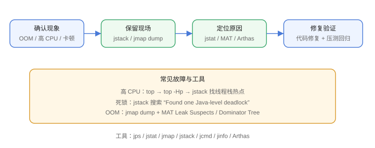

# 故障排查

JVM 故障排查的核心是“用工具还原现场”：进程信息、线程栈、堆内存、GC 状态、类加载情况。这一篇给出常用命令和 OOM、高 CPU、死锁三类典型问题的完整排查流程。



## 常用诊断工具

| 工具 | 作用 | 示例 |
| --- | --- | --- |
| `jps` | 列出 Java 进程 | `jps -l` |
| `jstat` | 观察 GC/类加载统计 | `jstat -gcutil <pid> 1000` |
| `jmap` | 堆信息、导出堆转储 | `jmap -dump:format=b,file=heap.hprof <pid>` |
| `jstack` | 线程栈 | `jstack <pid> > thread.txt` |
| `jcmd` | 综合诊断命令 | `jcmd <pid> VM.flags` |
| `jinfo` | 查看/修改参数 | `jinfo -flags <pid>` |
| `jconsole` / VisualVM | 图形监控 | 连接本地/远程进程 |
| `Arthas` | 在线诊断（阿里） | `dashboard`、`thread`、`heapdump` |

## 高 CPU 排查

```shell
# 1. 找到 CPU 最高的 Java 进程
top -c

# 2. 找到该进程内 CPU 最高的线程（top 里按 H 或使用 ps）
top -Hp <pid>

# 3. 把线程 PID 转十六进制
printf '%x\n' <tid>

# 4. 查看线程栈，定位热点
jstack <pid> | grep -A 20 'nid=0x<十六进制tid>'
```

常见结论：死循环、锁自旋、频繁 GC、正则回溯、序列化热点。

## 死锁排查

```shell
jstack <pid>
```

输出中出现：

```text
Found one Java-level deadlock:
"线程A":
  waiting to lock monitor 0x... (object 0x..., a java.lang.Object)
"线程B":
  waiting to lock monitor 0x... (object 0x..., a java.lang.Object)
```

即确认死锁；修复方向是统一锁顺序、缩小锁范围、用 `tryLock` 超时。

## OOM 类型与处理

| OOM 信息 | 含义 | 处理方向 |
| --- | --- | --- |
| `Java heap space` | 堆内存不足 | 分析堆转储，找泄漏或调大堆 |
| `Metaspace` | 元空间不足 | 检查类加载器泄漏、动态代理数量 |
| `unable to create native thread` | 线程数超限 | 检查线程池、`ulimit`、`-Xss` |
| `Direct buffer memory` | 直接内存不足 | 检查 NIO 缓冲区是否释放 |
| `GC overhead limit exceeded` | GC 频繁且收效甚微 | 堆太小或泄漏，需 dump 分析 |

## 堆转储分析流程（内存泄漏）

```shell
# 1. 启动时保留现场参数
java -XX:+HeapDumpOnOutOfMemoryError -XX:HeapDumpPath=/data/dumps -jar app.jar

# 2. 进程还活着时手动导出
jmap -dump:format=b,file=heap-$(date +%s).hprof <pid>

# 3. 用 MAT / VisualVM / JProfiler 分析
#    - Leak Suspects：自动找泄漏嫌疑
#    - Dominator Tree：找占用大的对象
#    - 对比两个 dump：看哪个对象持续增长
```

典型泄漏源：

1. 静态集合只增不减（缓存、监听器）。
2. ThreadLocal 不 `remove()`（线程池复用）。
3. 连接、流、文件句柄未关闭。
4. 反序列化/反射缓存无限增长。

## 高 GC 开销排查

```shell
jstat -gcutil <pid> 1000
```

关注列：`E`（Eden）、`O`（老年代）、`FGC`（Full GC 次数）、`FGCT`（Full GC 耗时）。

如果 `O` 持续高位且 `FGC` 快速增长：

1. 导出堆转储分析大对象与泄漏。
2. 检查是否设置了过小的 `-Xmx`。
3. 检查代码里是否频繁创建大对象（如超大 List、字符串拼接）。

## 实战案例：Full GC 频繁

现象：接口延迟突增，`FGC` 每秒多次。

排查：

```text
1. jstat -gcutil 观察：老年代占用 98%，FGCT 快速上涨
2. jmap dump 导出堆
3. MAT Leak Suspects 发现：静态 ConcurrentHashMap 缓存了所有请求对象，只增不减
4. 修复：缓存加容量上限 + 过期清理；回归压测确认 FGC 恢复平稳
```

## 易错点

::: danger 常见错误
1. OOM 发生后不保留现场：没有 dump 就重启，问题无法定位，必须开 `HeapDumpOnOutOfMemoryError`。
2. 只看 GC 次数不看耗时：次数多但每次极短可能不是主要矛盾。
3. `jmap` 在堆很大的进程上会 STW：生产导出 dump 要评估影响或安排在低峰期。
4. 线上直接 `kill -9`：至少先保留 jstack、jmap 现场再重启。
5. 用 `top` 看 Java 进程内存高就断定“泄漏”：堆外内存（元空间、直接内存、JIT、线程栈）也会占用 RSS，要分别确认。
:::

## 验证方式

1. 写一个泄漏 demo（静态 Map 不断 put），用 `jstat` 观察老年代与 FGC 上涨，再 dump + MAT 分析。
2. 写一个死锁 demo，用 `jstack` 找到 “Found one Java-level deadlock”。
3. 用 Arthas 的 `dashboard` 观察线程、内存、GC 实时指标。

## 参考资料

- JDK 诊断工具命令：https://docs.oracle.com/en/java/javase/25/docs/specs/man/index.html
- Eclipse MAT：https://eclipse.dev/mat/
- Arthas：https://arthas.aliyun.com/
