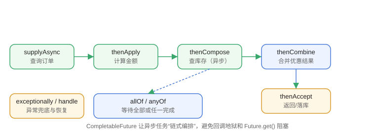

# CompletableFuture 异步编排

`CompletableFuture`（Java 8+）是异步编程的“编排器”：不仅能拿到异步结果，还能用链式方法组合多个异步任务，替代回调地狱和笨重的 Future。

## Future 的局限

```java
Future<Integer> f = executor.submit(task);
Integer result = f.get();   // 阻塞等待，无法做编排
```

`Future.get()` 只能阻塞等待，无法表达“A 完成后执行 B”“多个任务都完成再继续”这类组合逻辑。

## 创建异步任务

```java [Multithreading/CompletableFuture/CreateDemo.java]
import java.util.concurrent.CompletableFuture;
import java.util.concurrent.ExecutorService;
import java.util.concurrent.Executors;

public class CreateDemo {
    public static void main(String[] args) throws Exception {
        // runAsync：无返回值
        CompletableFuture<Void> f1 = CompletableFuture.runAsync(() ->
            System.out.println("runAsync 执行"));

        // supplyAsync：有返回值
        CompletableFuture<String> f2 = CompletableFuture.supplyAsync(() -> "supplyAsync 结果");
        System.out.println(f2.get());

        // 指定线程池（推荐，避免占用 commonPool）
        ExecutorService pool = Executors.newFixedThreadPool(4);
        CompletableFuture<String> f3 = CompletableFuture.supplyAsync(() -> "自定义线程池", pool);
        System.out.println(f3.get());
        pool.shutdown();
    }
}
```

输出：

```text
runAsync 执行
supplyAsync 结果
自定义线程池
```

::: tip 线程池
不传线程池时使用 `ForkJoinPool.commonPool()`，会被并行流等共享；生产环境建议显式传入业务线程池。
:::

## 链式转换

```java [Multithreading/CompletableFuture/ChainDemo.java]
import java.util.concurrent.CompletableFuture;

public class ChainDemo {
    public static void main(String[] args) throws Exception {
        CompletableFuture.supplyAsync(() -> "hello")
            .thenApply(s -> s + " world")          // 同步转换
            .thenApply(String::toUpperCase)
            .thenAccept(System.out::println)        // 消费结果，无返回值
            .thenRun(() -> System.out.println("完成"));   // 全部完成后执行

        Thread.sleep(500);
    }
}
```

输出：

```text
HELLO WORLD
完成
```



| 方法 | 作用 |
| --- | --- |
| `thenApply(fn)` | 转换结果，返回新 CompletableFuture |
| `thenAccept(consumer)` | 消费结果，无返回值 |
| `thenRun(action)` | 不关心结果，执行动作 |
| `thenCompose(fn)` | 扁平化：fn 返回 CompletableFuture |
| `thenCombine(other, fn)` | 合并两个异步结果 |
| `applyToEither(a, b, fn)` | 谁先完成用谁的结果 |

## thenApply 与 thenCompose 的区别

```java
// thenApply：函数返回普通值
CompletableFuture<String> f1 = cf.thenApply(s -> s + "!");

// thenCompose：函数返回 CompletableFuture，自动扁平化
CompletableFuture<String> f2 = cf.thenCompose(s -> fetchDetail(s));
```

用 `thenCompose` 连接两个异步依赖时，避免出现 `CompletableFuture<CompletableFuture<...>>` 的嵌套。

## 组合多个任务

```java [Multithreading/CompletableFuture/CombineDemo.java]
import java.util.concurrent.CompletableFuture;

public class CombineDemo {
    public static void main(String[] args) throws Exception {
        CompletableFuture<String> cf1 = CompletableFuture.supplyAsync(() -> "A");
        CompletableFuture<String> cf2 = CompletableFuture.supplyAsync(() -> "B");

        // 合并两个结果
        System.out.println(cf1.thenCombine(cf2, (a, b) -> a + b).get());   // AB

        // 所有完成（返回 Void）
        CompletableFuture<Void> all = CompletableFuture.allOf(cf1, cf2);
        all.join();
        System.out.println("全部完成");

        // 任一完成
        CompletableFuture<Object> any = CompletableFuture.anyOf(cf1, cf2);
        System.out.println(any.get());
    }
}
```

## 异常处理

```java [Multithreading/CompletableFuture/ExceptionDemo.java]
import java.util.concurrent.CompletableFuture;

public class ExceptionDemo {
    public static void main(String[] args) throws Exception {
        CompletableFuture<Integer> future = CompletableFuture.supplyAsync(() -> {
            if (true) {
                throw new RuntimeException("计算失败");
            }
            return 1;
        });

        // exceptionally：失败时给默认值
        System.out.println(future.exceptionally(e -> -1).get());   // -1

        // handle：无论成败都处理
        CompletableFuture.supplyAsync(() -> 1)
            .handle((r, e) -> e == null ? r : 0)
            .thenAccept(System.out::println);

        Thread.sleep(500);
    }
}
```

## 超时控制（Java 9+）

```java
CompletableFuture<String> f = CompletableFuture
    .supplyAsync(longTask)
    .completeOnTimeout("默认值", 3, TimeUnit.SECONDS);

// 或者：超时后让 future 以异常完成
CompletableFuture<String> f2 = CompletableFuture
    .supplyAsync(longTask)
    .orTimeout(3, TimeUnit.SECONDS);
```

## 易错点

::: danger 常见错误
1. 在回调里直接 `get()` 阻塞：违背异步初衷，尽量链式继续处理。
2. 忘记处理异常：异常在结果未被读取时静默丢失，链式末端要 `exceptionally` / `handle` / `whenComplete`。
3. `allOf` 的返回是 `CompletableFuture<Void>`：需要各任务结果时，先 `join()` 再手动收集，或把结果放进共享容器。
4. 把 `thenApply` 当 `thenCompose` 用：返回嵌套 future。
5. 所有异步任务挤在 `commonPool`：与并行流争抢线程，生产环境显式传线程池。
6. 依赖“回调顺序”保证结果顺序：组合任务用 `thenCombine` / `allOf`，不要依赖执行先后。
:::

## 验证方式

1. 运行 `ChainDemo`，确认输出 `HELLO WORLD` 与 `完成`。
2. 运行 `CombineDemo`，确认 `AB`、全部完成、任一结果输出。
3. 写一个 5 秒任务配 `orTimeout(1, SECONDS)`，确认 1 秒后以超时异常结束。

## 参考资料

- CompletableFuture 文档：https://docs.oracle.com/en/java/javase/25/docs/api/java.base/java/util/concurrent/CompletableFuture.html
- 异步编程教程：https://docs.oracle.com/javase/tutorial/essential/concurrency/futures.html
- Java 异步编程指南（Oracle 博客）：https://blogs.oracle.com/java/post/java-asynchronous-programming
