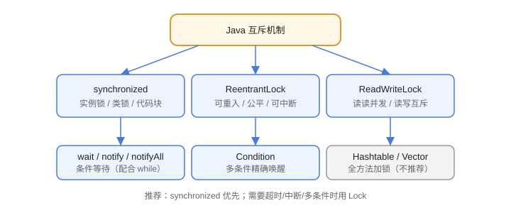

# synchronized 与 Lock

多线程共享可变数据时会出现**竞态条件（Race Condition）**。Java 提供 `synchronized` 和 `Lock` 两套互斥机制，把“访问共享资源的代码”变成临界区，保证同一时刻只有一个线程执行。

## 为什么需要同步

```java [Multithreading/SynchronizedLock/RaceDemo.java]
public class RaceDemo {
    private static int count = 0;

    public static void main(String[] args) throws InterruptedException {
        Thread t1 = new Thread(() -> {
            for (int i = 0; i < 10000; i++) count++;
        });
        Thread t2 = new Thread(() -> {
            for (int i = 0; i < 10000; i++) count++;
        });
        t1.start();
        t2.start();
        t1.join();
        t2.join();
        System.out.println(count);   // 大概率小于 20000
    }
}
```

`count++` 在字节码层面是“读-改-写”三步，两个线程交错执行就会丢更新。

## synchronized 三种用法

```java [Multithreading/SynchronizedLock/SynchronizedDemo.java]
class Counter {
    private int count;

    // 1. 同步实例方法：锁是当前对象 this
    public synchronized void increment() {
        count++;
    }

    // 2. 同步代码块：锁可以精确到对象
    public void incrementByBlock() {
        synchronized (this) {
            count++;
        }
    }

    // 3. 同步静态方法：锁是当前类的 Class 对象
    public static synchronized void staticMethod() {
    }
}

public class SynchronizedDemo {
    public static void main(String[] args) throws InterruptedException {
        Counter counter = new Counter();
        Thread[] threads = new Thread[10];
        for (int i = 0; i < threads.length; i++) {
            threads[i] = new Thread(() -> {
                for (int j = 0; j < 1000; j++) counter.increment();
            });
            threads[i].start();
        }
        for (Thread t : threads) {
            t.join();
        }
        System.out.println(counter.getCount());   // 10000
    }
}
```

要点：

1. synchronized 是**可重入**的：同一个线程可以重复获取同一把锁。
2. 实例锁（this）与类锁（Class）是两把锁，互不阻塞。
3. 同步块范围尽量小，只锁共享数据操作。

## ReentrantLock

```java [Multithreading/SynchronizedLock/ReentrantLockDemo.java]
import java.util.concurrent.TimeUnit;
import java.util.concurrent.locks.ReentrantLock;

public class ReentrantLockDemo {
    private final ReentrantLock lock = new ReentrantLock(true);  // 公平锁
    private int count;

    public void increment() {
        lock.lock();
        try {
            count++;
        } finally {
            lock.unlock();   // 必须放在 finally
        }
    }

    public boolean tryIncrement(long timeout) throws InterruptedException {
        if (lock.tryLock(timeout, TimeUnit.MILLISECONDS)) {
            try {
                count++;
                return true;
            } finally {
                lock.unlock();
            }
        }
        return false;
    }
}
```

### synchronized 与 ReentrantLock 对比

| 维度 | synchronized | ReentrantLock |
| --- | --- | --- |
| 语法 | 关键字，自动释放 | API，必须 finally 解锁 |
| 非阻塞尝试 | 不支持 | `tryLock()` |
| 超时等待 | 不支持 | `tryLock(timeout)` |
| 可中断 | 不支持 | `lockInterruptibly()` |
| 公平性 | 非公平 | 可指定公平 |
| 条件变量 | wait/notify | `newCondition()` |
| 性能 | JDK 持续优化，差距很小 | 功能更丰富 |



::: tip 选择建议
新代码优先用 `synchronized`（简洁、不易出错）；需要“超时、可中断、多条件、公平锁”时才用 `ReentrantLock`。
:::

## 读写锁：读读并发

```java [Multithreading/SynchronizedLock/ReadWriteLockDemo.java]
import java.util.concurrent.locks.ReadWriteLock;
import java.util.concurrent.locks.ReentrantReadWriteLock;

public class ReadWriteLockDemo {
    private int data;
    private final ReadWriteLock lock = new ReentrantReadWriteLock();

    public int read() {
        lock.readLock().lock();
        try {
            return data;
        } finally {
            lock.readLock().unlock();
        }
    }

    public void write(int value) {
        lock.writeLock().lock();
        try {
            data = value;
        } finally {
            lock.writeLock().unlock();
        }
    }
}
```

规则：**读读并发、读写互斥、写写互斥**。适合“读多写少”的缓存、配置类数据。

## wait / notify 与 Condition

`wait()` / `notify()` 必须在 synchronized 块内使用，条件判断用 `while` 而非 `if`（防止虚假唤醒）：

```java [Multithreading/SynchronizedLock/WaitNotifyDemo.java]
class SharedBuffer {
    private int value;
    private boolean empty = true;

    public synchronized void put(int v) throws InterruptedException {
        while (!empty) {
            wait();                 // 等待消费者取走
        }
        value = v;
        empty = false;
        notifyAll();
    }

    public synchronized int take() throws InterruptedException {
        while (empty) {
            wait();                 // 等待生产者放入
        }
        empty = true;
        notifyAll();
        return value;
    }
}
```

`Condition` 是 Lock 版的条件等待，支持多个独立条件：

```java
ReentrantLock lock = new ReentrantLock();
Condition notFull = lock.newCondition();
Condition notEmpty = lock.newCondition();
```

## 死锁

死锁产生的四个必要条件：**互斥、持有并等待、不可剥夺、循环等待**。避免死锁最常用手段是**统一锁的获取顺序**，或使用 `tryLock` 超时放弃。

```java
if (lockA.tryLock(1, TimeUnit.SECONDS)) {
    try {
        if (lockB.tryLock(1, TimeUnit.SECONDS)) {
            try {
                // 业务
            } finally {
                lockB.unlock();
            }
        }
    } finally {
        lockA.unlock();
    }
}
```

## 锁状态与升级（了解）

JVM 对 `synchronized` 做了优化，但**升级路径不是网上流传的那条四级链**。现行 JDK 只有三种状态：

| 状态 | 触发条件 | 实现与开销 |
| --- | --- | --- |
| 无锁 | 还没有线程真正竞争 | 什么都不做 |
| 轻量级锁 | 有竞争但很短（少量线程轮流进入） | 在栈帧里存锁记录，用 CAS 把 Mark Word 换出去；CAS 失败到阈值后升级 |
| 重量级锁 | 竞争激烈或持有时间较长 | 走操作系统互斥量，未拿到锁的线程**进入阻塞**，伴随上下文切换 |

::: danger 两条过期结论
1. **「偏向锁是最快的一级」已经不成立**：JDK 15 起默认禁用（JEP 374），**JDK 18 起 `-XX:+UseBiasedLocking` 参数作废**——在 JDK 18 及以上传这个参数会直接启动失败。所以「无锁 → 偏向锁 → 轻量级锁 → 重量级锁」这条四级链在现行 JDK 上只剩下三级。
2. **「升级之后就降不回来」也不准确**：撤销与降级都可能发生（例如锁对象被调用 `hashCode()`、或安全点上的批量撤销），但**降级不保证、不可依赖**，不要把它写进设计假设。
:::

本页只回答「锁状态是什么」。**升级阈值、不同竞争强度下的吞吐与延迟差异、`LongAdder` 与 `AtomicLong` 的选型、伪共享**这些性能面的内容，见 [高性能 Java · 锁与并发原语的性能](../../../../HighPerformanceJava/LockOptimize/index.md)——**先正确，再快**，两页分工不要混。

## 易错点

::: danger 常见错误
1. `lock()` 后忘记 `unlock()`：必须用 `try/finally` 保证释放，否则线程永久阻塞。
2. 用 `if` 判断 wait 条件：可能虚假唤醒，必须用 `while`。
3. 在持锁时调用 `sleep()`：不释放锁，白白阻塞其他线程。
4. 锁的获取顺序不一致：高概率死锁。
5. 同步范围过大：整个方法加锁，串行化严重；缩小临界区或用读写锁。
6. 用字符串常量做锁对象：如 `synchronized ("lock")`，不同类共用字符串常量池，可能意外互斥。
:::

## 验证方式

1. 运行 `RaceDemo`，确认结果小于 20000；加 synchronized 后恢复 20000。
2. 用 `jstack <pid>` 查看死锁示例的线程 dump，观察“Found one Java-level deadlock”输出。
3. 写一个 `tryLock` 超时版本，确认不会永久阻塞。

## 参考资料

- synchronized 教程：https://docs.oracle.com/javase/tutorial/essential/concurrency/locksync.html
- ReentrantLock 文档：https://docs.oracle.com/en/java/javase/25/docs/api/java.base/java/util/concurrent/locks/ReentrantLock.html
- 死锁与饥饿：https://docs.oracle.com/javase/tutorial/essential/concurrency/deadlock.html
