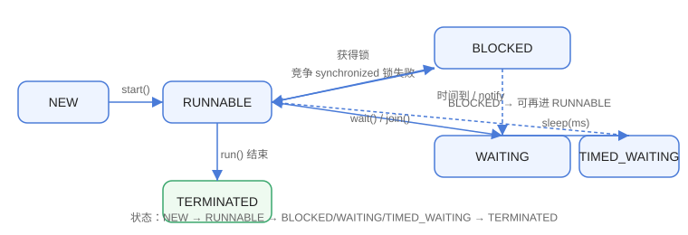

# 线程基础

线程（Thread）是操作系统能够独立调度的最小执行单元。Java 中多线程的核心价值是**让多个任务并行推进**，例如同时处理多个请求、后台异步执行任务。这一篇先把“创建、生命周期、常用方法、中断”讲透。

::: info 版本现状（2026-08 核对）
本文基于 **Java 25 LTS** 编写，示例兼容 Java 8+；`Thread.ofVirtual()` 等虚拟线程 API 从 Java 21 起可用，文中会单独标注。
:::

## 进程与线程

| 维度 | 进程 | 线程 |
| --- | --- | --- |
| 资源 | 独立内存空间 | 共享进程内存 |
| 切换成本 | 高 | 低 |
| 通信 | IPC（管道、Socket 等） | 直接读写共享变量 |
| 故障影响 | 进程间隔离 | 一个线程崩溃可能影响整个进程 |

## 创建线程的四种方式

```java [Multithreading/ThreadBasic/ThreadCreationDemo.java]
import java.util.concurrent.Callable;
import java.util.concurrent.FutureTask;

public class ThreadCreationDemo {
    public static void main(String[] args) throws Exception {
        // 方式1：继承 Thread
        Thread t1 = new MyThread("线程1");
        t1.start();

        // 方式2：实现 Runnable（推荐，不占用继承位）
        Thread t2 = new Thread(new MyRunnable(), "线程2");
        t2.start();

        // 方式3：Callable + FutureTask（有返回值）
        FutureTask<String> task = new FutureTask<>(new MyCallable());
        Thread t3 = new Thread(task, "线程3");
        t3.start();
        System.out.println("Callable 返回值: " + task.get());

        // 方式4：Lambda（Runnable 是函数式接口）
        Thread t4 = new Thread(() ->
            System.out.println(Thread.currentThread().getName() + " 运行"),
            "线程4");
        t4.start();

        t1.join();
        t2.join();
        t3.join();
        t4.join();
    }
}

class MyThread extends Thread {
    MyThread(String name) {
        super(name);
    }

    @Override
    public void run() {
        System.out.println(getName() + " 运行");
    }
}

class MyRunnable implements Runnable {
    @Override
    public void run() {
        System.out.println(Thread.currentThread().getName() + " 运行");
    }
}

class MyCallable implements Callable<String> {
    @Override
    public String call() {
        return "执行完成";
    }
}
```

输出：

```text
线程1 运行
线程2 运行
Callable 返回值: 执行完成
线程3 运行
线程4 运行
```

::: tip 创建方式选择
优先实现 `Runnable` 或 `Callable`：不占用类的继承位，任务与线程解耦；批量任务交给线程池（见「线程池」篇），不要裸 new Thread。
:::

## 线程生命周期

```text
NEW → RUNNABLE → BLOCKED / WAITING / TIMED_WAITING → TERMINATED
```

| 状态 | 含义 | 进入方式 |
| --- | --- | --- |
| NEW | 已创建未启动 | `new Thread(...)` |
| RUNNABLE | 可运行/运行中 | `start()` |
| BLOCKED | 等待锁 | 进入 synchronized 竞争失败 |
| WAITING | 无限期等待 | `wait()`、`join()` 无超时 |
| TIMED_WAITING | 限期等待 | `sleep()`、`wait(ms)`、`join(ms)` |
| TERMINATED | 已结束 | `run()` 返回或异常 |



```java [Multithreading/ThreadBasic/LifecycleDemo.java]
public class LifecycleDemo {
    public static void main(String[] args) throws InterruptedException {
        Thread t = new Thread(() -> {
            try {
                Thread.sleep(500);
            } catch (InterruptedException e) {
                Thread.currentThread().interrupt();
            }
        });
        System.out.println(t.getState());      // NEW
        t.start();
        System.out.println(t.getState());      // RUNNABLE
        Thread.sleep(100);
        System.out.println(t.getState());      // TIMED_WAITING
        t.join();
        System.out.println(t.getState());      // TERMINATED
    }
}
```

## 常用方法

| 方法 | 作用 | 注意 |
| --- | --- | --- |
| `start()` | 启动线程 | 只能调用一次 |
| `join()` / `join(ms)` | 等待线程结束 | 可中断 |
| `sleep(ms)` | 当前线程休眠 | 不释放锁 |
| `yield()` | 让出 CPU | 只是提示，可能无效 |
| `interrupt()` | 发送中断信号 | 协作式 |
| `isInterrupted()` | 检查中断标记 | 不清除标记 |
| `setDaemon(true)` | 设为守护线程 | 必须在 start 前 |
| `getName()` / `getState()` | 名称/状态 | 调试用 |

## 中断协作

```java [Multithreading/ThreadBasic/InterruptDemo.java]
public class InterruptDemo {
    public static void main(String[] args) throws InterruptedException {
        Thread worker = new Thread(() -> {
            while (!Thread.currentThread().isInterrupted()) {
                System.out.println("工作中...");
                try {
                    Thread.sleep(300);
                } catch (InterruptedException e) {
                    // sleep 被打断时中断标记会被清除，需要重新设置
                    Thread.currentThread().interrupt();
                    System.out.println("收到中断，退出");
                }
            }
        });
        worker.start();
        Thread.sleep(1000);
        worker.interrupt();
    }
}
```

## 易错点

::: danger 常见错误
1. 调用 `run()` 而不是 `start()`：只在当前线程执行，没有创建新线程。
2. 重复调用 `start()`：抛 `IllegalThreadStateException`。
3. 使用已废弃的 `stop()` / `suspend()` / `resume()`：可能破坏共享数据，必须用 `interrupt()` 协作退出。
4. `sleep` 在 synchronized 块内不释放锁：需要释放锁的等待要用 `wait()`。
5. 捕获 `InterruptedException` 后不恢复中断标记：上层代码无法感知中断，最佳实践是重新 `Thread.currentThread().interrupt()`。
6. 用 `new Thread` 处理每个请求：线程创建/销毁开销大，高并发场景必须用线程池。
:::

## 验证方式

1. 运行 `LifecycleDemo`，观察状态依次为 NEW、RUNNABLE、TIMED_WAITING、TERMINATED。
2. 运行 `InterruptDemo`，确认 1 秒后线程打印“收到中断，退出”。
3. 把 `t.start()` 改成 `t.run()`，确认输出顺序变化（主线程顺序执行）。

## 相关专题

- [JVM 基础](../../JVM/index.md)

## 参考资料

- Thread 类文档：https://docs.oracle.com/en/java/javase/25/docs/api/java.base/java/lang/Thread.html
- 并发教程：https://docs.oracle.com/javase/tutorial/essential/concurrency/
- 虚拟线程说明：https://docs.oracle.com/en/java/javase/21/core/virtual-threads.html
