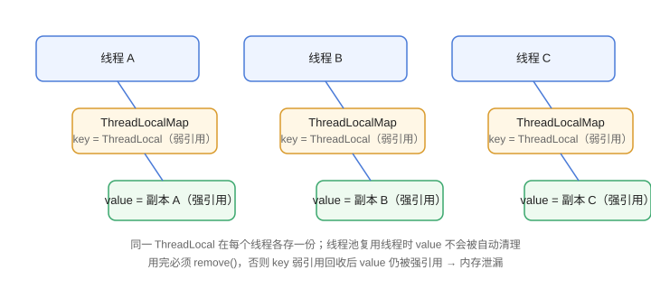

# ThreadLocal 详解

`ThreadLocal` 让每个线程拥有**独立副本**的变量，互不干扰。典型场景：数据库连接、用户上下文、SimpleDateFormat、事务信息透传。

## 基本用法

```java [Multithreading/ThreadLocal/ThreadLocalDemo.java]
public class ThreadLocalDemo {
    private static final ThreadLocal<Integer> COUNTER = ThreadLocal.withInitial(() -> 0);

    public static void main(String[] args) throws InterruptedException {
        Thread t1 = new Thread(() -> {
            COUNTER.set(1);
            System.out.println("线程1: " + COUNTER.get());   // 1
        });
        Thread t2 = new Thread(() -> {
            COUNTER.set(100);
            System.out.println("线程2: " + COUNTER.get());   // 100
        });
        t1.start();
        t2.start();
        t1.join();
        t2.join();
        System.out.println("主线程: " + COUNTER.get());      // 0
    }
}
```

输出：

```text
线程1: 1
线程2: 100
主线程: 0
```

三个线程各自持有独立值，互不影响。

## 典型场景：SimpleDateFormat

SimpleDateFormat **不是线程安全**的，全局单例并发格式化会数据错乱；每个线程一份副本即可安全使用：

```java [Multithreading/ThreadLocal/DateFormatDemo.java]
import java.text.SimpleDateFormat;

public class DateFormatDemo {
    private static final ThreadLocal<SimpleDateFormat> FORMATTER =
        ThreadLocal.withInitial(() -> new SimpleDateFormat("yyyy-MM-dd HH:mm:ss"));

    public static String format(long millis) {
        return FORMATTER.get().format(new java.util.Date(millis));
    }

    public static void main(String[] args) {
        System.out.println(format(System.currentTimeMillis()));
    }
}
```

## 底层原理

```text
Thread
└── ThreadLocalMap
    ├── key：ThreadLocal 实例（弱引用）
    └── value：线程持有的副本值（强引用）
```

每个 `Thread` 内部维护一个 `ThreadLocalMap`，`ThreadLocal` 只是 key。所以：

- 线程销毁，Map 随之回收。
- **线程池线程复用**时，Map 一直存在，如果不 `remove()`，value 永远被强引用 → **内存泄漏**。
- key 是弱引用，ThreadLocal 对象被回收后，value 仍被 Map 的 Entry 强引用。



## 内存泄漏与正确清理

::: danger 经典问题
在线程池中，线程执行完任务回到池里继续复用，ThreadLocal 的 value 不会被自动清理。使用完必须：

```java
try {
    // 业务逻辑
} finally {
    THREAD_LOCAL.remove();
}
```
:::

常见泄漏场景：Web 请求在过滤器里 `set` 用户信息，响应结束忘了 `remove`，同一线程处理下一个请求时读到上一个用户的上下文。

## InheritableThreadLocal：子线程继承

```java [Multithreading/ThreadLocal/InheritableDemo.java]
public class InheritableDemo {
    private static final InheritableThreadLocal<String> CTX =
        new InheritableThreadLocal<>();

    public static void main(String[] args) {
        CTX.set("父线程数据");
        new Thread(() -> System.out.println(CTX.get()))   // 父线程数据
            .start();
    }
}
```

注意：`InheritableThreadLocal` 只在**创建子线程那一刻**复制值；线程池复用线程时不会更新，跨线程传递上下文需要阿里开源的 `TransmittableThreadLocal`（TTL）。

## 易错点

::: danger 常见错误
1. 用完后不 `remove()`：线程池复用导致 value 泄漏、上下文串线。
2. 把大对象放进 ThreadLocal：每个线程一份，N 个线程 N 份大对象，内存翻倍。
3. 依赖 InheritableThreadLocal 做线程池透传：线程池场景不生效，需要 TTL。
4. 用 ThreadLocal 当“全局缓存”：它不是全局共享，每个线程独立，语义容易误解。
5. 静态 ThreadLocal 与类加载器：Web 容器热部署时可能造成类加载器泄漏，规范清理同样适用。
:::

## 验证方式

1. 运行 `ThreadLocalDemo`，确认三个线程值互不影响。
2. 模拟线程池场景：线程执行两次任务，第一次 `set` 不 `remove`，第二次 `get` 会读到旧值；加上 `remove` 后正常。
3. 用 `jmap -histo` 观察 ThreadLocalMap 中残留对象，验证泄漏。

## 参考资料

- ThreadLocal 文档：https://docs.oracle.com/en/java/javase/25/docs/api/java.base/java/lang/ThreadLocal.html
- ThreadLocal 源码：https://github.com/openjdk/jdk/blob/master/src/java.base/share/classes/java/lang/ThreadLocal.java
- TransmittableThreadLocal（阿里）：https://github.com/alibaba/transmittable-thread-local
