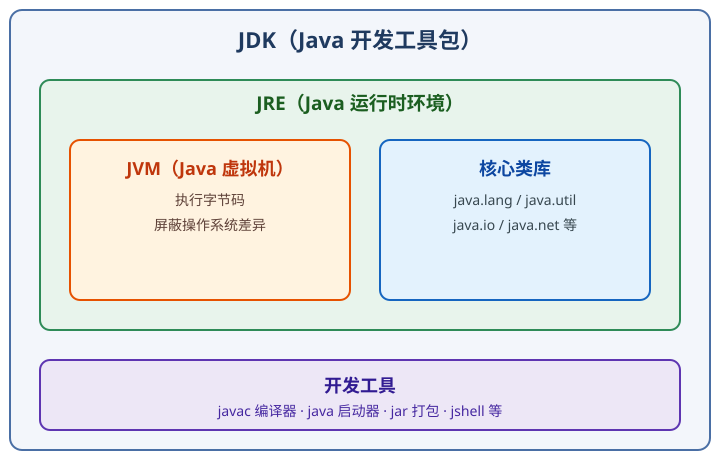
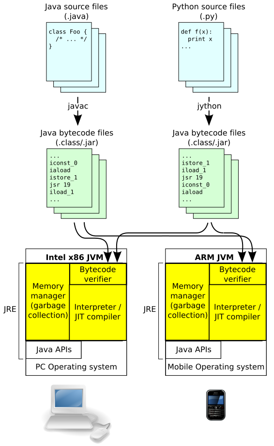

# Java 概述

Java（Java SE）是一种**面向对象**的编程语言，也是一套软件平台。它的核心口号是：**一次编写，到处运行**（Write Once, Run Anywhere，简称 WORA）。

为什么能做到？因为 Java 代码不是直接运行在操作系统上，而是运行在 **JVM（Java 虚拟机）** 中。只要目标平台安装了对应版本的 JVM，同一个编译产物 `.class` 文件就能运行。

## 历史与版本

- 1991 年由 Sun 公司启动，最初叫 Oak，1995 年正式发布 Java 1.0。
- 2009 年 Oracle 收购 Sun，Java 进入 Oracle 时代。
- 2017 年后，Java 改为每半年发布一个版本，每两年发布一个 **LTS（长期支持）版本**。

截至 2026 年常用的 LTS 版本：

| 版本 | 发布时间 | 说明 |
| --- | --- | --- |
| Java 8 | 2014 | 里程碑版本，引入 Lambda 和 Stream，仍有大量存量项目 |
| Java 11 | 2018 | 收费模式调整后的第一个 LTS |
| Java 17 | 2021 | 长期作为企业主流 LTS |
| Java 21 | 2023 | 引入虚拟线程等新特性，目前企业使用最广之一 |
| Java 25 | 2025 | **最新 LTS**，持续获得安全更新 |

::: tip
新项目建议直接使用 21 或 25 LTS；老项目保持稳定即可，不必盲目升级。
:::

## JDK、JRE、JVM 的关系

| 组件 | 全称 | 作用 |
| --- | --- | --- |
| JVM | Java Virtual Machine | 执行字节码，屏蔽操作系统差异 |
| JRE | Java Runtime Environment | JVM + 核心类库，只能运行程序 |
| JDK | Java Development Kit | JRE + 编译器 `javac`、调试工具等，用于开发 |

关系总结：**JDK 包含 JRE，JRE 包含 JVM**。

## JVM 内部结构（了解）

JVM 运行时主要包含：**类加载子系统**、**运行时数据区**（堆、虚拟机栈、方法区等）和**执行引擎**。其中堆存放对象实例，虚拟机栈存放方法调用，方法区存放类信息与常量。

::: warning 说明
初学阶段只需要记住「Java 代码 → 字节码 → JVM 执行」这条主线；内存模型和垃圾回收放到后续 JVM 专题深入。
:::

## Java 能做什么

- 后端服务：Spring Boot、Spring Cloud 等企业级框架
- 大数据生态：Hadoop、Spark、Flink
- 中间件：Kafka、Elasticsearch、Zookeeper 等大量使用 Java
- Android 应用（Kotlin 出现后仍兼容 Java）
- 金融、电商等对稳定性和性能要求高的系统

## 核心特性

1. 面向对象：封装、继承、多态。
2. 跨平台：JVM 保证「一处编译，处处运行」。
3. 自动内存管理：GC（垃圾回收）自动回收不再使用的对象。
4. 强类型：编译期就能发现大量类型错误，代码更可靠。
5. 生态庞大：构建工具、框架、云原生支持齐全。

## 开发环境三件套

- JDK：推荐 Temurin（Eclipse Adoptium）或 Oracle JDK
- IDE：IntelliJ IDEA、Eclipse、VS Code
- 构建工具：Maven 或 Gradle

## 学习路径

1. 基础语法：变量、类型、运算符、流程控制、数组
2. 面向对象：类、继承、接口、多态
3. 常用 API：集合、字符串、日期、IO
4. 进阶特性：泛型、反射、注解、Lambda / Stream
5. 并发与 JVM
6. 工程化：Maven / Gradle、单元测试、Spring Boot

## 相关链接

- Oracle JDK 版本矩阵：https://www.java.com/en/releases/matrix/
- Adoptium Temurin 下载：https://adoptium.net/temurin/releases/
- Java 官方教程：https://docs.oracle.com/javase/tutorial/
