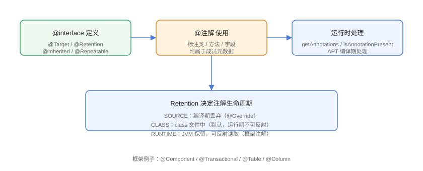

# 注解：定义与使用

注解（Annotation）是 Java 5 引入的元数据机制：用 `@` 标记代码元素（类、方法、字段、参数等），本身不改变程序逻辑，由框架或处理器读取后驱动行为。从 `@Override` 到 `@SpringBootApplication`，注解是 Java 生态最普遍的约定式编程工具。

## 注解的本质



注解本质上是一个**接口**，编译后是接口的字节码；使用注解相当于在类/方法上附加一条元数据记录，运行时可通过反射读取（`Retention.RUNTIME`）或编译期由 APT 处理。

```java
// Annotation/FirstAnnotation.java
import java.lang.annotation.ElementType;
import java.lang.annotation.Retention;
import java.lang.annotation.RetentionPolicy;
import java.lang.annotation.Target;

@Target({ElementType.TYPE, ElementType.METHOD})
@Retention(RetentionPolicy.RUNTIME)
public @interface Audit {
    String value() default "";
    String module() default "default";
}
```

```java
// Annotation/UseAnnotation.java
@Audit(module = "user", value = "创建用户")
public class UseAnnotation {

    @Audit("更新")
    public void update() { }
}
```

::: tip 注解的要素
1. 定义用 `@interface`；
2. 成员是「方法」形式，无方法体；
3. 成员类型限基本类型、`String`、`Class`、枚举、注解及它们的数组；
4. 可以有默认值（`default`），使用时可不写；
5. 只有 `value` 且使用时只写一个值，可以省略 `value=`。
:::

## 元注解

作用于注解本身的注解称为元注解（meta-annotation）：

| 元注解 | 作用 |
| --- | --- |
| `@Target` | 指定可用位置（TYPE/METHOD/FIELD/PARAMETER/CONSTRUCTOR/PACKAGE/ANNOTATION_TYPE/TYPE_PARAMETER/TYPE_USE） |
| `@Retention` | 生命周期：SOURCE / CLASS / RUNTIME |
| `@Inherited` | 子类继承父类的该注解（仅类上） |
| `@Repeatable` | 允许同一位置重复标注 |
| `@Documented` | 纳入 Javadoc |

### @Retention 三档对比

| 策略 | 保留位置 | 运行时反射 | 典型例子 |
| --- | --- | --- | --- |
| `SOURCE` | 仅源码 | 否 | `@Override`、`@SuppressWarnings` |
| `CLASS` | class 文件中（默认） | 否 | 部分字节码工具 |
| `RUNTIME` | JVM 运行期 | 是 | `@Component`、`@Transactional`、`@Table` |

::: danger 注解读不到先查 Retention
自定义注解忘了写 `@Retention(RUNTIME)`，默认是 `CLASS`，**运行时 `getAnnotation` 返回 null**。这是最常见的注解反射 Bug。
:::

## 读取注解（反射）

```java
// Annotation/ReadAnnotationDemo.java
import java.lang.reflect.Method;

public class ReadAnnotationDemo {
    public static void main(String[] args) throws Exception {
        Class<?> clazz = UseAnnotation.class;

        // 类上的注解
        if (clazz.isAnnotationPresent(Audit.class)) {
            Audit audit = clazz.getAnnotation(Audit.class);
            System.out.println("类注解：module=" + audit.module()
                    + " value=" + audit.value());
        }

        // 方法上的注解
        Method method = clazz.getMethod("update");
        Audit methodAudit = method.getAnnotation(Audit.class);
        System.out.println("方法注解：value=" + methodAudit.value());

        // 全部注解
        for (var a : clazz.getAnnotations()) {
            System.out.println("全部注解：" + a.annotationType().getSimpleName());
        }
    }
}
```

预期输出：

```text
类注解：module=user value=创建用户
方法注解：value=更新
全部注解：Audit
```

## @Inherited 与 @Repeatable

```java
// Annotation/InheritedRepeatableDemo.java
import java.lang.annotation.*;

@Retention(RetentionPolicy.RUNTIME)
@Inherited
@interface Role {
    String value();
}

@Retention(RetentionPolicy.RUNTIME)
@Repeatable(Roles.class)
@interface Tag {
    String value();
}

@Retention(RetentionPolicy.RUNTIME)
@interface Roles {
    Tag[] value();
}

@Role("admin")
@Tag("fast")
@Tag("safe")
class Base { }

class Child extends Base { }   // 继承 @Role，不继承 @Tag

public class InheritedRepeatableDemo {
    public static void main(String[] args) {
        System.out.println("子类是否继承 @Role：" +
                Child.class.isAnnotationPresent(Role.class));
        System.out.println("子类是否继承 @Tag：" +
                Child.class.isAnnotationPresent(Tag.class));

        Tag[] tags = Base.class.getAnnotationsByType(Tag.class);
        for (Tag tag : tags) {
            System.out.println("重复注解：" + tag.value());
        }
    }
}
```

预期输出：

```text
子类是否继承 @Role：true
子类是否继承 @Tag：false
重复注解：fast
重复注解：safe
```

## 常用框架注解速查

| 框架 | 注解 | 作用 |
| --- | --- | --- |
| Spring | `@Component` / `@Service` / `@Repository` | 注册 Bean |
| Spring | `@Autowired` / `@Resource` | 依赖注入 |
| Spring | `@Transactional` | 声明式事务 |
| Spring Boot | `@SpringBootApplication` | 启动类组合注解 |
| MyBatis | `@Mapper` / `@Select` / `@Insert` | Mapper 声明与 SQL 绑定 |
| Lombok | `@Getter` / `@Setter` / `@Builder` | 编译期生成代码 |
| JUnit | `@Test` / `@BeforeEach` | 测试生命周期 |
| Jackson | `@JsonProperty` / `@JsonFormat` | 序列化映射 |

## 易错点与最佳实践

::: danger 常见坑
1. **忘写 `@Retention(RUNTIME)`**：运行时读不到注解。
2. **`@Target` 过严**：注解想用在方法上却只声明了 TYPE，编译报错。
3. **`@Inherited` 只对类生效**：接口、方法、字段上的注解不随继承传递。
4. **注解成员不能是 `null`**：注解成员不允许 null 值，用 `default` 空字符串或特殊标记表达「未设置」。
5. **`@Repeatable` 必须配套容器注解**：缺了 `@Roles` 容器会编译失败。
:::

::: tip 最佳实践
- 自定义注解默认配齐 `@Target` + `@Retention(RUNTIME)` + `@Documented`。
- 注解只放「元数据」，具体逻辑交给读取它的处理器，保持注解薄。
- 用 `@interface` 定义的类型名以名词/形容词命名（如 `@Audit`、`@Cacheable`），成员名用小写驼峰。
:::

## 验证方式

```shell
javac FirstAnnotation.java UseAnnotation.java ReadAnnotationDemo.java
java ReadAnnotationDemo
```

预期：读取到类注解与方法注解的值。运行 `InheritedRepeatableDemo` 确认继承与重复注解行为符合预期。

## 参考资料

- [注解官方教程](https://docs.oracle.com/javase/tutorial/java/annotations/index.html)
- [java.lang.annotation 包 API 文档](https://docs.oracle.com/en/java/javase/25/docs/api/java.base/java/lang/annotation/package-summary.html)
- [AnnotatedElement API 文档](https://docs.oracle.com/en/java/javase/25/docs/api/java.base/java/lang/reflect/AnnotatedElement.html)
