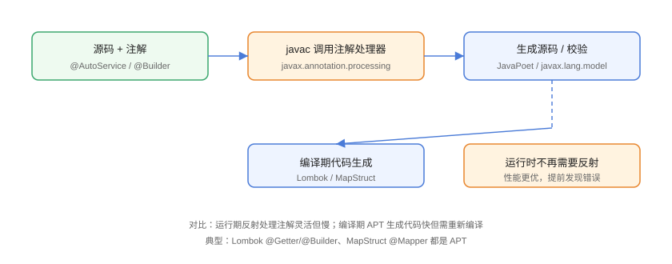

# 注解处理器（APT）

注解处理器（Annotation Processing Tool，APT）在**编译期**扫描源码中的注解并生成新代码或做校验，与运行期反射互补。Lombok（`@Getter`/`@Builder`）、MapStruct（`@Mapper`）、AutoService 等工具都是 APT 的产物。

## APT 与反射对比



| 维度 | 运行期反射 | 编译期 APT |
| --- | --- | --- |
| 时机 | JVM 运行时 | javac 编译时 |
| 性能 | 有反射开销 | 生成普通代码，运行时无开销 |
| 能力 | 动态读取/调用 | 生成源码、校验、改写 |
| 灵活性 | 高 | 需要重新编译 |
| 典型工具 | Spring 运行期组件 | Lombok、MapStruct |

::: tip 一句话理解
反射是「运行时问：这个注解什么意思？」；APT 是「编译时让工具先生成好代码，运行时直接调用」。
:::

## 编写一个注解处理器

### 第一步：定义编译期注解

```java
// AnnotationProcessor/BuildInfo.java
import java.lang.annotation.ElementType;
import java.lang.annotation.Retention;
import java.lang.annotation.RetentionPolicy;
import java.lang.annotation.Target;

@Target(ElementType.TYPE)
@Retention(RetentionPolicy.SOURCE)   // 编译期注解，运行期不需要
public @interface BuildInfo {
    String author() default "unknown";
}
```

### 第二步：实现 AbstractProcessor

```java
// AnnotationProcessor/BuildInfoProcessor.java
import javax.annotation.processing.AbstractProcessor;
import javax.annotation.processing.RoundEnvironment;
import javax.annotation.processing.SupportedAnnotationTypes;
import javax.annotation.processing.SupportedSourceVersion;
import javax.lang.model.SourceVersion;
import javax.lang.model.element.Element;
import javax.lang.model.element.TypeElement;
import javax.tools.JavaFileObject;
import java.io.IOException;
import java.io.Writer;
import java.util.Set;

@SupportedAnnotationTypes("BuildInfo")
@SupportedSourceVersion(SourceVersion.RELEASE_25)
public class BuildInfoProcessor extends AbstractProcessor {

    @Override
    public boolean process(Set<? extends TypeElement> annotations,
                           RoundEnvironment roundEnv) {
        for (Element element : roundEnv.getElementsAnnotatedWith(BuildInfo.class)) {
            BuildInfo info = element.getAnnotation(BuildInfo.class);
            String className = ((TypeElement) element).getQualifiedName().toString();
            generateClass(className, info.author());
        }
        return true;
    }

    private void generateClass(String annotatedClass, String author) {
        String pkg = annotatedClass.substring(0, annotatedClass.lastIndexOf('.'));
        String generated = pkg + ".BuildInfoGenerated";

        try {
            JavaFileObject file = processingEnv.getFiler()
                    .createSourceFile(generated);
            try (Writer w = file.openWriter()) {
                w.write("package " + pkg + ";\n");
                w.write("public class BuildInfoGenerated {\n");
                w.write("  public static String author() { return \""
                        + author + "\"; }\n");
                w.write("  public static String target() { return \""
                        + annotatedClass + "\"; }\n");
                w.write("}\n");
            }
        } catch (IOException e) {
            throw new RuntimeException(e);
        }
    }
}
```

### 第三步：注册处理器并编译

处理器通过 `META-INF/services/javax.annotation.processing.Processor` 注册：

```properties
BuildInfoProcessor
```

```shell
# 编译处理器
javac -d out/processor BuildInfo.java BuildInfoProcessor.java

# 使用注解并指定处理器
javac -cp out/processor -processorpath out/processor \
      -processor BuildInfoProcessor Sample.java
```

```java
// AnnotationProcessor/Sample.java
@BuildInfo(author = "Codex")
public class Sample {
    public static void main(String[] args) {
        System.out.println("作者：" + BuildInfoGenerated.author());
        System.out.println("目标：" + BuildInfoGenerated.target());
    }
}
```

预期输出：

```text
作者：Codex
目标：Sample
```

::: warning JDK 23+ 注解处理默认关闭
从 JDK 23 起，注解处理默认不再启用，使用处理器必须显式传 `-processor` 或在 Maven/Gradle 中配置（如 Lombok 会通过 `annotationProcessorPaths` 自动启用）。遇到「程序包 xxx 不存在」时先检查处理器是否生效。
:::

## 用 JavaPoet 生成代码

手写字符串拼接生成源码容易出错，工程上常用 [JavaPoet](https://github.com/square/javapoet)：

```java
// AnnotationProcessor/JavaPoetDemo.java
import com.squareup.javapoet.JavaFile;
import com.squareup.javapoet.MethodSpec;
import com.squareup.javapoet.TypeSpec;
import javax.lang.model.element.Modifier;

public class JavaPoetDemo {
    public static void main(String[] args) throws Exception {
        MethodSpec author = MethodSpec.methodBuilder("author")
                .addModifiers(Modifier.PUBLIC, Modifier.STATIC)
                .returns(String.class)
                .addStatement("return \"Codex\"")
                .build();

        TypeSpec clazz = TypeSpec.classBuilder("BuildInfoGenerated")
                .addModifiers(Modifier.PUBLIC)
                .addMethod(author)
                .build();

        JavaFile javaFile = JavaFile.builder("demo", clazz).build();
        javaFile.writeTo(System.out);
    }
}
```

## 常见 APT 工具与用法

| 工具 | 注解 | 生成内容 |
| --- | --- | --- |
| Lombok | `@Getter`/`@Setter`/`@Builder` | 访问器、建造器、equals/hashCode |
| MapStruct | `@Mapper` | Bean 转换实现类 |
| AutoService | `@AutoService` | META-INF/services 注册文件 |
| Dagger/Hilt | `@Component`/`@Module` | 依赖注入代码 |
| Micronaut | `@Controller` | 路由与 DI 字节码 |
| 自定义 | 自研注解 | 任意模板代码 |

## 易错点与最佳实践

::: danger 常见坑
1. **处理器未注册**：`META-INF/services` 缺失或路径错误，处理器不执行，生成类不存在。
2. **`-processor` 没传**：JDK 23+ 默认关闭 APT，必须显式启用。
3. **`process` 返回 `true` 的含义**：返回 true 表示注解已被消费，不再交给其他处理器，多个处理器协作时注意。
4. **多次 round 重复生成**：`roundEnv.processingOver()` 判断收尾轮，避免重复生成同名文件。
5. **生成类与注解类重名**：生成类名冲突导致编译失败，命名统一加 `Generated` 后缀。
:::

::: tip 最佳实践
- 注解处理器需要跑在编译期，逻辑保持**无副作用**、可重复执行。
- 优先用 JavaPoet 等库生成代码，避免字符串拼接错误。
- 性能敏感路径（getter、转换器）优先 APT，灵活性场景（Spring 运行时组件扫描）用反射。
:::

## 验证方式

```shell
javac -d out/processor BuildInfo.java BuildInfoProcessor.java
javac -cp out/processor -processorpath out/processor -processor BuildInfoProcessor Sample.java
java -cp .:out Sample
```

预期：编译目录生成 `BuildInfoGenerated.java`，`java Sample` 输出 `作者：Codex` 与 `目标：Sample`。将 JDK 23+ 环境中的 `-processor` 去掉再编译，观察处理器默认不生效的报错。

## 参考资料

- [javax.annotation.processing 包 API 文档](https://docs.oracle.com/en/java/javase/25/docs/api/java.compiler/javax/annotation/processing/package-summary.html)
- [JavaPoet GitHub](https://github.com/square/javapoet)
- [Lombok 官方文档](https://projectlombok.org/features/)
- [MapStruct 官方文档](https://mapstruct.org/documentation/stable/reference/html/)
