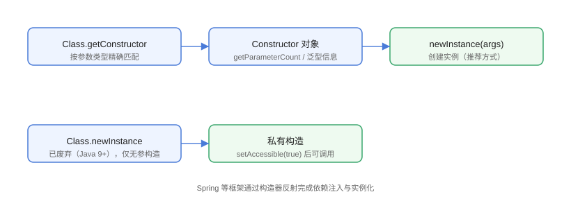

# 构造器与对象创建

构造器反射（`Constructor`）用于运行时创建对象：根据参数类型找到对应构造器，传入参数调用 `newInstance` 生成实例。Spring 的依赖注入、反序列化框架（Jackson 无参/全参构造）、动态代理底层都依赖它。

## 对象创建的两种方式



```java
// Constructor/ConstructorDemo.java
import java.lang.reflect.Constructor;

class User {
    private final String name;
    private final int age;

    public User() {
        this("默认用户", 0);
    }

    public User(String name, int age) {
        this.name = name;
        this.age = age;
    }

    private User(String name) {
        this.name = name;
        this.age = 18;
    }

    @Override
    public String toString() {
        return "User{name='" + name + "', age=" + age + "}";
    }
}

public class ConstructorDemo {
    public static void main(String[] args) throws Exception {
        Class<?> clazz = User.class;

        // 方式一（推荐）：getConstructor + newInstance(args)
        Constructor<?> ctor = clazz.getConstructor(String.class, int.class);
        User user = (User) ctor.newInstance("张三", 25);
        System.out.println("带参构造：" + user);

        // 方式二：无参构造
        User defaultUser = clazz.getConstructor().newInstance();
        System.out.println("无参构造：" + defaultUser);

        // 方式三（已废弃，Java 9+）：Class.newInstance()，只能调无参
        // User old = (User) clazz.newInstance();  // 不推荐

        // 私有构造器
        Constructor<?> privateCtor = clazz.getDeclaredConstructor(String.class);
        privateCtor.setAccessible(true);
        User privateUser = (User) privateCtor.newInstance("李四");
        System.out.println("私有构造：" + privateUser);

        // 列出全部构造器
        System.out.println("=== 构造器清单 ===");
        for (Constructor<?> c : clazz.getDeclaredConstructors()) {
            System.out.println("  " + c + " 参数数=" + c.getParameterCount());
        }
    }
}
```

预期输出：

```text
带参构造：User{name='张三', age=25}
无参构造：User{name='默认用户', age=0}
私有构造：User{name='李四', age=18}
=== 构造器清单 ===
  public User()
  public User(java.lang.String,int)
  private User(java.lang.String)
```

::: warning 为什么推荐 `getConstructor().newInstance()`
`Class.newInstance()` 自 Java 9 起标记废弃：它只能调用无参构造、异常包装不友好、且无法传递参数。统一使用 `Constructor.newInstance(args...)`。
:::

## 常见构造模式

### 全参数构造 + 反序列化

Jackson 等库在对象没有无参构造时，会查找全参构造并配合 `@JsonProperty` 映射字段：

```java
// Constructor/AllArgsDemo.java
import java.lang.reflect.Constructor;
import java.util.Arrays;

class Point {
    private final int x;
    private final int y;

    public Point(int x, int y) {
        this.x = x;
        this.y = y;
    }
}

public class AllArgsDemo {
    public static void main(String[] args) throws Exception {
        Constructor<Point> ctor = Point.class.getConstructor(int.class, int.class);
        Point p = ctor.newInstance(10, 20);
        System.out.println("创建成功：" + p);
    }
}
```

### 构造器参数名（`-parameters` 编译参数）

```java
// Constructor/ParamNameDemo.java
import java.lang.reflect.Constructor;
import java.lang.reflect.Parameter;

public class ParamNameDemo {
    public static void main(String[] args) throws Exception {
        Constructor<?> ctor = Point.class.getConstructor(int.class, int.class);
        for (Parameter param : ctor.getParameters()) {
            System.out.println("参数名：" + param.getName() +
                    " 类型：" + param.getType().getSimpleName());
        }
    }
}
```

默认输出 `arg0` / `arg1`；**编译时加 `-parameters`** 后输出 `x` / `y`。Spring 的构造器参数名推断、MyBatis 的 `@Param` 都与此相关。

## 单例与私有构造

```java
// Constructor/SingletonDemo.java
import java.lang.reflect.Constructor;

enum SingletonEnum {
    INSTANCE
}

public class SingletonDemo {
    public static void main(String[] args) throws Exception {
        // 反射破坏单例：私有构造可被 setAccessible 调用
        Constructor<?> ctor = MySingleton.class.getDeclaredConstructor();
        ctor.setAccessible(true);
        Object another = ctor.newInstance();
        System.out.println("反射创建的新实例：" + another);

        // 枚举天然防御反射
        Constructor<?> enumCtor = SingletonEnum.class.getDeclaredConstructors()[0];
        enumCtor.setAccessible(true);
        try {
            enumCtor.newInstance("OTHER", 1);
        } catch (Exception e) {
            System.out.println("枚举拒绝反射创建：" + e.getCause());
        }
    }
}

class MySingleton {
    private static final MySingleton INSTANCE = new MySingleton();
    private MySingleton() { }
}
```

::: danger 反射与单例
私有构造器配合 `setAccessible(true)` 可以**绕开单例**，这是安全边界的一部分。防御手段：
1. 构造器内判断实例已存在则抛异常；
2. 用 `enum` 实现单例（JVM 禁止反射创建枚举）；
3. 配合 `SecurityManager`（已废弃）或模块封装。
:::

## 易错点与最佳实践

::: danger 常见坑
1. **参数类型不匹配**：`getConstructor(String.class)` 找不到 `(String, int)` 构造器，必须精确列出全部参数类型。
2. **`newInstance` 抛的异常被包装**：构造器内部异常包在 `InvocationTargetException.getCause()` 里，别只看外层。
3. **基础类型与包装类型**：`(int.class)` 与 `(Integer.class)` 是不同的构造器签名。
4. **不可变对象的构造注入**：反射构造后 `final` 字段已被赋值，不能再通过 `Field.set` 修改。
5. **构造器参数个数为 0 判断**：`getParameterCount() == 0` 才是无参构造，别用 `getConstructors().length`。
:::

::: tip 最佳实践
- 框架实例化优先「无参构造 + setter」，不可行时再「全参构造 + 参数名/注解映射」。
- 构造器对象同样建议缓存（`Map<Class<?>, Constructor<?>>`）。
- 需要批量创建对象时考虑 `Objenesis`（绕过构造器）与 `Unsafe.allocateInstance`，但仅限框架底层。
:::

## 验证方式

```shell
javac ConstructorDemo.java AllArgsDemo.java
java ConstructorDemo
java AllArgsDemo
```

预期：三种构造方式分别输出对应 `User` 对象；`AllArgsDemo` 成功创建 `Point(10, 20)`。编译 `ParamNameDemo` 时加 `-parameters` 再运行，确认参数名由 `arg0` 变为 `x`/`y`。

## 参考资料

- [Constructor API 文档](https://docs.oracle.com/en/java/javase/25/docs/api/java.base/java/lang/reflect/Constructor.html)
- [Objenesis 官网](http://objenesis.org/)
- [Oracle 教程：对象创建与反射](https://docs.oracle.com/javase/tutorial/reflect/member/ctorInstance.html)
