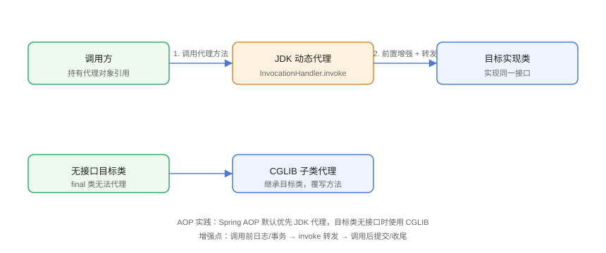

# 动态代理

动态代理（Dynamic Proxy）指在**运行时**生成代理类，拦截对目标对象的方法调用，在调用前后注入额外逻辑。它是 AOP（面向切面编程）的基石：Spring AOP、MyBatis Mapper、RPC 框架都依赖它实现日志、事务、权限、远程调用等横切能力。

## 两种实现对比



| 维度 | JDK 动态代理 | CGLIB 代理 |
| --- | --- | --- |
| 原理 | 实现接口，生成代理类 | 继承目标类，生成子类 |
| 要求 | 目标必须有接口 | 目标不能是 final 类/方法 |
| API | `java.lang.reflect.Proxy` | `net.sf.cglib.proxy`（Spring 内置 repackaged） |
| 性能 | 创建快，反射调用 | 创建慢，方法调用略快（字节码生成） |
| 选择 | 有接口时默认 | 无接口时兜底 |

::: tip 一句话理解
JDK 代理是「找一个同接口的替身」；CGLIB 是「生一个目标类的子类替身」。替身都会在真正干活前后做手脚。
:::

## JDK 动态代理实战

```java
// DynamicProxy/JdkProxyDemo.java
import java.lang.reflect.InvocationHandler;
import java.lang.reflect.Method;
import java.lang.reflect.Proxy;

interface UserService {
    void save(String name);
    String find(String id);
}

class UserServiceImpl implements UserService {
    @Override
    public void save(String name) {
        System.out.println("保存用户：" + name);
    }

    @Override
    public String find(String id) {
        return "用户-" + id;
    }
}

public class JdkProxyDemo {
    public static void main(String[] args) {
        UserServiceImpl target = new UserServiceImpl();

        UserService proxy = (UserService) Proxy.newProxyInstance(
                target.getClass().getClassLoader(),
                target.getClass().getInterfaces(),
                new LogHandler(target));

        proxy.save("张三");
        String result = proxy.find("1001");
        System.out.println("find 返回：" + result);
        System.out.println("代理类型：" + proxy.getClass().getName());
    }
}

class LogHandler implements InvocationHandler {
    private final Object target;

    LogHandler(Object target) {
        this.target = target;
    }

    @Override
    public Object invoke(Object proxy, Method method, Object[] args) throws Throwable {
        System.out.println("【前置】调用 " + method.getName());
        Object result = method.invoke(target, args);   // 转发给真实对象
        System.out.println("【后置】调用结束 " + method.getName());
        return result;
    }
}
```

预期输出：

```text
【前置】调用 save
保存用户：张三
【后置】调用结束 save
【前置】调用 find
【后置】调用结束 find
find 返回：用户-1001
代理类型：jdk.proxy1.$Proxy0
```

::: danger 代理对象不能强转成实现类
JDK 代理类实现的是**接口**，只能强转成接口类型；强转成 `UserServiceImpl` 会抛 `ClassCastException`。CGLIB 代理才能强转成目标类。
:::

## 拦截器链（AOP 雏形）

```java
// DynamicProxy/InterceptorChainDemo.java
import java.lang.reflect.InvocationHandler;
import java.lang.reflect.Method;
import java.lang.reflect.Proxy;
import java.util.ArrayList;
import java.util.List;

interface Interceptor {
    Object intercept(Invocation invocation) throws Throwable;
}

class Invocation {
    final Object target;
    final Method method;
    final Object[] args;
    private int index = 0;
    private final List<Interceptor> interceptors;

    Invocation(Object target, Method method, Object[] args, List<Interceptor> interceptors) {
        this.target = target;
        this.method = method;
        this.args = args;
        this.interceptors = interceptors;
    }

    Object proceed() throws Throwable {
        if (index < interceptors.size()) {
            return interceptors.get(index++).intercept(this);
        }
        return method.invoke(target, args);
    }
}

public class InterceptorChainDemo {
    public static void main(String[] args) {
        UserService target = new UserServiceImpl();
        List<Interceptor> interceptors = new ArrayList<>(List.of(
                new LogInterceptor(), new TxInterceptor()));

        UserService proxy = (UserService) Proxy.newProxyInstance(
                target.getClass().getClassLoader(),
                target.getClass().getInterfaces(),
                (p, m, a) -> new Invocation(target, m, a, interceptors).proceed());

        proxy.save("王五");
    }
}

class LogInterceptor implements Interceptor {
    @Override
    public Object intercept(Invocation invocation) throws Throwable {
        System.out.println("[日志] 方法开始：" + invocation.method.getName());
        Object r = invocation.proceed();
        System.out.println("[日志] 方法结束");
        return r;
    }
}

class TxInterceptor implements Interceptor {
    @Override
    public Object intercept(Invocation invocation) throws Throwable {
        System.out.println("[事务] 开启事务");
        try {
            Object r = invocation.proceed();
            System.out.println("[事务] 提交事务");
            return r;
        } catch (Throwable t) {
            System.out.println("[事务] 回滚事务");
            throw t;
        }
    }
}
```

预期输出：

```text
[日志] 方法开始：save
[事务] 开启事务
保存用户：王五
[事务] 提交事务
[日志] 方法结束
```

这就是 MyBatis 插件、Spring AOP 拦截器链的简化模型：每个拦截器包装下一个，形成责任链。

## 框架中的应用

| 框架 | 应用场景 |
| --- | --- |
| Spring AOP | 声明式事务、日志、权限切面 |
| MyBatis | Mapper 接口动态代理，无需实现类 |
| Spring Data JPA | Repository 接口代理 |
| RPC（Dubbo/Feign） | 接口代理转发远程调用 |
| Mockito | 测试对象 mock |
| Lombok | 编译期生成（与运行期代理互补） |

## 易错点与最佳实践

::: danger 常见坑
1. **JDK 代理必须接口**：目标类没实现接口会抛 `IllegalArgumentException`，改用 CGLIB。
2. **final 类/方法无法代理**：CGLIB 继承式代理遇到 final 直接失效，Spring 中表现为 AOP 不生效。
3. **自调用不走代理**：`this.method()` 在类内部调用不经过代理对象，事务/缓存切面失效，应注入代理或拆类。
4. **`toString`/`hashCode`/`equals` 也被拦截**：`invoke` 中处理这些方法时要小心死循环（代理调用自身方法）。
5. **代理对象的 `getClass()` 是代理类**：用 `Proxy.isProxyClass()` 判断，别用 instanceof 判断实现类。
:::

::: tip 最佳实践
- Spring 项目优先用 `@Transactional`、`@Cacheable` 等声明式能力，理解其底层是代理即可。
- 手写代理时缓存 `InvocationHandler` 与 `Method`，避免每次调用重复构建。
- 调试 AOP 不生效时，先确认：对象是否被代理（`getClass()` 名称）、方法是否 public、自调用问题。
:::

## 验证方式

```shell
javac JdkProxyDemo.java InterceptorChainDemo.java
java JdkProxyDemo
java InterceptorChainDemo
```

预期：`JdkProxyDemo` 输出前置/后置日志且 `find` 返回值正确；`InterceptorChainDemo` 按「日志 → 事务 → 业务 → 提交 → 日志结束」顺序输出。修改 `UserServiceImpl` 去掉接口再运行 JDK 代理，确认抛出 `IllegalArgumentException`。

## 参考资料

- [Proxy API 文档](https://docs.oracle.com/en/java/javase/25/docs/api/java.base/java/lang/reflect/Proxy.html)
- [InvocationHandler API 文档](https://docs.oracle.com/en/java/javase/25/docs/api/java.base/java/lang/reflect/InvocationHandler.html)
- [Spring AOP 官方文档](https://docs.spring.io/spring-framework/reference/core/aop.html)
