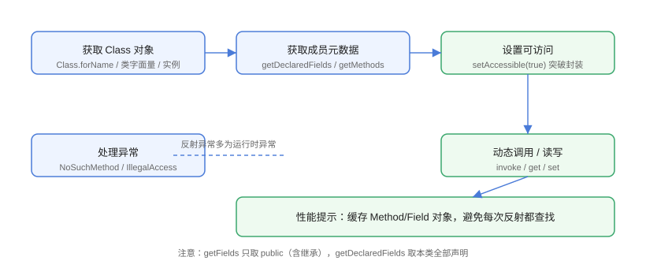

# 字段与方法反射

字段反射（`Field`）与方法反射（`Method`）是反射使用最频繁的两部分：运行时读取/修改对象属性、动态调用方法，是 Spring 依赖注入、Jackson 序列化、ORM 映射的基础。

## 获取与调用流程



标准步骤：获取 `Class` → 获取 `Field`/`Method` 元数据 → `setAccessible(true)`（私有成员）→ 动态读写/调用 → 处理异常。

## 字段反射 Field

```java
// FieldsMethods/FieldDemo.java
import java.lang.reflect.Field;

class User {
    private String name = "张三";
    public int age = 25;
    static final String TYPE = "user";
}

public class FieldDemo {
    public static void main(String[] args) throws Exception {
        User user = new User();
        Class<?> clazz = user.getClass();

        // getFields：仅 public（含继承）
        System.out.println("=== getFields ===");
        for (Field f : clazz.getFields()) {
            System.out.println("  " + f.getName());
        }

        // getDeclaredFields：本类全部字段
        System.out.println("=== getDeclaredFields ===");
        for (Field f : clazz.getDeclaredFields()) {
            System.out.println("  " + f.getName() + " 类型=" + f.getType().getSimpleName());
        }

        // 读取私有字段
        Field nameField = clazz.getDeclaredField("name");
        nameField.setAccessible(true);
        System.out.println("修改前 name：" + nameField.get(user));

        // 修改私有字段
        nameField.set(user, "李四");
        System.out.println("修改后 name：" + nameField.get(user));

        // 静态字段
        Field typeField = clazz.getDeclaredField("TYPE");
        System.out.println("静态字段：" + typeField.get(null));
    }
}
```

预期输出：

```text
=== getFields ===
  age
=== getDeclaredFields ===
  name 类型=String
  age 类型=int
  TYPE 类型=String
修改前 name：张三
修改后 name：李四
静态字段：user
```

::: danger 私有字段访问
`getDeclaredField` + `setAccessible(true)` 才能访问私有字段；`getField` 只能拿 public。Java 9+ 模块化系统下，跨模块的 `setAccessible(true)` 可能抛 `InaccessibleObjectException`，需要模块声明或 `--add-opens` 打开包。
:::

## 方法反射 Method

```java
// FieldsMethods/MethodDemo.java
import java.lang.reflect.Method;

class Calc {
    public int add(int a, int b) {
        return a + b;
    }

    private String greet(String name) {
        return "你好，" + name;
    }

    static void staticHi() {
        System.out.println("static hi");
    }
}

public class MethodDemo {
    public static void main(String[] args) throws Exception {
        Class<?> clazz = Calc.class;

        // 精确匹配：getMethod(名称, 参数类型...)
        Method add = clazz.getMethod("add", int.class, int.class);
        Object result = add.invoke(new Calc(), 3, 5);
        System.out.println("add(3,5) = " + result);

        // 私有方法：getDeclaredMethod + setAccessible
        Method greet = clazz.getDeclaredMethod("greet", String.class);
        greet.setAccessible(true);
        Object msg = greet.invoke(new Calc(), "世界");
        System.out.println(msg);

        // 静态方法：invoke 的第一个参数传 null
        Method staticHi = clazz.getDeclaredMethod("staticHi");
        staticHi.invoke(null);

        // 获取全部 public 方法（含 Object 继承的方法）
        System.out.println("=== public 方法 ===");
        for (Method m : clazz.getMethods()) {
            System.out.println("  " + m.getName() + "(" + m.getParameterCount() + " 参数)");
        }
    }
}
```

预期输出：

```text
add(3,5) = 8
你好，世界
static hi
=== public 方法 ===
  add(2 参数)
  greet(1 参数)
  staticHi(0 参数)
  wait(0 参数)
  ...
```

::: danger invoke 参数类型必须匹配
`getMethod("add", int.class, int.class)` 用的是 `int.class` 而非 `Integer.class`；类型不匹配会抛 `NoSuchMethodException`。参数个数错误抛 `IllegalArgumentException`。
:::

## 方法重载与桥接方法

```java
// FieldsMethods/BridgeMethodDemo.java
import java.lang.reflect.Method;

class Parent<T> {
    public void set(T value) { }
}

class Child extends Parent<String> {
    @Override
    public void set(String value) { }
}

public class BridgeMethodDemo {
    public static void main(String[] args) {
        for (Method m : Child.class.getDeclaredMethods()) {
            System.out.println(m.getName() + " 参数=" +
                    m.getParameterTypes()[0].getSimpleName() +
                    " 是否桥接=" + m.isBridge());
        }
    }
}
```

预期输出：

```text
set 参数=String 是否桥接=false
set 参数=Object 是否桥接=true
```

泛型擦除后编译器自动生成 `set(Object)` 桥接方法保持多态，框架处理泛型方法时要识别 `isBridge()` 跳过。

## 性能对比与优化

```java
// FieldsMethods/PerfDemo.java
import java.lang.reflect.Method;

public class PerfDemo {
    public static void main(String[] args) throws Exception {
        Calc calc = new Calc();
        Method add = Calc.class.getMethod("add", int.class, int.class);

        int N = 1_000_000;

        // 直接调用
        long t0 = System.nanoTime();
        for (int i = 0; i < N; i++) calc.add(i, 1);
        long direct = System.nanoTime() - t0;

        // 反射调用（复用 Method 对象）
        long t1 = System.nanoTime();
        for (int i = 0; i < N; i++) add.invoke(calc, i, 1);
        long reflect = System.nanoTime() - t1;

        System.out.println("直接调用：" + direct / 1_000_000 + " ms");
        System.out.println("反射调用：" + reflect / 1_000_000 + " ms");
    }
}
```

::: tip 性能结论
反射调用确实慢（通常数倍于直接调用），但**复用 Method 对象**比每次重新查找快得多；JDK 17+ 的 `MethodHandle.invoke` 与 `VarHandle` 进一步缩小差距。高频路径尽量用编译期方案（接口/泛型/代码生成）。
:::

## 易错点与最佳实践

::: danger 常见坑
1. **基础类型与包装类型混淆**：`getMethod("add", Integer.class)` 找不到参数为 `int` 的方法，必须用 `int.class`。
2. **`invoke` 返回 `Object` 拆箱失败**：返回 `null` 的基础类型包装拆箱会 NPE。
3. **`setAccessible(true)` 失败**：模块化 JDK 下跨模块访问受限，用 `--add-opens` 或避免访问私有成员。
4. **修改 `final` 字段**：`Field.set` 对 final 字段行为不稳定（实例字段在部分 JDK 可改，静态 final 通常不可），不要依赖。
5. **方法签名匹配包含 throws 声明**：`getMethod` 只按名称和参数类型匹配，与返回类型、异常无关。
:::

::: tip 最佳实践
- 框架层把 `Method`/`Field` 缓存到 `Map`（按名称/签名），不要每次反射都全量查找。
- 反射调用失败时包装成带上下文（类名 + 方法名）的异常，方便排查。
- 优先 `getMethod`（public）；确需私有成员时先评估是否能用接口替代。
:::

## 验证方式

```shell
javac FieldDemo.java MethodDemo.java
java FieldDemo
java MethodDemo
```

预期：`FieldDemo` 输出字段清单与修改前后的 name；`MethodDemo` 输出 `add(3,5) = 8`、`你好，世界`、`static hi`。运行 `BridgeMethodDemo` 确认桥接方法识别。

## 参考资料

- [Field API 文档](https://docs.oracle.com/en/java/javase/25/docs/api/java.base/java/lang/reflect/Field.html)
- [Method API 文档](https://docs.oracle.com/en/java/javase/25/docs/api/java.base/java/lang/reflect/Method.html)
- [MethodHandle API 文档](https://docs.oracle.com/en/java/javase/25/docs/api/java.base/java/lang/invoke/MethodHandle.html)
