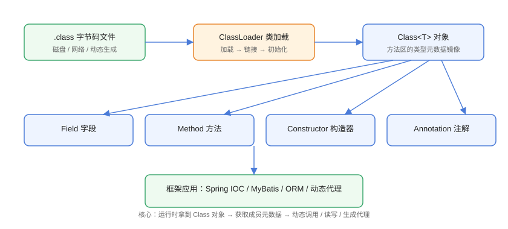

# 反射概述与 Class 对象

反射（Reflection）指程序在运行时获取自身结构信息的能力：拿到类的名称、字段、方法、构造器、注解，并动态创建对象、调用方法、读写字段。它是 Java 动态特性的核心，也是 Spring IOC、MyBatis、动态代理等框架的实现基础。

## 反射的运行原理



流程：`.class` 字节码 → `ClassLoader` 加载到方法区 → JVM 生成 `Class<T>` 对象 → 通过 `Class` 对象访问字段、方法、构造器、注解等元数据。

::: tip 一句话理解
普通代码是「编译期确定调用谁」；反射是「运行期才决定调用谁」，用元数据描述代替硬编码。
:::

## 获取 Class 对象的三种方式

```java
// Overview/GetClassDemo.java
public class GetClassDemo {
    public static void main(String[] args) throws ClassNotFoundException {
        // 方式一：类字面量（编译期安全，最推荐）
        Class<String> c1 = String.class;

        // 方式二：实例.getClass()（运行时获取）
        String s = "hello";
        Class<? extends String> c2 = s.getClass();

        // 方式三：Class.forName（字符串驱动，适合配置文件）
        Class<?> c3 = Class.forName("java.lang.String");

        System.out.println("c1 == c2：" + (c1 == c2));
        System.out.println("c2 == c3：" + (c2 == c3));
        System.out.println("类名：" + c1.getName());
        System.out.println("简单名：" + c1.getSimpleName());
        System.out.println("包名：" + c1.getPackageName());
        System.out.println("是否接口：" + c1.isInterface());
        System.out.println("是否数组：" + c1.isArray());
    }
}
```

预期输出：

```text
c1 == c2：true
c2 == c3：true
类名：java.lang.String
简单名：String
包名：java.lang
是否接口：false
是否数组：false
```

::: warning 同一个类只有一个 Class 对象
JVM 对每个已加载类只保留一份 `Class` 实例，三种方式拿到的是同一个对象（`==` 为 true）。
:::

## Class 对象核心 API

| 方法 | 作用 |
| --- | --- |
| `getName()` | 全限定类名（含包名） |
| `getSimpleName()` | 简单类名 |
| `getPackage()` / `getPackageName()` | 包信息 |
| `getModifiers()` | 修饰符（与 `Modifier` 工具类配合） |
| `getSuperclass()` | 父类 |
| `getInterfaces()` | 实现的接口数组 |
| `getClassLoader()` | 加载该类的类加载器 |
| `isInterface()` / `isArray()` / `isEnum()` / `isAnnotation()` | 类型判断 |
| `getFields()` / `getMethods()` | 获取 public 成员（含继承） |
| `getDeclaredFields()` / `getDeclaredMethods()` | 获取本类全部声明成员 |
| `getConstructors()` | 获取构造器 |
| `getAnnotations()` | 获取注解 |
| `cast(Object)` | 类型安全的类型转换 |

### 类型判断与转换示例

```java
// Overview/ClassCheckDemo.java
import java.util.ArrayList;
import java.util.List;

public class ClassCheckDemo {
    public static void main(String[] args) {
        Object obj = new ArrayList<>();

        Class<?> clazz = obj.getClass();
        System.out.println("是 List 的实例：" + (obj instanceof List));

        // cast：把 Object 安全转换为目标类型
        List<?> list = List.class.cast(obj);
        System.out.println("cast 后元素数：" + list.size());

        // 判断是否可赋值
        System.out.println("List 能否接受 ArrayList：" +
                List.class.isAssignableFrom(clazz));
        System.out.println("ArrayList 能否接受 List：" +
                clazz.isAssignableFrom(List.class));
    }
}
```

## 泛型与 Class

泛型在运行时被擦除，但 `Class` 可以携带类型信息：

```java
// Overview/GenericClassDemo.java
import java.lang.reflect.ParameterizedType;
import java.lang.reflect.Type;
import java.util.ArrayList;
import java.util.List;

public class GenericClassDemo {
    // 通过继承保存泛型类型
    static class StringList extends ArrayList<String> { }

    public static void main(String[] args) {
        Type superType = StringList.class.getGenericSuperclass();
        System.out.println("父类泛型类型：" + superType);

        if (superType instanceof ParameterizedType pt) {
            Type[] args = pt.getActualTypeArguments();
            System.out.println("泛型参数：" + args[0]);
        }
    }
}
```

预期输出：

```text
父类泛型类型：java.util.ArrayList<java.lang.String>
泛型参数：class java.lang.String
```

::: tip 为什么框架能拿到泛型
直接 `List<String>.class` 不行，但通过**带泛型父类的子类**（如 `TypeReference`、匿名内部类），`getGenericSuperclass()` 能拿到保留在字节码中的泛型签名。Jackson、MyBatis 的泛型反序列化都依赖这个技巧。
:::

## 反射的用途

| 场景 | 说明 |
| --- | --- |
| 框架 IOC/DI | Spring 根据配置/注解创建对象并注入依赖 |
| ORM | MyBatis 将查询结果映射到实体字段 |
| 动态代理 | Spring AOP、MyBatis Mapper 代理 |
| 序列化 | Jackson/Gson 反射读写对象属性 |
| 测试框架 | JUnit 反射调用测试方法、访问私有方法 |
| 热加载 | 类加载器隔离与动态替换类 |

## 易错点与最佳实践

::: danger 常见坑
1. **`getFields` 与 `getDeclaredFields` 混淆**：前者只取 public（含继承），后者取本类全部（不含继承），按需选择。
2. **`Class.forName` 触发静态初始化**：默认执行静态块，只想要 Class 对象可用 `Class.forName(name, false, loader)`。
3. **反射访问私有成员**：默认抛 `IllegalAccessException`，需要 `setAccessible(true)`；JDK 9+ 模块化下还要考虑 `--add-opens`。
4. **性能误区**：反射调用比直接调用慢，但获取并缓存 `Method`/`Field` 后差距可大幅缩小（JDK 17+ 的 MethodHandle 更快）。
:::

::: tip 最佳实践
- 优先用 `类字面量`（`String.class`）而不是 `Class.forName`，编译期即可发现类型错误。
- 框架中缓存 `Class`、`Method`、`Field` 元数据，避免重复查找。
- 业务代码少用反射；能用接口、多态、泛型解决的就不要反射。
:::

## 验证方式

```shell
javac GetClassDemo.java
java GetClassDemo
```

预期：三种方式拿到同一个 Class 对象（比较结果均为 true），类名输出 `java.lang.String`。再运行 `ClassCheckDemo` 与 `GenericClassDemo` 确认类型判断与泛型信息读取正确。

## 参考资料

- [Class API 文档](https://docs.oracle.com/en/java/javase/25/docs/api/java.base/java/lang/Class.html)
- [Oracle Java 教程：反射](https://docs.oracle.com/javase/tutorial/reflect/index.html)
- [java.lang.reflect 包 API 文档](https://docs.oracle.com/en/java/javase/25/docs/api/java.base/java/lang/reflect/package-summary.html)
