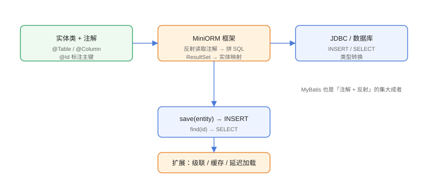

# 实战：注解驱动简易 ORM

综合运用注解、反射与 JDBC，实现一个迷你 ORM：用 `@Table`/`@Column`/`@Id` 标注实体，框架自动完成「实体 → INSERT/UPDATE SQL」与「ResultSet → 实体」双向映射。这是 MyBatis 原理的最小化复现，做完你对框架魔法会有完全不同的认识。

## 整体设计



设计目标：

1. 用注解声明实体与表的映射关系；
2. 通过反射读取注解生成 SQL；
3. 通过反射把 ResultSet 映射回实体；
4. 提供 `save(entity)` 与 `findById(clazz, id)` 两个核心 API。

## 第一步：定义注解

```java
// Practice/orm/Table.java
import java.lang.annotation.ElementType;
import java.lang.annotation.Retention;
import java.lang.annotation.RetentionPolicy;
import java.lang.annotation.Target;

@Target(ElementType.TYPE)
@Retention(RetentionPolicy.RUNTIME)
public @interface Table {
    String value();
}
```

```java
// Practice/orm/Column.java
import java.lang.annotation.ElementType;
import java.lang.annotation.Retention;
import java.lang.annotation.RetentionPolicy;
import java.lang.annotation.Target;

@Target(ElementType.FIELD)
@Retention(RetentionPolicy.RUNTIME)
public @interface Column {
    String value();
    boolean id() default false;
}
```

## 第二步：定义实体

```java
// Practice/User.java
@Table("t_user")
public class User {
    @Column(value = "id", id = true)
    private Long id;

    @Column("name")
    private String name;

    @Column("age")
    private Integer age;

    public User() { }

    public User(String name, Integer age) {
        this.name = name;
        this.age = age;
    }

    // getter / setter 省略（供 ORM 使用）
    public Long getId() { return id; }
    public void setId(Long id) { this.id = id; }
    public String getName() { return name; }
    public void setName(String name) { this.name = name; }
    public Integer getAge() { return age; }
    public void setAge(Integer age) { this.age = age; }

    @Override
    public String toString() {
        return "User{id=" + id + ", name='" + name + "', age=" + age + "}";
    }
}
```

## 第三步：编写 ORM 核心

```java
// Practice/orm/MiniORM.java
import java.lang.reflect.Field;
import java.sql.Connection;
import java.sql.DriverManager;
import java.sql.PreparedStatement;
import java.sql.ResultSet;
import java.util.ArrayList;
import java.util.List;

public class MiniORM {
    private final Connection conn;

    public MiniORM(String url, String user, String password) throws Exception {
        this.conn = DriverManager.getConnection(url, user, password);
    }

    /** 把实体对象保存到数据库（自动生成 INSERT） */
    public <T> void save(T entity) throws Exception {
        Class<?> clazz = entity.getClass();
        String table = clazz.getAnnotation(Table.class).value();

        List<Field> fields = new ArrayList<>();
        List<String> cols = new ArrayList<>();
        List<Object> vals = new ArrayList<>();

        for (Field field : clazz.getDeclaredFields()) {
            Column column = field.getAnnotation(Column.class);
            if (column == null || column.id()) continue;   // 主键自增，不插入
            field.setAccessible(true);
            fields.add(field);
            cols.add(column.value());
            vals.add(field.get(entity));
        }

        String sql = "INSERT INTO " + table + " (" +
                String.join(", ", cols) + ") VALUES (" +
                String.join(", ", cols.stream().map(c -> "?").toList()) + ")";
        System.out.println("SQL：" + sql);

        try (PreparedStatement ps = conn.prepareStatement(sql)) {
            for (int i = 0; i < vals.size(); i++) {
                ps.setObject(i + 1, vals.get(i));
            }
            ps.executeUpdate();
        }
    }

    /** 按主键查询，把 ResultSet 映射为实体 */
    public <T> T findById(Class<T> clazz, Object id) throws Exception {
        String table = clazz.getAnnotation(Table.class).value();
        String idColumn = null;
        List<Field> fields = new ArrayList<>();

        for (Field field : clazz.getDeclaredFields()) {
            Column column = field.getAnnotation(Column.class);
            if (column == null) continue;
            fields.add(field);
            if (column.id()) idColumn = column.value();
        }

        String sql = "SELECT * FROM " + table + " WHERE " + idColumn + " = ?";
        System.out.println("SQL：" + sql);

        try (PreparedStatement ps = conn.prepareStatement(sql)) {
            ps.setObject(1, id);
            try (ResultSet rs = ps.executeQuery()) {
                if (rs.next()) {
                    T entity = clazz.getConstructor().newInstance();
                    for (Field field : fields) {
                        Column column = field.getAnnotation(Column.class);
                        field.setAccessible(true);
                        Object value = rs.getObject(column.value());
                        field.set(entity, convert(value, field.getType()));
                    }
                    return entity;
                }
            }
        }
        return null;
    }

    private Object convert(Object value, Class<?> type) {
        if (value == null || type.isInstance(value)) return value;
        if (type == Long.class || type == long.class) return ((Number) value).longValue();
        if (type == Integer.class || type == int.class) return ((Number) value).intValue();
        return value;
    }

    public void close() throws Exception {
        conn.close();
    }
}
```

## 第四步：运行验证

```java
// Practice/OrDemo.java
public class OrDemo {
    public static void main(String[] args) throws Exception {
        // 使用 H2 内存数据库，零配置
        MiniORM orm = new MiniORM(
                "jdbc:h2:mem:test;DB_CLOSE_DELAY=-1", "sa", "");

        try (java.sql.Connection c = java.sql.DriverManager.getConnection(
                "jdbc:h2:mem:test", "sa", "")) {
            c.createStatement().execute(
                    "CREATE TABLE t_user (id BIGINT AUTO_INCREMENT PRIMARY KEY, " +
                    "name VARCHAR(50), age INT)");
        }

        // 保存
        User user = new User("张三", 25);
        orm.save(user);
        System.out.println("保存成功");

        // 查询
        User loaded = orm.findById(User.class, 1L);
        System.out.println("查询结果：" + loaded);

        orm.close();
    }
}
```

依赖（Maven 坐标）：

```xml
<dependency>
    <groupId>com.h2database</groupId>
    <artifactId>h2</artifactId>
    <version>2.3.232</version>
    <scope>test</scope>
</dependency>
```

预期输出：

```text
SQL：INSERT INTO t_user (name, age) VALUES (?, ?)
保存成功
SQL：SELECT * FROM t_user WHERE id = ?
查询结果：User{id=1, name='张三', age=25}
```

## 扩展方向

| 功能 | 思路 |
| --- | --- |
| 更新/删除 | 按主键生成 `UPDATE` / `DELETE` SQL |
| 驼峰转下划线 | `name` 字段自动映射 `name` 列，`createTime` → `create_time` |
| 类型转换 | 时间、枚举、JSON 字段的序列化/反序列化 |
| 查询条件 | 用方法名/注解声明条件（类似 Spring Data） |
| 结果集缓存 | 缓存 `Class → 字段映射`，避免每次反射全量查找 |
| 分页 | SQL 拼接 `LIMIT/OFFSET` 或数据库方言封装 |

::: tip 从迷你 ORM 到 MyBatis
MyBatis 的核心同样是「注解/XML 元数据 + 反射映射 + JDBC 执行」，只是多了动态 SQL、缓存、插件（拦截器链）等工业级能力。理解这个 Demo，再读 MyBatis 源码会轻松很多。
:::

## 易错点与最佳实践

::: danger 常见坑
1. **字段与列名不一致**：忘记注解或命名约定，映射结果全为 null，先打印 SQL 确认列名。
2. **类型转换缺失**：数据库返回 `Long`/`BigDecimal`，实体字段是 `Integer`，直接 `setObject` 可能类型不匹配，需要转换层。
3. **主键策略**：自增主键插入后需要 `getGeneratedKeys()` 回填 id，Demo 未覆盖，生产 ORM 必须处理。
4. **SQL 注入**：表名/列名来自注解（可信），但查询条件值必须用 `PreparedStatement` 参数，禁止字符串拼接。
5. **连接泄漏**：ORM 内部分配的连接要统一管理，生产使用连接池。
:::

::: tip 最佳实践
- 实体元数据（注解 → 字段映射）构建一次并缓存，性能接近手写 JDBC。
- 框架层反射 + 业务层编译期代码生成（record、POJO）结合，兼顾灵活与性能。
- 写自己的 ORM 只为学习；生产直接选 MyBatis/Spring Data JPA。
:::

## 验证方式

```shell
# 用 Maven 管理 H2 依赖后执行
mvn compile exec:java -Dexec.mainClass=OrDemo
```

预期：控制台按顺序输出 INSERT/查询 SQL 与实体映射结果；修改 `User` 增加字段并加注解后，无需改 ORM 代码即可完成新字段的存取。

## 参考资料

- [MyBatis 官方文档](https://mybatis.org/mybatis-3/zh_CN/index.html)
- [H2 数据库文档](https://www.h2database.com/html/main.html)
- [JDBC API 文档](https://docs.oracle.com/en/java/javase/25/docs/api/java.sql/java/sql/package-summary.html)
