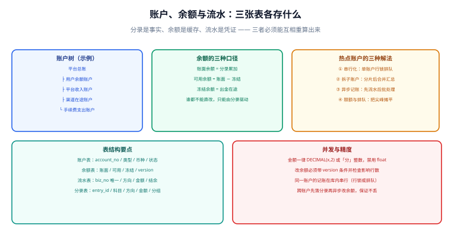

# 账户、余额与流水

**账户是资金归属的容器，余额是它在某一刻的值，流水是它变化的可读记录。** 三者里只有账户是「实体」，余额与流水都是**可重算的派生视图**——记住这一点，余额不一致的问题就从「玄学」变成了「重算一遍」。



## 一句话定位

**余额是缓存，不是事实。** 任何时刻都应当能用分录重算出余额；做不到这一点的设计，出问题时只能凭猜。

## 一、余额的三种口径

「账户里有多少钱」这句话至少有三种含义，混用是资金事故的常见起点。

| 口径 | 定义 | 典型用途 | 注意 |
| --- | --- | --- | --- |
| **账面余额** | 分录累加的结果，包含在途与冻结 | 财务对账、报表 | 恒等于分录聚合值 |
| **可用余额** | 账面余额 − 冻结余额 | 下单校验、提现校验 | 唯一允许业务直接用判断的口径 |
| **冻结余额** | 已受理但未完成的出金 / 预授权占用 | 提现中、预授权 | 解冻必须与冻结成对出现 |

```
账面余额 = 可用余额 + 冻结余额
```

::: danger 三个口径混用后的典型事故
1. **用账面余额校验提现** → 用户可以把在途资金重复提现，形成超额出款。
2. **冻结没有对应的解冻路径** → 用户资金被永久占用，客服只能手工改库（然后余额与分录彻底不一致）。
3. **余额表同时被两个业务直接改** → 一个业务加、一个业务减，谁也不知道最终值该是多少；所有余额变更必须经过统一的记账入口。
:::

## 二、账户状态与生命周期

账户不是一建就永久可用的，它有自己的状态机：

| 状态 | 含义 | 允许的记账 | 允许的出金 |
| --- | --- | --- | --- |
| `ACTIVE` | 正常 | 允许 | 允许 |
| `FROZEN` | 风控 / 合规冻结 | 只允许「入金」类分录 | 禁止 |
| `CLOSED` | 已销户 | 禁止 | 禁止，需先结清余额 |
| `PENDING` | 待激活（如未实名） | 允许入金，记在待激活科目 | 禁止 |

状态迁移同样需要审计：谁在什么时候、因为什么把账户冻结，必须可查。**状态迁移不走分录**（它不是资金变动），但必须与账务变更同源记录，否则会出现「账户已冻结但仍在出金」的窗口。

## 三、账户树与层级汇总

业务上常需要「某个商户下所有门店的合计」「平台全部用户余额合计」。两种做法：

| 做法 | 实现 | 代价 | 适用 |
| --- | --- | --- | --- |
| **实时聚合** | `SUM()` 直接按 `owner_id` 分组 | 账户量大时慢 | 账户数 < 十万 |
| **层级账户** | 每个父节点也是一个账户，子账户变动时同步更新父账户 | 写放大（一次变动写多个账户） | 需要高频查询汇总 |
| **物化快照** | 定时（如每分钟）把聚合结果写入汇总表 | 有延迟 | 看板与报表 |

::: tip 优先选实时聚合 + 索引
除非汇总查询非常高频，否则不要引入层级账户——它会让「一次业务写几条分录」变得不确定，幂等与对账复杂度立刻翻倍。**先用实时聚合，把索引建好**（`KEY idx_owner (owner_type, owner_id)`），等它真的慢了再引入快照。
:::

## 四、表结构：余额表与流水表

```sql [balance-and-flow.sql]
-- 余额表：派生值，必须能被分录重算出来
CREATE TABLE t_account_balance (
  account_no     VARCHAR(32)   NOT NULL,
  book_balance   DECIMAL(18,2) NOT NULL DEFAULT 0.00 COMMENT '账面余额',
  available      DECIMAL(18,2) NOT NULL DEFAULT 0.00 COMMENT '可用余额',
  frozen         DECIMAL(18,2) NOT NULL DEFAULT 0.00 COMMENT '冻结余额',
  last_entry_id  BIGINT        NOT NULL DEFAULT 0    COMMENT '已计入的最大分录 ID，用于增量重算',
  version        INT           NOT NULL DEFAULT 0    COMMENT '乐观锁版本号',
  update_time    DATETIME      NOT NULL DEFAULT CURRENT_TIMESTAMP ON UPDATE CURRENT_TIMESTAMP,
  PRIMARY KEY (account_no),
  CONSTRAINT ck_balance CHECK (book_balance = available + frozen)
) ENGINE=InnoDB DEFAULT CHARSET=utf8mb4 COMMENT='账户余额';

-- 流水表：给人和客服看的可读记录；由分录派生，允许按展示需要裁剪
CREATE TABLE t_account_flow (
  flow_id      BIGINT       NOT NULL AUTO_INCREMENT,
  flow_no      VARCHAR(40)  NOT NULL COMMENT '流水号',
  account_no   VARCHAR(32)  NOT NULL,
  biz_type     VARCHAR(32)  NOT NULL,
  biz_no       VARCHAR(64)  NOT NULL COMMENT '业务单号，与分录组的 biz_no 一致',
  direction    CHAR(1)      NOT NULL COMMENT 'D=增加 C=减少（展示口径，不是会计借贷）',
  amount       DECIMAL(18,2) NOT NULL,
  balance_after DECIMAL(18,2) NOT NULL COMMENT '发生后的可用余额，展示用',
  entry_time   DATETIME     NOT NULL,
  create_time  DATETIME     NOT NULL DEFAULT CURRENT_TIMESTAMP,
  PRIMARY KEY (flow_id),
  UNIQUE KEY uk_flow (account_no, biz_no, direction),
  KEY idx_account_time (account_no, entry_time)
) ENGINE=InnoDB DEFAULT CHARSET=utf8mb4 COMMENT='账户流水（展示口径）';
```

::: warning 流水表的 `direction` 和分录表的 `direction` 不是一回事
分录的 `D/C` 是**会计借贷方向**，由科目类别决定；流水的增加 / 减少是**展示口径**，用户看到的「+100 / −39.9」。同一个账户上，两者常常是一致的，但**不要用同一套枚举复用**，否则某天有人按流水方向去写分录时，会直接把借贷写反。字段名前缀或注释里必须写清楚口径。
:::

## 五、余额更新的三种实现

余额变更必须并发安全，三种做法的取舍如下：

| 做法 | 写法 | 优点 | 缺点 |
| --- | --- | --- | --- |
| 原子 UPDATE | `SET available = available + ? WHERE available + ? >= 0` | 无锁等待、语句级原子 | 无法在同一语句里做复杂校验 |
| 乐观锁 | `WHERE version = ?`，冲突重试 | 冲突少时性能好 | 冲突多时重试风暴 |
| 悲观锁 | `SELECT ... FOR UPDATE` | 逻辑简单、便于多步校验 | 同账户串行，热点账户排队 |

```java [LedgerService.java]
/** 统一的余额变更入口：所有余额变化都必须走这里。 */
@Transactional(rollbackFor = Exception.class)
public void post(EntryGroup group) {
    // ① 先写分录组与分录（事实层），唯一键负责幂等
    entryGroupMapper.insert(group);
    entryMapper.batchInsert(group.getEntries());

    // ② 再更新余额（派生层），按账户排序加锁，避免死锁
    List<Entry> entries = group.getEntries().stream()
            .sorted(Comparator.comparing(Entry::getAccountNo))
            .toList();
    for (Entry e : entries) {
        int delta = e.isDebit() ? e.getSignedDelta() : -e.getSignedDelta();
        // 原子更新 + 条件校验：余额不足即返回 0 行，事务回滚
        int n = balanceMapper.applyDelta(e.getAccountNo(), delta, group.getGroupNo());
        if (n == 0) {
            throw new BizException(ErrorCode.BALANCE_NOT_ENOUGH, e.getAccountNo());
        }
    }
    // ③ 流水是展示层，最后写；失败不影响账本正确性，可由补偿任务重建
    flowMapper.batchInsert(Flow.from(group));
}
```

```xml [BalanceMapper.xml]
<!-- 原子更新：负数余额在 WHERE 里被挡住，不依赖应用层判断 -->
<update id="applyDelta">
  UPDATE t_account_balance
     SET available = available + #{delta},
         book_balance = book_balance + #{delta},
         version = version + 1
   WHERE account_no = #{accountNo}
     AND available + #{delta} >= 0        <!-- 出金类不让余额变负 -->
</update>
```

::: danger 余额更新的四个坑
1. **先查余额再更新**。`SELECT` 与 `UPDATE` 之间会被其他事务插入，形成超卖式超额出金；必须把校验放进 `UPDATE ... WHERE` 或加行锁。
2. **多个账户无序加锁**。一次业务涉及两个账户时，A 事务按「账户1 → 账户2」加锁、B 事务反向，直接死锁；**统一按 `account_no` 排序**加锁或更新。
3. **把流水写失败当成记账失败**。流水是展示层，可以让补偿任务重建；反过来把「流水写成功但分录失败」当成成功，才是真事故。
4. **用 `SELECT SUM(amount)` 当余额读**。事务提交前的未完成分录会被算进去（取决于隔离级别与索引），读到的值可能与最终值不同；**读余额读余额表，校验余额才用分录**。
:::

## 六、热点账户：四种解法

「热点账户」指短时间内被大量并发写入的账户，典型如：平台收入账户、渠道在途账户、大商户的应结账户。它们的特点是**所有业务都写同一个 `account_no`**，行锁把并发压成了串行。

| 解法 | 做法 | 代价 | 判据 |
| --- | --- | --- | --- |
| 拆分账户 | 一个逻辑账户拆成 N 个物理子账户，按业务键分片，汇总时相加 | 查询要汇总，冲正要定位分片 | 单账户 TPS 成为瓶颈时 |
| 异步记账 | 先写分录流水队列，由消费者批量入账 | 有延迟，余额短时不精确 | 允许「最终可用」的场景 |
| 排队合并 | 同账户的分录在内存中合并，一次 UPDATE 写多笔之和 | 进程崩溃会丢内存批次，必须落盘先行 | 分录产生速率远高于余额读取速率 |
| 分级余额 | 余额分为「大粒度批次余额 + 明细差额」 | 复杂度高 | 极端场景，慎用 |

::: tip 先量再拆
拆账户会让「余额是账户维度还是逻辑账户维度」这个问题被放大，对账、提现、冲正都要相应改造。**先用监控证明瓶颈在行锁等待（`Innodb_row_lock_waits`）而不是其他环节**，再动手拆。判据是明确的：单账户 TPS 上不去、且 `SHOW ENGINE INNODB STATUS` 显示大量锁等待。
:::

## 验证方式

```shell
# 1. 余额与分录一致（核心判据：期望返回空）
mysql -u app -p < check-balance-drift.sql

# 2. 口径自洽：账面 = 可用 + 冻结（期望返回空）
mysql -u app -p -e "
SELECT account_no, book_balance, available, frozen
FROM t_account_balance WHERE book_balance <> available + frozen;"

# 3. 流水与分录笔数是否对得上（按业务单号，期望返回空）
mysql -u app -p -e "
SELECT f.biz_no, COUNT(*) AS flow_cnt
FROM t_account_flow f LEFT JOIN t_entry e ON e.group_no = f.biz_no
GROUP BY f.biz_no HAVING flow_cnt <> COUNT(e.entry_id);"
```

**并发出金验证（在两台终端同时跑）**：

```shell
# 终端 A 与终端 B 同时对同一账户发起 100 次 1 元的出金，账户初始可用 100 元
# 期望：成功 100 次、失败 0 次、最终可用余额恰好 0.00，且无负余额
```

| 检查项 | 期望结果 | 结论 |
| --- | --- | --- |
| 余额与分录一致 | 返回空集 | 待填写 |
| 账面 = 可用 + 冻结 | 返回空集 | 待填写 |
| 并发出金 | 无负余额、无超额成功 | 待填写 |

## 相关页面

- 上一节：[复式记账与账本模型](../DoubleEntry/index.md)
- 下一节：[记账幂等与一致性](../Idempotency/index.md)
- 事务与锁：[MySQL · 事务](../../../DB/Relational/MySQL/Transaction/index.md)

## 参考资料

- [Martin Fowler · Patterns for Accounting（Account 与 balance 的派生关系）](https://martinfowler.com/eaaDev/AccountingNarrative.html)
- [MySQL 8.4 Reference Manual · InnoDB Locking](https://dev.mysql.com/doc/refman/8.4/en/innodb-locking.html)
- [Stripe · Idempotent requests](https://docs.stripe.com/api/idempotent_requests)
