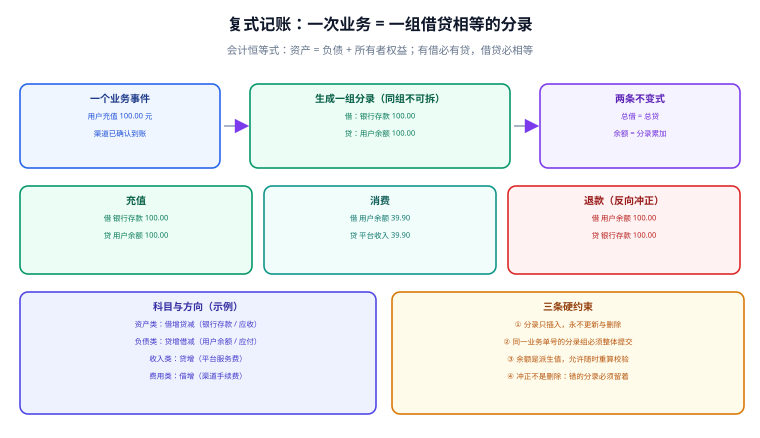

# 复式记账与账本模型

**复式记账（Double-entry bookkeeping）用一条数学约束解决了「钱会不会凭空出现」的问题：每笔业务都必须写成一组借贷合计相等的分录。** 这不是会计的繁文缛节，而是一个可以被数据库直接校验的不变式。本页给出科目表、分录组与完整 DDL，并说明借贷方向到底由什么决定。



## 一句话定位

**单边记账只能告诉你「某个数变了」，复式记账才能告诉你「钱从哪儿来、到哪儿去」。** 前者永远发现不了「这个数为什么变了」，后者把每一次变动都表达成两个账户之间的守恒转移。

## 一、会计恒等式

```
资产 = 负债 + 所有者权益
```

把收入与费用展开（收入增加权益、费用减少权益），恒等式在**任意时刻**都必须成立。工程上的意义是：**它是一个可以在生产库上跑的断言。**

```sql [invariant.sql]
-- 恒等式校验：资产合计 − 负债合计 − 权益合计 应恒为 0
SELECT
  SUM(CASE WHEN cat = 'ASSET'   THEN balance ELSE 0 END) AS assets,
  SUM(CASE WHEN cat = 'LIABILITY' THEN -balance ELSE 0 END) AS liabilities,
  SUM(CASE WHEN cat = 'EQUITY'  THEN -balance ELSE 0 END) AS equity
FROM t_account_balance b
JOIN t_account a ON a.account_no = b.account_no;
-- 期望：assets − liabilities − equity = 0.00
```

## 二、借贷方向到底由什么决定

初学复式记账最容易卡住的地方是「什么时候借、什么时候贷」。**结论：方向不是由「收钱 / 付钱」决定的，而是由账户所属科目类别决定的。**

| 科目类别 | 余额方向 | 增加记 | 减少记 | 例子 |
| --- | --- | --- | --- | --- |
| 资产类 | 借 | 借 | 贷 | 银行存款、应收款、在途资金 |
| 负债类 | 贷 | 贷 | 借 | 用户余额（平台欠用户）、应付款 |
| 所有者权益类 | 贷 | 贷 | 借 | 实收资本、未分配利润 |
| 收入类 | 贷 | 贷 | 借 | 平台服务费、通道收入 |
| 费用 / 成本类 | 借 | 借 | 贷 | 支付手续费、结算费 |

::: tip 记不住时的推导法
把「用户余额」想成**平台欠用户的钱**（负债）：用户充值 100 元，平台欠用户的负债增加，负债增加记 **贷**；同时平台银行存款（资产）增加，资产增加记 **借**。于是得到：

```text
借：银行存款   100.00
贷：用户余额   100.00
```

只要先判断科目类别，再判断是增还是减，方向自然就出来了——不需要背口诀。
:::

## 三、科目表设计

科目表是**分类体系**，账户是**实例**。一个科目下可以有成千上万个账户（每个用户一个余额账户），但科目本身是固定的、由财务确认的。

```sql [chart-of-accounts.sql]
CREATE TABLE t_account (
  account_no   VARCHAR(32)  NOT NULL COMMENT '账户号（业务侧生成，全局唯一）',
  account_name VARCHAR(64)  NOT NULL COMMENT '账户名称（可读）',
  subject_code VARCHAR(16)  NOT NULL COMMENT '所属科目编码，如 1001 / 2201',
  cat          VARCHAR(16)  NOT NULL COMMENT 'ASSET / LIABILITY / EQUITY / REVENUE / EXPENSE',
  balance_dir  CHAR(1)      NOT NULL COMMENT '余额方向 D=借 C=贷，由 cat 推导，冗余存储便于校验',
  owner_type   VARCHAR(16)  NOT NULL COMMENT 'USER / MERCHANT / PLATFORM / CHANNEL',
  owner_id     VARCHAR(64)  NULL     COMMENT '归属方 ID（平台账户为空）',
  currency     CHAR(3)      NOT NULL DEFAULT 'CNY' COMMENT '币种，ISO 4217',
  status       VARCHAR(16)  NOT NULL DEFAULT 'ACTIVE' COMMENT 'ACTIVE / FROZEN / CLOSED',
  create_time  DATETIME     NOT NULL DEFAULT CURRENT_TIMESTAMP,
  PRIMARY KEY (account_no),
  KEY idx_owner (owner_type, owner_id),
  KEY idx_subject (subject_code)
) ENGINE=InnoDB DEFAULT CHARSET=utf8mb4 COMMENT='账户表（科目实例）';
```

| 科目编码（示例） | 名称 | 类别 | 余额方向 | 用途 |
| --- | --- | --- | --- | --- |
| 1001 | 库存现金 | 资产 | 借 | 现金收付 |
| 1002 | 银行存款 | 资产 | 借 | 银行账户余额 |
| 1301 | 在途资金 | 资产 | 借 | 已收未清分的资金 |
| 2201 | 用户余额 | 负债 | 贷 | 平台欠用户的可用余额 |
| 2202 | 用户冻结 | 负债 | 贷 | 提现在途等冻结部分 |
| 2203 | 应结算款 | 负债 | 贷 | 应付给商户但未划付 |
| 6001 | 平台服务费 | 收入 | 贷 | 佣金 |
| 6401 | 通道手续费 | 费用 | 借 | 渠道收取的手续费 |

::: danger 科目编码不要自己发明
科目编码来自财务的科目表。研发自定义编码会导致「系统里能统计、月结报表对不上」。**正确做法**：让财务给出正式科目表，研发只做映射（`subject_code` 外键或枚举），新增科目前先与财务确认。
:::

## 四、分录的数据结构

复式记账的模型只有三个对象：**Account（账户）、Entry（分录）、Accounting Transaction（分录组）**。Fowler 的描述是：分录组把参与一次转移的分录连起来，并约束「组内分录金额之和为零」。

```sql [entry-schema.sql]
-- 分录组：一次业务产生的一组分录，是幂等与事务的最小单位
CREATE TABLE t_entry_group (
  group_no     VARCHAR(40)  NOT NULL COMMENT '分录组号（与业务单号关联）',
  biz_type     VARCHAR(32)  NOT NULL COMMENT '业务类型：RECHARGE / CONSUME / REFUND / SETTLE / ADJUST',
  biz_no       VARCHAR(64)  NOT NULL COMMENT '业务单号（幂等键的主要来源）',
  reversal_of  VARCHAR(40)  NOT NULL DEFAULT '' COMMENT '冲正时指向被冲正的分录组，正常为空串',
  amount       DECIMAL(18,2) NOT NULL COMMENT '本组金额（借贷各半，用于快速校验）',
  entry_time   DATETIME     NOT NULL COMMENT '账务时间（业务发生时间，非入库时间）',
  create_time  DATETIME     NOT NULL DEFAULT CURRENT_TIMESTAMP COMMENT '入库时间',
  PRIMARY KEY (group_no),
  UNIQUE KEY uk_biz (biz_type, biz_no, reversal_of)  -- 幂等的物理保证
) ENGINE=InnoDB DEFAULT CHARSET=utf8mb4 COMMENT='分录组';

-- 分录：只增不改不删
CREATE TABLE t_entry (
  entry_id     BIGINT       NOT NULL AUTO_INCREMENT,
  group_no     VARCHAR(40)  NOT NULL COMMENT '所属分录组',
  account_no   VARCHAR(32)  NOT NULL COMMENT '账户',
  direction    CHAR(1)      NOT NULL COMMENT 'D=借 C=贷',
  amount       DECIMAL(18,2) NOT NULL COMMENT '金额，恒为正数，方向由 direction 表达',
  currency     CHAR(3)      NOT NULL DEFAULT 'CNY',
  memo         VARCHAR(128) NULL     COMMENT '摘要，便于人工核对',
  create_time  DATETIME     NOT NULL DEFAULT CURRENT_TIMESTAMP,
  PRIMARY KEY (entry_id),
  KEY idx_group (group_no),
  KEY idx_account_time (account_no, create_time)   -- 支撑按账户重算余额
) ENGINE=InnoDB DEFAULT CHARSET=utf8mb4 COMMENT='分录（只增不改不删）';
```

::: warning 三个设计决定，每个都有理由
1. **金额恒为正、方向单独存 `direction`**。如果允许负数，`SUM(amount) = 0` 也能通过校验，但「这条分录到底是借还是贷」就看不出来了，人工核对会非常痛苦。
2. **分录组自带 `biz_no` 与唯一键**。幂等不应该只依赖幂等键表，**库级唯一约束才是最终保证**（见[记账幂等与一致性](../Idempotency/index.md)）。
3. **`entry_time` 与 `create_time` 分开**。账务时间用于归属会计期间（决定这笔钱算哪一天的账），入库时间是技术事实；补数场景下两者可能相差好几天。
:::

## 五、完整示例：一笔钱的四次转移

以「用户充值 100 元 → 消费 39.90 元 → 平台收 39.90 元 → 商家退款」为例，看分录怎么成组出现。

```sql [entries.sql]
-- ① 用户充值 100.00（渠道已到账）
INSERT INTO t_entry_group(group_no, biz_type, biz_no, amount, entry_time)
VALUES ('G202610100001', 'RECHARGE', 'RCH202610100001', 100.00, '2026-10-10 10:00:00');
INSERT INTO t_entry(group_no, account_no, direction, amount, memo) VALUES
  ('G202610100001', '1002-BANK-001', 'D', 100.00, '银行存款增加'),
  ('G202610100001', '2201-U-10086',  'C', 100.00, '用户余额增加');

-- ② 用户消费 39.90
INSERT INTO t_entry_group(group_no, biz_type, biz_no, amount, entry_time)
VALUES ('G202610100002', 'CONSUME', 'ORD202610100001', 39.90, '2026-10-10 11:20:00');
INSERT INTO t_entry(group_no, account_no, direction, amount, memo) VALUES
  ('G202610100002', '2201-U-10086',    'D', 39.90, '用户余额减少'),
  ('G202610100002', '2203-M-20001',    'C', 39.90, '形成应付商户的结算款');

-- ③ 平台确认收入（一笔业务可以有两组分录，分别对应资金流与收入确认）
INSERT INTO t_entry_group(group_no, biz_type, biz_no, amount, entry_time)
VALUES ('G202610100003', 'CONSUME', 'ORD202610100001-REV', 3.99, '2026-10-10 11:20:00');
INSERT INTO t_entry(group_no, account_no, direction, amount, memo) VALUES
  ('G202610100003', '2203-M-20001',    'D', 3.99, '应付商户中扣出平台服务费'),
  ('G202610100003', '6001-PLATFORM',   'C', 3.99, '平台服务费收入');

-- ④ 冲正：②的金额记错了（应为 49.90），用反向分录留痕，而不是 UPDATE
INSERT INTO t_entry_group(group_no, biz_type, biz_no, reversal_of, amount, entry_time)
VALUES ('G202610100004', 'CONSUME', 'ORD202610100001', 'G202610100002', 39.90, '2026-10-10 15:00:00');
INSERT INTO t_entry(group_no, account_no, direction, amount, memo) VALUES
  ('G202610100004', '2201-U-10086', 'C', 39.90, '冲正：原分录金额错误'),
  ('G202610100004', '2203-M-20001', 'D', 39.90, '冲正：原分录金额错误');
```

| 分录组 | 业务类型 | 借方 | 贷方 | 校验 |
| --- | --- | --- | --- | --- |
| G202610100001 | 充值 | 银行存款 100.00 | 用户余额 100.00 | 借 = 贷 ✓ |
| G202610100002 | 消费 | 用户余额 39.90 | 应付结算款 39.90 | 借 = 贷 ✓ |
| G202610100003 | 收入确认 | 应付结算款 3.99 | 平台服务费 3.99 | 借 = 贷 ✓ |
| G202610100004 | 冲正 | 应付结算款 39.90 | 用户余额 39.90 | 借 = 贷 ✓ |

::: danger 五个反复出现的写法错误
1. **只记一条分录**。看起来「余额已经减了」，但找不到对偶方，`SUM(借) ≠ SUM(贷)`，账永久不平。
2. **借贷写反**。资产增加记成了贷方，恒等式仍可能成立（两边同时错），但余额方向与科目不符，月末结转时报错；用「余额方向与科目类别是否一致」做校验可以抓到。
3. **用 `UPDATE` 修正金额**。审计链断裂；正确做法是冲正分录（示例 ④），并且保留 `reversal_of` 指向原组。
4. **金额用 `DOUBLE` / `FLOAT`**。`0.1 + 0.2 != 0.3` 会让「借贷相等」的校验随机失败；一律用 `DECIMAL(18,2)` 或「分」为单位的整数。
5. **分录组与分录不在同一事务提交**。中途失败会留下只有一条分录的组；必须一组一事务，并用唯一键保证重试安全。
:::

## 六、跨币种与多币种

多币种场景下不要在一个分录组里混币种。两种可行方案：

1. **按币种分别建账户**：`account_no` 里包含币种，每组分录的币种一致，恒等式按币种分别成立。
2. **加原币与记账币两个金额**：分录同时记 `amount_orig`（原币）与 `amount_base`（本位币）+ `fx_rate`，并用**同一个汇率**计算整组，否则组内借贷会因汇率取整而不等。

::: warning 汇率的取整陷阱
用汇率换算时，若对每条分录分别取整，可能出现「借方取整向上、贷方取整向下」，导致组内差一分钱。正确做法是**先算整组金额，再把尾差分配到指定的一条分录上**，并记录分配规则。
:::

## 验证方式

```shell
# 1. 逐组校验借贷相等：期望返回空
mysql -u app -p -e "
SELECT group_no,
       SUM(CASE WHEN direction='D' THEN amount ELSE 0 END) AS dr,
       SUM(CASE WHEN direction='C' THEN amount ELSE 0 END) AS cr
FROM t_entry GROUP BY group_no HAVING dr <> cr;"

# 2. 科目余额方向校验：期望返回空（资产类不应为贷方余额）
mysql -u app -p -e "
SELECT a.account_no, a.cat, a.balance_dir, b.book_balance
FROM t_account a JOIN t_account_balance b ON b.account_no=a.account_no
WHERE a.cat IN ('ASSET','EXPENSE') AND b.book_balance < 0;"

# 3. 试着重改一条分录：期望被拒绝（权限不足）
mysql -u app -p -e "UPDATE t_entry SET amount=1.00 WHERE entry_id=1;" || echo "已按预期被拒绝"
```

| 检查项 | 期望结果 | 结论 |
| --- | --- | --- |
| 组内借贷相等 | 返回空集 | 待填写 |
| 余额方向与科目一致 | 返回空集 | 待填写 |
| 应用账号不能改分录 | `UPDATE` 被拒绝 | 待填写 |

## 相关页面

- 上一节：[总览：四条边界](../Overview/index.md)
- 下一节：[账户、余额与流水](../AccountModel/index.md)
- 幂等怎么落：[记账幂等与一致性](../Idempotency/index.md)

## 参考资料

- [Martin Fowler · Accounting Transaction（两组/多组分录与三种调整方式）](https://www.martinfowler.com/eaaDev/AccountingTransaction.html)
- [Martin Fowler · Patterns for Accounting](https://martinfowler.com/eaaDev/AccountingNarrative.html)
- [Wikipedia · Double-entry bookkeeping](https://en.wikipedia.org/wiki/Double-entry_bookkeeping)
