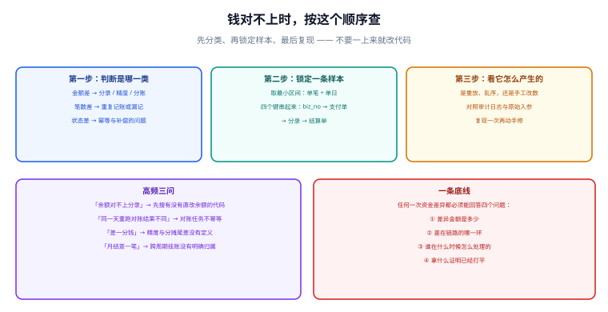

# 常见问题与排错

**账务问题的排查顺序永远是一样的：先分类（金额 / 笔数 / 状态），再锁定一条样本，最后复现。** 一上来就看代码、改数据，只会把「一条可解释的差异」变成「一堆不可解释的改动」。本页按这个顺序给出高频问题、判据与处置。



## 一句话定位

**能说清「差多少、差在哪一环、谁处理的、怎么证明已打平」这四个问题，才算修完了一个账务问题。**

## 一、总原则：三步定位法

```text
第一步：分类
  金额差   → 分录金额、精度与取整、分摊与尾差
  笔数差   → 重复记账、漏记、状态筛选条件不一致
  状态差   → 幂等与补偿、乱序、人工改数

第二步：锁定一条样本
  取最小区间：单笔 + 单日 + 单渠道
  把四个键串起来：biz_no → 支付单 → 分录组 → 结算单

第三步：复现
  在测试环境用同样的入参重放一次，观察是否必现
  必现 → 逻辑缺陷；偶发 → 并发 / 幂等 / 时序问题
```

::: danger 三个「先别做」
1. **别先改数据。** 差异一旦被手工修掉，就失去了唯一的证据；先备份现场（相关表按主键导出）。
2. **别先重跑任务。** 重跑可能让差异消失也让它变形（不幂等的任务会翻倍），先确认任务是否幂等。
3. **别同时改多处。** 一次只改一个假设，否则无法判断是哪一处生效。
:::

## 二、第一类：金额对不上

| 症状 | 常见原因 | 判据与处置 |
| --- | --- | --- |
| 借贷合计不相等（差几分钱） | 逐笔取整与汇总取整混用；分摊尾差无归属 | 先查 `SELECT group_no ... HAVING dr<>cr`；修法是把取整统一到「先汇总后取整」，尾差记入专用科目 |
| 借贷差的是整数倍 | 同一组分录被写了两次（幂等失效） | 按 `biz_no` 统计分录组数量；应为 1 组，多组说明唯一键缺失或幂等键不稳定 |
| 总额差一笔整数金额 | 漏记一组业务（长款 / 短款） | 对账双向差集能直接定位；长款优先处理并复核 |
| 多币种差一分 | 组内用不同汇率或各自取整 | 整组用同一汇率，尾差分配到指定分录并记录规则 |
| 手续费差一笔 | 渠道费与平台费重复扣减 | 检查清分 SQL 里 `channel_fee` / `platform_fee` 是否被同一笔业务各扣两次 |

```sql [q1-amount.sql]
-- 一次性定位「金额类」问题：所有差 0.01 量级的组
SELECT group_no, SUM(CASE WHEN direction='D' THEN amount ELSE 0 END)
              - SUM(CASE WHEN direction='C' THEN amount ELSE 0 END) AS diff
FROM t_entry GROUP BY group_no HAVING ABS(diff) BETWEEN 0.01 AND 1.00;

-- 同一业务出现了多组分录（幂等失效的信号）
SELECT biz_type, biz_no, COUNT(*) AS group_cnt
FROM t_entry_group GROUP BY biz_type, biz_no HAVING group_cnt > 1;
```

## 三、第二类：笔数对不上

| 症状 | 常见原因 | 判据与处置 |
| --- | --- | --- |
| 我方笔数 > 渠道笔数 | 重复记账，或把「受理中」也算成了成功 | 按状态筛选：只统计 `SUCCESS`；再查幂等键 |
| 我方笔数 < 渠道笔数 | 回调丢失、消息消费失败、漏记 | 拉渠道账单做双向差集；补处理必须走幂等入口 |
| 分录笔数 ≠ 流水笔数 | 流水写了但分录没写（或反之） | 流水是展示层，允许重建；**分录是事实层，缺了必须补记** |
| 对账明细比结算单多几笔 | 跨日切时间的数据归属不一致 | 统一用「账务时间」而不是「入库时间」归属会计期间 |

::: warning 「受理中」不能计入成功笔数
把 `INIT` / `PAYING` / `PROCESSING` 这类中间态算进成功笔数，是「笔数对不上」最常见的原因。**判据：统计成功笔数时，状态集合必须白名单化（只列成功状态），而不是黑名单化（排除失败状态）**——后者一旦新增一个中间态就会算错。
:::

## 四、第三类：状态对不上

| 症状 | 常见原因 | 判据与处置 |
| --- | --- | --- |
| 订单已关闭但余额已加 | 迟到的成功事件被直接补记，未校验前置状态 | 引入待处理事件表（见[记账幂等与一致性](../Idempotency/index.md)），拒绝不可达推进 |
| 重复支付成功事件导致二次加款 | 幂等键在每次重试时重新生成 | 幂等键必须来自业务单号；唯一键兜底 |
| 状态卡在「处理中」不前进 | 补偿任务未覆盖该分支，或事件被丢弃 | 统计各状态停留时长，超过 SLA 的必须告警 |
| 人工改库后状态与分录不一致 | 直接 `UPDATE` 了状态或余额 | 所有变更走统一入口；人工操作必须留审计记录 |

## 五、性能与容量

| 问题 | 判据 | 处置 |
| --- | --- | --- |
| 单账户写入上不去 | `SHOW ENGINE INNODB STATUS` 有大量行锁等待 | 拆分子账户 / 异步记账（见[账户、余额与流水](../AccountModel/index.md)） |
| 余额重算越来越慢 | 重算耗时随分录量线性增长 | 用 `last_entry_id` 做增量重算，定期做全量校验 |
| 对账比对超时 | 单日数据量大，`JOIN` 走全表 | 临时表建索引、按渠道分片、限制单批条数 |
| 分录表膨胀 | 表体积与索引体积持续增长 | 按 `entry_time` 分区；冷数据归档但**不删**（审计要求） |

::: tip 分录表只增不删带来的容量规划
分录是不可变事实，所以它的增长是**单调**的。按业务量估算：日均 100 万笔、每笔 2 条分录、单条约 200 字节，一年约 146 GB（含索引更大）。**上线前就要定好分区与归档策略**，而不是等到查询变慢才补。
:::

## 六、审计与合规

| 要求 | 落地方式 | 判据 |
| --- | --- | --- |
| 资金变动可追溯 | 分录只增不改；冲正带 `reversal_of` | 任取一条分录，都能追溯到业务单与操作来源 |
| 操作可归因 | 分录 / 差异记录带 `create_by` / `handle_by` | 人工处理项必须有操作人与说明 |
| 已关账期间不可变 | 关账后禁止写入该期间的分录 | 写入被拒绝并告警 |
| 敏感信息最小化 | 回调原文等含用户标识的数据脱敏后落库 | 检查落库字段是否脱敏、是否有保留期限 |
| 差异处理有闭环 | 差异台账「总数 = 已处理 + 待处理」 | 每日断言，不成立即告警 |

## 七、快速自查清单

```shell
# 把这一页的判据打包成一键自查（读者在自己的库里执行）
mysql -u app -p -e "
SELECT '余额与分录不一致' AS item, account_no AS detail FROM (
  SELECT b.account_no FROM t_account_balance b
  LEFT JOIN (SELECT account_no, SUM(CASE WHEN direction='D' THEN amount ELSE -amount END) s
             FROM t_entry GROUP BY account_no) e ON e.account_no=b.account_no
  WHERE b.book_balance <> IFNULL(e.s,0)) a
UNION ALL SELECT '借贷不等', group_no FROM (
  SELECT group_no FROM t_entry GROUP BY group_no
  HAVING SUM(CASE WHEN direction='D' THEN amount ELSE 0 END)
      <> SUM(CASE WHEN direction='C' THEN amount ELSE 0 END)) b
UNION ALL SELECT '余额口径不自洽', account_no FROM t_account_balance
  WHERE book_balance <> available + frozen
UNION ALL SELECT '负余额', account_no FROM t_account_balance WHERE available < 0
UNION ALL SELECT '未处理差异', concat(batch_no,'/',biz_key) FROM t_recon_diff
  WHERE handle_action = 'PENDING';
-- 期望：0 行"
```

| 检查项 | 期望结果 | 结论 |
| --- | --- | --- |
| 余额与分录一致 | 返回空集 | 待填写 |
| 借贷相等 | 返回空集 | 待填写 |
| 口径自洽 | 返回空集 | 待填写 |
| 无负余额 | 返回空集 | 待填写 |
| 差异无待处理 | 返回空集 | 待填写 |

## 八、综合排错案例：月末差 128 元

**现象**：月末结算时发现某渠道有一笔 128 元差异，渠道账单有、我方无。

**排查**：

```text
① 分类：金额 128.00，且是「渠道有、我方无」→ 长款
② 锁定样本：渠道交易号 CH-TRADE-88231，支付时间 2026-10-08 23:58:xx
③ 复现：查该笔支付的支付单 → 不存在；查业务订单 → 存在且状态为「待支付」
④ 根因：日切时间为 00:00:00，该笔在 23:58 发起、次日 00:03 才支付成功，
        回调事件里带的「业务日期」被取成了发起时间，落到了前一天的日切区间，
        而当天的对账任务已跑完，事件被落到了「不支持的业务日期」分支并丢弃
⑤ 处置：补记（长款，走幂等入口）+ 修复事件日期取值口径 + 回溯检查同一时段是否有其他丢单
```

**这一步最值钱的地方**：根因不是「回调丢了」，而是**事件归属日期取错**。如果不做「锁定样本 + 复现」，很容易得出「回调不可靠」的结论，进而加更多重试——问题依旧存在。

## 相关页面

- 上一节：[实战：从一笔支付到日终打平](../Practice/index.md)
- 起点回顾：[总览：四条边界](../Overview/index.md)
- 对账处置口径：[对账体系与差错处理](../Reconciliation/index.md)
- 幂等细节：[记账幂等与一致性](../Idempotency/index.md)

## 参考资料

- [Martin Fowler · Patterns for Accounting（差异调整的三种方式）](https://martinfowler.com/eaaDev/AccountingNarrative.html)
- [微信支付 · 账单产品介绍（日切时间与数据时间口径）](https://pay.wechatpay.cn/doc/v3/partner/4013080592)
- [Stripe · Reconciliation](https://docs.stripe.com/reports/reconciliation)
