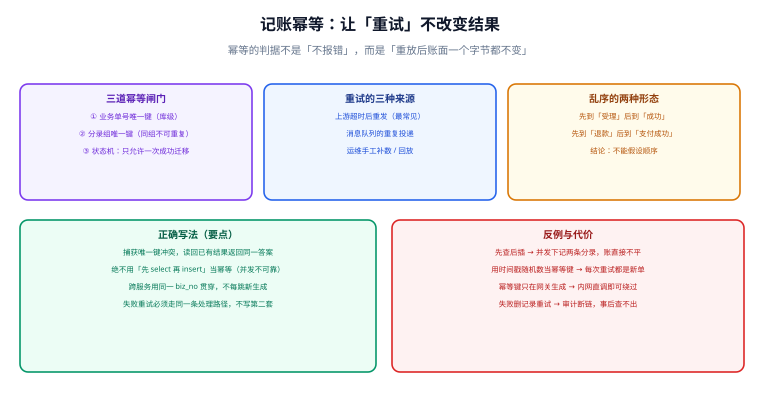

# 记账幂等与一致性

**幂等的判据不是「重试不报错」，而是「重放之后账面一个字节都不变」。** 账务系统面对的重试来自四面八方：上游超时重发、消息队列重复投递、定时任务重跑、运维手工补数。本页给出三道闸门、乱序的处理方式，以及最常见的「先查再插」错在哪。



## 一句话定位

**在账务系统里，幂等是数据库约束保证的，不是应用逻辑保证的。** 应用层判断只能减少无谓异常，真正拦住重复写入的是唯一键。

## 一、为什么「先查再插」不够

```java
// 反例：看起来天衣无缝，实际在并发下必出问题
if (entryGroupMapper.exists(bizType, bizNo)) {
    return;                      // 已经记过，跳过
}
entryGroupMapper.insert(group);  // ← 两个线程可能同时到达这里
```

在默认的 `REPEATABLE READ` 隔离级别下，两个并发事务的 `SELECT` 都可能查不到记录，于是**双写**。结果是：一组业务产生两组分录，金额翻倍，而两次调用都「成功了」。

```text
时刻   线程 A                      线程 B                    结果
T1     SELECT 无记录                                          A 认为需要插入
T2                                SELECT 无记录               B 也认为需要插入
T3     INSERT 成功
T4                                INSERT 成功                 两条分录组，账不平
```

::: danger 三种「看起来在防重」但实际上没防住的写法
1. **先查再插**（上面示例）。并发窗口内两个事务都能通过检查。
2. **加 `synchronized` 或本地锁**。单机有效，多实例部署后立即失效。
3. **用 Redis `SETNX` 作为唯一防线**。Redis 可能丢数据、可能被清空、可能与数据库不同步；它只能是**快速失败**的前置，最终保证必须在数据库。
:::

## 二、三道幂等闸门

| 闸门 | 位置 | 挡住什么 | 失效场景 |
| --- | --- | --- | --- |
| ① 业务单号 → 分录组唯一键 | 数据库 | 同一笔业务被重复记账 | 业务单号生成不稳定（每次重试新号） |
| ② 分录组内 `(biz_type, biz_no, reversal_of)` 唯一 | 数据库 | 同一业务重复提交分录组 | 冲正场景下需要额外维度 |
| ③ 账户状态 / 业务状态机 | 应用 + 数据库 | 已成功的单被再次推进 | 状态判断没走统一入口 |

::: warning 幂等键的语义比实现更重要
真正决定成败的是**幂等键是什么**。三条纪律：

1. **幂等键必须由业务定义，不能由技术生成**。「订单号 + 业务类型」是幂等键，「时间戳 + 随机数」不是——后者每次重试都会生成新键，等于没有幂等。
2. **幂等键必须贯穿全链路**。从网关到账务入口，不能每跳重新生成；否则「网关重试」和「账务重试」会被当成两笔业务。
3. **幂等键必须在最靠近数据的地方最终兜底**。应用层校验是优化，库级唯一键是保证。
:::

## 三、正确实现

```java [LedgerService.java]
/** 记账入口：幂等由唯一键保证，重复请求返回既有结果而不是报错。 */
public PostResult post(PostRequest req) {
    // 前置快速判断（可选，只为减少异常开销，不作为唯一防线）
    EntryGroup exist = entryGroupMapper.findByBiz(req.getBizType(), req.getBizNo(), "");
    if (exist != null) {
        return PostResult.idempotent(exist);       // 返回既有结果，语义与首次一致
    }

    EntryGroup group = EntryGroup.build(req);      // group_no 与 biz_no 一一对应，不随机
    try {
        ledgerTx.post(group);                      // 同事务内：分录组 + 分录 + 余额
        return PostResult.created(group);
    } catch (DuplicateKeyException e) {
        // 唯一键拦截：并发或重放。必须读回既有结果，而不是把异常抛给上游。
        EntryGroup winner = entryGroupMapper.findByBiz(
                req.getBizType(), req.getBizNo(), "");
        if (winner == null) {
            throw e;                               // 不是预期的唯一键冲突，如实上抛
        }
        log.info("记账重复，返回既有结果。bizNo={}, groupNo={}", req.getBizNo(), winner.getGroupNo());
        return PostResult.idempotent(winner);
    }
}
```

::: tip 重复请求必须返回「成功且结果一致」
与支付回调同一条纪律：**幂等的结果是「同样成功」，不是「报错说重复了」**。如果重复请求返回失败，上游会认为是新问题并继续重试，形成重试风暴；更糟的是上游可能走「失败补偿」分支，产生一笔本不该存在的反向业务。
:::

## 四、乱序与迟到的处理

分布式环境下，事件到达顺序无法假设。账务侧常见的两种乱序：

| 乱序形态 | 例子 | 处理方式 |
| --- | --- | --- |
| 先「受理」后「成功」 | 受理分录先落，成功分录后落 | 用状态机：只允许 `受理 → 成功` 或 `受理 → 关闭`，且分录组按业务状态分组 |
| 先「退款」后「支付成功」 | 退款事件先到，支付成功事件后到 | **必须拒绝**不可达的推进，并把事件记为「待处理」，等前置事件到达后补处理；不能默默成功 |

```sql [pending-event.sql]
-- 待处理事件表：乱序到达、前置未满足的事件先落这里，由补偿任务重放
CREATE TABLE t_pending_event (
  id           BIGINT      NOT NULL AUTO_INCREMENT,
  biz_type     VARCHAR(32) NOT NULL,
  biz_no       VARCHAR(64) NOT NULL,
  event_type   VARCHAR(32) NOT NULL,
  payload      JSON        NOT NULL,
  expect_state VARCHAR(32) NOT NULL COMMENT '处理该事件所需的前置状态',
  retry_count  INT         NOT NULL DEFAULT 0,
  next_retry   DATETIME    NOT NULL,
  status       VARCHAR(16) NOT NULL DEFAULT 'PENDING' COMMENT 'PENDING / DONE / DEAD',
  PRIMARY KEY (id),
  UNIQUE KEY uk_event (biz_type, biz_no, event_type),   -- 同一事件只登记一次
  KEY idx_retry (status, next_retry)
) ENGINE=InnoDB DEFAULT CHARSET=utf8mb4 COMMENT='乱序事件等待表';
```

::: danger 乱序的三个致命处理
1. **对迟到事件直接「补记」而不校验前置状态**。例如支付成功事件迟到时直接把余额加上，但订单早已因超时关闭，形成「已关闭订单仍有余额」。
2. **把不可达事件丢掉**。丢掉比报错更糟：账务少一笔，且没有任何痕迹，只能等对账发现。
3. **无限重试**。必须设置重试上限并进入 `DEAD`，由人工介入；否则补偿任务会持续消耗资源。
:::

## 五、对账与批处理任务自身的幂等

除了记账，**所有批处理也必须幂等**，因为它们天然会被重跑：

| 任务 | 为什么会被重跑 | 幂等怎么保证 |
| --- | --- | --- |
| 对账 | 账单可能重拉、发现差异后补跑 | 以「对账日 + 渠道 + 单号」做唯一键，重复比对只更新结果不重复处理 |
| 清分 | 上游数据补数后需要重算 | 按「清分日 + 商户」删除当日结果后重算，或写入新版本并标记旧版本失效 |
| 结算单生成 | 手工触发补跑 | 结算单号 = 日期 + 商户 + 批次，唯一键冲突即跳过 |
| 余额重算 | 巡检发现漂移后修复 | 重算是**幂等**的天然代表：把余额写成「分录聚合值」，重复执行结果相同 |

::: tip 用「可重算」替代「防重跑」
批处理最稳的设计思路不是「阻止它被跑两次」，而是**让它跑多少次结果都一样**。判据：同一个任务连跑两次，输出的差异条数为 0。

```shell
# 清分任务幂等性验证（读者在自己的工程里执行）
python3 scripts/settle.py --day 2026-10-10 && cp out/settle-2026-10-10.csv /tmp/first.csv
python3 scripts/settle.py --day 2026-10-10 && diff /tmp/first.csv out/settle-2026-10-10.csv && echo "幂等 ✓"
```
:::

## 六、与相邻专题的分工

| 主题 | 解决什么 | 本页解决什么 |
| --- | --- | --- |
| [分布式事务](../../Microservices/DistributedTransaction/index.md) | 跨服务「操作都发生」 | 单库内「记账只发生一次、且账面平」 |
| [消息队列 · 可靠投递](../../MessageQueue/index.md) | 消息不丢、可重投 | 消费端的幂等键设计与冲突处理 |
| [电商 · 支付、幂等与对账](../../Ecommerce/Payment/index.md) | 支付回调的验签、去重、查单 | 记账入口的幂等与乱序处理 |
| [分布式缓存深入 · 一致性](../../DistributedCache/Consistency/index.md) | 缓存与数据库的一致 | 账本自身的自洽（余额可重算） |

## 验证方式

**重放验证（核心判据）**：

```shell
# 1. 记录当前账面快照
mysql -u app -p -e "SELECT account_no, book_balance FROM t_account_balance" > /tmp/before.txt

# 2. 把同一笔业务请求连续发 5 次（幂等键相同）
for i in 1 2 3 4 5; do
  curl -s -X POST http://localhost:8080/api/ledger/post \
    -H 'Content-Type: application/json' \
    -d '{"bizType":"CONSUME","bizNo":"ORD202610100001","amount":39.90}'
done

# 3. 校验：分录组只有一条、余额表只有一个值、快照与快照前一致
mysql -u app -p -e "
SELECT COUNT(*) FROM t_entry_group WHERE biz_no='ORD202610100001';"   # 期望 1
mysql -u app -p -e "SELECT account_no, book_balance FROM t_account_balance" > /tmp/after.txt
diff /tmp/before.txt /tmp/after.txt && echo "账面未变 ✓" || echo "账面被重复记账 ✗"
```

| 检查项 | 期望结果 | 结论 |
| --- | --- | --- |
| 连续 5 次相同请求 | 分录组数量为 1 | 待填写 |
| 重放后账面 | 与重放前完全一致 | 待填写 |
| 5 次响应 | 全部成功且返回同一结果 | 待填写 |
| 迟到的乱序事件 | 落入待处理表，不静默丢弃 | 待填写 |

## 相关页面

- 上一节：[账户、余额与流水](../AccountModel/index.md)
- 下一节：[清分与结算](../Settlement/index.md)
- 跨服务协议：[分布式事务](../../Microservices/DistributedTransaction/index.md)
- 消息侧幂等：[消息队列](../../MessageQueue/index.md)

## 参考资料

- [Stripe · Idempotent requests（幂等键的语义与有效期）](https://docs.stripe.com/api/idempotent_requests)
- [Martin Fowler · Transactional Outbox](https://martinfowler.com/articles/patterns-of-distributed-systems/transactional-outbox.html)
- [MySQL 8.4 Reference Manual · InnoDB Locking（唯一键冲突与间隙锁）](https://dev.mysql.com/doc/refman/8.4/en/innodb-locking.html)
