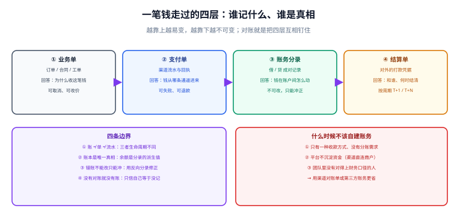

# 总览：账务系统的四条边界

**账务系统的职责边界只有一句话：它记录「钱现在记在谁头上」，并且保证这个记录可以被独立重算出来。** 它不是支付渠道的封装，不是订单的附属字段，也不是流水表的另一个名字。本页先把「账 / 单 / 流水」这三样看起来像同义词的东西拆开，再给出四条边界与「什么时候不该自建账务」的判断。



## 一句话定位

**支付是「这一次收钱成不成功」，账务是「这笔钱记在谁头上、还能不能动」。** 前者可以被重试、被替换、被渠道改口径；后者一旦写下就必须稳定，并且要能被财务、审计、监管独立复算。

## 三个容易混的概念：账、单、流水

这三样在需求文档里经常被写成同一个东西，但它们的**生命周期特性完全不同**，混在一起就会出现「余额对不上」的经典事故。

| 概念 | 是什么 | 能不能改 | 典型表 | 谁关心 |
| --- | --- | --- | --- | --- |
| **单**（业务单 / 支付单 / 结算单） | 一笔业务的过程与状态 | **可以改**，状态会迁移（待支付 → 已支付 → 已退款） | `t_order`、`t_payment`、`t_settlement` | 业务、客服、对账 |
| **流水**（交易流水 / 账户流水） | 某个账户上发生的一次资金变动的展示性记录 | 一般只插不改，但**允许补记** | `t_account_flow` | 客服、用户账单页 |
| **账**（分录 / 账本） | 资金在账户之间**成对**的转移事实 | **只增不改不删**，错了只能反向冲正 | `t_entry`、`t_account_balance` | 财务、审计、风控 |

::: warning 为什么必须区分「流水」和「账」
流水是**给人看的**：它按时间排、带结余、方便展示。账是**给校验用的**：它必须满足「每组的借方合计等于贷方合计」这种数学约束。只做流水不做账的系统，能展示得很好看，但**无法回答「这笔钱从哪个账户出来的」**——因为流水里只有一条记录的增减，看不到资金的对偶关系。
:::

一个反直觉的结论：**流水可以少记、账不可以**。展示层的流水允许按业务需要裁剪（比如不展示手续费明细），但账本少记一条，整个恒等式就不成立了。

## 四层结构：谁记什么

| 层 | 记录什么 | 关键问题 | 生命周期 |
| --- | --- | --- | --- |
| ① 业务单 | 订单 / 合同 / 工单 | 为什么收这笔钱 | 可取消、可改价、可超时关闭 |
| ② 支付单 | 渠道流水与回执 | 钱从哪条通道进来 | 可失败、可退款、可多次尝试 |
| ③ 账务分录 | 借 / 贷成对记录 | 钱在账户间怎么动 | 只增不改，错误用冲正 |
| ④ 结算单 | 对外的打款凭据 | 和谁、什么时候结清 | 按周期（T+1 / T+N）推进 |

这四层的正确关系是：**上面一层变了，下面一层不一定变；下面一层变了，上面一层必须能解释。** 例如用户申请退款（业务层），只要退款未成功，账务层就不该有任何分录；反之账务层出现了一笔分录，就一定能指向某个业务单与支付单。

## 四条边界

### 边界一：账 ≠ 单 ≠ 流水

三者的差异不是命名问题，而是**变更权限**问题。规则可以写成一张表：

| 动作 | 业务单 | 支付单 | 流水 | 分录 |
| --- | --- | --- | --- | --- |
| 新建 | 允许 | 允许 | 允许 | 允许 |
| 修改状态 | 允许（走状态机） | 允许（走状态机） | 允许（补记） | **禁止** |
| 修改金额 | 谨慎（需审计） | **禁止** | **禁止** | **禁止** |
| 删除 | 一般禁止 | 禁止 | 禁止 | **绝对禁止** |
| 纠错方式 | 状态回退 / 重开单 | 新建反向支付单 | 补记一条 | **反向分录冲正** |

### 边界二：账本是唯一真相，余额是派生值

余额有两种常见存法，各有代价：

- **不存余额**：每次要用时 `SUM(amount)` 算。永远与分录一致，但账户一多就慢。
- **存余额**：维护一张余额表，查询快，但**引入了一致性风险**——余额可能被谁改坏。

务实做法是**两者都要**：余额表当缓存（快），分录当事实（准），并且**随时能用分录重算校验余额**。判断标准很简单：能不能写出一条 SQL，把余额表和分录表的聚合结果做 `FULL OUTER JOIN` 找出不一致？能，说明这个设计是可信的。

```sql [check-balance-drift.sql]
-- 余额表与分录聚合的差异检查：任何一行都应返回空
SELECT b.account_no,
       b.book_balance                     AS balance_table,
       IFNULL(e.entry_sum, 0)             AS entry_sum,
       b.book_balance - IFNULL(e.entry_sum, 0) AS diff
FROM t_account_balance b
LEFT JOIN (
  SELECT account_no,
         SUM(CASE WHEN direction = 'D' THEN amount ELSE -amount END) AS entry_sum
  FROM t_entry
  GROUP BY account_no
) e ON e.account_no = b.account_no
WHERE b.book_balance <> IFNULL(e.entry_sum, 0);
```

### 边界三：错账不能改只能冲

分录的不可变性是账务系统的**核心机制**，不是洁癖。它带来三个直接收益：

1. **可审计**：任何时刻的余额都能追溯到「是哪几条分录累加出来的」，并且这些分录从未被改过。
2. **可复算**：把分录按不同顺序、不同批次重放，结果一定一致。
3. **可解释**：出现差异时，差异本身是一条可查询的记录（冲正分录），而不是「某天有人改了数」。

冲正不是「把错的删掉」，而是**新记一组方向相反的分录**，让错的那组与冲正的那组一起留在账上。Martin Fowler 在 Accounting Patterns 中把这类做法分成三种：**Replacement**（删掉错的、写对的）、**Reversal**（留错的、补反向）、**Difference**（只补差额）。账务系统应用第二种或第三种，**不要用第一种**。

### 边界四：没有对账就没有账

只要你的钱经过外部系统（银行、渠道、清算机构），你就必须假设**对方的记录和你的记录一定会不一致**。原因很朴素：两边的日切时间、状态定义、失败处理、网络可靠性都不同。

对账的价值不在于「让两边数字一样」，而在于：

- **发现差异**（这是唯一能发现的手段）；
- **把差异变成可追踪的任务**，而不是一个对不上的总数；
- **证明「已经打平」**，这是财务月结与审计的前置条件。

## 什么时候不该自建账务

自建账务的成本常常被低估：它不是「加一张表」，而是引入一整套**不可随意变更的口径**与**长期维护责任**。以下情况建议不要自建：

1. **只有一种收款方式，且平台不沉淀资金**。渠道直连商户（资金直接进商户账户）时，平台只是信息中介，不需要自己的账本。
2. **没有分账、佣金、账期需求**。没有「钱要在多方之间再分配」的需求，就没有账户体系的必要。
3. **没有对得上财务口径的人**。科目表是与财务共同定义的，自己拍脑袋设计科目，最终会与月结报表对不上。
4. **业务处在验证期**。商业模式还没定，账户模型一定会改；这时候用渠道账单 + 报表工具足够。
5. **团队无法承担长期维护**。账本一旦上线，就要承担对账、补数、审计支持、口径变更的长期成本。

替代方案按成本从低到高：**渠道对账单 + 报表工具** → **渠道或第三方账务 SaaS** → **自建轻量账本（只做分录 + 余额重算）** → **完整清结算体系**。

::: danger 四个「顺手写一下」的写法
1. **在支付回调里 `UPDATE user SET balance = balance + ?`**。余额没有分录支撑，一旦这一步被跳过（超时、异常、重复），账就永久不平；正确做法是先写分录，再由分录派生余额。
2. **给分录表开放 `UPDATE` / `DELETE` 权限**。应用账号必须只有 `INSERT` 与 `SELECT`；错账用冲正处理。
3. **把「支付成功」等同于「钱已入账」**。支付成功只说明渠道收到了钱，钱能不能用取决于账户的可用口径（是否在途、是否已清分）。
4. **没有余额重算脚本**。上线前就要有能力「用分录重算余额」，否则第一个对不上的问题会变成黑盒排查。
:::

## 从「记流水」到「一本账」的三步演进

不要一上来就做完整体系。按下面三步走，每一步都可独立上线并可验证：

| 阶段 | 做什么 | 新增的判据 | 什么时候进入下一阶段 |
| --- | --- | --- | --- |
| 第一步：只记流水 | 每次资金变动记一条流水，带 `biz_no` 唯一键 | 同一业务只有一条流水 | 出现「需要知道钱在账户间怎么动」的需求 |
| 第二步：加入成对分录 | 每次变动写一组借贷分录，余额由分录派生 | `SUM(借) = SUM(贷)`、余额可重算 | 出现分账、佣金、多账户需求 |
| 第三步：加入清结算 | 引入清分、结算单与划付 | 结算单金额 = 清分明细合计 − 手续费 | 平台需要向多方打款或有账期 |

## 术语对齐表

账务领域最大的沟通成本是术语歧义。开工前把这张表与产品、财务对齐一遍：

| 术语 | 本项目含义 | 常见歧义 |
| --- | --- | --- |
| 账户 | 资金归属的容器，有唯一 `account_no` | 常被当成「用户」；一个用户可以有多个账户（余额、冻结、奖励） |
| 科目 | 会计分类（如「银行存款」「用户余额」） | 常与「账户」混用；科目是分类，账户是实例 |
| 分录 / 分条 | 一次资金变动在某个账户上的单向记录 | 常被当成「一条流水」，实际分录必须成组出现 |
| 借贷 | 分录方向，`D`（借）/ `C`（贷） | 常被当成「收入 / 支出」；借贷是账户分类决定的，不是方向决定的 |
| 清分 | 计算各方应得的金额 | 常被当成「结算」；清分只算钱，不动钱 |
| 结算 | 形成对外应付/应收的单据 | 常被当成「打款」；结算只是形成单 |
| 划付 | 真正发起资金转移 | 常被当成「结算」 |
| 在途 | 已收到但尚不可用的资金 | 常被当成「已入账」 |

## 验证方式

本页的判据都可以在读者自己的库里执行（`mysql` 客户端）：

```shell
# 1. 会计恒等式：借贷合计必须相等（返回空才是对的）
mysql -u app -p -e "
SELECT biz_no,
       SUM(CASE WHEN direction='D' THEN amount ELSE 0 END) AS dr,
       SUM(CASE WHEN direction='C' THEN amount ELSE 0 END) AS cr
FROM t_entry GROUP BY biz_no HAVING dr <> cr;"

# 2. 余额与分录一致（返回空才是对的）
mysql -u app -p < check-balance-drift.sql

# 3. 分录表可写权限自查：期望只有 INSERT/SELECT，不含 UPDATE/DELETE
mysql -u app -p -e "SHOW GRANTS FOR CURRENT_USER();"
```

| 检查项 | 期望结果 | 结论 |
| --- | --- | --- |
| 借贷合计 | 查询返回空集 | 待填写 |
| 余额与分录 | 查询返回空集 | 待填写 |
| 分录表权限 | 无 `UPDATE` / `DELETE` | 待填写 |

## 相关页面

- 下一节：[复式记账与账本模型](../DoubleEntry/index.md)
- 渠道侧回调与查单：[电商 · 支付、幂等与对账](../../Ecommerce/Payment/index.md)
- 跨服务一致性：[分布式事务](../../Microservices/DistributedTransaction/index.md)

## 参考资料

- [Martin Fowler · Patterns for Accounting](https://martinfowler.com/eaaDev/AccountingNarrative.html)
- [Martin Fowler · Accounting Transaction](https://www.martinfowler.com/eaaDev/AccountingTransaction.html)
- [Wikipedia · Double-entry bookkeeping](https://en.wikipedia.org/wiki/Double-entry_bookkeeping)
