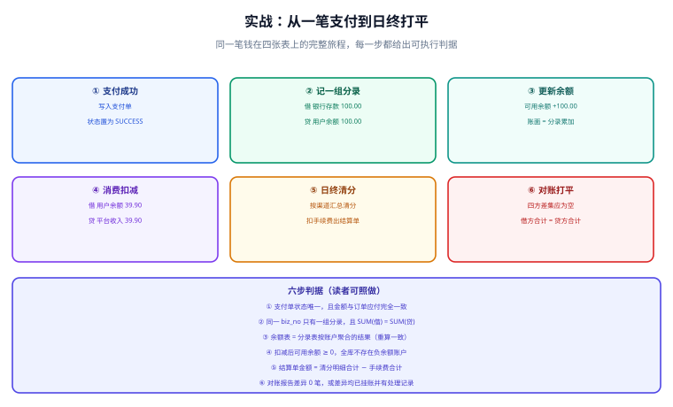

# 实战：从一笔支付到日终打平

**这一页把前面六页的知识串成一条可以照着做的链路**：用户支付 100 元 → 记账 → 更新余额 → 消费扣减 → 日终清分 → 生成结算单 → 对账打平。每一段都给完整的 SQL / 代码片段与可执行判据，最后给出一份「日终打平脚本」和验收清单。



## 一、场景与范围

**场景**：一个平台型电商，用户在平台下单付款，平台抽取 5% 服务费，渠道费率 0.6%，T+1 结算给商户。涉及三笔关键业务：

| 业务 | 金额 | 说明 |
| --- | --- | --- |
| 用户充值 | 100.00 | 通过微信支付，渠道收款 |
| 用户消费 | 39.90 | 购买商户 M20001 的商品 |
| 日终清分结算 | 39.90 | 扣渠道费 0.24 + 平台费 2.00，应结 37.66（T+1 划付） |

**本节做什么**：账本模型、记账入口、余额更新、清分结算、对账打平的**设计与实施说明**。
**本节不做什么**：不涉及渠道下单与回调的接入细节（见[电商 · 支付、幂等与对账](../../Ecommerce/Payment/index.md)），不涉及跨服务分布式事务协议（见[分布式事务](../../Microservices/DistributedTransaction/index.md)），不给出可直接克隆的工程。

::: info 环境与版本基线
- 数据库：MySQL 8.4（`CHECK` 约束、`JSON` 类型、窗口函数均可用）
- 金额类型：`DECIMAL(18,2)`，币种 `CNY`
- 应用：Spring Boot 3.x + MyBatis（示例片段为 Java，逻辑与语言无关）
- 时区：所有 `entry_time` 使用业务时区（如 `Asia/Shanghai`），不使用数据库默认时区
:::

## 二、数据模型总览

完整 DDL 分散在前几页，此处只列出本章会用到的表与职责，便于对照：

| 表 | 职责 | 详见 |
| --- | --- | --- |
| `t_account` | 账户（科目实例） | [复式记账与账本模型](../DoubleEntry/index.md) |
| `t_entry_group` / `t_entry` | 分录组与分录（事实层，只增不改） | [复式记账与账本模型](../DoubleEntry/index.md) |
| `t_account_balance` | 余额（派生层，可重算） | [账户、余额与流水](../AccountModel/index.md) |
| `t_account_flow` | 流水（展示层，可重建） | [账户、余额与流水](../AccountModel/index.md) |
| `t_fee_rule` | 费率规则（带生效区间） | [清分与结算](../Settlement/index.md) |
| `t_clearing_detail` | 清分明细 | [清分与结算](../Settlement/index.md) |
| `t_settlement` | 结算单 | [清分与结算](../Settlement/index.md) |
| `t_recon_batch` / `t_recon_diff` | 对账批次与差异 | [对账体系与差错处理](../Reconciliation/index.md) |

```sql [init-accounts.sql]
-- 初始化本章用到的账户（科目实例）
INSERT INTO t_account(account_no, account_name, subject_code, cat, balance_dir, owner_type, owner_id) VALUES
  ('1002-BANK-001',  '平台银行账户',   '1002', 'ASSET',     'D', 'PLATFORM', NULL),
  ('1301-CH-001',    '渠道在途资金',   '1301', 'ASSET',     'D', 'PLATFORM', NULL),
  ('2201-U-10086',   '用户 10086 余额','2201', 'LIABILITY', 'C', 'USER',     '10086'),
  ('2203-M-20001',   '商户 M20001 应结','2203','LIABILITY', 'C', 'MERCHANT', 'M20001'),
  ('6001-PLATFORM',  '平台服务费',     '6001', 'REVENUE',   'C', 'PLATFORM', NULL),
  ('6401-CH-FEE',    '通道手续费',     '6401', 'EXPENSE',   'D', 'PLATFORM', NULL),
  ('1002-BANK-PAY',  '银行付款账户',   '1002', 'ASSET',     'D', 'PLATFORM', NULL);

-- 余额行必须与账户一一对应（0.00 起始，不允许缺行）
INSERT INTO t_account_balance(account_no) SELECT account_no FROM t_account;
```

## 三、阶段一：支付成功 → 记一组分录

**入口只有一个**：所有记账都走统一方法（见[记账幂等与一致性](../Idempotency/index.md)）。回流充值场景的分录：

```text
借方：1301-CH-001   渠道在途资金     100.00   ← 资产增加（钱在渠道，尚未入平台银行）
贷方：2201-U-10086  用户 10086 余额  100.00   ← 负债增加（平台欠用户）
```

::: warning 为什么充值先记「在途」而不是「银行存款」
渠道收款后资金通常 T+1 才清算到平台银行账户。若立刻记入「银行存款」，会出现**账面银行存款大于银行实际余额**（这本身就是账实不符）。正确做法：充值先记「在途资金」，等渠道清算到账后再记一组「在途 → 银行存款」的分录。
:::

```sql [stage1-entries.sql]
-- ① 记充值分录（100.00，在途口径）
INSERT INTO t_entry_group(group_no, biz_type, biz_no, amount, entry_time)
VALUES ('G202610100001', 'RECHARGE', 'RCH202610100001', 100.00, '2026-10-10 10:00:00');

INSERT INTO t_entry(group_no, account_no, direction, amount, memo) VALUES
  ('G202610100001', '1301-CH-001',   'D', 100.00, '渠道在途资金增加'),
  ('G202610100001', '2201-U-10086',  'C', 100.00, '用户余额增加');

-- ② 更新余额与流水（同一事务内，按 account_no 排序避免死锁）
UPDATE t_account_balance SET available = available + 100.00, book_balance = book_balance + 100.00, version = version + 1
 WHERE account_no = '1301-CH-001';
UPDATE t_account_balance SET available = available + 100.00, book_balance = book_balance + 100.00, version = version + 1
 WHERE account_no = '2201-U-10086';

INSERT INTO t_account_flow(flow_no, account_no, biz_type, biz_no, direction, amount, balance_after, entry_time)
VALUES ('F202610100001', '2201-U-10086', 'RECHARGE', 'RCH202610100001', 'D', 100.00, 100.00, '2026-10-10 10:00:00');
```

**判据（阶段一）**：

```shell
mysql -u app -p -e "
-- ① 分录组只有一组、且借贷相等（期望 1 行，dr=cr）
SELECT g.group_no, g.amount,
       SUM(CASE WHEN e.direction='D' THEN e.amount ELSE 0 END) AS dr,
       SUM(CASE WHEN e.direction='C' THEN e.amount ELSE 0 END) AS cr
FROM t_entry_group g JOIN t_entry e ON e.group_no = g.group_no
WHERE g.biz_no = 'RCH202610100001' GROUP BY g.group_no, g.amount;
-- ② 用户余额已更新（期望 100.00）
SELECT account_no, available, book_balance FROM t_account_balance WHERE account_no='2201-U-10086';"
```

## 四、阶段二：消费扣减（含费率清分）

用户消费 39.90 元，需要记两组分录：**资金转移**（用户余额 → 商户应结）与**收入确认**（商户应结 → 平台服务费）。渠道手续费在**清分时**按当日汇总计算并单独记账，不在逐笔消费时扣——这是为了避免「逐笔取整导致汇总差异」。

```sql [stage2-entries.sql]
-- 组一：资金转移（用户余额 → 商户应结）
INSERT INTO t_entry_group(group_no, biz_type, biz_no, amount, entry_time)
VALUES ('G202610100002', 'CONSUME', 'ORD202610100001', 39.90, '2026-10-10 11:20:00');
INSERT INTO t_entry(group_no, account_no, direction, amount, memo) VALUES
  ('G202610100002', '2201-U-10086',  'D', 39.90, '用户余额减少'),
  ('G202610100002', '2203-M-20001',  'C', 39.90, '形成应付商户的结算款');

-- 组二：收入确认（从商户应结中扣出平台服务费 5%）
INSERT INTO t_entry_group(group_no, biz_type, biz_no, amount, entry_time)
VALUES ('G202610100003', 'CONSUME', 'ORD202610100001-REV', 2.00, '2026-10-10 11:20:00');
INSERT INTO t_entry(group_no, account_no, direction, amount, memo) VALUES
  ('G202610100003', '2203-M-20001',  'D', 2.00, '商户应结减少（平台服务费）'),
  ('G202610100003', '6001-PLATFORM', 'C', 2.00, '平台服务费收入');
```

::: danger 扣减类记账的三个必须
1. **余额校验必须写进 `WHERE`**：`UPDATE ... WHERE available - 39.90 >= 0`，靠影响行数为 0 判断余额不足；**不要先查再扣**。
2. **消费与收入确认拆成两组分录**。合并成「用户余额 → 商户应结 + 平台收入」的多腿分录也可以，但会导致退费冲正时无法只冲掉收入部分；拆开更易维护。
3. **手续费不要逐笔扣取整**。逐笔 `ROUND()` 与汇总后 `ROUND()` 的结果常常差几分，会让结算单与明细永久对不上。**逐笔记全额，手续费在清分阶段按汇总计算。**
:::

## 五、阶段三：日终清分与结算单

```sql [stage3-clearing.sql]
-- 清分明细：按「商户 + 渠道 + 业务类型」汇总当日消费
INSERT INTO t_clearing_detail
  (clearing_day, merchant_id, channel, biz_type, order_cnt, gross_amount, channel_fee, platform_fee, net_amount)
SELECT '2026-10-10' AS clearing_day,
       'M20001'     AS merchant_id,
       'WECHAT'     AS channel,
       'CONSUME'    AS biz_type,
       COUNT(*)                          AS order_cnt,
       SUM(g.amount)                     AS gross_amount,
       ROUND(SUM(g.amount) * 0.006, 2)   AS channel_fee,   -- 渠道费率 0.6%
       ROUND(SUM(g.amount) * 0.05 , 2)   AS platform_fee,  -- 平台服务费 5%
       SUM(g.amount) - ROUND(SUM(g.amount) * 0.006, 2) - ROUND(SUM(g.amount) * 0.05, 2) AS net_amount
FROM t_entry_group g
WHERE g.biz_type = 'CONSUME'
  AND g.biz_no NOT LIKE '%-REV'          -- 收入确认组不计入应收汇总
  AND g.entry_time >= '2026-10-10 00:00:00'
  AND g.entry_time <  '2026-10-11 00:00:00'
GROUP BY clearing_day, merchant_id, channel, biz_type
ON DUPLICATE KEY UPDATE                     -- 幂等：重跑覆盖写
  order_cnt = VALUES(order_cnt), gross_amount = VALUES(gross_amount),
  channel_fee = VALUES(channel_fee), platform_fee = VALUES(platform_fee),
  net_amount = VALUES(net_amount);

-- 生成结算单（T+1 应结，状态 CREATED）
INSERT INTO t_settlement(settle_no, merchant_id, clearing_day, gross_amount,
                         channel_fee, platform_fee, adjust_amount, net_amount,
                         pay_direction, status)
SELECT CONCAT('S', clearing_day, '-', merchant_id, '-PAYOUT'),
       merchant_id, clearing_day, SUM(gross_amount),
       SUM(channel_fee), SUM(platform_fee), 0.00, SUM(net_amount),
       'PAYOUT', 'CREATED'
FROM t_clearing_detail
WHERE clearing_day = '2026-10-10'
GROUP BY merchant_id, clearing_day
ON DUPLICATE KEY UPDATE status = status;   -- 已存在的结算单不做任何修改（不可变）
```

**清分结果示例**（39.90 元）：

| 项目 | 金额 |
| --- | --- |
| 应收总额 | 39.90 |
| 渠道手续费（0.6%） | 0.24 |
| 平台服务费（5%） | 2.00 |
| 应结商户（net） | 37.66 |
| 平台收入（服务费 − 手续费） | 1.76 |

::: tip 平台真实收入要减去渠道费
平台服务费 2.00 元是收入（`6001`），渠道手续费 0.24 元是费用（`6401`），**毛利 = 2.00 − 0.24 = 1.76**。不少系统只记收入不记渠道费，导致「收入看板很漂亮、财务对不上」。
:::

## 六、阶段四：日终打平脚本

**这是本章的核心产出**：一组 SQL，任何一条返回非空就说明账没平。

```sql [check-close.sql]
-- 判据 ① 借贷相等：任何一组分录的借方合计必须等于贷方合计
SELECT '1-借贷相等' AS item, group_no AS detail FROM (
  SELECT group_no,
         SUM(CASE WHEN direction='D' THEN amount ELSE 0 END) AS dr,
         SUM(CASE WHEN direction='C' THEN amount ELSE 0 END) AS cr
  FROM t_entry GROUP BY group_no HAVING dr <> cr
) t

UNION ALL
-- 判据 ② 余额 = 分录聚合（内部对账）
SELECT '2-余额重算一致', b.account_no FROM t_account_balance b
LEFT JOIN (SELECT account_no, SUM(CASE WHEN direction='D' THEN amount ELSE -amount END) AS s
           FROM t_entry GROUP BY account_no) e ON e.account_no = b.account_no
WHERE b.book_balance <> IFNULL(e.s, 0)

UNION ALL
-- 判据 ③ 口径自洽：账面 = 可用 + 冻结
SELECT '3-余额口径自洽', account_no FROM t_account_balance
WHERE book_balance <> available + frozen

UNION ALL
-- 判据 ④ 无负余额
SELECT '4-无负余额', account_no FROM t_account_balance WHERE available < 0

UNION ALL
-- 判据 ⑤ 结算单 = 清分明细合计 + 调整
SELECT '5-结算单可追溯', s.settle_no FROM t_settlement s
LEFT JOIN (SELECT merchant_id, clearing_day, SUM(net_amount) AS net_sum
           FROM t_clearing_detail GROUP BY merchant_id, clearing_day) c
       ON c.merchant_id = s.merchant_id AND c.clearing_day = s.clearing_day
WHERE s.net_amount <> IFNULL(c.net_sum, 0) + s.adjust_amount

UNION ALL
-- 判据 ⑥ 待处理差异归零（长款必须复核完成）
SELECT '6-无未处理差异', CONCAT(batch_no, '/', biz_key) FROM t_recon_diff
WHERE handle_action = 'PENDING';
-- 期望：整个查询返回 0 行
```

::: danger 打平脚本本身的三个要求
1. **必须是只读的**。用它定位问题，不要用 `UPDATE` 顺手修；修必须走记账入口（冲正 / 补记）。
2. **必须每天跑并留档**。只跑一次的打平脚本没有意义——价值在于「连续 30 天都是 0 行」这条证据链。
3. **必须按会计期间跑，并且已关账期间的结果不可变**。跑出了差异要能在报表上重现，而不是「第二天再看又没了」。
:::

## 七、验收清单

| # | 验收项 | 判据（命令 / 断言） | 期望 | 实测 | 结论 |
| --- | --- | --- | --- | --- | --- |
| 1 | 分录组借贷相等 | `check-close.sql` 判据 ① | 0 行 | 待填写 | ⏳ |
| 2 | 余额可重算 | 判据 ② | 0 行 | 待填写 | ⏳ |
| 3 | 余额口径自洽 | 判据 ③ | 0 行 | 待填写 | ⏳ |
| 4 | 无负余额 | 判据 ④ | 0 行 | 待填写 | ⏳ |
| 5 | 结算单可追溯 | 判据 ⑤ | 0 行 | 待填写 | ⏳ |
| 6 | 差异无待处理 | 判据 ⑥ | 0 行 | 待填写 | ⏳ |
| 7 | 记账幂等 | 同一 `biz_no` 连续请求 5 次 | 分录组 1 组 | 待填写 | ⏳ |
| 8 | 清分幂等 | 同日重跑清分，输出 diff 为空 | 无差异 | 待填写 | ⏳ |
| 9 | 对账幂等 | 同日重跑对账，差异条数不变 | 条数相同 | 待填写 | ⏳ |
| 10 | 分录不可改 | 应用账号执行 `UPDATE t_entry` | 被拒绝 | 待填写 | ⏳ |
| 11 | 冲正留痕 | 错误分录用反向组分录修正 | `reversal_of` 非空且指向原组 | 待填写 | ⏳ |
| 12 | 金额不符不自动修正 | `diff_type='AMOUNT'` 且 `AUTO_FIXED` | 0 行 | 待填写 | ⏳ |

::: warning 实测列的填写纪律
**「期望」不是「实测」。** 未在真实环境跑过的项一律写 `⏳ 未跑 + 原因`，**不要把期望值抄进实测列**。这张表的价值在于它能诚实地暴露哪些判据只是「设计上成立」而从未被验证过。
:::

## 八、常见失败与排查顺序

| 现象 | 最可能的原因 | 先查什么 |
| --- | --- | --- |
| 借贷合计不等 | 只写了一条分录，或分录组与分录未同事务提交 | `SELECT group_no FROM t_entry GROUP BY ... HAVING dr<>cr`，找到那一组后查它的业务日志 |
| 余额与分录不一致 | 有代码直接改了余额，或余额更新被跳过 | 搜代码里的 `available =` 直接赋值；再用分录重算修复 |
| 同一天重跑清分结果变了 | 清分任务不幂等（累加写） | 检查是否用了 `INSERT` 而非 `ON DUPLICATE KEY UPDATE` |
| 结算单与明细差几分 | 逐笔取整 vs 汇总取整不一致 | 统一为「先汇总再取整」，尾差显式记账 |
| 差异清单只增不减 | 缺少 `handle_action` 的闭环要求 | 加「差异数 = 已处理 + 待处理」断言并纳入告警 |
| 月末报表对不上 | 跨期差异未在发现当期挂账 | 检查是否有分录的 `entry_time` 落在已关账期间 |

## 相关页面

- 上一节：[对账体系与差错处理](../Reconciliation/index.md)
- 下一节：[常见问题与排错](../FAQ/index.md)
- 起点回顾：[总览：四条边界](../Overview/index.md)
- 项目侧落地：[实时监控大盘 · 指标口径与数据模型](../../../../project/Complete/MonitoringDashboard/MetricModel/index.md)

## 参考资料

- [Martin Fowler · Patterns for Accounting](https://martinfowler.com/eaaDev/AccountingNarrative.html)
- [Martin Fowler · Accounting Transaction（多腿分录与调整方式）](https://www.martinfowler.com/eaaDev/AccountingTransaction.html)
- [微信支付 · 账单产品介绍](https://pay.wechatpay.cn/doc/v3/partner/4013080592)
- [Stripe · Idempotent requests](https://docs.stripe.com/api/idempotent_requests)
- [MySQL 8.4 Reference Manual · CHECK Constraints](https://dev.mysql.com/doc/refman/8.4/en/create-table-check-constraints.html)
