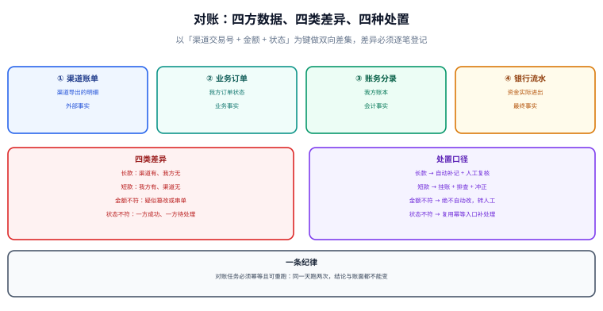

# 对账体系与差错处理

**对账不是「把两个数字比一比」，而是一套把差异变成可追踪任务的机制。** 它的产出不是「对上了」，而是**一张差异清单 + 每条差异的处理结果**。本页给出三层对账的划分、四类差异的处置口径，以及挂账、冲正、长短款这些必须落到表里的动作。



## 一句话定位

**只要钱经过别人的系统，就一定有对不上的时候。** 对账的价值在于：**在用户投诉之前发现它，并且留下它被处理的证据。**

## 一、三层对账

很多团队只有一层对账（渠道账单 vs 支付单），于是「渠道对上了，但账本不平」这类问题永远查不出来。完整体系至少三层：

| 层 | 比什么 | 发现什么问题 | 频率 |
| --- | --- | --- | --- |
| **外部 · 渠道对账** | 渠道账单 ↔ 我方支付单 | 回调丢失、串单、金额篡改 | T+1 |
| **外部 · 资金对账** | 银行流水 ↔ 我方资金账户余额 | 出款未记账、入账未登记 | T+1 |
| **内部 · 账本自洽** | 分录聚合 ↔ 余额表 | 余额被直接改坏、记账漏写分录 | 每小时 / 每日 |

::: warning 内部对账不是「多余的」
渠道对账通过，只说明「我方支付单与渠道一致」；它**完全不检查我方账本**。如果某次记账只写了分录没更新余额（或反过来），渠道对账照样全绿，而用户余额已经错了。内部对账是唯一能发现这类问题的检查，且成本极低——它就是本次那条「余额与分录聚合比对」的 SQL。
:::

## 二、对账的五个步骤

```text
① 拉账单   →  从渠道/银行获取对账单文件（注意就绪时间，不要凌晨硬拉）
② 解析入库 →  落到对账临时表（tmp_*），保留原文与文件哈希
③ 双向比对 →  以业务键做双向差集，并为每条差异生成记录
④ 分类处置 →  按差异类型走自动修正或转人工，动作必须留痕
⑤ 归档     →  保存账单原文、比对结果与处理记录，作为审计依据
```

```sql [reconcile-tables.sql]
-- 对账批次：一次对账运行的可追溯记录
CREATE TABLE t_recon_batch (
  batch_no      VARCHAR(40) NOT NULL COMMENT '对账批次号 = 类型 + 日期 + 渠道',
  recon_type    VARCHAR(16) NOT NULL COMMENT 'CHANNEL / FUND / INTERNAL',
  recon_day     DATE        NOT NULL,
  channel       VARCHAR(16) NULL,
  file_hash     VARCHAR(64) NULL     COMMENT '账单文件哈希，用于证明比的是哪一份',
  total_cnt     INT         NOT NULL DEFAULT 0,
  matched_cnt   INT         NOT NULL DEFAULT 0,
  diff_cnt      INT         NOT NULL DEFAULT 0,
  status        VARCHAR(16) NOT NULL DEFAULT 'RUNNING' COMMENT 'RUNNING / DONE / FAILED',
  create_time   DATETIME    NOT NULL DEFAULT CURRENT_TIMESTAMP,
  PRIMARY KEY (batch_no),
  UNIQUE KEY uk_batch (recon_type, recon_day, channel)   -- 同一批次不可重复运行
) ENGINE=InnoDB DEFAULT CHARSET=utf8mb4 COMMENT='对账批次';

-- 差异明细：每条差异一条记录，必须能追踪到「谁、何时、怎么处理」
CREATE TABLE t_recon_diff (
  diff_id       BIGINT      NOT NULL AUTO_INCREMENT,
  batch_no      VARCHAR(40) NOT NULL,
  biz_key       VARCHAR(96) NOT NULL COMMENT '比对键，如 渠道交易号 / 银行流水号',
  diff_type     VARCHAR(24) NOT NULL COMMENT 'LONG=长款 SHORT=短款 AMOUNT=金额不符 STATE=状态不符 MISSING=内部缺失',
  local_amount  DECIMAL(18,2) NULL,
  remote_amount DECIMAL(18,2) NULL,
  diff_amount   DECIMAL(18,2) NULL,
  handle_action VARCHAR(32) NOT NULL DEFAULT 'PENDING' COMMENT 'PENDING / AUTO_FIXED / MANUAL_SUSPENDED / WRITTEN_OFF / REVERSED',
  handle_by     VARCHAR(64) NULL,
  handle_time   DATETIME    NULL,
  handle_memo   VARCHAR(255) NULL COMMENT '处理说明（人工项必填）',
  create_time   DATETIME    NOT NULL DEFAULT CURRENT_TIMESTAMP,
  PRIMARY KEY (diff_id),
  UNIQUE KEY uk_diff (batch_no, biz_key, diff_type),   -- 重跑不重复登记
  KEY idx_action (handle_action, create_time)
) ENGINE=InnoDB DEFAULT CHARSET=utf8mb4 COMMENT='对账差异明细';
```

## 三、四类差异与处置口径

| 差异类型 | 含义 | 危害 | 处置 |
| --- | --- | --- | --- |
| **长款** | 渠道 / 银行有，我方无 | 用户付了钱但没拿到权益 | 自动补记 + **人工复核**（金额大时必须复核） |
| **短款** | 我方有，渠道 / 银行无 | 记录了不存在的收入 | 挂账 → 排查 → 确认后冲正 |
| **金额不符** | 两边都有但金额不同 | 可能串单或被篡改 | **绝不自动修正**，转人工 |
| **状态不符** | 一边成功、一边未完成 | 用户已付但订单未推进 | 复用幂等入口补处理（安全，因为幂等） |
| **内部缺失** | 分录存在但余额未更新（或反之） | 余额错误，用户可见 | 用分录重算余额修复（幂等操作） |

::: danger 对账处理的四条铁律
1. **金额不符绝不自动修正。** 自动修正会抹掉「可能被篡改」的信号，让问题永远查不出来。
2. **长款优先于短款处理。** 长款意味着用户的钱在平台上但权益没到账，属于「欠用户」，优先级最高，且要主动通知或退款。
3. **每一笔差异必须有 `handle_action`。** 「对账差异数 = 已处理数 + 待处理数」必须成立；没有这条断言，差异清单会越积越多，最终没人看。
4. **对账任务本身必须幂等。** 同一天重跑两次，差异记录不能翻倍（`uk_diff` 兜底），自动处理动作不能重复执行。
:::

## 四、挂账与冲正

**挂账**是把无法立即定性的差异先「临时入账」到一个专用科目，避免它污染正常账户，同时保持账本平衡。

```sql [suspend.sql]
-- 挂账：把短款先记入「待处理差异」科目，账本保持平衡，等待定性
INSERT INTO t_entry_group(group_no, biz_type, biz_no, amount, entry_time)
VALUES ('G-SUSPEND-20261010001', 'ADJUST', 'DIFF-20261010-0001', 128.00, '2026-10-10 12:00:00');
INSERT INTO t_entry(group_no, account_no, direction, amount, memo) VALUES
  ('G-SUSPEND-20261010001', '1901-DIFF-SUSPEND', 'D', 128.00, '短款挂账：我方有渠道无'),
  ('G-SUSPEND-20261010001', '1002-BANK-001',    'C', 128.00, '短款挂账：暂冲减银行存款');

-- 定性后冲正挂账：用反向分录释放挂账科目，并把正确的结果记入正式账户
INSERT INTO t_entry_group(group_no, biz_type, biz_no, reversal_of, amount, entry_time)
VALUES ('G-SUSPEND-20261010002', 'ADJUST', 'DIFF-20261010-0001', 'G-SUSPEND-20261010001', 128.00, '2026-10-11 09:00:00');
INSERT INTO t_entry(group_no, account_no, direction, amount, memo) VALUES
  ('G-SUSPEND-20261010002', '1901-DIFF-SUSPEND', 'C', 128.00, '挂账冲回：差异已定性'),
  ('G-SUSPEND-20261010002', '1002-BANK-001',    'D', 128.00, '挂账冲回：恢复银行存款');
```

| 动作 | 何时用 | 是否改变历史分录 | 留痕方式 |
| --- | --- | --- | --- |
| 挂账 | 差异性质未定 | 否 | 新增分录组 + 差异记录 |
| 冲正 | 确认原分录错误 | 否（只追加反向分录） | `reversal_of` 指向原分录组 |
| 补记 | 确认漏记（长款） | 否 | 新增分录组 + 差异记录 |
| 核销 | 差异金额极小且确认无法追回 | 否 | 手续费 / 损益科目 + 审批记录 |

::: warning 跨周期差异必须单独处理
如果一笔差异在月底最后一天被发现、下月才定性，它会影响两个会计期间的报表。正确做法：**在发现的当期先挂账**（保证当期账平），**在定性的当期冲回挂账并记入正确科目**，而不是「等定了再说」。判据：任何一个已关账期间的账都不会被后续动作修改。
:::

## 五、渠道账单接入的工程注意点

以微信支付为例（写作时口径，以官方为准）：

| 注意点 | 事实 | 工程动作 |
| --- | --- | --- |
| 账单就绪时间 | 次日约 9 点生成，建议 10 点后获取 | 任务从 10 点开始重试，未就绪不算失败 |
| API 下载范围 | 仅支持近 3 个月、单次单日 | 补数超过 3 个月要走平台下载或联系渠道 |
| 下载链接有效期 | 约 5 分钟 | 拿到 `download_url` 后立即下载，不要存起来稍后用 |
| 完整性校验 | 接口返回 `hash_type` 与 `hash_value`；下载响应不带签名头 | **必须比对哈希**；不要对下载响应做验签（会一直失败） |
| 账单类型 | 交易账单与资金账单分开 | 交易账单对「支付单」，资金账单对「资金账户」，分别入不同临时表 |

::: danger 账单接入的四个坑
1. **把「拉不到账单」当成对账失败并告警**。账单未就绪是正常状态，会产生大量无效告警，最终没人看告警。**正确做法**：区分「未就绪（重试）」与「已就绪但解析失败（告警）」。
2. **不校验文件哈希**。下载中断或缓存污染时会拿到残缺文件，比对结果全是假差异。
3. **把账单原文覆盖式入库**。账单是可重拉的，但**比对结论与处理记录不可丢**；原文与结果分离存储，原文可按保留策略清理。
4. **在同一个任务里既拉账单又做人工处理**。自动任务应只产出差异清单；人工处置走独立流程，否则任务超时会卡住整条链路。
:::

## 六、用 SQL 做双向差集

```sql [recon-diff.sql]
-- 差异一：渠道有、我方无（长款）
SELECT c.channel_trade_no AS biz_key, 'LONG' AS diff_type, NULL AS local_amount, c.amount AS remote_amount
FROM tmp_channel_bill c
LEFT JOIN t_payment p ON p.channel = c.channel AND p.channel_trade_no = c.channel_trade_no
WHERE p.pay_no IS NULL;

-- 差异二：我方有、渠道无（短款）
SELECT p.channel_trade_no AS biz_key, 'SHORT', p.amount, NULL
FROM t_payment p
LEFT JOIN tmp_channel_bill c ON c.channel = p.channel AND c.channel_trade_no = p.channel_trade_no
WHERE p.status = 'SUCCESS' AND c.channel_trade_no IS NULL;

-- 差异三：金额不符（绝不自动处理）
SELECT p.channel_trade_no AS biz_key, 'AMOUNT', p.amount, c.amount
FROM t_payment p
JOIN tmp_channel_bill c ON c.channel = p.channel AND c.channel_trade_no = p.channel_trade_no
WHERE p.amount <> c.amount;

-- 差异四（仅账务侧有）：内部对账 —— 余额与分录聚合不一致
SELECT b.account_no AS biz_key, 'MISSING', b.book_balance, IFNULL(e.entry_sum, 0)
FROM t_account_balance b
LEFT JOIN (
  SELECT account_no, SUM(CASE WHEN direction='D' THEN amount ELSE -amount END) AS entry_sum
  FROM t_entry GROUP BY account_no
) e ON e.account_no = b.account_no
WHERE b.book_balance <> IFNULL(e.entry_sum, 0);
```

**把差异写入登记表时统一用 `INSERT ... ON DUPLICATE KEY UPDATE`**，这样重跑只会更新结果，不会重复登记：

```sql [write-diff.sql]
INSERT INTO t_recon_diff(batch_no, biz_key, diff_type, local_amount, remote_amount, diff_amount)
VALUES (#{batchNo}, #{bizKey}, #{diffType}, #{local}, #{remote}, #{diff})
ON DUPLICATE KEY UPDATE
  local_amount  = VALUES(local_amount),
  remote_amount = VALUES(remote_amount),
  diff_amount   = VALUES(diff_amount);
-- 注意：只更新金额字段，绝不覆盖 handle_action / handle_by
```

## 验证方式

```shell
# 1. 差异守恒：差异数必须等于已处理 + 待处理
mysql -u app -p -e "
SELECT batch_no,
       COUNT(*) AS total,
       SUM(handle_action <> 'PENDING') AS handled,
       SUM(handle_action = 'PENDING')  AS pending
FROM t_recon_diff GROUP BY batch_no;"

# 2. 金额不符必须全部转人工（期望待处理之外不得出现 AUTO_FIXED）
mysql -u app -p -e "
SELECT diff_id, biz_key, diff_amount, handle_action
FROM t_recon_diff WHERE diff_type = 'AMOUNT' AND handle_action = 'AUTO_FIXED';"   # 期望空集

# 3. 对账任务幂等：同一天重跑，差异条数不变
python3 scripts/recon.py --day 2026-10-10 --channel WECHAT | tail -1
python3 scripts/recon.py --day 2026-10-10 --channel WECHAT | tail -1

# 4. 内部对账（最容易漏的一层，必须为空）
mysql -u app -p < check-balance-drift.sql
```

| 检查项 | 期望结果 | 结论 |
| --- | --- | --- |
| 差异守恒 | 总数 = 已处理 + 待处理 | 待填写 |
| 金额不符无自动修正 | 返回空集 | 待填写 |
| 对账任务幂等 | 两次差异条数相同 | 待填写 |
| 内部对账 | 返回空集 | 待填写 |

## 相关页面

- 上一节：[清分与结算](../Settlement/index.md)
- 下一节：[实战：从一笔支付到日终打平](../Practice/index.md)
- 渠道侧对账细节：[电商 · 支付、幂等与对账](../../Ecommerce/Payment/index.md)
- 增量取数（对账取数的常用手段）：[数据同步与 CDC](../../../DB/CDC/index.md)

## 参考资料

- [微信支付 · 账单产品介绍（账单类型、日切与数据时间）](https://pay.wechatpay.cn/doc/v3/partner/4013080592)
- [微信支付 · 下载账单（哈希校验与有效期）](https://pay.weixin.qq.com/docs/partner/apis/combine-payment-identity/bill-download/download-fund-bill.html)
- [Stripe · Reconciliation（对账报表口径）](https://docs.stripe.com/reports/reconciliation)
- [Martin Fowler · Patterns for Accounting（Difference / Reversal Adjustment）](https://martinfowler.com/eaaDev/AccountingNarrative.html)
