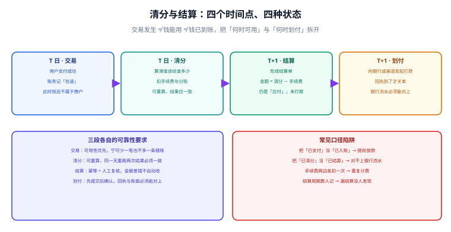

# 清分与结算

**清分是「算钱」，结算是「出单」，划付是「动钱」——三段必须分开，因为它们的失败代价完全不同。** 把三者揉成一个「结算任务」是账务系统最常见的架构错误：算错了要重算（安全），打款打错了要追款（非常痛苦），而揉在一起后你无法在算错时安全重跑。



## 一句话定位

**交易成功 ≠ 钱能用 ≠ 钱已到账。** 中间隔着清分、结算、划付三段，每一段都有自己的时间口径、状态与失败处理。

## 一、四个时间点、四种状态

| 时点 | 发生了什么 | 资金状态 | 谁的数据是准的 |
| --- | --- | --- | --- |
| T 日 · 交易 | 用户支付成功 | 钱到平台账户，但归属未定 | 渠道（以渠道回执为准） |
| T 日 · 清分 | 算出各方应得金额 | 归属已定，仍未对外支付 | 平台（以我方清分明细为准） |
| T+1 · 结算 | 形成对外应付单据 | 形成应付，未打款 | 平台（以结算单为准） |
| T+1 · 划付 | 真实发起资金转移 | 钱离开平台账户 | 银行（以银行回执为准） |

| 状态口径 | 含义 | 允许发生的动作 |
| --- | --- | --- |
| 交易成功 | 渠道确认收款 | 记账、可按规则清分 |
| 已清分 | 各方应得金额确定 | 生成结算单；**不允许直接打款** |
| 已结算 | 结算单已冻结金额 | 发起划付；结算单不允许再改 |
| 已划付 | 银行回执成功 | 结清应付；失败则回退到「已结算」重试 |

::: danger 四个口径陷阱
1. **把「已支付」当成「已入账」**。用户充值的钱如果是「在途」口径，直接算入可用余额，就等于把还没到账的钱提前放款。
2. **把「已清分」当成「已结算」**。清分结果天天可能重算，拿它直接去对银行流水，一定对不上。
3. **手续费两边各扣一次**。平台向商户扣了手续费、又在结算时从总额里扣一次，商户拿到的钱少了一次手续费——这是最常见的资损之一。
4. **结算周期靠人记**。「每周一结」「每月 15 号结」如果只写在运营手册里，漏结算不会被系统发现；**周期必须落成配置并由任务驱动**。
:::

## 二、费率与分账模型

清分的本质是「按规则把钱分配到多个接收方」。规则可以拆成三层：

```text
应收总额
  ├─ 渠道手续费（按渠道费率扣，通常是交易额的百分比）
  ├─ 平台服务费（按商户合同，可为百分比或固定额）
  └─ 剩余部分
       ├─ 商户应结（主收款方）
       └─ 分账接收方（如分销员、服务商、内容创作者）
```

| 费率形态 | 表达式 | 常见场景 | 取整方式 |
| --- | --- | --- | --- |
| 比例费率 | `amount × rate` | 渠道手续费、平台佣金 | 四舍五入到分 |
| 固定费用 | 固定值 | 单笔提现费、月服务费 | 直接取值 |
| 阶梯费率 | 按区间取不同 `rate` | 交易量越大费率越低 | 先算区间再取整 |
| 封顶 / 保底 | `min(max(fee, floor), cap)` | 有上限的分期手续费 | 先算后夹逼 |

```sql [fee-rule.sql]
CREATE TABLE t_fee_rule (
  rule_id      BIGINT       NOT NULL AUTO_INCREMENT,
  merchant_id  VARCHAR(64)  NOT NULL COMMENT '商户/门店标识',
  channel      VARCHAR(16)  NOT NULL COMMENT '渠道：ALIPAY / WECHAT / BANK',
  biz_type     VARCHAR(32)  NOT NULL COMMENT '业务类型',
  fee_type     VARCHAR(16)  NOT NULL COMMENT 'RATE / FIXED / LADDER',
  rate         DECIMAL(10,6) NULL    COMMENT '比例，如 0.006000 表示 0.6%',
  fixed_amount DECIMAL(18,2) NULL    COMMENT '固定额',
  ladder_json  JSON         NULL     COMMENT '阶梯：[{"upto":100000,"rate":0.006},{"rate":0.005}]',
  cap_amount   DECIMAL(18,2) NULL    COMMENT '封顶',
  floor_amount DECIMAL(18,2) NULL    COMMENT '保底',
  effective_from DATETIME   NOT NULL COMMENT '生效时间（费率有历史版本，必须带时间维度）',
  effective_to   DATETIME   NULL     COMMENT '失效时间，NULL 表示当前有效',
  PRIMARY KEY (rule_id),
  KEY idx_lookup (merchant_id, channel, biz_type, effective_from)
) ENGINE=InnoDB DEFAULT CHARSET=utf8mb4 COMMENT='费率规则（带生效区间）';
```

::: warning 费率必须带生效时间区间
费率变更后，**历史交易必须仍按当时的费率清分**。用一张「只有当前值」的配置表会导致补数时按新费率重算，把历史结算金额算错。判据：任给一笔历史交易，都能查到当时生效的那条规则。
:::

## 三、清分算法：汇总、取整与尾差

清分的实现通常是「按维度分组汇总 → 逐组应用规则 → 取整 → 处理尾差」。**尾差是必现的**，必须有明确归属。

```sql [clearing.sql]
-- 步骤一：按「商户 + 渠道 + 业务类型」汇总当日的应收与笔数
INSERT INTO t_clearing_detail(clearing_day, merchant_id, channel, biz_type,
                              order_cnt, gross_amount, channel_fee, platform_fee, net_amount)
SELECT DATE(e.entry_time)                                   AS clearing_day,
       o.merchant_id,
       p.channel,
       g.biz_type,
       COUNT(DISTINCT g.biz_no)                             AS order_cnt,
       SUM(g.amount)                                        AS gross_amount,
       -- 渠道手续费：按费率规则当时的版本计算（这里以比例费率示意）
       ROUND(SUM(g.amount) * IFNULL(r.rate, 0), 2)          AS channel_fee,
       -- 平台服务费由业务规则给出，此处示意为 0.5%
       ROUND(SUM(g.amount) * 0.005, 2)                      AS platform_fee,
       SUM(g.amount)
         - ROUND(SUM(g.amount) * IFNULL(r.rate, 0), 2)
         - ROUND(SUM(g.amount) * 0.005, 2)                  AS net_amount
FROM t_entry_group g
JOIN t_entry e   ON e.group_no = g.group_no
JOIN t_order o   ON o.order_no = g.biz_no
JOIN t_payment p ON p.order_no = o.order_no AND p.status = 'SUCCESS'
LEFT JOIN t_fee_rule r
       ON r.merchant_id = o.merchant_id AND r.channel = p.channel
      AND r.biz_type = g.biz_type
      AND g.entry_time >= r.effective_from
      AND (r.effective_to IS NULL OR g.entry_time < r.effective_to)
WHERE g.biz_type = 'CONSUME'
  AND g.entry_time >= '2026-10-10 00:00:00'
  AND g.entry_time <  '2026-10-11 00:00:00'
GROUP BY clearing_day, o.merchant_id, p.channel, g.biz_type;
```

::: danger 尾差处理的三种错误做法
1. **每条明细分别取整后相加**。与「先汇总再取整」的结果可能差几分钱，导致结算单与明细合计对不上。**规则：先汇总再取整，尾差留在设计里而不是散在各处。**
2. **尾差没有人认领**。汇总金额减去各方分账之和若不为零，必须显式记入专门的「尾差」科目，而不是丢掉或塞给某一方。
3. **清分任务不幂等**。重跑一次金额就累加一次，直接算错。清分必须按「清分日 + 维度」覆盖写或写入新版本，见[记账幂等与一致性](../Idempotency/index.md)。
:::

## 四、结算单与周期

结算单是**对外承诺**，一旦生成就不允许再改（要改只能作废重出）。

```sql [settlement.sql]
CREATE TABLE t_settlement (
  settle_no     VARCHAR(40)  NOT NULL COMMENT '结算单号 = 结算日 + 商户 + 批次',
  merchant_id   VARCHAR(64)  NOT NULL,
  clearing_day  DATE         NOT NULL COMMENT '归属清分日',
  gross_amount  DECIMAL(18,2) NOT NULL COMMENT '应收总额',
  channel_fee   DECIMAL(18,2) NOT NULL DEFAULT 0.00,
  platform_fee  DECIMAL(18,2) NOT NULL DEFAULT 0.00,
  adjust_amount DECIMAL(18,2) NOT NULL DEFAULT 0.00 COMMENT '往期调整/冲正带来的增减',
  net_amount    DECIMAL(18,2) NOT NULL COMMENT '本次应结 = gross − 各项费用 + adjust',
  pay_direction VARCHAR(16)  NOT NULL COMMENT 'PAYOUT=打给商户 / COLLECT=向商户收',
  status        VARCHAR(16)  NOT NULL DEFAULT 'CREATED' COMMENT 'CREATED / CONFIRMED / PAID / FAILED / VOID',
  pay_channel   VARCHAR(16)  NULL     COMMENT '出款通道',
  pay_ref_no    VARCHAR(64)  NULL     COMMENT '出款回执号',
  pay_time      DATETIME     NULL,
  create_time   DATETIME     NOT NULL DEFAULT CURRENT_TIMESTAMP,
  PRIMARY KEY (settle_no),
  UNIQUE KEY uk_settle (clearing_day, merchant_id, pay_direction),  -- 幂等的物理保证
  KEY idx_status (status, create_time)
) ENGINE=InnoDB DEFAULT CHARSET=utf8mb4 COMMENT='结算单';
```

| 结算周期 | 适用场景 | 风险 |
| --- | --- | --- |
| T+1 | 大多数电商、餐饮 | 平台需垫资一天 |
| T+N（N=7/15/30） | 有账期的 B 端、供应链 | 商户现金流压力大 |
| 月结 | 企业合作、对公 | 需人工对账，差错发现晚 |
| 实时结算 | 高风险，少见 | 一旦算错已出款，追款困难 |

::: tip 结算周期的三条工程约束
1. **周期必须落成配置**（含生效时间），不能写在代码常量或运营手册里。
2. **必须有「到点未出账」的告警**：预期时间到达但结算单未生成，本身就是一次事故。
3. **调整金额（`adjust_amount`）必须能追溯到来源单据**。往期冲正、补差、罚款都应挂到具体单据，而不是只写一个数。
:::

## 五、划付：先提交后确认

```text
① 生成结算单（CONFIRMED，冻结应付金额）
② 提交出款请求 → 得到「已受理」而非「已成功」
③ 落 出款请求单（pay_ref_no = 受理号）
④ 收银行/渠道回执 → 成功则 PAID、失败则回退 CONFIRMED 重试
⑤ 出款成功后记账：借 应结算款 / 贷 银行存款
```

::: danger 四个划付侧的致命错误
1. **把「受理成功」当成「出款成功」**。受理只是收到了请求，钱可能还没动；必须等回执。判据：结算单只有在收到成功回执后才置 `PAID`。
2. **失败后不落痕迹直接置回 `CREATED`**。要保留失败原因与重试次数，否则「为什么这笔钱打了三次」无从查起。
3. **出款没有金额上限与双人复核**。大额出款应有人工复核与限额（例如超过 N 万需二次确认），这是内控要求而非技术偏好。
4. **出款成功但没记账**。资金已离开银行账户而账本未反映，直接导致账实不符；记账与出款必须是同一业务链路的两半。
:::

## 六、渠道侧事实（以官方为准）

以微信支付为例，账单与分账的公开口径如下（写作时状态，具体以官方最新文档为准）：

| 项目 | 公开口径 |
| --- | --- |
| 账单日切时间 | 每日 `00:00:00`，T 日账单覆盖 T 日 00:00:00 ~ 23:59:59 |
| 账单生成与获取 | 次日约 9 点开始生成，建议 10 点后获取 |
| API 下载账单 | 仅支持近 3 个月，单次请求只支持单日账单 |
| 平台下载 | 支持更长时间范围，多日合并下载时间跨度上限约 31 天 |
| 下载链接有效期 | 约 5 分钟，且建议比对接口返回的哈希值（如 `hash_type` / `hash_value`）校验完整性 |
| 分账能力 | 支持单次分账与多次分账；多次分账对同一笔订单有次数上限（约 20 次） |
| 分账接收方 | 需先添加接收方（可删除），才能对其发起分账 |

::: warning 这些数字为什么必须写在设计里
「账单 10 点后才就绪」意味着**凌晨 2 点跑对账必然失败**，任务必须设计成「未就绪则重试」而不是「拉不到就报失败」；「分账最多 20 次」意味着**多次分账的业务必须在 20 次内设计完分账方案**，否则月末才发现分不完。把这些约束写进设计文档，比出事故后再加判断要便宜得多。
:::

## 验证方式

```shell
# 1. 结算单与清分明细必须能对上（期望返回空）
mysql -u app -p -e "
SELECT s.settle_no, s.net_amount,
       IFNULL(c.net_sum, 0) + s.adjust_amount AS detail_sum,
       s.net_amount - (IFNULL(c.net_sum,0) + s.adjust_amount) AS diff
FROM t_settlement s
LEFT JOIN (
  SELECT merchant_id, clearing_day, SUM(net_amount) AS net_sum
  FROM t_clearing_detail GROUP BY merchant_id, clearing_day
) c ON c.merchant_id = s.merchant_id AND c.clearing_day = s.clearing_day
WHERE s.net_amount <> IFNULL(c.net_sum,0) + s.adjust_amount;"

# 2. 清分幂等：同一天连跑两次，明细应逐字相同
python3 scripts/clearing.py --day 2026-10-10 && cp out/clearing-2026-10-10.csv /tmp/c1.csv
python3 scripts/clearing.py --day 2026-10-10 && diff /tmp/c1.csv out/clearing-2026-10-10.csv && echo "清分幂等 ✓"

# 3. 到点未出账告警自查：昨日应结但仍在 CREATED 的结算单必须为空
mysql -u app -p -e "
SELECT settle_no, merchant_id, net_amount, create_time
FROM t_settlement
WHERE status = 'CREATED' AND clearing_day < CURDATE() - INTERVAL 1 DAY;"
```

| 检查项 | 期望结果 | 结论 |
| --- | --- | --- |
| 结算单与清分明细一致 | 返回空集 | 待填写 |
| 清分任务幂等 | 两次输出相同 | 待填写 |
| 无超期未出账结算单 | 返回空集 | 待填写 |
| 划付状态依赖回执 | 未收回执时不为 `PAID` | 待填写 |

## 相关页面

- 上一节：[记账幂等与一致性](../Idempotency/index.md)
- 下一节：[对账体系与差错处理](../Reconciliation/index.md)
- 费率与分账的渠道实现：[电商 · 支付、幂等与对账](../../Ecommerce/Payment/index.md)
- 时序库与结算看板：[时序数据库](../../../DB/TimeSeries/index.md)

## 参考资料

- [微信支付 · 账单产品介绍（日切时间与账单类型）](https://pay.wechatpay.cn/doc/v3/partner/4013080592)
- [微信支付 · 下载账单（有效期与哈希校验）](https://pay.weixin.qq.com/docs/partner/apis/combine-payment-identity/bill-download/download-fund-bill.html)
- [微信支付 · 分账能力（单次 / 多次分账与接收方管理）](https://developers.weixin.qq.com/miniprogram/dev/wxcloud/reference-sdk-api/open/pay/Cloud.CloudPay.html)
- [Martin Fowler · Patterns for Accounting](https://martinfowler.com/eaaDev/AccountingNarrative.html)
