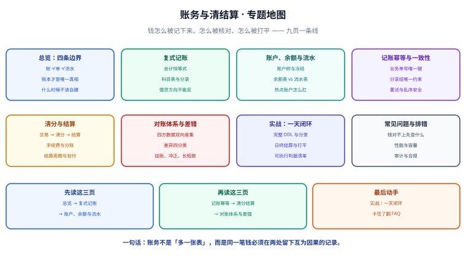

# 账务与清结算

**账务系统要回答的不是「这笔钱有没有收到」，而是「这笔钱现在记在谁头上、能不能花、什么时候结算出去」**——它把每一笔资金变动拆成成对的记录，保证钱只能被搬运、不能被凭空创造或消失。这个专题讲清三件事：**钱怎么记（复式记账与账户模型）、钱怎么核对（幂等与对账）、钱怎么结算（清分、结算与划付）**，适用于做支付、钱包、佣金分账、平台结算、供应链账期的后端工程师。

::: tip 一句话理解
支付系统管的是「这一次收款成不成功」，账务系统管的是「这一笔钱在账本上留下了什么痕迹、这个痕迹对不对」。
:::

## 为什么单独成一个专题

**支付接入是一次性工作，账务是长期负债。** 支付渠道对接完就很少动，而账本一旦上线，它要活到业务结束的那天，中途还要面对对账、审计、监管口径、财务核对。把两者混在一起写，最常见的后果是：**支付代码里顺手 `UPDATE balance = balance + ?` 就完事了**——这正是账务事故的第一现场。

| 你可能会问 | 简短回答 | 详细看哪页 |
| --- | --- | --- |
| 已经记了订单和支付单，为什么还要一本账？ | 订单会取消、支付单会失败，只有账本是「钱现在的归属」 | [总览：四条边界](Overview/index.md) |
| 一条业务记录真的要拆成两条借贷吗？ | 要。借贷相等是让「钱凭空出现」无法通过校验的唯一办法 | [复式记账与账本模型](DoubleEntry/index.md) |
| 余额到底存不存？存了和分录不一致怎么办 | 余额是派生值（缓存），分录才是事实；不一致时必须能重算 | [账户、余额与流水](AccountModel/index.md) |
| 消息重投三次，会不会记三笔账？ | 靠三个唯一键挡住，而不是靠「先查再插」 | [记账幂等与一致性](Idempotency/index.md) |
| 「这笔订单的钱什么时候能打给商户」 | 那是清分 + 结算 + 划付三段，和「支付成功」是四件事 | [清分与结算](Settlement/index.md) |
| 双方数据不一致谁来发现 | 只有对账能发现；且金额类差异绝不自动修正 | [对账体系与差错处理](Reconciliation/index.md) |
| 想直接照着做一遍 | 有一页给出了完整 DDL、分录、日终打平脚本与判据 | [实战：从一笔支付到日终打平](Practice/index.md) |
| 钱对不上，先查什么 | 先分类（金额差 / 笔数差 / 状态差），再锁定样本复现 | [常见问题与排错](FAQ/index.md) |

## 与相邻专题的分工

本专题**不重复讲支付渠道对接、订单状态机、分布式事务协议**，它们的落点在别处；这里只讲「钱怎么被记成一本可以对账的账」。

| 相邻专题 | 它负责 | 本专题负责 | 边界在哪 |
| --- | --- | --- | --- |
| [电商系统设计](../Ecommerce/index.md) | 订单、库存、营销、支付回调与渠道对账 | 记成一本**可审计的账**：分录、余额、清分结算 | 支付页讲「回调幂等 + 与渠道对账」；本专题讲「我方账本自身是否自洽」 |
| [电商 · 支付、幂等与对账](../Ecommerce/Payment/index.md) | 回调验签、回调去重、主动查单、渠道账单四类差异 | 复式分录、账户与余额、多方对账与挂账冲正 | 渠道账单对账是**第三方 vs 我方支付单**；账务对账还要多比**我方分录与资金账户** |
| [电商 · 订单状态机](../Ecommerce/OrderStateMachine/index.md) | 订单状态与合法迁移边、事件去重 | 账户状态与分录不可变性、错账如何冲正 | 订单状态可回退，账务记录**只增不改** |
| [分布式事务](../Microservices/DistributedTransaction/index.md) | 跨服务一致性协议（2PC / TCC / SAGA / 本地消息表） | 单库内的账本不变式（借贷相等、余额可重算） | 协议保证「操作最终都发生」，账本保证「发生后账是平的」 |
| [消息队列 · 可靠投递](../MessageQueue/index.md) | 消息不丢、重复投递、消费幂等 | 记账入口的幂等键设计 | 消息幂等解决「同一条消息被消费两次」，账务幂等还要解决「两条不同消息表达同一笔业务」 |
| [领域驱动设计](../DDD/index.md) | 聚合、领域事件、限界上下文 | 账务域内的聚合切分（账户是聚合根） | 分录组就是典型的「一次事件产生一组不可分割的实体」 |
| [MySQL · 事务](../../DB/Relational/MySQL/Transaction/index.md) | 事务隔离、行锁、死锁 | 用什么锁保护单账户余额、热点账户怎么拆 | 本专题给的是**在账务场景下的具体取舍** |

## 专题地图

## 学习路径

1. **先建立边界感**：[总览：四条边界](Overview/index.md) → 弄明白账、单、流水三者的区别，以及什么时候**不该**自建账务。
2. **再补会计基础**：[复式记账与账本模型](DoubleEntry/index.md) → 借贷方向、科目表、分录组、会计恒等式。
3. **然后落到表结构**：[账户、余额与流水](AccountModel/index.md) → 三张表各存什么、余额怎么算、热点账户怎么扛。
4. **接着解决并发与重试**：[记账幂等与一致性](Idempotency/index.md) → 三道幂等闸门与乱序处理。
5. **最后走完资金链路**：[清分与结算](Settlement/index.md) → [对账体系与差错处理](Reconciliation/index.md) → [实战](Practice/index.md)。
6. **收尾查资料**：[常见问题与排错](FAQ/index.md) 与文末参考资料。

## 版本与标准状态

账务领域的「版本」不在框架上，而在**会计口径与报文标准**上。下表给出写作时的状态，具体以官方最新发布为准。

| 项目 | 状态 | 对开发者的影响 |
| --- | --- | --- |
| 复式记账（Double-entry） | 1494 年由 Luca Pacioli 首次系统记述，此后基本未变 | 模型稳定到可以直接照抄，不存在「新版本」 |
| 会计恒等式 | `资产 = 负债 + 所有者权益`，恒等式不成立即账错 | 可作为离线校验的断言 |
| 企业会计准则（中国） | 财政部发布，按准则号分号（如收入准则） | 收入确认时点、科目口径要与财务对齐，**不要自己发明科目** |
| ISO 20022（金融报文） | SWIFT 已于 2025 年 11 月完成 MT 报文向 MX 的迁移 | 涉及跨境与银行直连时，报文结构以 ISO 20022 为准 |
| 微信支付账单接口 | 日切 00:00:00，次日约 9 点生成、建议 10 点后获取；API 下载仅支持近 3 个月、单次单日 | 对账任务要按「账单未就绪」设计重试，不要假设凌晨一定能拉到 |
| 微信支付分账 | 支持单次分账与多次分账，多次分账同一笔订单最多 20 次 | 分账次数上限要写进业务约束，否则月末才发现分不完 |
| Stripe 幂等与对账 | 提供 Idempotency-Key 与对账报表（Reports） | 幂等键的**语义**比实现更重要，见幂等页 |

::: info 关于版本口径
本专题不写死任何渠道的字段清单与费率，只写**设计判据**。渠道字段请以官方文档为准，费率与结算周期属于商务条款，必须来自合同而不是文档。
:::

## 三条底线

::: danger 三条底线，破一条就会出资金事故
1. **余额只能由分录驱动。** 任何直接 `UPDATE ... SET balance = ?` 的代码都是事故源；正确做法是先落分录，再由分录派生余额。
2. **分录只增不改不删。** 记错了用**反向分录**冲正，而不是 `UPDATE` 或 `DELETE`；否则审计链断裂，事后无法解释账是怎么变的。
3. **金额不符绝不自动修正。** 对账发现金额差异一律转人工，自动修正会把「可能被篡改」的信号抹掉。
:::

## 参考资料

- [Martin Fowler · Patterns for Accounting](https://martinfowler.com/eaaDev/AccountingNarrative.html)
- [Martin Fowler · Accounting Transaction](https://www.martinfowler.com/eaaDev/AccountingTransaction.html)
- [微信支付 · 账单产品介绍（账单类型与日切时间）](https://pay.wechatpay.cn/doc/v3/partner/4013080592)
- [微信支付 · 下载账单（有效期与哈希校验）](https://pay.weixin.qq.com/docs/partner/apis/combine-payment-identity/bill-download/download-fund-bill.html)
- [Stripe · Idempotent requests](https://docs.stripe.com/api/idempotent_requests)
- [Stripe · Reports and reconciliation](https://docs.stripe.com/reports/reconciliation)
- [ISO 20022 官方站点](https://www.iso20022.org/)
