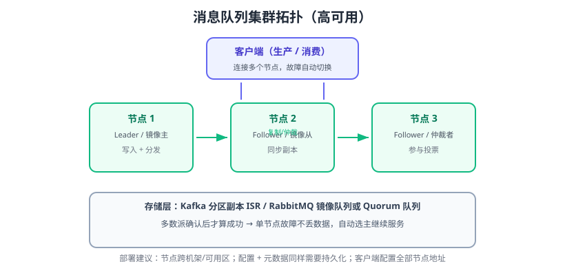

# 集群部署

单节点 MQ 是明显单点：宕机即丢消息、断服务。集群部署的目标是**高可用**——单节点故障时消息不丢、服务不中断，并支持水平扩展吞吐。本页分别给出 Kafka（KRaft）与 RabbitMQ 的最小高可用集群方案。



## 高可用设计原则

| 原则 | 说明 |
| --- | --- |
| 副本冗余 | 数据至少 3 份，多数派（仲裁）确认才算成功 |
| 故障自动转移 | Leader 宕机自动选主，客户端无感知 |
| 无单点依赖 | 元数据也要集群化（Kafka 的 KRaft 控制器、RabbitMQ 的集群状态） |
| 跨故障域 | 节点分散到不同机器/机架/可用区 |
| 客户端容错 | 客户端配置全部节点地址，自动重连切换 |

## Kafka KRaft 集群（3 节点）

Kafka 4.x 用 **KRaft** 管理元数据：推荐 3 个 Controller + 3 个 Broker，也可合并部署（本示例为演示合并模式，生产建议拆分）。

```yaml [docker-compose-kafka.yml]
services:
  kafka1:
    image: apache/kafka:4.3.1
    hostname: kafka1
    ports: ["9092:9092"]
    environment: &kafka-env
      KAFKA_NODE_ID: 1
      KAFKA_PROCESS_ROLES: "broker,controller"
      KAFKA_CONTROLLER_QUORUM_VOTERS: "1@kafka1:9093,2@kafka2:9093,3@kafka3:9093"
      KAFKA_LISTENERS: "PLAINTEXT://:9092,CONTROLLER://:9093"
      KAFKA_ADVERTISED_LISTENERS: "PLAINTEXT://localhost:9092"
      KAFKA_LISTENER_SECURITY_PROTOCOL_MAP: "CONTROLLER:PLAINTEXT,PLAINTEXT:PLAINTEXT"
      KAFKA_CONTROLLER_LISTENER_NAMES: CONTROLLER
      KAFKA_OFFSETS_TOPIC_REPLICATION_FACTOR: 3
      KAFKA_TRANSACTION_STATE_LOG_REPLICATION_FACTOR: 3
      KAFKA_TRANSACTION_STATE_LOG_MIN_ISR: 2
      KAFKA_MIN_INSYNC_REPLICAS: 2
      KAFKA_DEFAULT_REPLICATION_FACTOR: 3
    volumes: ["kafka1-data:/var/lib/kafka/data"]
  kafka2:
    image: apache/kafka:4.3.1
    hostname: kafka2
    ports: ["19092:9092"]
    environment:
      <<: *kafka-env
      KAFKA_NODE_ID: 2
      KAFKA_ADVERTISED_LISTENERS: "PLAINTEXT://localhost:19092"
    volumes: ["kafka2-data:/var/lib/kafka/data"]
  kafka3:
    image: apache/kafka:4.3.1
    hostname: kafka3
    ports: ["29092:9092"]
    environment:
      <<: *kafka-env
      KAFKA_NODE_ID: 3
      KAFKA_ADVERTISED_LISTENERS: "PLAINTEXT://localhost:29092"
    volumes: ["kafka3-data:/var/lib/kafka/data"]

volumes:
  kafka1-data:
  kafka2-data:
  kafka3-data:
```

```shell
docker compose -f docker-compose-kafka.yml up -d
docker exec -it docs-website-kafka1-1 bash

# 查看集群节点（应显示 3 个 broker）
/opt/kafka/bin/kafka-metadata.sh --bootstrap-server localhost:9092 describe

# 创建 3 副本 Topic
/opt/kafka/bin/kafka-topics.sh --bootstrap-server localhost:9092 \
  --create --topic orders --partitions 3 --replication-factor 3
/opt/kafka/bin/kafka-topics.sh --bootstrap-server localhost:9092 --describe --topic orders
```

预期输出中 `Replicas` 显示 3 个节点，`Isr` 同样为 3 个，说明副本已同步。

### 验证故障转移

```shell
docker stop docs-website-kafka1-1
# 生产者/消费者继续工作（客户端配置了多个地址时自动切换）
docker exec -it docs-website-kafka2-1 bash
/opt/kafka/bin/kafka-topics.sh --bootstrap-server localhost:19092 --describe --topic orders
```

观察 Topic 的 Leader 已转移到其他节点，消息可继续生产消费。

## RabbitMQ 集群（3 节点）

RabbitMQ 集群中每个节点保存**同一份元数据**（交换机、队列定义、绑定），消息则按队列类型决定副本策略：**Quorum Queue（仲裁队列）** 是 4.0 起官方推荐的高可用方案，数据在多数节点落盘后才返回确认。

```yaml [docker-compose-rabbitmq.yml]
services:
  rabbit1:
    image: rabbitmq:4.3.5-management
    hostname: rabbit1
    ports: ["5672:5672", "15672:15672"]
    environment:
      RABBITMQ_ERLANG_COOKIE: "cluster-cookie-2026"
      RABBITMQ_NODENAME: rabbit@rabbit1
    volumes: ["rabbit1-data:/var/lib/rabbitmq"]
  rabbit2:
    image: rabbitmq:4.3.5-management
    hostname: rabbit2
    ports: ["5673:5672", "15673:15672"]
    environment:
      RABBITMQ_ERLANG_COOKIE: "cluster-cookie-2026"
      RABBITMQ_NODENAME: rabbit@rabbit2
    volumes: ["rabbit2-data:/var/lib/rabbitmq"]
    depends_on: [rabbit1]
  rabbit3:
    image: rabbitmq:4.3.5-management
    hostname: rabbit3
    ports: ["5674:5672", "15674:15672"]
    environment:
      RABBITMQ_ERLANG_COOKIE: "cluster-cookie-2026"
      RABBITMQ_NODENAME: rabbit@rabbit3
    volumes: ["rabbit3-data:/var/lib/rabbitmq"]
    depends_on: [rabbit1]

volumes:
  rabbit1-data:
  rabbit2-data:
  rabbit3-data:
```

启动后把节点 2、3 加入集群：

```shell
docker compose -f docker-compose-rabbitmq.yml up -d

docker exec -it docs-website-rabbit2-1 bash
rabbitmqctl stop_app
rabbitmqctl reset
rabbitmqctl join_cluster rabbit@rabbit1
rabbitmqctl start_app

docker exec -it docs-website-rabbit3-1 bash
rabbitmqctl stop_app
rabbitmqctl reset
rabbitmqctl join_cluster rabbit@rabbit1
rabbitmqctl start_app

# 任意节点查看集群状态，应显示 3 个 running 节点
docker exec -it docs-website-rabbit1-1 bash
rabbitmqctl cluster_status
```

### 声明 Quorum 队列

```shell
rabbitmqadmin declare queue name=order.quorum durable=true \
  arguments='{"x-queue-type":"quorum"}'
```

客户端连接多个节点即可自动重连；生产建议在前面加负载均衡（如 Nginx TCP 层或 HAProxy）。

## 部署注意事项

::: danger 生产集群必查项
1. **Kafka 的 `advertised.listeners` 必须是对外可达地址**：容器里写 `localhost`，外部客户端连不上。
2. **KRaft Controller 必须奇数个**：3 个节点允许挂 1 个；2 个节点无法形成多数派，白部署。
3. **RabbitMQ 所有节点 Erlang Cookie 必须一致**，否则无法加入集群。
4. **元数据与数据都要持久化**：只做内存副本，节点重启等于丢数据。
5. **副本数 ≥ 2 但 `min.insync.replicas=1`**：写入只要 1 个副本确认，宕机照样丢，可靠性形同虚设。
6. **客户端只配一个节点地址**：该节点宕机客户端无法感知，必须配置完整节点列表。
:::

## 客户端多节点配置示例

```java
// Kafka
props.put("bootstrap.servers", "kafka1:9092,kafka2:9092,kafka3:9092");
```

```python
# RabbitMQ
import pika
params = pika.ConnectionParameters(
    host="rabbit1,rabbit2,rabbit3",   # 逗号分隔多节点
    port=5672,
    credentials=pika.PlainCredentials("admin", "admin123"),
)
connection = pika.BlockingConnection(params)
```

## 验证方式

1. Kafka：`kafka-metadata.sh describe` 显示 3 节点；`kafka-topics.sh --describe` 显示 `Replicas=3, Isr=3`。
2. RabbitMQ：`rabbitmqctl cluster_status` 显示 3 个 running 节点；管理界面 Overview 显示集群模式。
3. 故障演练：逐台停止节点，确认生产消费不中断、消息不丢；恢复节点后数据自动同步。
4. 重启全部节点，确认元数据与消息都在（持久化验证）。

## 参考资料

- Kafka KRaft 配置：https://kafka.apache.org/documentation/#kraft
- Kafka 部署与副本机制：https://kafka.apache.org/documentation/#replication
- RabbitMQ 集群指南：https://www.rabbitmq.com/clustering.html
- RabbitMQ Quorum Queues：https://www.rabbitmq.com/quorum-queues.html
- RabbitMQ 网络分区处理：https://www.rabbitmq.com/partitions.html
