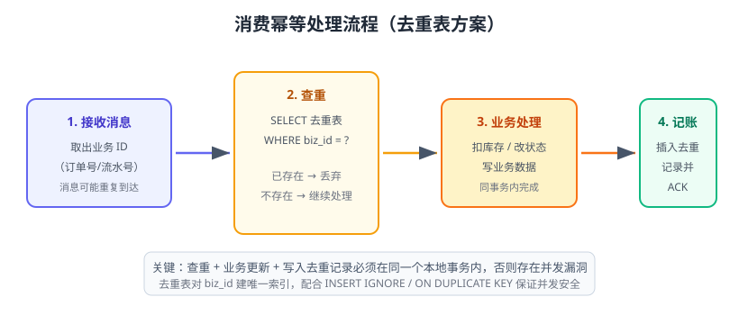

# 消费幂等

“至少一次”投递意味着**同一条消息可能被重复消费**。消费幂等（Idempotency）是指：无论同一业务消息被消费多少次，最终的业务结果都只生效一次。这是消息队列生产落地中最重要的工程能力，没有之一。



## 为什么消息天然不幂等

看一个最简单的例子：消费端收到「订单 1001 已支付」，执行 `UPDATE account SET balance = balance - 100 WHERE user_id = 1`。消息重复投递两次，就扣了两次钱。

```sql
-- 重复执行两次，余额被扣两次 ❌
UPDATE account SET balance = balance - 100 WHERE user_id = 1;
```

消息重复的原因：

1. 生产者重试发送（网络超时，其实已送达）。
2. Broker 重新投递（消费者 ACK 前崩溃）。
3. 消费者重平衡/重启后从未提交的 offset 重新消费。
4. 消费者业务处理成功但 ACK 失败。

## 幂等方案总览

| 方案 | 原理 | 适用 |
| --- | --- | --- |
| 唯一 ID + 去重表 | 用业务 ID 做唯一键，重复插入被拒绝 | 通用，最推荐 |
| 数据库唯一约束 | 表字段加唯一索引，冲突即忽略 | 落库型消费 |
| 状态机校验 | 只有状态 A 才能迁移到 B，重复操作被拒 | 订单状态流转 |
| Redis SETNX | 用 Redis 锁/去重键标记已处理 | 高并发、短窗口去重 |
| 乐观锁版本号 | `WHERE version = ?`，更新失败说明已被处理 | 更新型业务 |

## 方案一：唯一 ID + 去重表（推荐）

消息体里必须携带**全局唯一的业务 ID**（订单号、流水号、UUID）。消费流程：

```text
1. 接收消息，取出 biz_id
2. 查去重表：存在 → 直接 ACK 丢弃；不存在 → 继续
3. 同事务内：执行业务更新 + 插入去重记录
4. 事务提交后 ACK
```

### MySQL 落地方案

```sql
CREATE TABLE msg_dedup (
    biz_id      VARCHAR(64)  NOT NULL COMMENT '业务唯一ID（订单号/流水号）',
    topic       VARCHAR(64)  NOT NULL COMMENT '消息来源主题/队列',
    created_at  DATETIME     NOT NULL DEFAULT CURRENT_TIMESTAMP,
    PRIMARY KEY (biz_id, topic)
) COMMENT '消息消费去重表';
```

消费逻辑：

```sql
-- 同事务：先插入去重记录，成功才执行业务
START TRANSACTION;
INSERT INTO msg_dedup (biz_id, topic) VALUES ('ORDER-1001', 'orders');
-- 若主键冲突，说明已消费过，回滚并跳过
UPDATE orders SET status = 'PAID' WHERE order_no = 'ORDER-1001' AND status = 'UNPAID';
COMMIT;
```

配合唯一索引 + `INSERT IGNORE`，并发场景也不会双写：

```sql
INSERT IGNORE INTO msg_dedup (biz_id, topic) VALUES ('ORDER-1001', 'orders');
-- 影响行数 = 1 才继续业务；= 0 说明重复，直接 ACK
```

::: danger 去重表最常见的坑
1. **查重与业务不在同一事务**：先查后写存在并发窗口，两个消费者同时查到“不存在”，双双执行业务。正确做法是用唯一约束 + 原子插入兜底。
2. **只查不插**：第二次消费时去重记录还在，没问题；但如果去重记录没有持久化到事务里，崩溃后就失效。
3. **biz_id 生成不唯一**：UUID 拼接时要包含业务语义，避免跨业务撞号。
4. **无过期清理**：去重表无限膨胀，应定期清理或按 `created_at` 分区。
:::

## 方案二：状态机校验

适合订单这类有明确状态流转的业务：只有「待支付 → 已支付」合法，重复消息想再从「已支付 → 已支付」就被 SQL 挡住。

```sql
UPDATE orders
SET status = 'PAID', paid_at = NOW()
WHERE order_no = 'ORDER-1001' AND status = 'UNPAID';
-- 影响行数为 0 → 状态不匹配，消息重复或状态非法，直接 ACK
```

## 方案三：Redis 去重键

```python
import redis

r = redis.Redis(host="localhost", port=6379, decode_responses=True)
biz_id = "ORDER-1001"

# SETNX 成功返回 1 才继续处理；TTL 根据业务保留窗口设置
if r.setnx(f"mq:dedup:{biz_id}", "1"):
    r.expire(f"mq:dedup:{biz_id}", 24 * 3600)
    process_message()   # 执行业务
else:
    print("重复消息，跳过")
```

::: warning 注意
Redis 去重适合短窗口防重；窗口外的重复（如 2 天后重放）会漏。关键业务仍建议落库去重。
:::

## 方案四：乐观锁版本号

```sql
UPDATE order_item
SET stock = stock - 1, version = version + 1
WHERE order_no = 'ORDER-1001' AND version = 0;
-- 影响行数 = 0 → 已被消费过
```

## Kafka 消费组与幂等

Kafka 重复消费通常发生在重平衡或“处理成功但提交失败”之后。配合去重表即可：

::: tip 补充
如果希望连「重复写入下游 Topic」都避免，可用事务把「消费位移提交」和「下游写入」绑定成原子操作（`sendOffsetsToTransaction` + `isolation.level=read_committed`），详见 [Kafka 可靠性与 Exactly-Once](../Kafka/Reliability/index.md)。
跨服务的强一致场景（如扣库存 + 扣余额）还可以用 TCC 或本地消息表组合解决，方案与对比见 [分布式事务专题](../../Microservices/DistributedTransaction/index.md) 与 [本地消息表与事务消息](../../Microservices/DistributedTransaction/MessageTable/index.md)。
:::

```java
while (true) {
    ConsumerRecords<String, String> records = consumer.poll(Duration.ofMillis(500));
    for (ConsumerRecord<String, String> record : records) {
        String bizId = record.key();          // 生产端用业务 ID 做 key
        if (dedupService.tryMark(bizId)) {    // 唯一插入成功才算数
            businessService.handle(record.value());
        }
        consumer.commitSync();                // 无论是否重复都提交
    }
}
```

## 实战：订单支付消息消费

```python [order_consumer.py]
import pika
import pymysql

def handle(ch, method, properties, body):
    order_no = body.decode()          # 消息体就是业务 ID
    conn = pymysql.connect(host="localhost", user="app", password="123456", database="shop")
    try:
        with conn.cursor() as cur:
            # 同一事务：去重记录 + 业务更新
            cur.execute("START TRANSACTION")
            n = cur.execute(
                "INSERT IGNORE INTO msg_dedup (biz_id, topic) VALUES (%s, 'order.paid')",
                (order_no,))
            if n == 1:
                cur.execute(
                    "UPDATE orders SET status='PAID' WHERE order_no=%s AND status='UNPAID'",
                    (order_no,))
            conn.commit()
        ch.basic_ack(delivery_tag=method.delivery_tag)   # 事务提交后才 ACK
    except Exception:
        conn.rollback()
        ch.basic_nack(delivery_tag=method.delivery_tag, requeue=False)  # 进死信兜底
    finally:
        conn.close()
```

验证方法：

1. 连续向 `order.paid` 发送两条 `ORDER-1001` 消息。
2. 观察数据库：`orders` 表只更新一次，`msg_dedup` 表只有一条记录。
3. 第二次消费直接 ACK，不执行业务。

## 最佳实践清单

::: tip 幂等设计四问
1. 消息里有没有全局唯一业务 ID？没有就生产端补上。
2. 去重和业务更新是不是同一事务？不是就补事务或唯一约束。
3. 重复消息会不会产生副作用（扣款、发短信、写日志）？会就必须幂等。
4. 去重记录会不会无限增长？会就加清理策略。
:::

## 参考资料

- RabbitMQ 消费确认与幂等设计：https://www.rabbitmq.com/consumers.html
- Kafka 消费提交与重平衡：https://kafka.apache.org/documentation/#consumerconfigs
- 消息幂等性设计（阿里云）：https://help.aliyun.com/document_detail/44394.html
- 分布式系统幂等性实践（InfoQ）：https://www.infoq.cn/article/idempotent-design
