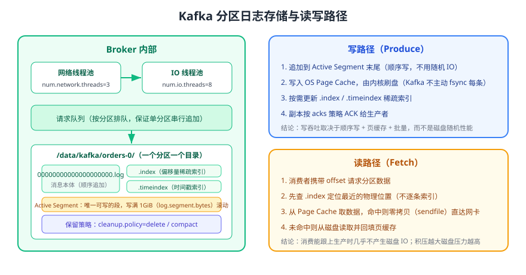

# Kafka 架构与存储原理

Kafka 的高吞吐不是靠「快磁盘」，而是靠**顺序写日志 + 页缓存 + 批量收发 + 零拷贝**这套组合。本页自顶向下拆解 Broker 集群、KRaft 元数据、分区日志的物理结构，以及一次写入与一次读取到底经过了哪些环节。



## 整体架构分层

| 层次 | 组成 | 职责 |
| --- | --- | --- |
| 客户端层 | Producer、Consumer、AdminClient、Kafka Streams、Connect | 生产、消费、管理元数据、流式处理与数据集成 |
| 数据面 | Broker 集群 | 承载分区副本，处理 produce / fetch 请求，副本同步 |
| 控制面 | Controller Quorum（KRaft） | 元数据仲裁、分区分配、Leader 选举、Broker 注册 |
| 存储层 | 分区日志目录 + 本地磁盘 + 可选远程存储 | 消息持久化、索引、保留与压缩、分层存储 |

::: tip 一句话理解
**控制面与数据面分离**是 KRaft 的核心设计：Controller 只处理元数据（写入 `__cluster_metadata` 日志），Broker 只处理消息读写。元数据规模再大也不会挤占数据面的 IO 能力。
:::

## KRaft 元数据仲裁

### 角色与配置

```properties [config/kraft/server.properties（Broker 与 Controller 分离）]
# Controller 节点
process.roles=controller
node.id=1
controller.quorum.voters=1@k1:9093,2@k2:9093,3@k3:9093
controller.listener.names=CONTROLLER
listeners=CONTROLLER://:9093
listener.security.protocol.map=CONTROLLER:PLAINTEXT

# Broker 节点（另一个文件）
process.roles=broker
node.id=101
controller.quorum.voters=1@k1:9093,2@k2:9093,3@k3:9093
controller.listener.names=CONTROLLER
listeners=PLAINTEXT://:9092
advertised.listeners=PLAINTEXT://broker1.example.com:9092
log.dirs=/data/kafka
```

### 元数据是如何传播的

1. Controller Quorum 通过 Raft 选出 **Active Controller**，并把元数据变更追加到内部主题 `__cluster_metadata`。
2. 元数据变更提交后，Broker 通过 `CONTROLLER` 监听器接收快照与增量记录，本地缓存分区状态。
3. 客户端请求打到 Broker 后，Leader 信息直接从 Broker 的元数据缓存获得，不需要访问 ZooKeeper。

```shell
# 查看元数据仲裁与元数据日志状态
bin/kafka-metadata-quorum.sh --bootstrap-server localhost:9092 describe --status
bin/kafka-metadata-quorum.sh --bootstrap-server localhost:9092 describe --replication

# 元数据日志以段文件形式保存在 Controller 的 log.dirs 下
ls -lh /data/kafka/__cluster_metadata-0/
```

预期输出：`describe --status` 显示 `CurrentVoters`（通常 3 个）、`LeaderId`、`MaxFollowerLag`；目录中存在 `00000000000000000000.log` 等段文件。

## Broker 内部结构与请求处理

Broker 把请求处理拆成两个线程池，中间用请求队列解耦：

| 组件 | 配置 | 说明 |
| --- | --- | --- |
| 网络线程池 | `num.network.threads=3` | 负责收发数据、解析请求头，不阻塞在磁盘 IO 上 |
| 请求队列 | `queued.max.requests=500` | 请求排队区，过小会拒绝请求，过大掩盖慢盘问题 |
| IO 线程池 | `num.io.threads=8` | 真正执行日志读写、副本同步等磁盘操作 |
| 副本拉取线程 | `num.replica.fetchers=1` | Follower 拉取 Leader 数据的并发数，弱网/大集群可调大 |
| 日志清理线程 | `log.cleaner.enable=true` | 执行日志压缩（compact）的后台线程 |

::: danger 易错点
1. 请求队列持续打满 ≠ 线程数不够。优先排查磁盘 IO 饱和或慢盘，盲目调大 `num.io.threads` 只会加剧磁盘争抢。
2. `num.io.threads` 超过磁盘并发能力会降低吞吐，日志盘建议使用独立 SSD/NVMe，避免与页缓存争抢。
3. 把 `log.dirs` 配成同一物理盘的多路径：Kafka 只做目录级分配，不会有磁盘级冗余，反而可能加剧热点。
:::

## 分区日志的物理结构

一个分区对应 `log.dirs` 下的一个目录，命名规则为 `<topic>-<partition>`，例如 `orders-0`：

```text
/data/kafka/orders-0/
├─ 00000000000000000000.log        # 消息段文件（从该段起始 offset 开始追加）
├─ 00000000000000000000.index      # 偏移量稀疏索引（offset → 物理位置）
├─ 00000000000000000000.timeindex  # 时间戳索引（timestamp → offset）
├─ 00000000000005368768.log        # 下一段，段满后滚动
├─ 00000000000005368768.index
├─ 00000000000005368768.timeindex
└─ partition.metadata              # 分区元数据（如 KRaft 下的分区标识）
```

| 文件 | 作用 | 关键配置 |
| --- | --- | --- |
| `.log` | 存放消息批次，顺序追加，只有 Active Segment 可写 | `log.segment.bytes=1073741824`（1 GiB） |
| `.index` | 稀疏索引，每约 `log.index.interval.bytes`（默认 4 KB）记一条 | `log.index.size.max.bytes` |
| `.timeindex` | 按时间戳查找 offset，支持按时间重置位移 | `message.timestamp.type` |
| Active Segment | 当前正在写的段，写满后滚动生成新段 | `log.roll.ms` / `log.roll.hours` |

```shell
# 查看日志段内容（排查消息内容与批次结构）
bin/kafka-dump-log.sh --files /data/kafka/orders-0/00000000000000000000.log \
  --print-data-log | head -20
```

## 保留策略：delete 与 compact

| 策略 | 行为 | 典型场景 |
| --- | --- | --- |
| `cleanup.policy=delete`（默认） | 按时间或大小删除过期段文件 | 事件流、日志采集 |
| `cleanup.policy=compact` | 按 key 保留每个 key 的最新值，旧值被清理 | 配置分发、状态同步、CDC 快照 |
| `cleanup.policy=compact,delete` | 先压缩，再按时间删除旧段 | 需要长期保留最新值但又有体积上限的场景 |

```shell
# 创建一个压缩主题（保存每个 key 的最新值）
bin/kafka-topics.sh --bootstrap-server localhost:9092 --create \
  --topic user-config --partitions 3 --replication-factor 3 \
  --config cleanup.policy=compact \
  --config min.cleanable.dirty.ratio=0.3 \
  --config segment.ms=3600000
```

::: warning 日志压缩不等于「删空」
压缩只保留每个 key 的**最新值**，且不会压缩 Active Segment；被压缩掉的旧值在段被重写前仍可能被消费者读到。需要强一致语义时应配合事务或业务侧幂等。
:::

## 读写路径逐步拆解

### 写路径

1. 生产请求到达网络线程，解析后进入请求队列。
2. IO 线程校验 `acks`、`min.insync.replicas`、序列号（幂等场景）后，把消息批次追加到目标分区的 Active Segment。
3. 数据先写入 **页缓存（Page Cache）**，Kafka 依赖操作系统刷盘，而不是每条 `fsync`；副本同步完成后按 `acks` 策略响应生产者。
4. 段文件达到 `log.segment.bytes` 或超过 `log.roll.ms` 时滚动，旧段可被清理或压缩。

### 读路径

1. 消费者以 `(partition, offset)` 发起 fetch，Broker 先查 `.index` 定位最近的物理位置。
2. 命中页缓存时使用 **零拷贝（sendfile）** 把数据直接送到网卡，不经过 JVM 堆。
3. 未命中时从磁盘读取并回填页缓存；消费长期落后会使磁盘 IO 显著上升。
4. 消费者只读取**小于高水位**的消息，保证读到的数据在 ISR 中已同步（详见 [分区与副本机制](../PartitionReplica/index.md)）。

## 分层存储（Tiered Storage）

默认情况下 Kafka 把全部数据放在本地磁盘，冷数据会挤占昂贵的本地 SSD。4.x 支持把**已完成的日志段**卸载到对象存储，本地只保留热段：

| 配置层级 | 参数 | 说明 |
| --- | --- | --- |
| Broker | `remote.log.storage.system.enable=true` | 开启分层存储能力（默认 `false`） |
| Topic | `remote.storage.enable=true` | 开启该主题的远程存储 |
| Topic | `local.retention.ms` / `local.retention.bytes` | 本地保留窗口，通常小于 `retention.ms` |
| Topic | `remote.log.delete.on.disable=true` | 关闭分层存储时同时删除远程数据（谨慎使用） |

```shell
# 开启主题级分层存储：本地保留 1 小时，远程保留 7 天
bin/kafka-configs.sh --bootstrap-server localhost:9092 --alter \
  --entity-type topics --entity-name orders \
  --add-config 'remote.storage.enable=true,local.retention.ms=3600000,retention.ms=604800000'
```

::: danger 易错点
1. 只开 Topic 级开关、Broker 端未开启：配置不报错但不会生效，务必先确认 `remote.log.storage.system.enable=true`。
2. 误设 `local.retention.ms` 小于消费追赶所需时间：消费者会因本地段被删除而频繁回源读取，延迟飙升。
3. 关闭分层存储时忘记清理远程数据，会留下永远无法回收的对象存储费用。
:::

## 关键 Broker 配置清单

| 参数 | 默认值 | 建议 | 说明 |
| --- | --- | --- | --- |
| `num.partitions` | `1` | 显式在创建 Topic 时指定 | 自动创建 Topic 时的默认分区数 |
| `default.replication.factor` | `1` | 生产 ≥ 3 | 自动创建 Topic 的副本数 |
| `log.dirs` | 无（必须配置） | 独立数据盘 | 日志目录，多个目录用逗号分隔 |
| `log.segment.bytes` | `1073741824` | 保持默认 | 段文件大小，影响滚动与清理粒度 |
| `log.retention.hours` | `168` | 按合规与成本调整 | 默认保留 7 天 |
| `message.max.bytes` | `1048588` | 与生产者 `max.request.size` 联动 | Broker 可接收的单批次上限 |
| `auto.create.topics.enable` | `true` | 生产建议 `false` | 关闭后避免拼错 Topic 名产生垃圾主题 |
| `num.replica.fetchers` | `1` | 跨机房或大集群调大 | 副本拉取并发 |

## 验证方式

1. 执行 `bin/kafka-metadata-quorum.sh --bootstrap-server localhost:9092 describe --status`，确认 Controller Quorum 有 1 个 Leader 与 2 个 Follower。
2. 查看 `/data/kafka/<topic>-<partition>/` 目录，确认 `.log`、`.index`、`.timeindex` 三类文件存在，且 Active Segment 随生产持续增长。
3. 生产 10 万条消息后执行 `kafka-dump-log.sh --files ...`，观察批次结构与 offset 连续性。
4. 创建 `cleanup.policy=compact` 主题，对同一 key 连续写入 3 个值，消费时确认只保留最新值。

## 参考资料

- Kafka 4.3 设计与实现：https://kafka.apache.org/43/design/
- Kafka 4.3 Broker 配置：https://kafka.apache.org/43/generated/kafka_config.html
- Kafka 4.3 Topic 配置：https://kafka.apache.org/43/generated/topic_config.html
- 分层存储文档：https://kafka.apache.org/43/operations/tiered-storage/
- KIP-405（分层存储）：https://cwiki.apache.org/confluence/display/KAFKA/KIP-405%3A+Kafka+Tiered+Storage
