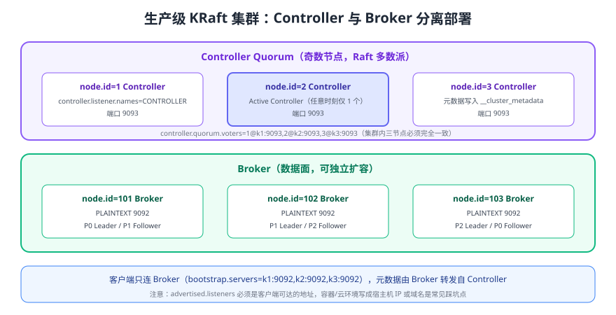

# 集群部署、运维与监控

单机 Docker 只能用来体验，生产集群要回答四个问题：**角色怎么放、副本够不够、故障能不能扛、指标看不看得见**。本页给出一套可直接落地的 3 节点 KRaft 部署方案、扩缩容与升级流程、安全配置和监控告警清单。



## 角色规划

| 部署形态 | `process.roles` | 适用场景 | 说明 |
| --- | --- | --- | --- |
| 合并部署（单节点） | `broker,controller` | 本地开发、演示 | 无多数派，只能用于体验 |
| 合并部署（3 节点） | `broker,controller` | 小规模非核心环境 | 省机器，但元数据与数据 IO 互相影响 |
| 分离部署（推荐） | Controller 3 台 + Broker N 台 | 生产环境 | 控制面与数据面隔离，独立扩缩容 |
| Controller 5 台 | Controller 5 台 + Broker N 台 | 强一致要求极高的环境 | 容忍 2 台 Controller 同时故障，代价是延迟略增 |

::: tip 为什么 Controller 要奇数台
KRaft 用 Raft 多数派提交元数据：3 台容忍 1 台故障，5 台容忍 2 台。偶数台（如 4 台）不会提升容错能力，只会增加协调开销。
:::

## 三节点 Docker Compose 部署

下面的编排用 3 个节点承担 `broker,controller` 双角色（生产环境建议按上表拆分，只需把 `KAFKA_PROCESS_ROLES` 与端口拆分到不同服务即可）。

```yaml [docker-compose.yml]
services:
  kafka1:
    image: apache/kafka:4.3.1
    container_name: kafka1
    hostname: kafka1
    ports: ["9092:9092"]
    environment:
      KAFKA_NODE_ID: 1
      KAFKA_PROCESS_ROLES: "broker,controller"
      KAFKA_LISTENERS: "PLAINTEXT://:9092,CONTROLLER://:9093"
      KAFKA_ADVERTISED_LISTENERS: "PLAINTEXT://kafka1:9092"
      KAFKA_CONTROLLER_LISTENER_NAMES: CONTROLLER
      KAFKA_LISTENER_SECURITY_PROTOCOL_MAP: "CONTROLLER:PLAINTEXT,PLAINTEXT:PLAINTEXT"
      KAFKA_CONTROLLER_QUORUM_VOTERS: "1@kafka1:9093,2@kafka2:9093,3@kafka3:9093"
      KAFKA_OFFSETS_TOPIC_REPLICATION_FACTOR: 3
      KAFKA_TRANSACTION_STATE_LOG_REPLICATION_FACTOR: 3
      KAFKA_TRANSACTION_STATE_LOG_MIN_ISR: 2
      KAFKA_DEFAULT_REPLICATION_FACTOR: 3
      KAFKA_MIN_INSYNC_REPLICAS: 2
      KAFKA_AUTO_CREATE_TOPICS_ENABLE: "false"
      KAFKA_LOG_DIRS: "/var/lib/kafka/data"
    volumes: ["kafka1-data:/var/lib/kafka/data"]

  kafka2:
    image: apache/kafka:4.3.1
    container_name: kafka2
    hostname: kafka2
    environment:
      KAFKA_NODE_ID: 2
      KAFKA_PROCESS_ROLES: "broker,controller"
      KAFKA_LISTENERS: "PLAINTEXT://:9092,CONTROLLER://:9093"
      KAFKA_ADVERTISED_LISTENERS: "PLAINTEXT://kafka2:9092"
      KAFKA_CONTROLLER_LISTENER_NAMES: CONTROLLER
      KAFKA_LISTENER_SECURITY_PROTOCOL_MAP: "CONTROLLER:PLAINTEXT,PLAINTEXT:PLAINTEXT"
      KAFKA_CONTROLLER_QUORUM_VOTERS: "1@kafka1:9093,2@kafka2:9093,3@kafka3:9093"
      KAFKA_OFFSETS_TOPIC_REPLICATION_FACTOR: 3
      KAFKA_TRANSACTION_STATE_LOG_REPLICATION_FACTOR: 3
      KAFKA_MIN_INSYNC_REPLICAS: 2
      KAFKA_AUTO_CREATE_TOPICS_ENABLE: "false"
      KAFKA_LOG_DIRS: "/var/lib/kafka/data"
    volumes: ["kafka2-data:/var/lib/kafka/data"]

  kafka3:
    image: apache/kafka:4.3.1
    container_name: kafka3
    hostname: kafka3
    environment:
      KAFKA_NODE_ID: 3
      KAFKA_PROCESS_ROLES: "broker,controller"
      KAFKA_LISTENERS: "PLAINTEXT://:9092,CONTROLLER://:9093"
      KAFKA_ADVERTISED_LISTENERS: "PLAINTEXT://kafka3:9092"
      KAFKA_CONTROLLER_LISTENER_NAMES: CONTROLLER
      KAFKA_LISTENER_SECURITY_PROTOCOL_MAP: "CONTROLLER:PLAINTEXT,PLAINTEXT:PLAINTEXT"
      KAFKA_CONTROLLER_QUORUM_VOTERS: "1@kafka1:9093,2@kafka2:9093,3@kafka3:9093"
      KAFKA_OFFSETS_TOPIC_REPLICATION_FACTOR: 3
      KAFKA_TRANSACTION_STATE_LOG_REPLICATION_FACTOR: 3
      KAFKA_MIN_INSYNC_REPLICAS: 2
      KAFKA_AUTO_CREATE_TOPICS_ENABLE: "false"
      KAFKA_LOG_DIRS: "/var/lib/kafka/data"
    volumes: ["kafka3-data:/var/lib/kafka/data"]

volumes:
  kafka1-data:
  kafka2-data:
  kafka3-data:
```

```shell
# 启动并检查
docker compose up -d
docker exec -it kafka1 /opt/kafka/bin/kafka-metadata-quorum.sh \
  --bootstrap-server kafka1:9092 describe --status

# 查看 Broker 注册情况（应看到 node 1、2、3）
docker exec -it kafka1 /opt/kafka/bin/kafka-broker-api-versions.sh \
  --bootstrap-server kafka1:9092 | grep -c "id:"
```

预期输出：`describe --status` 中 `CurrentVoters` 为 3 个节点、`LeaderId` 唯一；Broker 数量为 3。

::: danger 容器与云环境最常见的三类坑
1. `KAFKA_ADVERTISED_LISTENERS` 写了容器名或内网 IP，客户端在集群外无法连接——必须写成客户端可达的地址（宿主机 IP / 域名 / 负载均衡地址）。
2. `KAFKA_CONTROLLER_QUORUM_VOTERS` 各节点不一致：Controller 无法组成多数派，集群起不来。
3. 把数据卷配成匿名卷或容器内路径：容器重建后数据丢失，务必显式挂载持久化卷。
:::

## 原生部署关键配置

```properties [config/kraft/controller.properties]
process.roles=controller
node.id=1
controller.quorum.voters=1@k1:9093,2@k2:9093,3@k3:9093
controller.listener.names=CONTROLLER
listeners=CONTROLLER://:9093
listener.security.protocol.map=CONTROLLER:PLAINTEXT
log.dirs=/data/kafka-controller
```

```properties [config/kraft/broker.properties]
process.roles=broker
node.id=101
controller.quorum.voters=1@k1:9093,2@k2:9093,3@k3:9093
controller.listener.names=CONTROLLER
listeners=PLAINTEXT://:9092
advertised.listeners=PLAINTEXT://broker1.example.com:9092
listener.security.protocol.map=CONTROLLER:PLAINTEXT,PLAINTEXT:PLAINTEXT
log.dirs=/data/kafka
num.partitions=6
default.replication.factor=3
min.insync.replicas=2
auto.create.topics.enable=false
unclean.leader.election.enable=false
broker.rack=az-a
```

```shell
# 格式化存储目录（Controller 与 Broker 各执行一次，集群 ID 必须一致）
KAFKA_CLUSTER_ID="$(bin/kafka-storage.sh random-uuid)"
bin/kafka-storage.sh format -t $KAFKA_CLUSTER_ID -c config/kraft/controller.properties
bin/kafka-storage.sh format -t $KAFKA_CLUSTER_ID -c config/kraft/broker.properties
```

## 扩缩容

| 操作 | 步骤 | 验证 |
| --- | --- | --- |
| 扩容 Broker | 新增节点（`node.id` 唯一）→ 启动 → 用 `kafka-reassign-partitions.sh` 迁入分区 | `--verify` 全部 completed；`--describe` 各 Broker 分区数均衡 |
| 缩容 Broker | 先迁走其分区（重分配到其他 Broker）→ 确认无分区归属 → 下线 | 下线后 `Isr` 仍等于 `Replicas` |
| 扩容分区 | `kafka-topics.sh --alter --partitions N` | 分区数增加；注意 key 落点变化 |
| Controller 扩缩容 | 更新所有节点的 `controller.quorum.voters` 并滚动重启 | `describe --status` 的 `CurrentVoters` 与新规模一致 |

```shell
# 迁移前限速，避免重分配打满网络
bin/kafka-reassign-partitions.sh --bootstrap-server localhost:9092 \
  --reassignment-json-file plan.json --execute --throttle 52428800
```

## 滚动升级与元数据版本提升

```shell
# 1. 升级前体检
bin/kafka-topics.sh --bootstrap-server localhost:9092 --describe --under-replicated-partitions
bin/kafka-features.sh --bootstrap-server localhost:9092 describe

# 2. 逐台替换二进制、重启（Controller 先重启 Follower）
bin/kafka-server-stop.sh
bin/kafka-server-start.sh -daemon config/kraft/broker.properties

# 3. 全部稳定后提升元数据版本与共享组特性
bin/kafka-features.sh --bootstrap-server localhost:9092 upgrade --metadata 4.3
```

::: danger 升级期易错点
1. 升级中执行分区重分配或大量 Topic 变更：故障时无法区分是升级导致还是变更导致。
2. 只升级 Broker 不升级客户端：4.x 对客户端最低版本有要求，详见 [版本演进与迁移](../Version/index.md)。
3. 忽略 `--under-replicated-partitions` 的输出：带病升级会把小问题放大成数据不可用。
:::

## 安全配置

### 监听器与协议

```properties [server.properties（SASL_SSL 片段）]
listeners=SASL_SSL://:9093,CONTROLLER://:9094
advertised.listeners=SASL_SSL://broker1.example.com:9093
listener.security.protocol.map=CONTROLLER:PLAINTEXT,SASL_SSL:SASL_SSL
ssl.keystore.location=/etc/kafka/ssl/broker.keystore.jks
ssl.keystore.password=${KAFKA_KEYSTORE_PASSWORD}
ssl.truststore.location=/etc/kafka/ssl/broker.truststore.jks
ssl.client.auth=required
sasl.enabled.mechanisms=SCRAM-SHA-512
```

| 能力 | 实现方式 | 说明 |
| --- | --- | --- |
| 传输加密 | `SSL` / `SASL_SSL` 监听器 | 生产建议全域开启 |
| 身份认证 | SASL/SCRAM、Kerberos、mTLS | 避免使用匿名 `PLAINTEXT` |
| 授权 | `kafka-acls.sh` 按 Topic/消费组/操作授权 | 遵循最小权限原则 |
| 敏感配置 | KRaft 无 ZooKeeper，无需再保护 znode | 但仍需保护 `server.properties` 中的密码 |
| 审计 | 客户端指标 + Broker 授权日志 | 便于追责与容量分析 |

```shell
# 授予订单服务对 orders 的生产权限、对消费组的读权限
bin/kafka-acls.sh --bootstrap-server localhost:9093 --command-config admin.properties \
  --add --allow-principal User:order-service \
  --operation Write --topic orders
bin/kafka-acls.sh --bootstrap-server localhost:9093 --command-config admin.properties \
  --add --allow-principal User:order-service \
  --operation Read --topic orders --group order-group
```

## 监控指标与告警

Kafka 通过 JMX 暴露指标，建议用 JMX Exporter 转成 Prometheus 指标，Grafana 面板参照官方监控文档配置。

| 指标（JMX MBean） | 含义 | 告警建议 |
| --- | --- | --- |
| `kafka.server:type=ReplicaManager,name=UnderReplicatedPartitions` | 副本不足的分区数 | **> 0 持续 5 分钟** 即告警 |
| `kafka.server:type=ReplicaManager,name=UnderMinIsrPartitionCount` | ISR 小于 `min.insync.replicas` 的分区数 | > 0 立即告警（写入可能被拒） |
| `kafka.controller:type=KafkaController,name=ActiveControllerCount` | 是否为 Active Controller | 全集群之和 ≠ 1 时告警 |
| `kafka.controller:type=KafkaController,name=OfflinePartitionsCount` | 离线分区数 | > 0 立即告警（不可读写） |
| `kafka.server:type=ReplicaManager,name=IsrShrinksPerSec` | ISR 收缩速率 | 频繁非零说明网络或磁盘异常 |
| `kafka.server:type=BrokerTopicMetrics,name=MessagesInPerSec` | 消息写入速率 | 结合业务量设阈值 |
| `kafka.server:type=BrokerTopicMetrics,name=BytesInPerSec` | 写入字节速率 | 用于容量与限流评估 |
| 消费 Lag（`kafka-consumer-groups.sh --describe` 或监控系统采集） | 消费积压 | 持续增长或超过业务 SLA 告警 |

```shell
# 命令行快速体检
bin/kafka-topics.sh --bootstrap-server localhost:9092 --describe --under-replicated-partitions
bin/kafka-consumer-groups.sh --bootstrap-server localhost:9092 --all-groups --describe | head
bin/kafka-metadata-quorum.sh --bootstrap-server localhost:9092 describe --status
```

## 跨集群复制

多机房或灾备场景常用 **MirrorMaker 2（MM2）** 做集群间复制：

| 场景 | 说明 |
| --- | --- |
| 灾备复制 | 主集群 → 备集群持续复制，故障时切换消费端 |
| 数据汇聚 | 多个业务集群汇聚到一个数据平台集群 |
| 迁移 | 新旧集群并行复制，验证后切换并停止旧集群写入 |

::: warning 复制不等于事务一致
MM2 默认提供异步复制，主备切换时可能出现少量重复或延迟，业务侧仍需幂等与幂等消费设计；复制链路的偏移量不一致，切换时需配合 `--reset-offsets` 或按业务时间对齐。
:::

## 验证方式

1. `docker compose up -d` 后执行 `kafka-metadata-quorum.sh describe --status`，确认 3 个 Voter、1 个 Leader。
2. 创建 3 副本、`min.insync.replicas=2` 的 Topic，`--describe` 确认 `Isr` 为 3。
3. 停掉一个容器，确认生产者仍能写入、`Isr` 变为 2；恢复容器后 `Isr` 回到 3。
4. 通过 JMX 或命令行确认 `UnderReplicatedPartitions=0`、`OfflinePartitionsCount=0`。

## 参考资料

- KRaft 操作指南：https://kafka.apache.org/43/operations/kraft/
- Kafka 4.3 监控指标：https://kafka.apache.org/43/operations/monitoring/
- Kafka 4.3 安全配置：https://kafka.apache.org/43/security/
- Kafka 4.3 升级说明：https://kafka.apache.org/43/getting-started/upgrade/
- 本库容器基础：[Docker 概述](../../../../Ops/Docker/index.md)、[Kubernetes 概述](../../../../Ops/Kubernetes/index.md)
