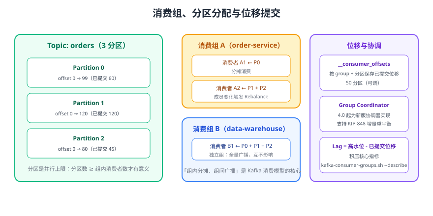

# Kafka 消费者与消费组深入

消费者是 Kafka 里「最容易被写错」的一端：位移提交时机决定是否丢消息，重平衡决定是否重复消费，分区数决定并行上限。本页讲清消费组模型、重平衡机制、位移管理与并发消费设计，并给出生产可用的代码骨架。



## 消费模型：拉取 + 消费组

Kafka 消费者采用**主动拉取（pull）**模型：消费者按自己的节奏调用 `poll()` 拉取消息，Broker 不会主动推送。这样做的收益是消费者可以按处理能力控制速率，不会被打爆。

| 概念 | 说明 |
| --- | --- |
| 消费组（Consumer Group） | 同一 `group.id` 的消费者集合；**组内分摊分区，组间广播** |
| 分区分配 | 一个分区在同一时刻只能被组内一个消费者消费，`分区数` 就是组内并行上限 |
| 位移（offset） | 消费者记录「下一条要读的位置」，提交到 `__consumer_offsets` |
| Lag（积压） | `高水位 - 已提交位移`，是消费健康度的第一指标 |

::: tip 一句话理解
**组内是队列，组间是广播**。订单服务与数仓服务用不同 `group.id` 订阅同一 Topic 就能各读全量；而订单服务内起 3 个实例则会按分区把负载平摊。
:::

## 消费组协调与新版协议

### 协调器（Group Coordinator）

消费组的成员管理、位移存储由 **Group Coordinator** 负责，Coordinator 落在 `__consumer_offsets` 某个分区所在 Broker 上，分区按 `hash(group.id) % offsets.topic.num.partitions`（默认 50 个分区）计算。

```shell
# 查看内部位移主题的分区与副本情况（副本数不足是常见隐患）
bin/kafka-topics.sh --bootstrap-server localhost:9092 --describe --topic __consumer_offsets

# 查看消费组成员、分配到的分区与 Lag
bin/kafka-consumer-groups.sh --bootstrap-server localhost:9092 --describe --group order-group
bin/kafka-consumer-groups.sh --bootstrap-server localhost:9092 --describe --group order-group --members --verbose
```

预期输出：`--describe` 打印每个分区一行，含 `CURRENT-OFFSET`、`LOG-END-OFFSET`、`LAG`、`CONSUMER-ID`、`HOST`；`--members --verbose` 显示每个成员负责的分区。

### 4.0 的新版消费组协议（KIP-848）

| 项目 | 传统协议（classic） | 新版协议（consumer，KIP-848） |
| --- | --- | --- |
| 重平衡执行者 | 消费者组内自行协调（Leader 消费者计算分配） | Broker 端（Group Coordinator）计算分配 |
| 重平衡范围 | 通常全组停止（eager） | 支持增量式调整，未受影响的分区继续消费 |
| 客户端开关 | `group.protocol=classic`（默认） | `group.protocol=consumer` |
| 服务端支持 | — | 4.0 起 GA，升级完成后自动启用；`group.coordinator.rebalance.protocols` 默认为 `classic,consumer,streams` |

::: warning 切换前先评估
新版协议与客户端版本、拦截器行为、`onPartitionsRevoked` 调用的时机都有差异。切换应先在预发环境验证，并保留回退到 `classic` 的方案；4.3 中消费者默认仍是 `classic`。
:::

## 分区分配策略

| 策略 | 行为 | 特点 |
| --- | --- | --- |
| `RangeAssignor` | 按分区范围连续分配（默认策略之一） | 实现简单，但多 Topic 订阅时易不均衡 |
| `CooperativeStickyAssignor` | 尽量保留已有分配，仅移动必要分区（默认策略之一） | 配合增量重平衡，减少「全体停下」 |
| `RoundRobinAssignor` | 轮询分配所有已订阅分区 | 单 Topic 时较均衡，变动时迁移较多 |

默认值为 `[RangeAssignor, CooperativeStickyAssignor]`：组内所有成员都支持第二种策略时优先使用它，否则回退到 `RangeAssignor`。

```java [分配策略配置]
props.put(ConsumerConfig.PARTITION_ASSIGNMENT_STRATEGY_CONFIG,
        List.of("org.apache.kafka.clients.consumer.CooperativeStickyAssignor"));
```

## 位移提交与投递语义

```java [三种提交方式]
// 1) 自动提交：每 auto.commit.interval.ms（默认 5s）在 poll 中提交，可能重复也可能丢
props.put(ConsumerConfig.ENABLE_AUTO_COMMIT_CONFIG, true);

// 2) 同步手动提交：处理成功后按批提交，失败可重试，语义清晰（推荐）
consumer.commitSync();

// 3) 异步手动提交：吞吐更高，但要在关闭前 commitSync 兜底
consumer.commitAsync((offsets, ex) -> {
    if (ex != null) {
        log.warn("异步提交失败，将在关闭时同步提交", ex);
    }
});
```

| 提交时机 | 语义 | 风险 |
| --- | --- | --- |
| 先提交位移再处理业务 | 最多一次（at-most-once） | 处理失败或进程崩溃 = 丢消息 |
| 先处理业务再提交位移 | 至少一次（at-least-once，**推荐**） | 崩溃重放 = 重复消费，需业务幂等 |
| 事务内提交位移（`sendOffsetsToTransaction`） | 精确一次（exactly-once） | 复杂度高，见 [可靠性与 Exactly-Once](../Reliability/index.md) |

## 重平衡：触发条件与避免方式

重平衡在以下情况触发：成员加入/离开、订阅的 Topic 分区数变化、消费者心跳超时、`max.poll.interval.ms` 超时。

| 参数 | 默认值 | 作用 | 建议 |
| --- | --- | --- | --- |
| `session.timeout.ms` | `45000` | 心跳超时判定成员死亡 | 跨机房可适当调大，不超过 `max.poll.interval.ms` |
| `heartbeat.interval.ms` | `3000` | 心跳发送间隔 | 保持为 `session.timeout.ms` 的 1/3 左右 |
| `max.poll.interval.ms` | `300000` | 两次 poll 的最大间隔 | 处理慢就调大，或改为异步处理 |
| `max.poll.records` | `500` | 单次 poll 最大条数 | 单条处理慢时调小，避免超时 |
| `group.initial.rebalance.delay.ms` | `3000` | 新组首次重平衡前等待时间 | 大规模批量启动场景可调大以减少反复重平衡 |
| `group.instance.id` | 无 | 静态成员标识 | 滚动重启不触发重平衡（Kafka 2.3+） |

::: danger 易错点
1. 消费逻辑里做长时间阻塞（大文件、慢 SQL、同步 HTTP）：超过 `max.poll.interval.ms` 会被踢出组，表现为「消费者反复重平衡 + 消息重复」。
2. 消费者数量超过分区数：多出的实例完全空闲，扩容无效；应优先扩分区或优化单条处理耗时。
3. 组内成员频繁上下线（如 K8s 频繁重启）：会产生「重平衡风暴」，可用静态成员 + 优雅关闭缓解。
4. `session.timeout.ms` 设得比 `max.poll.interval.ms` 大：Broker 侧判定逻辑混乱，客户端甚至启动失败。
:::

## 位移重置与历史数据重放

```shell
# 1. 先看当前位移与 Lag（务必带 --dry-run 预览）
bin/kafka-consumer-groups.sh --bootstrap-server localhost:9092 --describe --group order-group

# 2. 重置到最早 / 指定时间 / 指定偏移
bin/kafka-consumer-groups.sh --bootstrap-server localhost:9092 \
  --group order-group --topic orders --reset-offsets --to-earliest --dry-run
bin/kafka-consumer-groups.sh --bootstrap-server localhost:9092 \
  --group order-group --topic orders \
  --reset-offsets --to-datetime 2026-09-01T00:00:00.000 --execute
bin/kafka-consumer-groups.sh --bootstrap-server localhost:9092 \
  --group order-group --topic orders --reset-offsets --shift-by -1000 --execute
```

::: danger 位移重置的前提
1. 重置必须在**消费组无活跃成员**时执行，否则会被 `--execute` 拒绝。
2. 重置会让消费者重新读取历史消息，业务侧必须有幂等保护。
3. `auto.offset.reset` 只在「找不到已提交位移」时生效，不能用来回退已有位移。
:::

## Share Groups（4.2 起生产可用）

传统消费组把分区整体分配给某个消费者，而 **Share Groups（KIP-932）** 让组内成员按**记录**协同消费，支持逐条确认与投递次数计数：

| 维度 | 消费组 | Share Group |
| --- | --- | --- |
| 分配粒度 | 分区 | 记录 |
| 顺序性 | 分区内有序 | 不保证顺序 |
| 弹性 | 受分区数限制 | 成员可自由伸缩 |
| 适用场景 | 事件流、需要顺序的业务 | 任务队列、可并行处理的任务 |

```shell
# 使用共享消费组控制台消费者
bin/kafka-console-share-consumer.sh --bootstrap-server localhost:9092 \
  --topic orders --group order-workers
```

::: info 使用前提
Share Groups 会使用内部主题 `__share_group_state`，默认副本数为 3；不足 3 个 Broker 的集群必须显式调整 `share.coordinator.state.topic.replication.factor` 与 `share.coordinator.state.topic.min.isr`，并用 `kafka-features.sh upgrade --feature share.version=1` 启用特性。
:::

## 并发消费模型

`KafkaConsumer` **不是线程安全的**，并发消费有两种主流做法：

| 模型 | 实现 | 优点 | 代价 |
| --- | --- | --- | --- |
| 多消费者实例 | 每个实例一个线程（或一个进程），靠消费组分摊分区 | 官方推荐，语义最清晰，易水平扩展 | 并行上限 = 分区数 |
| 单实例 + 工作线程池 | 主线程 poll，把消息投递给业务线程池处理 | 单分区内也能并行处理 | 需自己管理位移提交顺序与失败重试 |

```java [WorkerPoolConsumer.java]
import org.apache.kafka.clients.consumer.*;
import org.apache.kafka.common.TopicPartition;
import org.apache.kafka.common.errors.WakeupException;
import org.apache.kafka.common.serialization.StringDeserializer;
import java.time.Duration;
import java.util.*;
import java.util.concurrent.*;

public class WorkerPoolConsumer {
    /** 分区处理完成回执：key=分区，value=该分区下一条应读位移（已处理最后一条 offset + 1） */
    private static final BlockingQueue<Map.Entry<TopicPartition, OffsetAndMetadata>> DONE =
            new LinkedBlockingQueue<>();

    public static void main(String[] args) {
        Properties props = new Properties();
        props.put(ConsumerConfig.BOOTSTRAP_SERVERS_CONFIG, "localhost:9092");
        props.put(ConsumerConfig.GROUP_ID_CONFIG, "order-group");
        props.put(ConsumerConfig.KEY_DESERIALIZER_CLASS_CONFIG, StringDeserializer.class);
        props.put(ConsumerConfig.VALUE_DESERIALIZER_CLASS_CONFIG, StringDeserializer.class);
        props.put(ConsumerConfig.ENABLE_AUTO_COMMIT_CONFIG, false);
        props.put(ConsumerConfig.MAX_POLL_RECORDS_CONFIG, 100);

        ExecutorService workers = Executors.newFixedThreadPool(8);
        KafkaConsumer<String, String> consumer = new KafkaConsumer<>(props);
        consumer.subscribe(List.of("orders"));
        Runtime.getRuntime().addShutdownHook(new Thread(consumer::wakeup));

        try {
            while (true) {
                ConsumerRecords<String, String> records = consumer.poll(Duration.ofSeconds(1));
                // 分区内串行、分区之间并行，避免同一分区乱序
                for (TopicPartition partition : records.partitions()) {
                    List<ConsumerRecord<String, String>> batch = records.records(partition);
                    workers.submit(() -> {
                        for (ConsumerRecord<String, String> record : batch) {
                            handle(record);                 // 业务处理（必须幂等）
                        }
                        long nextOffset = batch.get(batch.size() - 1).offset() + 1;
                        DONE.add(new AbstractMap.SimpleEntry<>(
                                partition, new OffsetAndMetadata(nextOffset)));
                    });
                }
                // 位移提交只在 poll 线程做：KafkaConsumer 不是线程安全的
                Map<TopicPartition, OffsetAndMetadata> toCommit = new HashMap<>();
                Map.Entry<TopicPartition, OffsetAndMetadata> item;
                while ((item = DONE.poll()) != null) {
                    toCommit.put(item.getKey(), item.getValue());
                }
                if (!toCommit.isEmpty()) {
                    consumer.commitSync(toCommit);
                }
            }
        } catch (WakeupException e) {
            System.out.println("收到关闭信号，开始优雅退出");
        } finally {
            consumer.close(Duration.ofSeconds(10));
            workers.shutdown();
        }
    }

    private static void handle(ConsumerRecord<String, String> record) {
        // 幂等去重 + 业务处理，示例略
    }
}
```

::: warning 多线程提交位移的正确姿势
异步提交 + 多分区并行会打乱位移提交顺序，一旦低位移先提交，高位移的消息会被跳过而丢失。稳妥做法是**每个分区固定一个处理线程**（或按分区串行），并在该分区全部处理成功后提交该分区最后一条 offset + 1。
:::

## 关键消费者参数清单

| 参数 | 默认值 | 说明 |
| --- | --- | --- |
| `group.id` | 无（必填） | 消费组标识，决定分摊与位移归属 |
| `group.protocol` | `classic` | 可选 `consumer` 使用 KIP-848 新协议 |
| `auto.offset.reset` | `latest` | 无位移时从最新还是最早开始 |
| `enable.auto.commit` | `true` | 生产建议 `false` |
| `auto.commit.interval.ms` | `5000` | 自动提交间隔 |
| `fetch.min.bytes` | `1` | 单次 fetch 最小字节，调大可提升吞吐但增加延迟 |
| `fetch.max.wait.ms` | `500` | 数据不足时的最长等待时间 |
| `isolation.level` | `read_uncommitted` | 事务场景改为 `read_committed` |
| `client.rack` | 无 | 配合 `broker.rack` 优先从同机架副本读取 |

## 验证方式

1. 启动两个同组消费者，用 `kafka-consumer-groups.sh --describe --group order-group --members` 确认分区被两人分摊；启动第三个超过分区数的消费者，确认它处于空闲。
2. 生产 1000 条消息，确认 `LAG` 从 1000 逐步回落到 `0`。
3. 在消费处理中故意 `Thread.sleep(400000)`（大于 `max.poll.interval.ms`），观察重平衡与重复消费，验证后改回正常逻辑。
4. 停掉全部消费者后执行 `--reset-offsets --to-earliest --execute`，再启动消费者确认从头消费，且业务侧幂等表未产生重复数据。

## 参考资料

- Kafka 4.3 消费者配置：https://kafka.apache.org/43/generated/consumer_config.html
- KafkaConsumer API 文档：https://kafka.apache.org/43/javadoc/org/apache/kafka/clients/consumer/KafkaConsumer.html
- 消费者设计（Design → The Consumer）：https://kafka.apache.org/43/design/
- KIP-848（新版消费组协议）：https://cwiki.apache.org/confluence/display/KAFKA/KIP-848%3A+The+Next+Generation+of+the+Consumer+Rebalance+Protocol
- KIP-932（Queues for Kafka / Share Groups）：https://cwiki.apache.org/confluence/display/KAFKA/KIP-932%3A+Queues+for+Kafka
