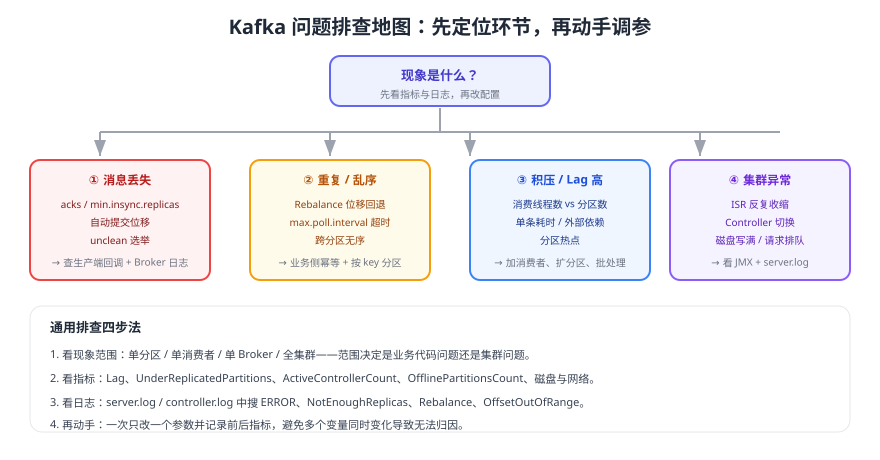

# Kafka 常见问题与最佳实践

生产环境的 Kafka 问题大多是「配置组合不当 + 客户端写法不规范」导致的，真正的集群故障占比反而更低。本页按现象组织 15 个高频问题，每个都给出定位思路、命令与处理方案，并附排查地图与最佳实践清单。



## 消息丢失

1. **生产端丢**：检查生产者是否 `acks=all`、是否处理了 `send()` 回调异常。回调里只打日志不补偿，等于丢消息。
2. **存储端丢**：检查 Topic 副本数是否 ≥ 3、`min.insync.replicas` 是否 ≥ 2、`unclean.leader.election.enable` 是否为 `false`。
3. **消费端丢**：检查是否 `enable.auto.commit=true` 或在业务处理前提交位移；生产环境应改为「业务成功后手动提交」。

```shell
# 关键检查点
bin/kafka-topics.sh --bootstrap-server localhost:9092 --describe --topic orders
bin/kafka-configs.sh --bootstrap-server localhost:9092 --describe \
  --entity-type topics --entity-name orders
```

::: danger 结论先行
只把 `acks` 改成 `all`、不改 `min.insync.replicas`，**性能下降但可靠性没有提升**。这两个参数必须成对出现，详见 [分区与副本机制](../PartitionReplica/index.md)。
:::

## 消息重复

重复来自三个来源：生产者重试、消费者重平衡、消费逻辑重放。

- 生产者侧：确认 `enable.idempotence=true`（4.x 默认开启）；跨会话、跨分区仍可能重复，需要事务或业务去重。
- 消费者侧：重平衡后位移回退、`max.poll.interval.ms` 超时被踢出组都会重放消息。
- 业务侧：用唯一键（如 `orderId + 事件类型`）做幂等表或状态机校验，方案见 [消费幂等](../../Idempotency/index.md)。

## 消息乱序

| 原因 | 排查与修正 |
| --- | --- |
| 消息 key 为空 | 粘性分区会打散顺序，需按业务键分区 |
| 分区数被扩容过 | key 的哈希落点变化，历史消息与新消息可能分属不同分区 |
| 多线程消费同一分区 | 改为按分区固定线程或分区内串行 |
| 关闭幂等 + 多线程重试 | 批次重排导致乱序，保持 `enable.idempotence=true` |

## 消息积压（Lag 持续增长）

按「生产端是不是暴涨 → 消费端是不是变慢 → 分区数是否够」的顺序排查：

```shell
# 1. 定位是哪个分区、哪个消费者在拖后腿
bin/kafka-consumer-groups.sh --bootstrap-server localhost:9092 \
  --describe --group order-group

# 2. 查看消费组成员分配与主机
bin/kafka-consumer-groups.sh --bootstrap-server localhost:9092 \
  --describe --group order-group --members --verbose
```

| 排查方向 | 典型现象 | 处理方式 |
| --- | --- | --- |
| 消费实例少于分区数 | 部分分区无人消费 | 扩容到与分区数一致 |
| 单条处理慢 | Lag 缓慢上升，CPU 不高 | 优化外部依赖、批量处理、异步化 |
| 分区热点 | 单个分区 Lag 远高于其他 | 检查 key 分布，重新设计分区键 |
| 消费反复重平衡 | 日志出现大量 Rebalance | 检查 `max.poll.interval.ms` 与优雅关闭 |
| 消费者数超过分区数 | 有新实例但 Lag 不降 | 增加分区数（注意 key 落点变化） |

## 消费者反复重平衡

```shell
# 观察组状态与成员数变化
bin/kafka-consumer-groups.sh --bootstrap-server localhost:9092 \
  --describe --group order-group --state
```

常见原因与对策：

1. 单条处理超过 `max.poll.interval.ms`（默认 5 分钟）→ 调大该值或减少 `max.poll.records`。
2. 消费线程被阻塞（长事务、同步 IO）→ 拆分处理、加超时。
3. 容器频繁重启导致成员抖动 → 配置 `group.instance.id`（静态成员）与优雅关闭。
4. 心跳间隔不合理 → 保持 `heartbeat.interval.ms` 为 `session.timeout.ms` 的 1/3。

## ISR 反复收缩

| 原因 | 判断依据 | 处理 |
| --- | --- | --- |
| 副本拉取线程不足 | 大集群、`num.replica.fetchers` 仍为 1 | 适当调大 |
| 磁盘 IO 饱和 | 磁盘 await 高、`IsrShrinksPerSec` 频繁 | 换独立盘、减少共享存储争抢 |
| 网络带宽或跨机房延迟 | Follower 与 Leader 跨机房 | 调整机架分布，避免跨机房同步 |
| Broker 过载 | 请求队列打满 | 降低单 Broker 分区数或扩容 |

```shell
bin/kafka-topics.sh --bootstrap-server localhost:9092 --describe --under-replicated-partitions
```

## 磁盘写满与保留策略

1. 检查 Topic 保留配置：`retention.ms`、`retention.bytes`、`cleanup.policy`。
2. 检查是否有人误设超大 `retention.bytes=-1` 且流量激增。
3. 短期应急：调小 `retention.ms` 并触发日志滚动；不要直接 `rm` 段文件（会导致数据不一致）。
4. 长期方案：使用分层存储把冷数据卸载到对象存储，见 [架构与存储原理](../Architecture/index.md)。

## 生产者报 NotEnoughReplicas / TimeoutException

| 异常 | 含义 | 处理 |
| --- | --- | --- |
| `NotEnoughReplicasException` | ISR 数量小于 `min.insync.replicas` | 先恢复副本，这是防止丢数据的保护机制 |
| `TimeoutException`（发送） | 超过 `delivery.timeout.ms` 仍未成功 | 检查 Broker 负载、网络、`linger.ms` 与批次大小 |
| `RecordTooLargeException` | 消息超过 `max.request.size` 或 `message.max.bytes` | 两端同步调大，或拆分消息 |
| `SerializationException` | 序列化器抛错 | 修复数据格式，注意这类异常不会重试 |

## 新消费组读不到历史消息

`auto.offset.reset` 默认是 `latest`，新消费组首次订阅时没有已提交位移，会从最新位置开始。需要历史数据时：

```shell
# 方式一：消费端显式配置 earliest
# props.put(ConsumerConfig.AUTO_OFFSET_RESET_CONFIG, "earliest");

# 方式二：先把已有消费组的位移重置到最早（组内必须无活跃成员）
bin/kafka-consumer-groups.sh --bootstrap-server localhost:9092 \
  --group order-group --topic orders --reset-offsets --to-earliest --execute
```

## 分区热点与分区数选择

1. 检查每个分区的消息量：`kafka-topics.sh --describe` 与 `kafka-get-offsets` 类工具配合观察，或直接在监控上看分区级写入速率。
2. 热点通常来自 key 设计：用自增 ID、时间戳、少量大客户做 key 都会造成倾斜。
3. 分区数规划要同时考虑吞吐、消费并行度与单分区体积，见 [分区与副本机制](../PartitionReplica/index.md)。

## 集群级异常

| 现象 | 可能原因 | 排查命令 |
| --- | --- | --- |
| 无法创建 Topic / 元数据不更新 | Controller 无 Leader | `kafka-metadata-quorum.sh describe --status` |
| 全集群只读或不可写 | Active Controller 数量异常 | 检查 `ActiveControllerCount`，全集群之和应为 1 |
| 分区不可读写 | `OfflinePartitionsCount > 0` | `kafka-topics.sh --describe --unavailable-partitions` |
| 元数据版本升级失败 | 有节点未升级完成 | `kafka-features.sh describe`，确认所有组件版本一致 |

## 常用排查命令速查

| 目的 | 命令 |
| --- | --- |
| 查看 Topic 分区与副本 | `kafka-topics.sh --bootstrap-server ... --describe --topic <t>` |
| 查看副本不足分区 | `kafka-topics.sh --bootstrap-server ... --describe --under-replicated-partitions` |
| 查看消费组积压 | `kafka-consumer-groups.sh --bootstrap-server ... --describe --group <g>` |
| 查看消费组成员分配 | `kafka-consumer-groups.sh --bootstrap-server ... --describe --group <g> --members --verbose` |
| 查看 Topic 配置 | `kafka-configs.sh --bootstrap-server ... --describe --entity-type topics --entity-name <t>` |
| 查看 Controller 仲裁 | `kafka-metadata-quorum.sh --bootstrap-server ... describe --status` |
| 查看元数据版本 | `kafka-features.sh --bootstrap-server ... describe` |
| 查看日志段内容 | `kafka-dump-log.sh --files <seg>.log --print-data-log` |
| 生产/消费压测 | `kafka-producer-perf-test.sh` / `kafka-consumer-perf-test.sh` |
| 首选 Leader 选举 | `kafka-leader-election.sh --election-type preferred --all-topic-partitions` |

## 最佳实践清单

::: tip 部署与配置
1. Controller 用 3 或 5 台奇数节点，生产环境与 Broker 分离部署，全部使用 KRaft 模式。
2. 生产 Topic：副本数 3、`min.insync.replicas=2`、`acks=all`、`unclean.leader.election.enable=false` 四件套同时满足。
3. 关闭 `auto.create.topics.enable`，避免拼错 Topic 名产生垃圾主题与不可控分区数。
4. 内部主题（`__consumer_offsets`、`__transaction_state`、`__share_group_state`）副本数保持 3。
:::

::: tip 开发与消费
1. 生产端永远处理发送回调，失败落本地重试表，不要静默丢弃。
2. 消费端 `enable.auto.commit=false`，按批手动提交，业务侧必须幂等。
3. 同一业务实体的事件用同一 key，跨分区不要期望有序。
4. 消费逻辑避免长阻塞，慢任务异步化并配置超时。
5. 每个消费组都要有 Lag 监控与告警阈值，死信主题要有人工处理流程。
:::

## 验证方式

1. 用「消息丢失」三条检查点在测试集群逐项核对配置，确认 `acks=all` 与 `min.insync.replicas=2` 同时生效。
2. 人为触发重平衡（重启一个消费者）后，确认重复消息被幂等表拦住。
3. 造 1 万条积压，观察 Lag 曲线在扩容消费者后回落。
4. 执行上面的「常用排查命令速查」，确认每条命令都能返回预期字段。

## 参考资料

- Kafka 4.3 官方文档（含运维与监控）：https://kafka.apache.org/documentation/
- Kafka 4.3 监控指标：https://kafka.apache.org/43/operations/monitoring/
- Kafka 4.3 升级与行为变更：https://kafka.apache.org/43/getting-started/upgrade/
- 本库通用消息队列 FAQ：[消息队列常见问题与最佳实践](../../FAQ/index.md)
