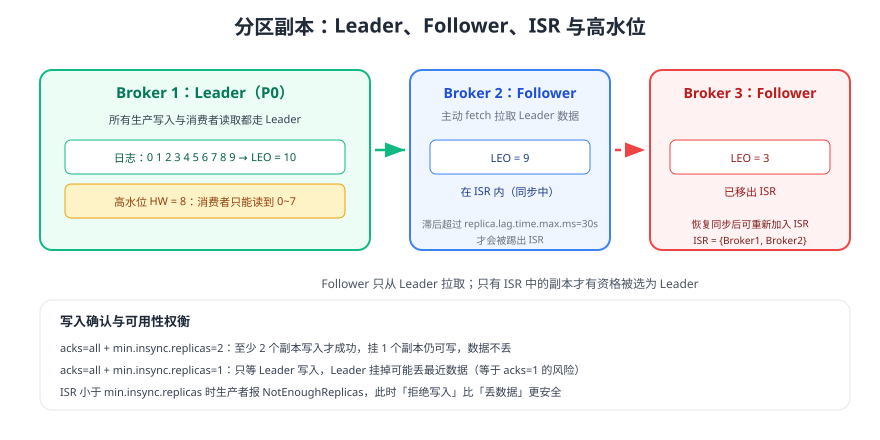

# 分区与副本机制

分区决定**并行度与顺序性**，副本决定**高可用与不丢数据**。两件事经常被混为一谈：以为「副本数 = 3 就不会丢」，却把 `min.insync.replicas` 留在默认的 1。本页讲清 Leader/Follower 同步、ISR 与高水位、选举策略，以及分区数量的规划方法。



## 分区：并行与顺序的基本单位

| 属性 | 说明 | 约束 |
| --- | --- | --- |
| 分区数 | 决定 Topic 的并行上限与分布粒度 | **只能增加不能减少**，且增加会改变 key 落点 |
| 分区内顺序 | 同一分区内按写入顺序追加，消费者按 offset 顺序读 | 保证有序的前提是同一 key 进同一分区 |
| 分区大小 | 每个分区对应一个日志目录，含多个段文件 | 单分区过大影响恢复时间与重分配速度 |
| 副本数 | 每个分区的副本分布在多个 Broker 上 | 生产建议 3，`replication.factor ≤ broker 数` |

```shell
# 查看分区分布：Leader、副本集合、ISR
bin/kafka-topics.sh --bootstrap-server localhost:9092 --describe --topic orders

# 增加分区（注意：会改变 key 的哈希落点，务必评估有序性影响）
bin/kafka-topics.sh --bootstrap-server localhost:9092 --alter \
  --topic orders --partitions 12
```

预期输出：每行显示 `Partition`、`Leader`、`Replicas`、`Isr`；正常状态下 `Replicas` 与 `Isr` 集合一致，若 `Isr` 少于 `Replicas` 说明有副本落后。

## 副本同步与 ISR

### 同步的四个角色

| 术语 | 含义 |
| --- | --- |
| Leader | 每分区唯一的读写入口，所有生产写入与消费者读取都经过它 |
| Follower | 主动向 Leader 发起 fetch 拉取数据，保持与 Leader 一致 |
| LEO（Log End Offset） | 副本日志末尾的下一个偏移量，代表该副本写到哪 |
| HW（High Watermark） | 高水位，消费者只能读到 HW 之前的消息，代表 ISR 均已同步的位置 |

### 同步流程

1. 生产者写入 Leader，Leader 追加本地日志，LEO 前移。
2. Follower 发起 fetch，拉取新数据并追加本地日志，返回自己的 LEO。
3. Leader 取自身 LEO 与所有 ISR 的 LEO 最小值作为新的 HW 并推进。
4. 消费者只能读取 `offset < HW` 的消息，因此**读到的消息一定不会因 Leader 切换而丢失**。
5. Follower 若在 `replica.lag.time.max.ms`（默认 30 秒）内未追上，被移出 ISR；追上后再重新加入。

::: tip 一句话理解
HW 是「**ISR 都同步到哪**」，LEO 是「**这个副本写到哪**」。消费者看到的永远是 HW，缺口由副本同步填平。
:::

## min.insync.replicas 与 acks 的组合

这是生产事故里最常见的一类配置错误，务必按矩阵理解：

| `acks` | `min.insync.replicas` | 副本数 | 效果 |
| --- | --- | --- | --- |
| `all` | `2` | 3 | **推荐**：至少 2 个副本写入成功才响应，挂 1 个副本仍可写且不丢数据 |
| `all` | `1` | 3 | 只要 Leader 写入即成功，等价于 `acks=1` 的风险 |
| `1` | 任意 | 3 | Leader 宕机且未同步时可能丢最近消息 |
| `0` | 任意 | 3 | 发出即成功，可能丢消息 |

::: danger 易错点
1. 只把 `acks` 改成 `all`，却保留 `min.insync.replicas=1`（默认值）：可靠性没有提升，仍可能丢数据。
2. `min.insync.replicas` 设成等于副本数（如 3 副本 + `min.insync.replicas=3`）：任意一个副本挂掉就完全无法写入，可用性过差。
3. 只对「重要 Topic」设置参数，忘记 Broker 级默认值仍是 1：建议在 Broker 端统一设置 `min.insync.replicas=2`，再按 Topic 微调。
4. ISR 不足时生产者报 `NotEnoughReplicasException`：这是**保护**而非故障，应告警并先恢复副本，而不是调低参数放行写入。
:::

## 日志截断与 Leader 选举

### 日志截断（Log Truncation）

Leader 切换后，新 Leader 会按自己的日志与 **Leader Epoch** 通知 Follower 截断不一致的尾部数据，再继续同步。这就是「Kafka 以 Leader 的日志为准」的具体体现。

### 选举策略

| 配置 | 默认值 | 行为 |
| --- | --- | --- |
| `unclean.leader.election.enable` | `false` | 禁止非 ISR 副本当选；宁可暂时不可用也不丢数据 |
| `unclean.leader.election.enable`（设为 true） | — | 允许落后副本当选，**提升可用性但可能丢数据** |
| KIP-966 ELR（4.0+） | 内置 | Controller 记录「不在 ISR 但可安全当选」的副本，减少不可用时间且不牺牲数据安全 |

```shell
# 触发一次首选 Leader 选举（例如让 Leader 回到各分区 Replicas 列表首个 Broker）
bin/kafka-leader-election.sh --bootstrap-server localhost:9092 \
  --election-type preferred --all-topic-partitions
```

### 机架感知

```properties [server.properties]
# 每个 Broker 声明自己的机架/可用区
broker.rack=az-a
```

配置 `broker.rack` 后，Kafka 会尽量把同一分区的副本分散到不同机架，并用 `client.rack` 让消费者优先读取本机架副本，降低跨机房流量。

## 分区数规划

| 规划维度 | 参考做法 |
| --- | --- |
| 吞吐目标 | `分区数 ≈ 目标吞吐 / 单分区可承载吞吐`，单分区通常几 MB/s 到几十 MB/s，需实测 |
| 消费并行度 | 分区数 ≥ 期望的消费并行实例数（含未来半年扩容余量） |
| 顺序性要求 | 需要全局有序的 Topic 只能单分区，需评估是否真有必要 |
| 单分区大小 | 建议单分区数据量控制在几十 GB 级，避免恢复与重分配耗时过长 |
| 元数据压力 | KRaft 支持大量分区，但分区越多，Leader 选举与重分配代价越高 |

::: warning 分区不是越多越好
分区增多会带来更多文件句柄、更多副本同步线程、更长的 Leader 选举与重平衡时间，还会因为客户端元数据变大而增加内存开销。建议按「预期峰值吞吐 × 2」规划，并保留一倍余量后停止扩张。
:::

## 分区重分配与扩容

```shell
# 1. 生成重分配方案：把 orders 的分区在各 Broker 间重新均衡
cat > reassign.json <<'EOF'
{"topics":[{"topic":"orders"}],"version":1}
EOF
bin/kafka-reassign-partitions.sh --bootstrap-server localhost:9092 \
  --topics-to-move-json-file reassign.json --broker-list "101,102,103,104" --generate

# 2. 用生成的方案执行重分配（--execute 会触发数据搬迁）
bin/kafka-reassign-partitions.sh --bootstrap-server localhost:9092 \
  --reassignment-json-file plan.json --execute

# 3. 查看进度，直到每个分区的分区状态都为 completed
bin/kafka-reassign-partitions.sh --bootstrap-server localhost:9092 \
  --reassignment-json-file plan.json --verify
```

::: danger 扩容操作注意事项
1. 重分配会带来大量跨 Broker 网络与磁盘 IO，应在低峰执行并限速（`--throttle`）。
2. 新增 Broker 不会自动分担已有分区：必须显式执行重分配或依赖自动均衡（视版本与配置而定）。
3. 重分配期间不要同时做扩容分区数、升级版本等其他变更。
4. 退役 Broker 前，先确认其上的分区已全部迁出（`--verify` 全 completed）再下线。
:::

## 验证方式

1. 创建 3 副本、`min.insync.replicas=2` 的 Topic，执行 `--describe` 确认 `Replicas` 与 `Isr` 均为 3 个 Broker。
2. 停掉一个 Broker，观察 `Isr` 变为 2、生产者仍能写入；重启后确认 ISR 恢复到 3。
3. 同时停掉两个 Broker，确认生产者收到 `NotEnoughReplicasException`（这是预期的保护行为）。
4. 执行一次 `--election-type preferred` 选举，确认各分区 Leader 回到首选副本且客户端无异常。

## 参考资料

- Kafka 4.3 副本设计（Design → Replication）：https://kafka.apache.org/43/design/
- Kafka 4.3 Topic 配置（`min.insync.replicas` 等）：https://kafka.apache.org/43/generated/topic_config.html
- Kafka 4.3 Broker 配置（`unclean.leader.election.enable`、`broker.rack`）：https://kafka.apache.org/43/generated/kafka_config.html
- KIP-966（Eligible Leader Replicas）：https://cwiki.apache.org/confluence/display/KAFKA/KIP-966%3A+Eligible+Leader+Replicas
