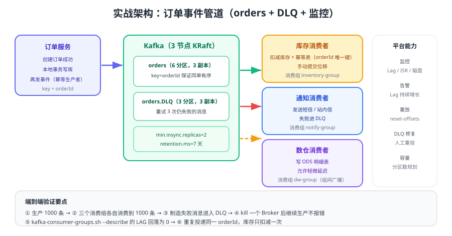

# 实战：订单事件管道

前面几页分别讲了生产者、消费者、副本与可靠性，本页把它们组装成一条**可运行、可验证、可演练**的订单事件管道：订单服务发布事件，库存/通知/数仓三个消费组各自消费，失败消息进入死信主题，全链路有监控与幂等保护。



## 需求与设计目标

| 目标 | 落地方式 |
| --- | --- |
| 订单状态变更实时通知下游 | 订单服务在本地事务提交后发布 `orders` 事件 |
| 同一订单的事件必须有序 | 以 `orderId` 作为消息 key，落同一分区 |
| 下游系统各自独立消费 | 每个下游使用独立 `group.id`，互不影响 |
| 不允许因为消息重复导致重复扣减 | 消费者用 `orderId` 唯一键 + 幂等表去重 |
| 处理失败不能无限阻塞 | 重试 3 次后写入 `orders.DLQ` |
| 可观测 | Lag、ISR、DLQ 消息数进监控与告警 |

## Topic 设计

| Topic | 分区数 | 副本数 | 关键配置 | 说明 |
| --- | --- | --- | --- | --- |
| `orders` | 6 | 3 | `min.insync.replicas=2`、`retention.ms=604800000`（7 天） | 主事件流，按 `orderId` 分区 |
| `orders.DLQ` | 3 | 3 | 同上，保留 14 天 | 死信，人工介入后重投 |

```shell
# 创建主主题与死信主题
bin/kafka-topics.sh --bootstrap-server localhost:9092 --create \
  --topic orders --partitions 6 --replication-factor 3 \
  --config min.insync.replicas=2 --config retention.ms=604800000

bin/kafka-topics.sh --bootstrap-server localhost:9092 --create \
  --topic orders.DLQ --partitions 3 --replication-factor 3 \
  --config min.insync.replicas=2 --config retention.ms=1209600000

# 确认分区、副本与 ISR
bin/kafka-topics.sh --bootstrap-server localhost:9092 --describe --topic orders
```

预期输出：`orders` 有 6 个分区，`ReplicationFactor` 为 3，每行 `Isr` 有 3 个 Broker；`orders.DLQ` 有 3 个分区。

## 生产者：先落库再发消息

订单服务的关键约束是「数据库写入成功」与「事件发送成功」不能相互回滚，因此采用「本地事务 + 消息表 + 幂等生产者」的组合：

```java [OrderService.java]
import org.apache.kafka.clients.producer.KafkaProducer;
import org.apache.kafka.clients.producer.ProducerRecord;
import org.springframework.transaction.annotation.Transactional;

public class OrderService {
    private final KafkaProducer<String, String> producer;
    private final OrderRepository orderRepository;
    private final OutboxRepository outboxRepository;

    /** 第一步：同一数据库事务内写订单 + 写消息表 */
    @Transactional
    public void createOrder(Order order) {
        orderRepository.save(order);
        outboxRepository.save(new Outbox("orders", order.getId(), order.toJson()));
    }

    /** 第二步：后台任务扫描消息表，用幂等生产者投递，成功后标记已发送 */
    public void flushOutbox() {
        for (Outbox message : outboxRepository.findPending(100)) {
            producer.send(new ProducerRecord<>(message.topic(), message.key(), message.payload()),
                    (metadata, ex) -> {
                        if (ex == null) {
                            outboxRepository.markSent(message.id());
                        } else {
                            outboxRepository.markFailed(message.id(), ex.getMessage());
                        }
                    });
        }
        producer.flush();
    }
}
```

::: tip 为什么不用「先发消息再落库」
如果先发消息、后写数据库失败，下游会收到一条不存在的订单事件；反过来先落库再发消息，最坏情况只是「事件晚到」，配合消息表的定时补偿可以保证最终一定发出。**业务事件应以数据库为事实来源**。
:::

## 消费者：手动提交 + 幂等 + 死信

```java [InventoryConsumer.java]
import org.apache.kafka.clients.consumer.ConsumerConfig;
import org.apache.kafka.clients.consumer.ConsumerRecord;
import org.apache.kafka.clients.consumer.ConsumerRecords;
import org.apache.kafka.clients.consumer.KafkaConsumer;
import org.apache.kafka.clients.producer.KafkaProducer;
import org.apache.kafka.clients.producer.ProducerRecord;
import org.apache.kafka.common.serialization.StringDeserializer;
import java.time.Duration;
import java.util.List;
import java.util.Properties;

public class InventoryConsumer {
    private static final int MAX_RETRY = 3;

    public static void main(String[] args) {
        Properties props = new Properties();
        props.put(ConsumerConfig.BOOTSTRAP_SERVERS_CONFIG, "kafka1:9092,kafka2:9092,kafka3:9092");
        props.put(ConsumerConfig.GROUP_ID_CONFIG, "inventory-group");
        props.put(ConsumerConfig.KEY_DESERIALIZER_CLASS_CONFIG, StringDeserializer.class);
        props.put(ConsumerConfig.VALUE_DESERIALIZER_CLASS_CONFIG, StringDeserializer.class);
        props.put(ConsumerConfig.ENABLE_AUTO_COMMIT_CONFIG, false);
        props.put(ConsumerConfig.MAX_POLL_RECORDS_CONFIG, 100);
        props.put(ConsumerConfig.ISOLATION_LEVEL_CONFIG, "read_committed");

        KafkaProducer<String, String> dlqProducer = DlqProducerFactory.create();
        KafkaConsumer<String, String> consumer = new KafkaConsumer<>(props);
        consumer.subscribe(List.of("orders"));

        try {
            while (true) {
                ConsumerRecords<String, String> records = consumer.poll(Duration.ofSeconds(1));
                for (ConsumerRecord<String, String> record : records) {
                    try {
                        // 幂等：以 orderId + 事件类型为唯一键，已处理则直接跳过
                        if (idempotentRepository.exists(record.key(), eventType(record.value()))) {
                            continue;
                        }
                        deductStock(record.value());                 // 业务处理
                        idempotentRepository.mark(record.key(), eventType(record.value()));
                    } catch (Exception e) {
                        if (RetryCounter.exceeded(record.key(), MAX_RETRY)) {
                            // 重试耗尽：写死信，人工介入；不要无限阻塞分区
                            dlqProducer.send(new ProducerRecord<>(
                                    "orders.DLQ", record.key(), record.value()));
                        } else {
                            RetryCounter.increase(record.key());
                        }
                    }
                }
                // 业务与死信都处理完成后按批提交
                if (!records.isEmpty()) {
                    dlqProducer.flush();
                    consumer.commitSync();
                }
            }
        } finally {
            consumer.close(Duration.ofSeconds(10));
            dlqProducer.close();
        }
    }

    private static void deductStock(String payload) { }
    private static String eventType(String payload) { return "ORDER_CREATED"; }
}
```

::: danger 消费端易错点
1. 捕获异常后不写死信也不提交：分区被卡死，Lag 持续增长，最终拖垮整条链路。
2. 先提交位移再写幂等表：崩溃后消息丢失，幂等表「看起来」完整。
3. 死信消息不记录失败原因与重试次数：排查时无法判断是数据问题还是下游故障。
4. 消费里调用没有超时设置的同步 HTTP：单条阻塞会拖到 `max.poll.interval.ms` 超时并被踢出组。
:::

## 端到端压测与故障演练

```shell
# 1. 生产 10 万条事件，同时观察三个消费组的 Lag
bin/kafka-producer-perf-test.sh --topic orders \
  --num-records 100000 --record-size 512 --throughput 20000 \
  --producer-props bootstrap.servers=localhost:9092 acks=all enable.idempotence=true

# 2. 观察消费组 Lag（可重复执行）
bin/kafka-consumer-groups.sh --bootstrap-server localhost:9092 \
  --describe --group inventory-group

# 3. 造一批失败消息后，确认死信主题有数据
bin/kafka-console-consumer.sh --bootstrap-server localhost:9092 \
  --topic orders.DLQ --from-beginning --max-messages 5
```

| 演练 | 操作 | 期望结果 |
| --- | --- | --- |
| Broker 宕机 | `docker stop kafka2` | 生产不中断；`Isr` 变 2；重启后恢复 3 |
| 消费者崩溃 | `kill -9` 库存消费者 | 位移未提交，重启后重放；幂等表阻止重复扣减 |
| 重复投递 | 手工重发同一 `orderId` 事件 | 幂等表命中，库存只扣一次 |
| 下游故障 | 模拟数据库不可用 | 重试 3 次后进 `orders.DLQ`，主链路继续推进 |
| 消费扩容 | 库存消费者从 2 个实例扩到 6 个 | 每个实例分到 1 个分区，Lag 下降更快；超过 6 个实例无额外收益 |

## 验证方式

1. `kafka-topics.sh --describe` 确认 `orders` 为 6 分区 3 副本、`orders.DLQ` 为 3 分区 3 副本，`Isr` 与 `Replicas` 一致。
2. 三个消费组（`inventory-group`、`notify-group`、`dw-group`）分别消费到全部 10 万条消息，`LAG` 归零（验证组间广播）。
3. 向同一 `orderId` 重复投递 10 次，库存表只发生 1 次扣减（验证幂等）。
4. 注入失败消息，确认 `orders.DLQ` 收到消息且主 Topic 的 Lag 仍能归零（验证死信不阻塞）。
5. 停掉一个 Broker 后继续生产 1 万条，确认无发送失败、无重复。

## 参考资料

- Kafka 4.3 快速开始（含官方容器镜像用法）：https://kafka.apache.org/43/getting-started/quickstart/
- Kafka 4.3 生产者与消费者配置：https://kafka.apache.org/43/generated/producer_config.html
- 消费幂等的通用方案（本库）：[消费幂等](../../Idempotency/index.md)
- 可靠投递的通用方法论（本库）：[可靠投递](../../Reliability/index.md)
- 微服务最终一致性与分布式事务（本库）：[分布式事务](../../../Microservices/DistributedTransaction/index.md)
