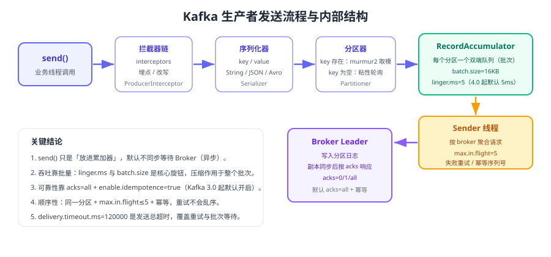

# Kafka 生产者深入

生产者决定了消息「**怎么进 Kafka、进哪个分区、会不会丢、会不会重**」。本页从上到下拆解发送流程，给出分区策略、批量与压缩、确认与重试的参数矩阵，以及可直接运行的完整示例代码。



## 发送流程的五个阶段

1. **拦截器（Interceptor）**：可选，用于埋点、改写消息或注入 traceId。
2. **序列化（Serializer）**：把 key/value 转成字节，序列化失败会在客户端直接抛异常。
3. **分区器（Partitioner）**：决定消息进入哪个分区，决定「同一业务键是否有序」。
4. **累加器（RecordAccumulator）**：按分区排队成批次，`batch.size` 与 `linger.ms` 共同决定批次大小。
5. **Sender 线程**：按目标 Broker 聚合请求发送，处理重试、幂等序列号与响应回调。

::: tip 一句话理解
`send()` 默认是**异步**的：它只把消息放进累加器就返回，真正的网络发送由 Sender 线程完成。所以「调用 send 成功」不等于「消息已经被 Broker 接收」，需要回调或 `flush()` 才能确认。
:::

## 分区策略

| key 情况 | 默认行为 | 结果 |
| --- | --- | --- |
| key 非空 | 对 key 做 murmur2 哈希后对分区数取模 | 相同 key 永远进同一分区，**保证该 key 有序** |
| key 为空 | 粘性分区（sticky partitioning）：选一个分区写满一个批次再切换 | 吞吐高，但不保证顺序 |
| 指定分区号 | 直接写入指定分区 | 需要自己保证均衡 |
| 自定义分区器 | 实现 `Partitioner` 接口 | 可按业务规则（如租户、地域）路由 |

```java [TenantPartitioner.java]
import org.apache.kafka.clients.producer.Partitioner;
import org.apache.kafka.common.Cluster;
import java.util.Map;

/** 按租户哈希分区：保证同一租户的消息有序，同时避免大租户全压在一个分区 */
public class TenantPartitioner implements Partitioner {
    @Override
    public int partition(String topic, Object key, byte[] keyBytes,
                         Object value, byte[] valueBytes, Cluster cluster) {
        int partitions = cluster.partitionsForTopic(topic).size();
        String tenant = key == null ? "unknown" : key.toString().split(":")[0];
        return Math.floorMod(tenant.hashCode(), partitions);
    }

    @Override public void close() { }
    @Override public void configure(Map<String, ?> configs) { }
}
```

::: danger 易错点
1. **分区数变更会打乱 key 的落点**：`hash(key) % 分区数` 在分区数变化后结果改变，历史消息与新消息可能落在不同分区，破坏「同 key 有序」。分区数只能增加、不能减少，务必在容量规划阶段确定。
2. 只给「需要有序的事件」设置 key，其他消息留空可以提升吞吐与负载均衡。
3. 用自增 ID 或时间戳做 key 会导致极端热点分布，应使用业务实体 ID（如 orderId、userId）。
:::

## 批量、压缩与超时

| 参数 | 默认值 | 作用 | 调优建议 |
| --- | --- | --- | --- |
| `batch.size` | `16384` | 单分区批次字节上限 | 高吞吐场景可调到 64 KB~256 KB |
| `linger.ms` | `5`（4.0 起由 0 改为 5） | 批次等待时间 | 追求吞吐可调到 20~100 ms，延迟敏感保持默认 |
| `compression.type` | `none` | 批次压缩算法 | 推荐 `lz4`（低延迟）或 `zstd`（高压缩比） |
| `buffer.memory` | `33554432` | 生产者可用缓冲区总量 | 批次变大或突发流量大时调大 |
| `max.block.ms` | `60000` | 缓冲区满时 `send()` 阻塞上限 | 阻塞超时会抛 `TimeoutException`，必须监控 |
| `delivery.timeout.ms` | `120000` | 从 `send()` 到最终成功的总超时 | 应大于 `linger.ms + request.timeout.ms + 重试耗时` |
| `max.request.size` | `1048576` | 单个请求最大字节 | 大消息场景需与 Broker `message.max.bytes` 同步调大 |

```java [ProducerTuningDemo.java]
Properties props = new Properties();
props.put(ProducerConfig.BOOTSTRAP_SERVERS_CONFIG, "localhost:9092");
props.put(ProducerConfig.KEY_SERIALIZER_CLASS_CONFIG,
        "org.apache.kafka.common.serialization.StringSerializer");
props.put(ProducerConfig.VALUE_SERIALIZER_CLASS_CONFIG,
        "org.apache.kafka.common.serialization.StringSerializer");
// 高吞吐取向：攒批 + 压缩
props.put(ProducerConfig.LINGER_MS_CONFIG, 20);
props.put(ProducerConfig.BATCH_SIZE_CONFIG, 131072);
props.put(ProducerConfig.COMPRESSION_TYPE_CONFIG, "lz4");
props.put(ProducerConfig.BUFFER_MEMORY_CONFIG, 67108864L);
// 可靠性取向：显式写明（4.x 默认即为该组合）
props.put(ProducerConfig.ACKS_CONFIG, "all");
props.put(ProducerConfig.ENABLE_IDEMPOTENCE_CONFIG, true);
props.put(ProducerConfig.RETRIES_CONFIG, Integer.MAX_VALUE);
props.put(ProducerConfig.DELIVERY_TIMEOUT_MS_CONFIG, 120000);
```

::: warning 压缩生效位置
压缩作用于**整个批次**而不是单条消息，所以批越大压缩收益越高。若 `linger.ms=0` 且消息很小，压缩几乎没有效果，甚至会因解压开销略微降低吞吐。
:::

## 确认与重试

| `acks` | 语义 | 丢消息风险 | 适用场景 |
| --- | --- | --- | --- |
| `0` | 发出即认为成功 | 高（网络抖动、Broker 忙都会丢） | 可丢弃的埋点、指标采集 |
| `1` | Leader 写入本地日志即响应 | 中（Leader 宕机且未同步时可能丢） | 对性能要求高、可容忍少量丢失 |
| `all`（默认） | 所有 ISR 按 `min.insync.replicas` 确认 | 低（配合 `min.insync.replicas ≥ 2`） | 订单、支付等核心链路 |

```java [SendWithCallback.java]
producer.send(new ProducerRecord<>("orders", orderId, payload), (metadata, ex) -> {
    if (ex != null) {
        // 1. 区分可重试异常（TimeoutException / NotEnoughReplicas）与不可重试异常（序列化失败）
        log.error("发送失败 orderId={} topic={}", orderId, "orders", ex);
        // 2. 落入本地重试表或降级通道，避免静默丢消息
        retryStore.save(orderId, payload);
    } else {
        log.info("发送成功 partition={} offset={}", metadata.partition(), metadata.offset());
    }
});
```

### 幂等与事务

- `enable.idempotence=true`：为生产者分配 PID，并对每条消息编号（sequence number），Broker 侧去重，避免重试导致的重复写入。要求 `acks=all`、`retries > 0`、`max.in.flight.requests.per.connection ≤ 5`。
- `transactional.id`：跨多个分区写入的原子性，配合 `isolation.level=read_committed` 实现「读→处理→写」精确一次，完整原理与示例见 [可靠性与 Exactly-Once](../Reliability/index.md)。

## 完整示例：可靠 + 高吞吐生产者

```java [OrderEventProducer.java]
import org.apache.kafka.clients.producer.*;
import org.apache.kafka.common.serialization.StringSerializer;
import java.util.Properties;
import java.util.concurrent.atomic.LongAdder;

public class OrderEventProducer {
    private static final LongAdder ok = new LongAdder();
    private static final LongAdder failed = new LongAdder();

    public static void main(String[] args) throws Exception {
        Properties props = new Properties();
        props.put(ProducerConfig.BOOTSTRAP_SERVERS_CONFIG, "k1:9092,k2:9092,k3:9092");
        props.put(ProducerConfig.KEY_SERIALIZER_CLASS_CONFIG, StringSerializer.class);
        props.put(ProducerConfig.VALUE_SERIALIZER_CLASS_CONFIG, StringSerializer.class);
        props.put(ProducerConfig.ACKS_CONFIG, "all");
        props.put(ProducerConfig.ENABLE_IDEMPOTENCE_CONFIG, true);
        props.put(ProducerConfig.LINGER_MS_CONFIG, 20);
        props.put(ProducerConfig.COMPRESSION_TYPE_CONFIG, "lz4");
        props.put(ProducerConfig.DELIVERY_TIMEOUT_MS_CONFIG, 120000);

        try (KafkaProducer<String, String> producer = new KafkaProducer<>(props)) {
            for (int i = 0; i < 10_000; i++) {
                String orderId = "ORD-" + (i % 1000);
                String payload = "{\"orderId\":\"" + orderId + "\",\"status\":\"created\"}";
                producer.send(new ProducerRecord<>("orders", orderId, payload),
                        (metadata, ex) -> {
                            if (ex == null) {
                                ok.increment();
                            } else {
                                failed.increment();
                            }
                        });
            }
            // 关闭前 flush，确保所有在途批次都有最终结果
            producer.flush();
        }
        System.out.printf("成功=%d 失败=%d%n", ok.sum(), failed.sum());
    }
}
```

预期输出：`成功=10000 失败=0`；用控制台消费者加 `--property print.key=true --property print.partition=true` 可以看到相同 `ORD-*` 的消息集中在同一分区。

## 性能压测

```shell
# 官方压测工具：100 万条、每条 1 KB、目标吞吐 50000 条/秒、acks=all
bin/kafka-producer-perf-test.sh --topic orders \
  --num-records 1000000 --record-size 1024 --throughput 50000 \
  --producer-props bootstrap.servers=localhost:9092 acks=all \
    enable.idempotence=true linger.ms=20 compression.type=lz4

# 查看各分区的消息量与分布是否均衡
bin/kafka-topics.sh --bootstrap-server localhost:9092 --describe --topic orders
```

预期输出：压测结束打印 `records/sec`、`MB/sec`、`avg latency`、`max latency`；`--describe` 中每个分区的消息量级相近，无明显热点。

::: danger 易错点
1. 用 `send().get()` 逐条同步发送：吞吐会降到几十到几百 TPS，仅在必须确认单条结果的场景使用。
2. `delivery.timeout.ms` 设得小于 `linger.ms + request.timeout.ms`：启动时直接报配置非法。
3. 序列化异常不重试，回调里只打日志不处理：这类消息实际上已经「丢」了，必须有本地补偿通道。
4. 只调大 `batch.size` 而不调 `buffer.memory`：缓冲区更快打满，`send()` 阻塞或抛超时。
5. 生产环境混用多版本客户端：4.0 起对客户端最低版本有要求，升级前请核对 [版本演进与迁移](../Version/index.md)。
:::

## 验证方式

1. 运行 `OrderEventProducer`，确认回调统计为「成功=10000 失败=0」。
2. 执行 `kafka-topics.sh --describe --topic orders`，确认各分区消息量分布均衡、ISR 与副本数一致。
3. 用控制台消费者加 `--property print.key=true --property print.partition=true --from-beginning`，确认同一 `orderId` 的消息落在同一分区。
4. 停掉一个 Broker 后继续生产：`acks=all` + `min.insync.replicas=2` 时应无失败（剩余 ISR 仍满足条件），恢复后 ISR 自动回到 3。

## 参考资料

- Kafka 4.3 生产者配置：https://kafka.apache.org/43/generated/producer_config.html
- Kafka 4.3 Producer API：https://kafka.apache.org/43/javadoc/org/apache/kafka/clients/producer/KafkaProducer.html
- 设计文档（The Producer / Message Format）：https://kafka.apache.org/43/design/
- 消息投递语义说明：https://kafka.apache.org/43/documentation/#semantics
