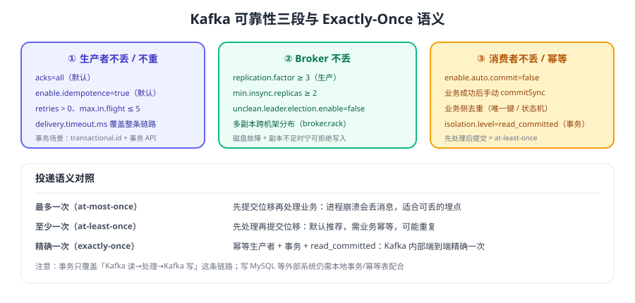

# Kafka 可靠性与 Exactly-Once

「消息不丢、不重、不乱序」这三件事分别由生产者、Broker、消费者三段共同保证，任何一段缺失都会让整体语义退化。本页给出可落地的配置组合、幂等生产者与事务的原理，以及端到端精确一次的完整代码。



## 可靠性三段论

| 环节 | 目标 | 关键手段 | 常见失误 |
| --- | --- | --- | --- |
| 生产者 | 不丢、不乱序 | `acks=all`、`enable.idempotence=true`、`retries`、回调处理 | 忽略回调、`acks=0/1`、`send().get()` 拖垮吞吐 |
| Broker | 不丢 | 副本数 ≥ 3、`min.insync.replicas ≥ 2`、禁止 unclean 选举 | 只加副本不改 `min.insync.replicas` |
| 消费者 | 不丢、可重复处理 | 手动提交位移、业务幂等、事务消费 | 自动提交、先提交后处理、处理超时被踢出组 |

::: tip 一句话理解
**不丢消息** = 生产端确认收到了 Broker 的响应 + 存储端至少有 2 份副本 + 消费端处理完才提交位移。三者缺一，链路上就有一个环节会漏。
:::

## 幂等生产者：避免重试造成重复

生产者重试是网络抖动下的正常行为，但「Broker 已写入、响应超时」的重试会造成重复写入。幂等生产者用两个标识解决：

| 标识 | 作用 |
| --- | --- |
| PID（Producer ID） | 由 Broker 分配，标识一个生产者会话 |
| Sequence Number | 每条消息在每个分区内单调递增，Broker 按序去重 |

当 Broker 收到序号重复或乱序的消息时，会拒绝并让生产者重新对齐，从而保证「一个生产者会话内、单个分区不重复」。

```java [IdempotentProducerConfig.java]
props.put(ProducerConfig.ACKS_CONFIG, "all");                       // 幂等要求
props.put(ProducerConfig.ENABLE_IDEMPOTENCE_CONFIG, true);          // 4.x 默认即 true
props.put(ProducerConfig.RETRIES_CONFIG, Integer.MAX_VALUE);        // 默认值
props.put(ProducerConfig.MAX_IN_FLIGHT_REQUESTS_PER_CONNECTION, 5); // 默认值，1~5 均保持顺序
```

::: warning 幂等的边界
幂等生产者只保证「**单个生产者会话内、单个分区不重复**」。生产者重启后 PID 变化，跨会话去重仍需业务侧唯一键；跨分区原子写入需要事务。
:::

## 事务：跨分区原子写入

事务把「多条消息写入多个分区」和「消费者位移提交」打包成一个原子操作，配合 `isolation.level=read_committed` 让消费者看不到未提交的数据。

| 概念 | 说明 |
| --- | --- |
| `transactional.id` | 事务标识，跨生产者重启保持不变，用于恢复未完成事务 |
| 事务协调器 | 管理事务状态的 Broker 组件，状态写入 `__transaction_state` |
| `transaction.timeout.ms` | 事务超时（默认 60000 ms），超时由协调器中止事务 |
| `isolation.level=read_committed` | 消费者只读已提交事务的数据，跳过 aborted 消息 |
| KIP-890（4.0+） | 强化事务协议，每次事务提升 producer epoch，修复边界场景 |

事务的基本流程：`initTransactions()` → `beginTransaction()` → 发送/处理 → `commitTransaction()`（或 `abortTransaction()`）。生产者在重启后调用 `initTransactions()` 会自动中止上一个未完成的事务。

## 端到端精确一次：读 → 处理 → 写

```java [ExactlyOncePipeline.java]
import org.apache.kafka.clients.consumer.*;
import org.apache.kafka.clients.producer.*;
import org.apache.kafka.common.serialization.*;
import java.time.Duration;
import java.util.*;

public class ExactlyOncePipeline {
    public static void main(String[] args) {
        String inTopic = "orders";
        String outTopic = "order-enriched";

        Properties producerProps = new Properties();
        producerProps.put(ProducerConfig.BOOTSTRAP_SERVERS_CONFIG, "k1:9092,k2:9092,k3:9092");
        producerProps.put(ProducerConfig.KEY_SERIALIZER_CLASS_CONFIG, StringSerializer.class);
        producerProps.put(ProducerConfig.VALUE_SERIALIZER_CLASS_CONFIG, StringSerializer.class);
        producerProps.put(ProducerConfig.TRANSACTIONAL_ID_CONFIG, "order-enrich-tx-1");
        producerProps.put(ProducerConfig.ENABLE_IDEMPOTENCE_CONFIG, true);
        producerProps.put(ProducerConfig.ACKS_CONFIG, "all");

        Properties consumerProps = new Properties();
        consumerProps.put(ConsumerConfig.BOOTSTRAP_SERVERS_CONFIG, "k1:9092,k2:9092,k3:9092");
        consumerProps.put(ConsumerConfig.GROUP_ID_CONFIG, "order-enrich-group");
        consumerProps.put(ConsumerConfig.KEY_DESERIALIZER_CLASS_CONFIG, StringDeserializer.class);
        consumerProps.put(ConsumerConfig.VALUE_DESERIALIZER_CLASS_CONFIG, StringDeserializer.class);
        consumerProps.put(ConsumerConfig.ENABLE_AUTO_COMMIT_CONFIG, false);
        // 关键：只读已提交事务的数据
        consumerProps.put(ConsumerConfig.ISOLATION_LEVEL_CONFIG, "read_committed");

        KafkaProducer<String, String> producer = new KafkaProducer<>(producerProps);
        producer.initTransactions();          // 中止上一次未完成的事务
        KafkaConsumer<String, String> consumer = new KafkaConsumer<>(consumerProps);
        consumer.subscribe(List.of(inTopic));

        try {
            while (true) {
                ConsumerRecords<String, String> records = consumer.poll(Duration.ofSeconds(1));
                if (records.isEmpty()) {
                    continue;
                }
                producer.beginTransaction();
                try {
                    for (ConsumerRecord<String, String> record : records) {
                        String enriched = enrich(record.value());   // 业务处理
                        producer.send(new ProducerRecord<>(outTopic, record.key(), enriched));
                    }
                    // 位移提交纳入同一事务：要么都成功，要么都不生效
                    producer.sendOffsetsToTransaction(
                            currentOffsets(consumer, records),
                            consumer.groupMetadata());
                    producer.commitTransaction();
                } catch (Exception e) {
                    producer.abortTransaction();       // 回滚：消息不写、位移不提交
                    throw e;
                }
            }
        } finally {
            producer.close();
            consumer.close();
        }
    }

    private static Map<org.apache.kafka.common.TopicPartition, OffsetAndMetadata>
            currentOffsets(KafkaConsumer<String, String> consumer,
                           ConsumerRecords<String, String> records) {
        Map<org.apache.kafka.common.TopicPartition, OffsetAndMetadata> offsets = new HashMap<>();
        records.partitions().forEach(partition -> {
            List<ConsumerRecord<String, String>> list = records.records(partition);
            offsets.put(partition,
                    new OffsetAndMetadata(list.get(list.size() - 1).offset() + 1));
        });
        return offsets;
    }

    private static String enrich(String value) {
        return value;   // 示例：实际可补全商品、用户等维度
    }
}
```

::: warning 事务不等于全局一致性
事务只覆盖「Kafka 读 → 处理 → Kafka 写」。如果处理过程中还要写 MySQL、调用外部接口，则外部系统的写入不在事务内，仍需**本地消息表 / 幂等表 + 状态机**配合，相关方案见 [消费幂等](../../Idempotency/index.md) 与 [分布式事务](../../../Microservices/DistributedTransaction/index.md)。
:::

## 顺序性保证

| 要求 | 做法 |
| --- | --- |
| 单 key 有序 | key 使用业务实体 ID，落到同一分区 |
| 重试不乱序 | `enable.idempotence=true` + `max.in.flight.requests.per.connection ≤ 5` |
| 消费不乱序 | 同一分区串行处理；多线程模型下按分区固定线程（见 [消费者深入](../Consumer/index.md)） |
| 全局有序 | 单分区 Topic（牺牲吞吐）或按业务维度拆分 Topic |
| 事务有序 | 事务内消息顺序与发送顺序一致；`read_committed` 消费者按序提交可见 |

::: danger 易错点
1. 手动实现「重试 + 多线程发送」并关掉幂等：批次重排会导致同一分区内消息顺序错乱。
2. 事务生产者未设置 `transactional.id`：调用事务 API 会直接抛 `IllegalStateException`。
3. 消费者漏配 `read_committed`：会读到未提交或已中止事务的消息，出现「脏读」。
4. 长事务（超过 `transaction.timeout.ms`）被协调器强制中止：应将大批量处理拆分为多个短事务。
5. 认为开启幂等就能跨生产者实例去重：PID 在重启后变化，跨会话仍需业务唯一键。
:::

## 验证方式与故障演练

| 演练 | 操作 | 预期结果 |
| --- | --- | --- |
| 消费者崩溃不丢消息 | 处理到一半 `kill -9` 消费者，重启后观察 | 位移未提交，消息被重新消费，业务幂等后无副作用 |
| 生产重试不重复 | 使用 `kafka-verifiable-producer.sh` 结合网络抖动/重启 Broker | Broker 侧消息不重复（幂等生效） |
| 副本不足保护 | 停掉 2 个 Broker 后继续生产 | 生产者收到 `NotEnoughReplicasException`，不产生「假装成功」 |
| 事务原子性 | 在 `commitTransaction()` 前抛异常，观察下游 Topic | 下游 `read_committed` 消费者读不到这批消息 |

```shell
# 可验证生产者：输出每条消息的发送结果，便于核对是否重复
bin/kafka-verifiable-producer.sh --bootstrap-server localhost:9092 \
  --topic orders --max-messages 1000 --throughput 100

# 可验证消费者：打印收到的 offset 序列，确认无缺口也无重复
bin/kafka-verifiable-consumer.sh --bootstrap-server localhost:9092 \
  --topic orders --group verify-group --max-messages 1000
```

验证清单：

1. 生产 1000 条消息，`kafka-verifiable-consumer.sh` 输出的 offset 应严格递增且无重复。
2. 事务管道中人为抛异常，确认下游 Topic 在 `read_committed` 模式下读不到该批消息。
3. 消费者中途 `kill -9`，重启后确认消息重放且业务数据只落一次。

## 参考资料

- Kafka 4.3 消息投递语义：https://kafka.apache.org/43/documentation/#semantics
- Kafka 4.3 事务设计：https://kafka.apache.org/43/design/#design_transaction
- KafkaProducer 事务 API：https://kafka.apache.org/43/javadoc/org/apache/kafka/clients/producer/KafkaProducer.html
- KIP-890（事务协议强化）：https://cwiki.apache.org/confluence/display/KAFKA/KIP-890%3A+Transactions+Server-Side+Defense
- 可靠投递通用方法论（本库）：[可靠投递](../../Reliability/index.md)
