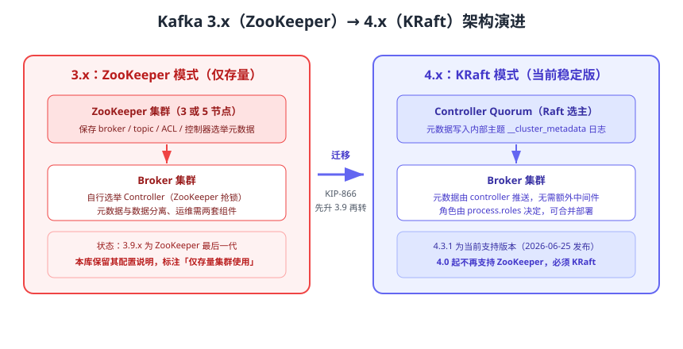

# Kafka 版本演进与迁移

Kafka 的「大版本」意义比其他中间件更重：**4.0 起彻底移除 ZooKeeper，只支持 KRaft 模式**，这是运维模型的代际切换而不是普通补丁升级。本页给出各版本的状态、KRaft 与 ZooKeeper 的差异，以及从 3.x 存量集群迁移到 4.x 的完整路径；旧版本的配置说明在本库中保留，并统一标注为「仅存量集群使用」。



## 版本状态与维护建议

以下状态以 2026-09 的官方下载页与发布说明为准。

| 版本线 | 发布/归档状态 | 元数据模式 | 建议 |
| --- | --- | --- | --- |
| 4.3.1 | 当前支持版本（2026-06-25 发布） | 仅 KRaft | **新项目统一使用**，Docker 镜像 `apache/kafka:4.3.1` |
| 4.2.1 | 支持中（4.2.x 补丁线） | 仅 KRaft | Share Groups 在 4.2 生产可用 |
| 4.1.2 | 支持中（4.1.x 补丁线） | 仅 KRaft | 生命周期内的修复版本 |
| 4.0.x | 已归档 | 仅 KRaft | 首个 KRaft-only 大版本，升级到 4.1+ 更稳 |
| 3.9.x | 已归档 | KRaft 或 ZooKeeper | **ZooKeeper 最后一代**，仅存量集群使用；迁移前先升到 3.9 |
| 3.3.x ~ 3.8.x | 已归档 | KRaft 或 ZooKeeper | 支持从 3.3.x（KRaft 首个生产可用版本）直接升级 |
| ≤ 3.2.x | 已归档 | 仅 ZooKeeper | 需先升级到 3.9.x 再迁移 |

::: info 大版本目录约定
本库对存在大版本差异的主题采用「版本目录 + 状态标注」的策略，例如 Spring 的 `Spring5` / `Spring6`。Kafka 的差异集中在**元数据模式**而不是 API，因此采用**同一页面内标注版本状态 + 独立迁移页**的方式组织：3.x 的 ZooKeeper 配置、脚本参数与注意事项全部保留并标注「仅存量集群使用」，4.x 内容作为当前主线，二者不互相覆盖。
:::

::: tip 一句话理解
MongoDB、MySQL 这类大版本差异在「功能与语法」，Kafka 的大版本差异在「**元数据谁管**」：3.x 由 ZooKeeper 管，4.x 由 Controller Quorum 管。理解了这一点，就能理解为什么 4.0 必须被视为一次运维模型的重建，而不是普通的版本升级。
:::

## ZooKeeper 模式与 KRaft 模式对比

| 维度 | 3.x：ZooKeeper 模式 | 4.x：KRaft 模式 |
| --- | --- | --- |
| 元数据存储 | 外部 ZooKeeper 集群的 znode | 内部 `__cluster_metadata` 主题（Raft 日志） |
| Controller 选举 | Broker 抢占 ZooKeeper 临时节点 | Controller Quorum 通过 Raft 选主 |
| 组件数量 | ZooKeeper + Kafka 两套集群 | 仅 Kafka（Controller 可与 Broker 合并或分离） |
| 元数据规模上限 | 分区数量大时 ZooKeeper 成为瓶颈 | 元数据为日志，支持百万级分区 |
| 故障恢复 | Controller 重启需重新从 ZooKeeper 全量加载 | 增量快照 + 日志重放，恢复更快 |
| 迁移工具 | — | `kafka-metadata-quorum.sh`、KRaft 迁移流程（KIP-866） |
| 4.x 可用性 | **不可用**（4.0 起移除） | 唯一模式 |

### 常见误解

::: danger 易错点
1. 「4.x 还能配 ZooKeeper」：不能。4.0 起 ZooKeeper 模式已移除，`zookeeper.connect` 配置不再被识别。
2. 「3.x 集群可以直接升 4.3」：ZooKeeper 模式的集群必须先迁移到 KRaft（建议先升到 3.9.x），再升级到 4.x。
3. 「KRaft 一定要独立 3 台 Controller」：小规模环境允许 Controller 与 Broker 合并（`process.roles=broker,controller`），但生产建议分离，避免元数据与数据 IO 互相影响。
4. 「迁移只是改配置」：迁移会重放元数据，需要停机窗口或受控的滚动流程，且必须演练回滚方案。
:::

## 元数据版本（metadata.version）与软件版本的区别

KRaft 里有两个容易混淆的概念：

| 概念 | 含义 | 查看/升级方式 |
| --- | --- | --- |
| 软件版本（software version） | 二进制包/镜像的版本，如 4.3.1 | 更换安装包或镜像标签 |
| 元数据版本（metadata.version） | 集群元数据格式版本，如 `4.3-IV0` | `kafka-features.sh describe` / `kafka-features.sh upgrade` |

滚动升级到新二进制后，元数据版本**保持不变**，集群仍以旧格式运行；确认所有组件稳定后，再用 `kafka-features.sh upgrade` 提升元数据版本，从而启用新特性（例如 4.0 的事务协议强化、ELR 等）。

```shell
# 查看集群元数据版本与支持范围
bin/kafka-features.sh --bootstrap-server localhost:9092 describe

# 升级到目标元数据版本（升级前必须完成滚动升级并确认稳定）
bin/kafka-features.sh --bootstrap-server localhost:9092 upgrade --metadata 4.3

# 查看 KRaft 元数据仲裁状态（谁在领导、日志偏移与滞后）
bin/kafka-metadata-quorum.sh --bootstrap-server localhost:9092 describe --status
```

预期输出：`describe` 显示 `metadata.version` 与 `supported` 范围；`metadata-quorum describe --status` 显示 `CurrentVoters`、`LeaderId`、`MaxFollowerLag` 等字段，`MaxFollowerLag` 应稳定在较小值。

## 从 3.x（ZooKeeper）迁移到 4.x（KRaft）

迁移分两段：**ZooKeeper → KRaft（在 3.x 内完成）**，再 **3.x KRaft → 4.x（滚动升级）**。官方明确要求：ZooKeeper 模式的集群必须先迁移到 KRaft，才能升级到 4.x。

### 阶段一：ZooKeeper 迁移到 KRaft（在 3.9.x 上执行）

```shell
# 1. 升级前先升级到 3.9.x（ZooKeeper 模式最后一代），确认集群健康
bin/kafka-topics.sh --bootstrap-server localhost:9092 --describe --under-replicated-partitions

# 2. 准备 Controller Quorum：部署 3 个节点并在 server.properties 中声明
#    process.roles=controller
#    node.id=1 / 2 / 3
#    controller.quorum.voters=1@k1:9093,2@k2:9093,3@k3:9093
#    controller.listener.names=CONTROLLER

# 3. 开启迁移模式（在 Broker 配置中）
#    zookeeper.metadata.migration.enable=true

# 4. 迁移期间同时观察两侧元数据一致性，并在业务低峰执行最终切换
bin/kafka-metadata-quorum.sh --bootstrap-server localhost:9092 describe --status

# 5. 迁移完成后移除 ZooKeeper 依赖配置，改为纯 KRaft 启动
```

::: warning 迁移操作要点
1. 迁移前**必须备份** ZooKeeper 快照与 Kafka 日志目录，并准备可回滚的旧配置。
2. 迁移期间 Controller 与 Broker 都会经历角色切换，务必在业务低峰执行并暂停自动化发布。
3. 迁移完成后确认 `zookeeper.connect` 等参数彻底删除，再进入 4.x 升级流程。
:::

### 阶段二：3.x KRaft → 4.x 滚动升级

| 步骤 | 操作 | 验证方式 |
| --- | --- | --- |
| 1 | 客户端先升级到 2.1+（Java 客户端），Broker 再升级 | 客户端日志无 `UNSUPPORTED_VERSION` 报错 |
| 2 | 逐台替换 Broker 二进制/镜像并重启 | `kafka-topics.sh --describe` 显示副本与 ISR 正常 |
| 3 | Controller 节点逐台重启（先重启 follower） | `kafka-metadata-quorum.sh describe --status` 的 LeaderId 正常切换 |
| 4 | 全部组件升级完成后提升元数据版本 | `kafka-features.sh describe` 的 `metadata.version` 更新 |
| 5 | 观察 1~2 个业务周期，确认 Lag、ISR、请求延迟无异常 | 监控看板无 `UnderReplicatedPartitions` 持续告警 |

::: danger 易错点
1. **先升 Broker 后升客户端**：4.0 对旧客户端有最低版本要求，顺序颠倒会出现协议不兼容。
2. 元数据版本跨级提升：`metadata.version` 只能逐级升级，且升级后不能回退到更低版本。
3. 把单节点合并角色（`--standalone`）用于生产：没有多数派，Controller 一旦重启集群不可用。
4. 升级窗口内继续做分区重分配等管理操作：会与元数据变更叠加，增加故障排查难度。
:::

## 行为变更速查（3.x → 4.x）

| 变更项 | 具体变化 | 影响 |
| --- | --- | --- |
| ZooKeeper | 4.0 起完全移除 | 老脚本、老配置、老监控模板必须清理 |
| Java 版本 | Broker/工具需 Java 17+，客户端与 Streams 需 Java 11+ | CI 镜像与运行环境要同步升级 |
| 生产者默认值 | `linger.ms` 由 `0` 调整为 `5` | 吞吐略升、无人工干预下延迟基本不变 |
| 消费组协议 | KIP-848 新协议在 4.0 GA，升级完成后服务端自动启用 | 可用 `group.protocol` 逐步切换并回退 |
| 事务协议 | KIP-890 强化事务协议，生产者 epoch 每次事务递增 | 事务场景需使用 4.x 客户端 |
| 副本选举 | KIP-966（ELR）让控制器记录「安全可当选」的副本 | 降低不可用副本被选举导致的数据丢失风险 |
| 命令行工具 | `--zookeeper` 系列参数移除，统一使用 `--bootstrap-server` | 运维脚本需要批量替换 |

## 验证方式

1. 执行 `bin/kafka-features.sh --bootstrap-server localhost:9092 describe`，确认 `metadata.version` 与目标版本一致且 `supported` 范围包含当前版本。
2. 执行 `bin/kafka-metadata-quorum.sh --bootstrap-server localhost:9092 describe --status`，确认 `CurrentVoters` 为 3、`LeaderId` 唯一、`MaxFollowerLag` 稳定。
3. 创建 3 副本 Topic 并生产/消费 1000 条消息，用 `kafka-consumer-groups.sh --describe` 确认 `LAG` 回落为 `0`。
4. 重启一个 Broker，确认分区 Leader 正常切换、ISR 恢复、客户端无中断报错。

## 参考资料

- Kafka 4.3 升级说明（含 4.0/4.1/4.2/4.3 全部变更）：https://kafka.apache.org/43/getting-started/upgrade/
- KRaft 模式操作指南：https://kafka.apache.org/43/operations/kraft/
- KRaft 与 ZooKeeper 对比：https://kafka.apache.org/43/getting-started/zk2kraft/
- Kafka 版本下载与支持状态：https://kafka.apache.org/community/downloads/
- KIP-500 / KIP-866（KRaft 与迁移）：https://cwiki.apache.org/confluence/display/KAFKA/KIP-500%3A+Replace+ZooKeeper+with+a+Self-Managed+Metadata+Quorum
