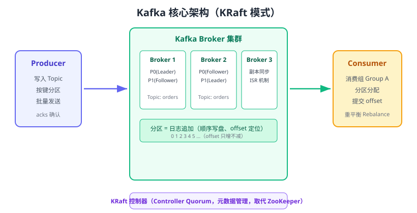

# Kafka 入门

Apache Kafka 是一个**分布式事件流平台**：它把消息以“日志”形式追加到分区中，消费者通过 offset 自行控制读取位置，因此既支持高吞吐消息传递，也支持历史数据回溯。Kafka 适合日志采集、事件驱动、大数据管道等场景；截至 2026 年 8 月，最新稳定版本为 **4.3.x（4.3.1）**，4.0 起已彻底移除 ZooKeeper，全部使用 KRaft 模式管理元数据。



## 核心概念

### Topic 与 Partition

- **Topic（主题）**：消息的逻辑分类，如 `orders`、`user-events`。
- **Partition（分区）**：一个 Topic 被拆成多个分区，每个分区是一个**有序追加的日志文件**；分区是 Kafka 并行和水平扩展的基本单位。
- **Offset（偏移量）**：消息在分区内的单调递增序号，消费者通过它记录“读到哪里”。

::: info 版本说明
Kafka 4.x 全部采用 **KRaft（Kafka Raft）**：由一组专用 Controller 节点通过 Raft 协议维护集群元数据。ZooKeeper 在 4.0 中被移除，不再有回退方案；3.x 存量集群升级前必须先完成 KRaft 迁移。
:::

### Broker、副本与 ISR

| 概念 | 说明 |
| --- | --- |
| Broker | 一台 Kafka 服务器，集群由多个 Broker 组成 |
| 副本（Replica） | 每个分区有多个副本，Leader 负责读写，Follower 同步 |
| ISR | In-Sync Replica，与 Leader 保持同步的副本集合；写入需多数 ISR 确认 |
| 控制器（Controller） | KRaft 模式下由 Controller Quorum 负责选主、分区分配、元数据管理 |

### Producer 与 Consumer

- **Producer（生产者）**：把消息写入指定 Topic 的分区；可以通过 key 保证同一 key 进入同一分区（顺序性）。
- **Consumer（消费者）**：从分区拉取消息；多个消费者组成 **Consumer Group（消费组）**，组内按分区分配分摊消费，组间互相独立（广播）。

::: tip 分区内有序、跨分区无序
Kafka 只保证**同一个分区内**的消息顺序。需要全局有序时，把 Topic 设为单分区（牺牲吞吐），或按业务 key 分区。
:::

### 消费组与重平衡

一个消费组里的消费者数量变化（新增、宕机、主动退出）会触发 **Rebalance（重平衡）**，重新分配分区。重平衡期间消费者可能短暂停顿，并且可能重复消费（消费端需要幂等）。

### Share Groups（共享消费组）

4.2 起 **Share Groups** 达到生产可用，提供“点对点队列”能力：组内成员可以弹性伸缩、逐条确认消息，弥补了 Kafka 传统消费组按分区分配不够灵活的问题。

## 安装与快速启动

推荐用 Docker 单机体验（演示环境）：

```shell [docker-compose.yml]
services:
  kafka:
    image: apache/kafka:4.3.1
    container_name: kafka
    ports:
      - "9092:9092"
    environment:
      KAFKA_NODE_ID: 1
      KAFKA_PROCESS_ROLES: "broker,controller"
      KAFKA_LISTENERS: "PLAINTEXT://:9092,CONTROLLER://:9093"
      KAFKA_ADVERTISED_LISTENERS: "PLAINTEXT://localhost:9092"
      KAFKA_CONTROLLER_LISTENER_NAMES: CONTROLLER
      KAFKA_LISTENER_SECURITY_PROTOCOL_MAP: "CONTROLLER:PLAINTEXT,PLAINTEXT:PLAINTEXT"
      KAFKA_CONTROLLER_QUORUM_VOTERS: "1@kafka:9093"
      KAFKA_OFFSETS_TOPIC_REPLICATION_FACTOR: 1
      KAFKA_TRANSACTION_STATE_LOG_REPLICATION_FACTOR: 1
      KAFKA_GROUP_INITIAL_REBALANCE_DELAY_MS: 0
```

```shell
docker compose up -d
```

::: tip KRaft 单节点说明
单节点同时充当 broker 与 controller 即可运行；生产环境请把 controller 与 broker 拆分，并至少部署 3 个节点（见 [集群部署](../Cluster/index.md)）。
:::

## 基础命令行操作

容器内执行：

```shell
# 进入容器
docker exec -it kafka bash

# 创建 Topic（3 分区，1 副本）
/opt/kafka/bin/kafka-topics.sh --bootstrap-server localhost:9092 --create \
  --topic orders --partitions 3 --replication-factor 1

# 查看 Topic 列表
/opt/kafka/bin/kafka-topics.sh --bootstrap-server localhost:9092 --list

# 控制台生产者
/opt/kafka/bin/kafka-console-producer.sh --bootstrap-server localhost:9092 --topic orders
# 输入内容后回车即可发送，如：1001,paid

# 控制台消费者（从最开始读）
/opt/kafka/bin/kafka-console-consumer.sh --bootstrap-server localhost:9092 \
  --topic orders --from-beginning
```

预期输出：消费者窗口会实时打印生产者输入的消息，证明消息已投递、可消费。

## Java 客户端示例

引入依赖：

```xml [pom.xml]
<dependency>
    <groupId>org.apache.kafka</groupId>
    <artifactId>kafka-clients</artifactId>
    <version>4.3.1</version>
</dependency>
```

### 生产者

```java [KafkaProducerDemo.java]
import org.apache.kafka.clients.producer.*;
import java.util.Properties;

public class KafkaProducerDemo {
    public static void main(String[] args) throws Exception {
        Properties props = new Properties();
        props.put(ProducerConfig.BOOTSTRAP_SERVERS_CONFIG, "localhost:9092");
        props.put(ProducerConfig.KEY_SERIALIZER_CLASS_CONFIG,
                "org.apache.kafka.common.serialization.StringSerializer");
        props.put(ProducerConfig.VALUE_SERIALIZER_CLASS_CONFIG,
                "org.apache.kafka.common.serialization.StringSerializer");
        // 至少一次：等待 Leader 确认
        props.put(ProducerConfig.ACKS_CONFIG, "all");
        props.put(ProducerConfig.RETRIES_CONFIG, 3);

        KafkaProducer<String, String> producer = new KafkaProducer<>(props);
        for (int i = 0; i < 10; i++) {
            // 相同 key 会进入同一分区，保证该 key 的消息有序
            producer.send(new ProducerRecord<>("orders", "order-1001", "paid-" + i));
        }
        producer.flush();
        producer.close();
        System.out.println("发送完成");
    }
}
```

### 消费者

```java [KafkaConsumerDemo.java]
import org.apache.kafka.clients.consumer.*;
import org.apache.kafka.common.serialization.StringDeserializer;
import java.time.Duration;
import java.util.List;
import java.util.Properties;

public class KafkaConsumerDemo {
    public static void main(String[] args) {
        Properties props = new Properties();
        props.put(ConsumerConfig.BOOTSTRAP_SERVERS_CONFIG, "localhost:9092");
        props.put(ConsumerConfig.GROUP_ID_CONFIG, "order-group");
        props.put(ConsumerConfig.KEY_DESERIALIZER_CLASS_CONFIG, StringDeserializer.class);
        props.put(ConsumerConfig.VALUE_DESERIALIZER_CLASS_CONFIG, StringDeserializer.class);
        // 从最早的消息开始消费
        props.put(ConsumerConfig.AUTO_OFFSET_RESET_CONFIG, "earliest");
        // 生产环境建议手动提交 offset
        props.put(ConsumerConfig.ENABLE_AUTO_COMMIT_CONFIG, "false");

        KafkaConsumer<String, String> consumer = new KafkaConsumer<>(props);
        consumer.subscribe(List.of("orders"));
        while (true) {
            ConsumerRecords<String, String> records =
                    consumer.poll(Duration.ofMillis(1000));
            for (ConsumerRecord<String, String> record : records) {
                System.out.printf("key=%s, value=%s, partition=%d, offset=%d%n",
                        record.key(), record.value(),
                        record.partition(), record.offset());
                // 业务处理成功后手动提交
                consumer.commitSync();
            }
        }
    }
}
```

## 常用配置清单

### Producer 关键参数

| 参数 | 默认值 | 说明 |
| --- | --- | --- |
| `acks` | all | `all` 等所有 ISR 确认（不丢）；`0` 最快但可能丢 |
| `retries` | 2147483647 | 发送重试次数 |
| `enable.idempotence` | true | 幂等生产者，避免重试产生重复 |
| `linger.ms` | 0 | 批量发送等待时间，适当调大提升吞吐 |
| `batch.size` | 16384 | 批量大小（字节） |
| `compression.type` | none | 压缩类型（gzip/snappy/lz4/zstd） |

### Consumer 关键参数

| 参数 | 默认值 | 说明 |
| --- | --- | --- |
| `group.id` | 无 | 消费组 ID，必填 |
| `enable.auto.commit` | true | 是否自动提交 offset，生产建议 false |
| `auto.offset.reset` | latest | 无 offset 时从 latest/earliest 开始 |
| `max.poll.records` | 500 | 单次 poll 最大条数 |
| `max.poll.interval.ms` | 300000 | 两次 poll 最大间隔，超时判定死亡并触发重平衡 |

::: danger 易错点
1. `enable.auto.commit=true` 时在业务处理前提交：进程崩溃会丢消息，应改为手动提交。
2. 单条消息处理超过 `max.poll.interval.ms`：消费者被判定死亡，分区被转给别人，产生重复消费。
3. `acks=0` 用于生产：可能直接丢消息。
4. 依赖跨分区全局有序：Kafka 只保证分区内有序。
5. 消费者数量大于分区数：多出的消费者空闲，不提升消费速度。
:::

## 实战：订单事件流

```text
订单服务（Producer）→ orders Topic（3 分区）→ 消费组 order-group
                                              ├─ 库存消费者
                                              ├─ 通知消费者
                                              └─ 数据分析消费者（独立组）
```

1. 创建 Topic：`kafka-topics.sh --create --topic orders --partitions 3 --replication-factor 1`。
2. 启动两个不同组名的消费者，分别订阅 `orders`，验证**组间广播**。
3. 启动同组内两个消费者，验证**组内分摊**（每个消费者只收到部分分区）。
4. 停掉一个消费者，观察剩余消费者通过重平衡接管分区，消息不丢。

## 验证方式

1. `docker compose up -d` 后执行 `docker exec -it kafka bash`，用控制台生产者发送、消费者接收。
2. 运行 Java Producer/Consumer Demo，观察输出中的 partition/offset。
3. 停掉消费者，生产多条消息后重启消费者，用 `--from-beginning` 验证消息持久化未丢。

## 参考资料

- Apache Kafka 官方文档：https://kafka.apache.org/documentation/
- Kafka 4.3 Release Announcement：https://kafka.apache.org/blog/
- KRaft 迁移指南：https://kafka.apache.org/documentation/#kraft
- Confluent Kafka 4.3 博客：https://www.confluent.io/blog/apache-kafka-4-3-release/
