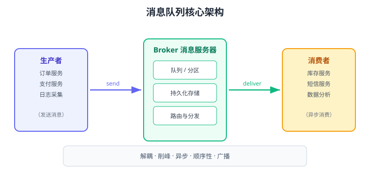

# 消息队列概念与选型

消息队列（Message Queue，MQ）是一种**基于队列的异步通信中间件**：生产者把消息投递给 Broker（消息服务器），Broker 暂存并按规则分发，消费者再从队列中取出消息处理。它解决的是分布式系统里「调用方与被调用方必须同时在线、同步等待」的耦合问题，也是微服务架构中最高频的基础组件之一。

## 消息队列解决了什么问题

### 1. 异步解耦

下单成功后，系统需要同步调用扣库存、发短信、加积分、写日志。同步调用意味着：任何一个下游慢，下单接口就慢；任何一个下游挂掉，下单就失败。引入 MQ 后，下单服务只把「订单创建」事件写入队列就立刻返回，下游各自异步消费，互不影响。

### 2. 流量削峰

秒杀、抢购等场景流量会在瞬间暴涨。直接把请求打到数据库很容易压垮系统；先让请求进入 MQ，消费端按自身处理能力**匀速拉取**，把高峰流量“削平”到后续时间窗口处理。

### 3. 异步化提升响应速度

把耗时的非核心操作（发邮件、生成报表、调用第三方）放到 MQ 里异步执行，主链路响应时间从「串行总和」降为「单次入队时间」，通常从几百毫秒降到几毫秒。

### 4. 广播与数据分发

一份消息可以被多个消费组同时消费（如订单数据同时同步到搜索、数仓、风控），避免“一个业务改接口、所有下游都改”的连锁变更。

## 核心概念

| 概念 | 英文 | 说明 |
| --- | --- | --- |
| 生产者 | Producer / Publisher | 发送消息的一方 |
| 消费者 | Consumer / Subscriber | 接收并处理消息的一方 |
| 消息 | Message | 生产者与消费者之间传递的数据载体，通常包含业务体和属性 |
| Broker | Broker | 消息服务器，负责存储、路由、分发 |
| 队列 | Queue | 先进先出的消息存储结构 |
| 主题 | Topic | 消息的逻辑分类，发布订阅模型中的“频道” |
| 消费组 | Consumer Group | 一组消费者协同消费同一批消息，组内分摊、组间广播 |
| 偏移量 | Offset | 消费者在分区中的读取位置，用于断点续读 |
| 确认 | ACK | 消费者处理成功后通知 Broker 删除/提交该消息 |
| 死信 | Dead Letter | 处理多次仍失败的消息，转入死信队列兜底 |

## 常见产品与定位

| 产品 | 语言 | 核心模型 | 典型场景 |
| --- | --- | --- | --- |
| Apache Kafka | Scala/Java | Topic + Partition，日志追加 | 日志采集、事件流、大数据管道、高吞吐消息 |
| RabbitMQ | Erlang | Exchange + Queue 路由 | 业务消息、灵活路由、任务分发 |
| RocketMQ | Java | Topic + Queue，事务消息 | 电商交易、金融级可靠性 |
| Pulsar | Java | 存算分离、多租户 | 大规模多租户消息与流 |
| Redis Stream | C | 内存数据结构 | 轻量级消息、简单场景替代 |
| Amazon SQS/SNS | - | 云托管队列 | 云上 Serverless 集成 |

::: tip 一句话理解
Kafka 更像“日志流水账”（追求吞吐和回溯），RabbitMQ 更像“邮局”（追求灵活路由和精细控制）；两者都可以做消息队列，但擅长的事不同。
:::

## 选型维度

### 吞吐量

- 需要**每秒几十万条以上**、按 Topic 顺序追加写入的场景，优先 Kafka。
- 每秒几万条以内的业务消息，RabbitMQ、RocketMQ 都足够。

### 路由灵活性

- 需要按消息属性做复杂路由（直连、通配、广播、优先队列、延迟队列），RabbitMQ 的 Exchange 模型最灵活。
- Kafka 只有 Topic 维度，4.2 起提供生产可用的 **Share Groups（共享消费组）** 才补上了点对点队列能力。

### 可靠性

- 金融交易、订单支付等要求严格不丢，需要事务消息、Exactly-Once 能力，优先 RocketMQ 或 Kafka（幂等生产者 + 事务）。
- 一般业务消息「至少一次 + 消费幂等」即可，Kafka/RabbitMQ 都能满足。

### 生态与运维成本

- 已有 Hadoop/Flink/大数据链路，选 Kafka 无缝衔接。
- 团队熟悉 Erlang/AMQP 或需要多语言客户端，选 RabbitMQ。
- 国内电商体系、需要开源可控，选 RocketMQ。

### 简单场景

- 单机、消息量小、不想引入重型中间件：Redis Stream / Redis Pub/Sub 可以做轻量替代，但**没有持久化保障和消息确认机制**，不能当正式 MQ 用（详见 [Redis 发布订阅与事务](../../../DB/NoRelational/Redis/PubSubTransaction/index.md)）。

## 消息模型对比

| 模型 | 说明 | 代表 |
| --- | --- | --- |
| 点对点（Queue） | 一条消息只能被一个消费者消费，消费后删除 | RabbitMQ Queue、Kafka Share Group |
| 发布订阅（Topic） | 一条消息广播给所有订阅的消费组 | Kafka Topic、RabbitMQ fanout |
| 日志追加（Log） | 消息按顺序写入分区，消费者自行管理 offset，可回溯重放 | Kafka |

## 投递语义

消息在「生产 → Broker → 消费」全链路中可能丢失或重复，选型时必须确认支持哪种投递语义：

| 语义 | 英文 | 含义 |
| --- | --- | --- |
| 最多一次 | At-most-once | 可能丢，不会重复 |
| 至少一次 | At-least-once | 不丢，但可能重复 |
| 精确一次 | Exactly-once | 不丢不重，实现成本最高 |

生产实践通常是「至少一次 + 消费端幂等」，详见 [可靠投递](../Reliability/index.md) 与 [消费幂等](../Idempotency/index.md)。

## 选型决策表

| 场景 | 推荐 | 理由 |
| --- | --- | --- |
| 日志采集、埋点、大数据管道 | Kafka | 高吞吐、顺序写、可重放 |
| 电商订单、支付、库存解耦 | RocketMQ / RabbitMQ | 可靠投递、事务消息、灵活路由 |
| 任务分发、通知、延迟消息 | RabbitMQ | Exchange 路由 + 死信/延迟插件成熟 |
| 事件驱动架构（EDA） | Kafka | 事件流天然按时间排序、可回溯 |
| 云上 Serverless 集成 | SQS / SNS | 免运维、弹性伸缩 |
| 轻量内部通知 | Redis Stream | 零新增组件，但可靠性有限 |

## 易错点与最佳实践

::: danger 常见错误
1. **把 Redis Pub/Sub 当生产 MQ**：Pub/Sub 不持久化、不确认，消费者离线消息直接丢。
2. **只看吞吐量选型**：RabbitMQ 处理业务消息足够快，Kafka 的“快”主要在日志场景；业务消息路由复杂时 RabbitMQ 反而更好维护。
3. **忽略消费组语义**：多个消费者不加消费组会各自收到全部消息（广播），加错组则消息被重复/丢失消费。
4. **不评估运维成本**：Kafka 集群依赖 KRaft 控制器、磁盘和网络规划；小团队小流量不要为了“流行”硬上。
5. **默认认为 MQ 万能**：MQ 引入后还有顺序、幂等、积压、监控等一堆问题，能用数据库事务解决的就不要引入。
:::

::: tip 选型建议
先用一张表列出：峰值流量、路由复杂度、可靠性要求、团队熟悉度、运维预算。把「吞吐量」放在第二位，把「可靠性 + 可运维性」放在第一位。
:::

## 验证方式

1. 搭建一个最小 Demo（见 [Kafka 入门](../Kafka/index.md) 或 [RabbitMQ 入门](../RabbitMQ/index.md)），用控制台生产者发、消费者收，确认消息可投递可消费。
2. 手动停掉消费者再发消息，重启消费者后确认消息仍在（验证持久化）。
3. 对比同步调用与异步调用的接口耗时，量化 MQ 带来的响应提升。

## 参考资料

- Apache Kafka 官方文档：https://kafka.apache.org/documentation/
- RabbitMQ 官方文档：https://www.rabbitmq.com/documentation.html
- RocketMQ 官方文档：https://rocketmq.apache.org/
- 消息队列设计精要（阿里中间件）：https://developer.aliyun.com/article/76979
