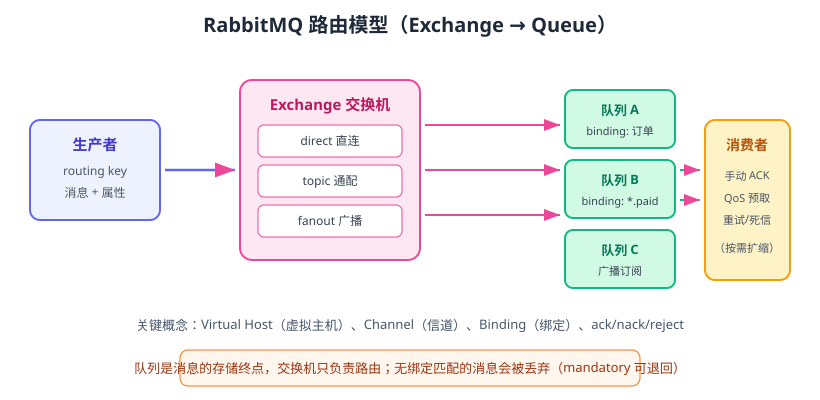

# RabbitMQ 入门

RabbitMQ 是一个基于 **AMQP（Advanced Message Queuing Protocol，高级消息队列协议）** 的开源消息中间件，核心特色是**灵活的 Exchange 路由模型**：消息先进入交换机，交换机按绑定规则把消息路由到不同的队列。它适合业务消息解耦、任务分发、延迟消息、通知等场景。截至 2026 年 8 月，最新稳定系列为 **4.3.x（4.3.5）**，生产环境中 4.2.x（最终补丁 4.2.10）仍大量存在。



## AMQP 核心概念

| 概念 | 说明 |
| --- | --- |
| Virtual Host | 虚拟主机，租户隔离：队列、交换机、绑定都在 vhost 内命名 |
| Exchange | 交换机，接收生产者消息并负责路由，本身不存储消息 |
| Queue | 队列，消息的存储终点，先进先出 |
| Binding | 绑定关系：队列按 binding key 与交换机建立关联 |
| Channel | 信道，客户端与 Broker 之间的轻量连接，可复用、可并发 |
| ACK | 消费者处理完成后的确认，告诉 Broker 可以删除消息 |

## Exchange 类型

| 类型 | 路由规则 | 适用场景 |
| --- | --- | --- |
| `direct` | binding key 与 routing key **完全相等** | 精确路由，如按订单类型分发 |
| `topic` | routing key 按 `.` 分隔，`*` 匹配一段、`#` 匹配多段 | 灵活的通配路由 |
| `fanout` | 忽略 routing key，广播给所有绑定队列 | 广播通知、事件分发 |
| `headers` | 按消息头属性匹配 | 复杂条件路由（很少用） |

## 安装与快速启动

```shell [docker-compose.yml]
services:
  rabbitmq:
    image: rabbitmq:4.3.5-management
    container_name: rabbitmq
    ports:
      - "5672:5672"    # AMQP 端口
      - "15672:15672"  # 管理界面
    environment:
      RABBITMQ_DEFAULT_USER: admin
      RABBITMQ_DEFAULT_PASS: admin123
```

```shell
docker compose up -d
```

启动后访问 http://localhost:15672/，用 `admin / admin123` 登录管理界面，确认 Nodes 页面显示一个运行中的节点。

## 基础概念演示：Exchange + Queue + Binding

通过管理界面或命令行 `rabbitmqadmin` 创建：

```shell
docker exec -it rabbitmq bash

# 创建交换机（direct 类型，持久化）
rabbitmqadmin declare exchange name=order.exchange type=direct durable=true

# 创建队列
rabbitmqadmin declare queue name=order.paid durable=true

# 绑定：队列通过 binding key 与交换机关联
rabbitmqadmin declare binding source=order.exchange destination=order.paid routing_key=paid

# 发送一条测试消息
rabbitmqadmin publish exchange=order.exchange routing_key=paid payload="1001 paid"

# 查看队列中的消息数
rabbitmqadmin list queues name messages
```

::: tip 消息如何到达队列
生产者只把消息发给 Exchange（带上 routing key）；消息能否进入队列，取决于是否存在匹配的 Binding。**没有匹配绑定的消息会被丢弃**（除非设置 `mandatory` 退回或进入死信）。
:::

## Python 客户端示例（pika）

```shell
pip install pika
```

### 生产者

```python [producer.py]
import pika

connection = pika.BlockingConnection(
    pika.ConnectionParameters("localhost", 5672, "/",
                              pika.PlainCredentials("admin", "admin123"))
)
channel = connection.channel()

# 声明交换机与队列（幂等，重复声明不会报错）
channel.exchange_declare(exchange="order.exchange", exchange_type="direct", durable=True)
channel.queue_declare(queue="order.paid", durable=True)
channel.queue_bind(exchange="order.exchange", queue="order.paid", routing_key="paid")

channel.basic_publish(
    exchange="order.exchange",
    routing_key="paid",
    body=b"order 1001 paid",
    properties=pika.BasicProperties(delivery_mode=2),  # 持久化消息
)
print("消息已发送")
connection.close()
```

### 消费者

```python [consumer.py]
import pika

connection = pika.BlockingConnection(
    pika.ConnectionParameters("localhost", 5672, "/",
                              pika.PlainCredentials("admin", "admin123"))
)
channel = connection.channel()
channel.queue_declare(queue="order.paid", durable=True)

def callback(ch, method, properties, body):
    print(f"收到消息: {body.decode()}")
    # 处理成功后再确认
    ch.basic_ack(delivery_tag=method.delivery_tag)

# 预取数量：一次最多取 1 条，处理完才取下一条
channel.basic_qos(prefetch_count=1)
channel.basic_consume(queue="order.paid", on_message_callback=callback)
print("开始消费，Ctrl+C 退出")
channel.start_consuming()
```

先运行 `python consumer.py`，再运行 `python producer.py`，消费者窗口应输出 `收到消息: order 1001 paid`。

## ACK 与消息生命周期

```text
Producer → Exchange → Queue → Consumer（unacked）→ 处理成功 → ack → 消息删除
                              ↓ 处理失败
                      nack/reject（requeue=true 重回队列，否则进死信）
```

| 动作 | 含义 |
| --- | --- |
| `basic_ack` | 处理成功，Broker 删除消息 |
| `basic_nack` / `basic_reject` | 处理失败；`requeue=true` 重回队列头部，`requeue=false` 进死信/丢弃 |
| 连接断开未确认 | 消息回到队列重新投递（可能重复消费，需要幂等） |

::: danger 易错点
1. **默认自动确认**：pika 的 `auto_ack=True` 时，消息投递出去就算确认，进程崩溃会丢消息；业务场景必须手动 ACK。
2. **无限 requeue 死循环**：失败消息反复重回队列会阻塞队列，应该设置重试次数上限或直接进死信队列。
3. **忘记声明队列持久化**：`durable=True` 只保证队列定义不丢，消息持久化还需要 `delivery_mode=2`。
4. **一个连接开大量 Channel 不当**：Channel 建议复用，但每个 Channel 有流量控制，不要无节制创建。
5. **多消费者不设 `prefetch_count`**：默认轮询分发，处理慢的消费者可能积压，建议按能力设置预取。
:::

## 常用命令与配置清单

```shell
# 查看队列积压
rabbitmqadmin list queues name messages consumers
# 查看所有交换机和绑定
rabbitmqadmin list exchanges name type
rabbitmqadmin list bindings source destination routing_key
# 清空队列
rabbitmqadmin purge queue name=order.paid
```

| 配置项 | 说明 |
| --- | --- |
| `durable` | 队列/交换机持久化（重启不丢定义） |
| `delivery_mode=2` | 消息持久化到磁盘 |
| `prefetch_count` | 消费者预取数量，控制本地积压 |
| `x-message-ttl` | 消息过期时间（毫秒） |
| `x-dead-letter-exchange` | 死信交换机，超时/拒绝消息转入 |
| `x-max-length` | 队列最大长度，超限丢弃或进死信 |

## 实战：延迟消息 + 死信

用「死信交换机 + TTL」实现延迟队列（下单 30 分钟后未支付自动关闭）：

```shell
# 1. 死信交换机
rabbitmqadmin declare exchange name=delay.exchange type=direct durable=true
# 2. 业务队列：消息 30 秒后进入死信交换机
rabbitmqadmin declare queue name=order.timeout durable=true \
  arguments='{"x-message-ttl":30000,"x-dead-letter-exchange":"delay.exchange","x-dead-letter-routing-key":"timeout"}'
# 3. 延迟消费队列
rabbitmqadmin declare queue name=order.timeout.delay durable=true
rabbitmqadmin declare binding source=delay.exchange destination=order.timeout.delay routing_key=timeout
```

生产者把消息发到 `order.timeout` 队列，30 秒后消息自动转到 `order.timeout.delay`，专门处理超时的消费者从该队列消费即可。

## 验证方式

1. 管理界面打开 Queues 页面，确认队列、绑定、消息数正确。
2. 运行生产者后查看队列 `messages` 数增长；消费者启动后处理并 ACK，积压归零。
3. 手动停掉消费者再发消息，重启后消息仍在（验证持久化）。
4. 发送一个无绑定匹配的消息，观察被丢弃（可在管理界面 Connections/Channels 中开 trace 验证）。

## 参考资料

- RabbitMQ 官方文档：https://www.rabbitmq.com/documentation.html
- RabbitMQ Release Information：https://www.rabbitmq.com/release-information
- pika 客户端文档：https://pika.readthedocs.io/
- RabbitMQ 死信与延迟队列：https://www.rabbitmq.com/dlx.html
