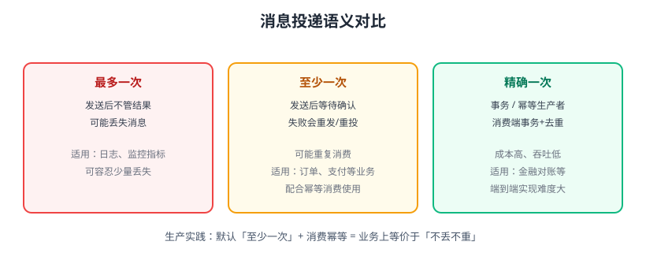

# 可靠投递

消息队列的可靠性指**消息从生产者发出、经 Broker 存储、到消费者成功处理**这一整条链路都不丢失。任何一环偷懒都会丢消息：生产者发了没确认、Broker 只存在内存、消费者先确认后处理……本页给出全链路的可靠性配置与「至少一次」的落地方案。



## 投递语义回顾

| 语义 | 丢消息 | 重复消息 | 实现方式 | 适用 |
| --- | --- | --- | --- | --- |
| 最多一次 | 可能 | 不会 | 发送后不确认、消费端先确认 | 日志、监控指标 |
| 至少一次 | 不会 | 可能 | 生产端确认 + 消费端处理后再 ACK | 大多数业务 |
| 精确一次 | 不会 | 不会 | 幂等生产者/事务 + 消费端事务与去重 | 金融对账等 |

生产实践推荐：**Broker 持久化 + 生产端确认 + 消费端手动 ACK（至少一次）+ 消费幂等**，业务效果上等价于“不丢不重”，成本远低于端到端精确一次。

## 第一环：生产者确认（不丢的第一步）

### Kafka

- `acks=all`：等待分区 Leader 和所有 ISR 副本确认，Leader 挂了也不丢。
- `enable.idempotence=true`：Kafka 3.0 起默认开启，重试不会重复写入。
- 同步等待发送结果：`send()` 返回的 Future 必须处理异常，否则静默失败。

```java
props.put(ProducerConfig.ACKS_CONFIG, "all");
props.put(ProducerConfig.ENABLE_IDEMPOTENCE_CONFIG, true);

RecordMetadata meta = producer.send(new ProducerRecord<>("orders", "1", "paid"))
        .get(5, TimeUnit.SECONDS); // 阻塞等待结果，失败抛异常
```

### RabbitMQ

- 使用 **Publisher Confirms（发布确认）**：开启后 Broker 持久化成功才回 ack，配合 `basic_publish` 的确认回调。

```python
channel.confirm_delivery()
try:
    channel.basic_publish(exchange="order.exchange", routing_key="paid",
                          body=b"1001", properties=pika.BasicProperties(delivery_mode=2))
    print("Broker 已确认")
except pika.exceptions.UnroutableError:
    print("消息未路由，进入失败处理")
```

::: tip 超时与重试
生产端确认超时怎么办？重试发送。配合幂等生产者（Kafka）或全局消息 ID（RabbitMQ），重试也不会造成重复。
:::

## 第二环：Broker 持久化

### Kafka

- 分区副本：`replication.factor`（建议 3），写入要求 `min.insync.replicas`（建议 2）。
- 刷盘策略：`log.flush.interval.messages`、`log.flush.interval.ms` 决定多久刷盘，默认由系统刷盘策略保证基本安全。
- 特别注意：`acks=all` + 副本数 1 时，Broker 宕机依然丢数据；副本数必须 ≥ 2 且 `min.insync.replicas=2` 才稳。

### RabbitMQ

- 队列 `durable=true`：队列定义持久化。
- 消息 `delivery_mode=2`：消息写入磁盘。
- 高可用：镜像队列（经典）或 **Quorum Queue（仲裁队列，4.0 起推荐）**，多数节点写入成功才返回确认。

## 第三环：消费者确认

### Kafka：手动提交 offset

```java
props.put(ConsumerConfig.ENABLE_AUTO_COMMIT_CONFIG, "false");

while (true) {
    ConsumerRecords<String, String> records = consumer.poll(Duration.ofMillis(500));
    for (ConsumerRecord<String, String> record : records) {
        process(record);            // 1. 业务处理
        consumer.commitSync();      // 2. 处理成功才提交 offset
    }
}
```

### RabbitMQ：手动 ACK

```python
def callback(ch, method, properties, body):
    try:
        process(body)               # 1. 业务处理
        ch.basic_ack(delivery_tag=method.delivery_tag)  # 2. 成功才 ack
    except Exception:
        ch.basic_nack(delivery_tag=method.delivery_tag, requeue=False)  # 失败进死信
```

::: danger 最常见的丢消息原因
1. 消费者开启自动确认/自动提交：消息还没处理完就确认了，进程一挂就丢。
2. 先提交 offset / ack，再执行业务：顺序颠倒等于白做。
3. 失败消息无限 requeue：永远处理不了，还阻塞队列；应限次重试后进死信。
4. Kafka `acks=0`、RabbitMQ 不确认：性能换来的是可靠性归零。
5. 业务处理成功但 ACK 失败：消息会被重复投递，需要幂等兜底（见 [消费幂等](../Idempotency/index.md)）。
:::

## 全链路配置模板

| 环节 | Kafka | RabbitMQ |
| --- | --- | --- |
| 生产端 | `acks=all` + 幂等生产者 | Publisher Confirms + `delivery_mode=2` |
| Broker | 副本 ≥ 2，`min.insync.replicas=2` | 持久化队列 + Quorum Queue |
| 消费端 | 手动提交 offset | 手动 ACK + `prefetch_count=1` |
| 失败兜底 | 死信/重试 Topic | 死信队列 + 限次重试 |
| 兜底重复 | 消费幂等 | 消费幂等 |

## 实战：模拟“消费者崩溃不丢消息”

1. 启动一个消费者，**不 ACK**（注释掉 `basic_ack` / `commitSync`）。
2. 生产者发送 5 条消息，观察管理界面消息状态变为 `unacked`。
3. `Ctrl+C` 强杀消费者进程。
4. 再次启动消费者：RabbitMQ 消息重新回到队列投递（`ready` 增加后再次被消费）；Kafka 消费者从上次提交的 offset 之后继续读。
5. 结论：只要处理成功后再确认，崩溃最多造成重复，不会丢失。

## 验证方式

1. RabbitMQ 管理界面观察 `ready` / `unacked` 计数与队列持久化标志。
2. Kafka 用 `kafka-consumer-groups.sh --describe --group order-group` 查看消费组 `CURRENT-OFFSET` 与 `LOG-END-OFFSET`。
3. 杀掉 Broker 再重启（测试环境），确认已确认的消息未丢、未确认的消息可重投。
4. Kafka 事务场景补充验证：以 `isolation.level=read_committed` 消费，确认未提交事务的消息不可见，详见 [Kafka 可靠性与 Exactly-Once](../Kafka/Reliability/index.md)。
5. 跨库一致性场景：用本地消息表把「业务写入」与「待发消息」放进同一事务，再异步投递，方案见 [本地消息表与事务消息](../../Microservices/DistributedTransaction/MessageTable/index.md)。

## 参考资料

- Kafka 生产者配置：https://kafka.apache.org/documentation/#producerconfigs
- Kafka 消费提交（4.3 Javadoc）：https://kafka.apache.org/43/javadoc/org/apache/kafka/clients/consumer/KafkaConsumer.html
- Kafka 可靠性与 Exactly-Once（本库）：[Kafka 可靠性与 Exactly-Once](../Kafka/Reliability/index.md)
- RabbitMQ Publisher Confirms：https://www.rabbitmq.com/confirms.html
- RabbitMQ Quorum Queues：https://www.rabbitmq.com/quorum-queues.html
- RabbitMQ 消费确认：https://www.rabbitmq.com/consumers.html
