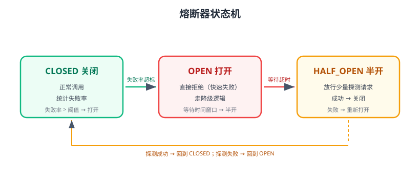

# 熔断限流与降级

微服务调用链上，任何一个下游变慢或故障，都可能通过同步调用**反向传染**：上游请求堆积、线程池耗尽，最终整个系统雪崩。熔断、限流、降级就是三道防线：**不让故障扩散（熔断）、不让流量超载（限流）、故障时给用户可接受的兜底（降级）**。



## 雪崩是怎么发生的

```text
订单服务 → 调用库存服务（RT 从 50ms 涨到 5s）
订单服务的线程被库存拖住 → 线程池耗尽 → 新请求排队超时
网关超时重试 → 请求量放大 → 库存服务彻底被打挂
订单服务的其他接口也因线程耗尽而不可用 → 全站雪崩
```

对策：**超时 + 熔断 + 限流 + 降级 + 异步化**。

## 三大概念

| 概念 | 英文 | 作用 |
| --- | --- | --- |
| 熔断 | Circuit Breaker | 下游故障率超标时快速失败，不再调用 |
| 限流 | Rate Limiting | 控制单位时间请求量，保护自身与下游 |
| 降级 | Fallback / Degradation | 故障时返回兜底结果（缓存、默认值、提示） |

## 熔断器状态机

| 状态 | 行为 |
| --- | --- |
| CLOSED（关闭） | 正常调用，统计失败率/慢调用率 |
| OPEN（打开） | 直接快速失败，走降级；持续一个时间窗口 |
| HALF_OPEN（半开） | 放行少量探测请求；成功则关闭，失败则重新打开 |

## Resilience4j

Resilience4j 是轻量容错库，2.4.x 为当前稳定版（2026-03 发布），支持熔断、限流、隔离、重试、超时五种能力，函数式 API 对 Spring Boot 4 / Spring Cloud 2025.1 友好。

```xml [pom.xml]
<dependency>
    <groupId>io.github.resilience4j</groupId>
    <artifactId>resilience4j-spring-boot3</artifactId>
    <version>2.4.0</version>
</dependency>
```

### 熔断配置

```yaml [application.yml]
resilience4j:
  circuitbreaker:
    instances:
      inventory:
        register-health-indicator: true
        sliding-window-size: 10            # 统计最近 10 次调用
        failure-rate-threshold: 50         # 失败率超 50% 打开熔断
        wait-duration-in-open-state: 10s   # 打开状态持续 10 秒
        permitted-number-of-calls-in-half-open-state: 3  # 半开探测次数
```

### 代码使用

```java
@RestController
public class OrderController {
    @Autowired
    private InventoryClient inventoryClient;

    @GetMapping("/order/inventory/{id}")
    @CircuitBreaker(name = "inventory", fallbackMethod = "inventoryFallback")
    public String getInventory(@PathVariable Long id) {
        return inventoryClient.getInventory(id);
    }

    // 降级方法：参数与返回值需匹配原方法，可追加 Throwable 参数
    public String inventoryFallback(Long id, Throwable t) {
        return "{\"id\":" + id + ",\"stock\":-1,\"msg\":\"库存服务暂不可用\"}";
    }
}
```

### 限流配置

```yaml
resilience4j:
  ratelimiter:
    instances:
      order-api:
        limit-for-period: 100      # 每个周期 100 次
        limit-refresh-period: 1s   # 周期 1 秒
        timeout-duration: 500ms    # 等待令牌超时
```

### 隔离与重试

```yaml
resilience4j:
  bulkhead:
    instances:
      inventory:
        max-concurrent-calls: 20       # 最大并发调用数
        max-wait-duration: 0           # 等待队列
  retry:
    instances:
      inventory:
        max-attempts: 3
        wait-duration: 500ms
        retry-exceptions:
          - org.springframework.web.client.HttpServerErrorException
```

## Sentinel

Sentinel 是阿里开源的流量治理组件，经典版 1.8.x（Spring Cloud Alibaba 2025.1 内置 1.8.9）仍在大量生产环境使用；新一代 Sentinel 2 由 OpenSergo 社区持续演进。相比 Resilience4j，Sentinel 更偏“控制台 + 规则中心”的运维形态。

```xml
<dependency>
    <groupId>com.alibaba.cloud</groupId>
    <artifactId>spring-cloud-starter-alibaba-sentinel</artifactId>
</dependency>
```

```yaml
spring:
  cloud:
    sentinel:
      transport:
        dashboard: localhost:8080   # Sentinel 控制台
```

核心能力：

| 能力 | 说明 |
| --- | --- |
| 流控 | QPS/并发线程数阈值，冷启动、匀速排队 |
| 熔断降级 | 慢调用比例、异常比例、异常数 |
| 热点参数限流 | 按参数值（如商品 ID）限流 |
| 系统保护 | 按 Load、RT、线程数自适应保护 |
| 规则持久化 | 配合 Nacos/文件持久化规则 |

## 网关侧降级

网关是入口，下游熔断时给客户端统一兜底响应：

```yaml
spring:
  cloud:
    gateway:
      routes:
        - id: order-route
          uri: lb://order-service
          predicates:
            - Path=/api/order/**
          filters:
            - name: CircuitBreaker
              args:
                name: orderCB
                fallbackUri: forward:/fallback/order
```

```java
@RestController
public class FallbackController {
    @GetMapping("/fallback/order")
    public String fallback() {
        return "{\"code\":503,\"msg\":\"服务繁忙，请稍后重试\"}";
    }
}
```

## 降级策略清单

| 场景 | 兜底方案 |
| --- | --- |
| 查询类接口 | 返回本地缓存/Redis 缓存的数据 |
| 非核心功能 | 直接返回“功能暂不可用”，不阻塞主流程 |
| 写操作 | 落到本地消息表/MQ，异步补偿（最终一致） |
| 第三方服务 | 返回默认值或上次成功结果 |
| 极端场景 | 限制并发、拒绝部分请求（返回 429/503） |

## 易错点与最佳实践

::: danger 常见错误
1. **不设超时**：没有超时的调用，熔断统计永远不触发，线程被无限拖住。
2. **降级方法签名不匹配**：Resilience4j 找不到 fallback，直接抛异常。
3. **只熔断不降级**：熔断后抛异常给用户，体验比原故障更差。
4. **重试叠加风暴**：网关重试 × 客户端重试 × 下游重试，请求放大几十倍；统一重试预算。
5. **限流阈值拍脑袋**：不压测就设 QPS，要么误杀正常流量，要么形同虚设。
6. **熔断粒度太大**：一个服务的所有接口共用一个熔断器，A 接口故障拖累 B 接口；按接口/依赖细分。
7. **忽略缓存一致性**：降级用缓存数据，要有明确的“数据可能延迟”提示。
:::

::: tip 最佳实践
1. 所有远程调用：**超时 + 熔断 + 降级**三件套，缺一不可。
2. 熔断阈值基于压测数据设定，上线后持续观察误报率。
3. 关键接口降级返回要有标识（如 `degraded: true`），方便排查。
4. 规则与配置放配置中心，支持动态调整，不用重启。
5. 定期故障演练：人为让下游超时，验证熔断、降级、恢复全流程。
:::

## 验证方式

1. 让 inventory-service 接口人为 sleep 5 秒，观察调用方在 `wait-duration-in-open-state` 后熔断打开，快速失败并返回降级 JSON。
2. 恢复下游，观察半开探测成功后熔断器自动关闭。
3. 用压测工具打满限流阈值，确认超额请求返回 429/降级，后端 QPS 被钳制在阈值附近。
4. 在监控面板查看熔断打开次数、降级次数与恢复时间。

## 参考资料

- Resilience4j 文档：https://resilience4j.readme.io/
- Resilience4j GitHub：https://github.com/resilience4j/resilience4j
- Sentinel 文档：https://sentinelguard.io/zh-cn/
- Spring Cloud Gateway 熔断过滤器：https://docs.spring.io/spring-cloud-gateway/reference/spring-cloud-gateway-server-mvc/filter-factories/circuitbreaker.html
- 雪崩与容错设计（阿里云）：https://help.aliyun.com/document_detail/62242.html
