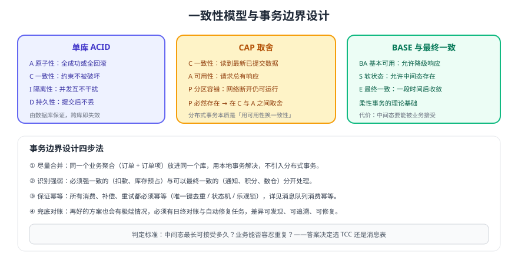

# 一致性基础与事务边界

分布式事务之所以难，难点不在框架 API，而在**一致性语义与事务边界的取舍**：哪些操作必须在同一个事务里，哪些可以最终一致，重复执行会带来什么后果。本页把 ACID、CAP、BASE 讲成可落地的判断标准，并给出幂等、重试、对账三件基础设施的设计方法。



## ACID 在分布式场景下会失去什么

| 特性 | 单库含义 | 跨服务/跨库后 |
| --- | --- | --- |
| 原子性 A | 一组操作全成功或全回滚 | **失效**：两个库的提交无法天然绑定 |
| 一致性 C | 事务前后约束不被破坏 | **部分失效**：跨库的外键与业务约束无人保证 |
| 隔离性 I | 并发事务互不可见中间态 | **失效或弱化**：中间态对其他服务可见 |
| 持久性 D | 提交后掉电不丢 | 单库仍成立，但跨库会出现「一边提交一边失败」 |

::: tip 结论
只要一次业务操作跨了两个独立的事务边界（两个库或两个服务），就**不能再用单库事务的直觉思考**：必须显式设计补偿、重试或对账。
:::

## CAP：P 是前提，真正取舍在 C 与 A

| 选择 | 行为 | 代价 | 适用 |
| --- | --- | --- | --- |
| CP（保一致舍可用） | 分区时拒绝写入，等多数派恢复 | 短暂不可用、请求失败 | 资金、库存扣减等不允许脏数据的操作 |
| AP（保可用舍一致） | 分区时继续写入，事后合并冲突 | 出现短暂不一致，需要补偿 | 通知、积分、日志、推荐等可最终一致的操作 |

实践中的三条经验：

1. **同一条业务链路可以混用**：扣款走 CP，发短信走 AP，不必全链路统一。
2. **分区不常见，但超时很常见**：多数「不一致」不是网络分裂，而是超时导致的「一边成功一边未知」，因此**超时后的补偿与查询比选型更重要**。
3. **不要用 CAP 给偷懒找理由**：「最终一致」的前提是有可靠的补偿与对账，否则只是「永远不一致」。

## BASE：柔性事务的落地表述

| 要素 | 含义 | 落地动作 |
| --- | --- | --- |
| Basically Available 基本可用 | 允许降级响应 | 主链路快速失败/排队，异步链路延后处理 |
| Soft state 软状态 | 允许中间状态存在 | 订单状态机引入「待确认」「退款中」等中间态 |
| Eventually consistent 最终一致 | 一段时间后收敛到一致 | 补偿任务 + 对账任务 + 人工兜底 |

## 刚性事务与柔性事务

| 维度 | 刚性事务（2PC/XA） | 柔性事务（TCC/SAGA/消息表） |
| --- | --- | --- |
| 一致性 | 强一致，提交前不可见 | 最终一致，中间态可见 |
| 锁 | Prepare 后长期持有资源锁 | 尽量不持锁，用业务状态替代 |
| 可用性 | 协调者或参与者故障会阻塞 | 允许局部失败，靠补偿收敛 |
| 峰值性能 | 差（参与者越多越差） | 好（本地事务 + 异步） |
| 业务改造 | 小 | 中到高（要写补偿与幂等） |
| 排查难度 | 中（事务状态集中） | 高（链路长、状态分散） |

## 事务边界怎么划：四步法

1. **先合并，再拆分**：同一个业务聚合（订单 + 订单项、账户 + 流水）放到同一个库，用本地事务解决，这是最便宜的一致性。
2. **区分强一致与最终一致**：逐条问「这一步失败会不会直接造成资损或业务不可用」。会 → 强一致；不会 → 最终一致 + 补偿。
3. **把中间态建模出来**：如「库存已预占待确认」「退款中」，让业务能表达和接受中间态，而不是靠锁隐藏它。
4. **为每一步准备失败出口**：超时怎么办、重试几次、谁负责补偿、何时告警、人工怎么介入。

::: danger 边界设计的三个高频错误
1. 把「通知下游」放进强一致链路：短信、推送失败导致订单事务回滚，完全没有必要。
2. 一个全局事务里塞十几次远程调用：链路越长失败率越高，锁持有时间越长。
3. 中间态没有对外语义：前端拿到 `PROCESSING` 不知道该展示什么，只能轮询。
:::

## 幂等：柔性事务的地基

任何补偿、重试、消息消费都会重复执行，因此**幂等不是可选项**。

| 方案 | 实现 | 适用 |
| --- | --- | --- |
| 唯一键去重表 | `INSERT ... ON DUPLICATE KEY` / 唯一索引冲突即已处理 | 绝大多数场景，首选 |
| 状态机校验 | 只允许 `待支付 → 已支付`，重复请求直接拒绝 | 有明确业务状态的场景 |
| 乐观锁版本号 | `UPDATE ... WHERE version = ?` 判断影响行数 | 更新类操作 |
| Redis SETNX | `SET key NX EX` 去重，注意过期与丢数据风险 | 高频短窗口去重 |

```sql [幂等表设计示例]
CREATE TABLE tx_idempotent (
  id           BIGINT UNSIGNED AUTO_INCREMENT PRIMARY KEY,
  biz_type     VARCHAR(32)  NOT NULL COMMENT '业务类型，如 ORDER_PAID',
  biz_id       VARCHAR(64)  NOT NULL COMMENT '业务唯一键，如订单号',
  status       VARCHAR(16)  NOT NULL DEFAULT 'PROCESSING',
  created_at   DATETIME     NOT NULL DEFAULT CURRENT_TIMESTAMP,
  updated_at   DATETIME     NOT NULL DEFAULT CURRENT_TIMESTAMP ON UPDATE CURRENT_TIMESTAMP,
  UNIQUE KEY uk_biz (biz_type, biz_id)
) ENGINE=InnoDB COMMENT='幂等去重表';
```

完整方案（含 Redis、状态机、Kafka 消费幂等）见 [消息队列消费幂等](../../../MessageQueue/Idempotency/index.md)。

## 重试：既要重试，又不能放大故障

| 要点 | 做法 | 反例 |
| --- | --- | --- |
| 退避 | 指数退避 + 抖动（如 1s、2s、4s + 随机） | 固定 100ms 快速重试，压垮下游 |
| 上限 | 明确最大次数与最大时长，超限转人工或进死信 | 无限重试，日志与线程池被打满 |
| 幂等 | 重试必须携带同一业务 ID | 每次重试生成新请求号，重复扣款 |
| 熔断 | 下游大面积失败时快速失败 | 下游已崩，仍然全量重试 |
| 观测 | 记录重试次数、成功率、耗时分布 | 只在出错时打一行日志 |

## 对账：最后一道防线

::: warning 为什么必须有对账
再完善的补偿逻辑也会遇到极端情况（磁盘损坏、消息过期被清理、人工误操作）。对账是**唯一能主动发现历史脏数据**的手段，缺了它，问题只会在业务投诉时暴露。
:::

对账任务的最小实现：

1. **选基准**：一般以「资金/订单主表」为基准，其他表与之核对。
2. **定频率**：日终全量对账 + 关键单据准实时对账（如每 5 分钟核对近 1 小时单据）。
3. **比什么**：笔数、金额、状态、时间戳；既要比总量，也要能定位到具体单据。
4. **差异处理**：写入差异表 → 自动修复可修复项 → 无法自动修复的进入人工工单。
5. **闭环验证**：修复后重新对账，确认差异清零并记录处理人。

```sql [差异表设计示例]
CREATE TABLE tx_difference (
  id            BIGINT UNSIGNED AUTO_INCREMENT PRIMARY KEY,
  biz_id        VARCHAR(64)  NOT NULL COMMENT '业务单据号',
  diff_type     VARCHAR(32)  NOT NULL COMMENT 'MISSING/AMOUNT_MISMATCH/STATUS_MISMATCH',
  expect_value  VARCHAR(128) NOT NULL,
  actual_value  VARCHAR(128) NOT NULL,
  fixed         TINYINT      NOT NULL DEFAULT 0,
  created_at    DATETIME     NOT NULL DEFAULT CURRENT_TIMESTAMP,
  UNIQUE KEY uk_biz_type (biz_id, diff_type)
) ENGINE=InnoDB COMMENT='对账差异表';
```

## 验证方式

1. 针对核心链路，逐条写出「每一步失败时的中间态与补偿动作」，与代码实现对照，确认没有遗漏分支。
2. 用同一业务 ID 重复调用补偿接口与消费逻辑 10 次，确认数据只变化一次（幂等生效）。
3. 制造下游超时（如 `tc qdisc` 或代理延迟），确认重试有退避、有上限、有告警。
4. 人为删除一笔下游数据，运行对账任务，确认差异能被发现并正确修复。

## 参考资料

- SAGA 模式与最终一致（microservices.io）：https://microservices.io/patterns/data/saga.html
- CAP 定理与 BASE（Martin Fowler）：https://martinfowler.com/articles/patterns-of-distributed-systems/two-phase-commit.html
- MySQL 事务与隔离级别（本库）：[MySQL 事务](../../../../DB/Relational/MySQL/Transaction/index.md)
- 幂等方案汇总（本库）：[消费幂等](../../../MessageQueue/Idempotency/index.md)
- 消息投递语义（本库）：[可靠投递](../../../MessageQueue/Reliability/index.md)
