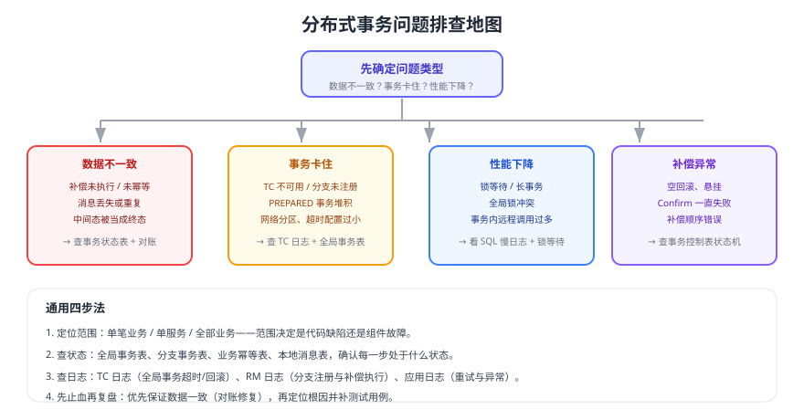

# 常见问题与最佳实践

分布式事务的线上问题大多不是「框架不会用」，而是**中间态没设计好、补偿不幂等、缺少对账**。本页按现象组织 14 个高频问题，每个都给出定位思路与处理方案，并汇总最佳实践清单。



## 通用排查顺序

1. **定位范围**：单笔业务不一致 / 单个服务异常 / 全部业务受影响——范围决定是代码缺陷还是组件故障。
2. **查状态**：全局事务表、分支事务表、业务幂等表、本地消息表，确认每一步处于什么状态。
3. **查日志**：TC 日志（全局事务超时、回滚）、RM 日志（分支注册、补偿执行）、应用日志（重试与异常）。
4. **先止血再复盘**：优先用对账修复数据，再定位根因并补测试用例。

## 1. 出现数据不一致，先看哪里

按「时间 + 业务 ID」把链路拼出来：先用订单号查订单库状态，再用 `xid` 查分支事务表与 TC 日志，最后看下游是否消费过该事件。**先确认是哪一步没完成，再谈修复**，避免上来就手工改数据。

```sql
-- 1. 业务单据当前状态
SELECT order_no, status, amount, updated_at FROM orders WHERE order_no = '1001';

-- 2. 该单据对应的分支事务状态
SELECT xid, branch_id, status, amount FROM tcc_branch_transaction WHERE biz_key = '1001';

-- 3. 是否已投递下游事件
SELECT biz_id, status, retry_count, next_retry_at FROM msg_outbox WHERE biz_id = '1001';
```

## 2. 补偿（Cancel）失败了怎么办

补偿**不允许放弃**，必须重试到成功：

1. 区分可重试（网络超时、下游不可用）与不可重试（状态冲突、数据已变更）异常。
2. 可重试：指数退避重试，超过阈值告警。
3. 不可重试：写入人工处理队列，由人工判断是「改为 Confirm」还是「手工修正数据」。
4. 无论哪种，都要保留完整日志（`xid`、分支、参数、失败原因），否则事后无法复盘。

## 3. TCC 的 Confirm 一直失败

常见原因与处理：

| 原因 | 现象 | 处理 |
| --- | --- | --- |
| Confirm 里做了业务校验 | 余额/库存条件不满足导致失败 | 业务校验必须放在 Try，Confirm 只做状态转换 |
| 并发修改同一行导致死锁 | 数据库死锁异常 | 缩短事务、固定加锁顺序、降并发 |
| 分支状态与业务数据不一致 | 状态为 `CONFIRMED` 但数据未变 | 用对账任务修复，并排查是否漏了幂等保护 |
| TC 重试风暴 | 同一分支被高频重试 | 加退避与限流，避免压垮下游 |

## 4. 空回滚与悬挂怎么验证

两者都必须有**专项测试用例**，不能只靠代码评审：

1. 空回滚：直接调用 Cancel（跳过 Try），断言返回成功且控制表留下 `CANCELLED` 记录。
2. 悬挂：先执行 Cancel，再执行 Try，断言 Try 被拒绝且库存/余额没有变化。
3. 回归：把这两个用例纳入 CI，任何改动 TCC 逻辑的提交都要跑。

## 5. 全局锁冲突（Seata AT）怎么优化

1. 缩小事务范围：把非必要的远程调用、批量循环移出全局事务。
2. 按业务维度错峰：热点商品可用「库存分桶」或排队削峰（见 [微服务熔断限流与降级](../../CircuitBreaker/index.md)）。
3. 降低隔离要求：确认业务能否接受 AT 的默认隔离级别，避免滥用 `@GlobalLock`。
4. 缩短超时：合理设置 `timeoutMills`，让失败事务尽快回滚释放锁。

## 6. 全局事务超时时间怎么设

| 参考因素 | 建议 |
| --- | --- |
| 正常链路 P99 耗时 | 超时时间至少为 P99 的 2~3 倍 |
| 下游数量 | 每多一个参与方，超时时间适当上调 |
| 锁竞争程度 | 竞争激烈时超时不宜过大，避免长时间持锁 |
| 业务可接受性 | 用户可等待多长？超过就应先返回「处理中」再异步确认 |

::: warning 超时不是失败
全局事务超时后 TC 会尝试回滚，但**回滚本身也可能失败**。因此超时必须配合补偿与对账，不能假设「超时 = 已回滚」。
:::

## 7. Seata Server（TC）挂掉会怎样

1. 已开启的全局事务：客户端无法上报分支状态，事务会超时并由 TC 恢复后继续处理。
2. 新事务：无法开启，业务应快速失败（配置合理的连接与超时时间），不要无限阻塞。
3. 预防措施：TC 集群部署 + 事务会话存储使用数据库或 Raft 模式 + 监控 TC 节点存活与事务堆积。

## 8. XA 的 PREPARED 事务堆积怎么处理

`XA RECOVER` 可以列出处于 PREPARED 状态的事务，处理原则：

1. 先确认这笔全局事务的最终决议（提交还是回滚），**不能凭猜测操作**。
2. 与业务方核对单据状态，确认数据影响范围。
3. 由 DBA 执行 `XA COMMIT` 或 `XA ROLLBACK`，并记录操作人与原因。
4. 补齐监控：PREPARED 事务数量与最长停留时间必须告警。

另外注意：MySQL 的 XA 事务**仅支持 InnoDB**，且**不支持**与复制过滤器/二进制日志过滤器混用，具体限制见 [2PC 与 XA](../TwoPhaseCommit/index.md)。

## 9. 消息重复导致重复处理

1. 消费端必须有幂等：唯一键去重表、状态机、乐观锁任选其一，方案见 [消费幂等](../../../MessageQueue/Idempotency/index.md)。
2. 幂等键要包含「业务 ID + 事件类型」，避免不同事件互相覆盖。
3. 处理顺序：先写幂等记录（或与业务同事务写入），再执行业务；不要在业务成功后才写幂等键。

## 10. 本地消息表积压、投递变慢

| 现象 | 原因 | 处理 |
| --- | --- | --- |
| `PENDING` 持续增长 | 投递线程数不足 / MQ 不可用 | 增加投递并发、检查 MQ 健康度 |
| 最老 PENDING 停留很久 | 部分消息一直失败 | 查看 `retry_count` 与失败原因，必要时转人工 |
| 扫描变慢 | 历史数据太多 | 归档 `SENT` 记录、优化索引（`status + next_retry_at`） |
| 同一条消息被多实例重复发送 | 未做抢占控制 | 使用 `SELECT ... FOR UPDATE SKIP LOCKED` |

## 11. 事务消息回查一直返回 UNKNOW

说明回查接口无法判断本地事务真实状态。常见原因是**没有本地事务表**，仅靠业务表推断。正确做法：

1. 本地事务执行前先写入「事务记录表」，状态为 `PROCESSING`。
2. 本地事务成功后更新为 `COMMITTED`，失败更新为 `ROLLED_BACK`。
3. 回查时读该表：`COMMITTED → Commit`，`ROLLED_BACK → Rollback`，其余情况先返回 `UNKNOW`，并设置最大回查次数后的兜底策略（通常默认回滚并告警）。

## 12. 性能太差，该怎么优化

按代价从低到高：

1. **减少全局事务范围**：把通知、积分、统计移出全局事务，改用消息表。
2. **减少参与方数量**：能合并的服务合并，能本地事务的不要拆。
3. **降低隔离要求**：从 XA 换 TCC 或 AT，避免长期持锁。
4. **热点削峰**：库存分桶、异步排队、令牌桶限流。
5. **优化数据库**：索引、批量提交、避免长事务（见 [SQL 优化](../../../../DB/Relational/SQLOptimization/index.md)）。

## 13. 到底要不要做分布式事务

按顺序自问：

1. 能否把这些操作收敛到同一个库、用本地事务解决？
2. 中间态业务能否接受（例如「库存预占中」）？
3. 失败后能否靠重试或补偿恢复？
4. 有没有能力维护补偿逻辑与对账任务？

四个问题的答案决定了选强一致（XA/TCC）还是最终一致（SAGA/消息表），也决定了是否值得引入框架。相关判断标准见 [一致性基础与事务边界](../Consistency/index.md)。

## 14. 面试高频问题速答

| 问题 | 回答要点 |
| --- | --- |
| 2PC 有什么缺点 | 同步阻塞、协调者单点、参与者故障长期 PREPARED、超时语义模糊 |
| TCC 与 2PC 的差别 | 锁的粒度与位置不同：2PC 锁数据库资源，TCC 用业务预占，无长事务锁 |
| TCC 三大坑 | 空回滚、悬挂、幂等，配套事务控制表与状态机解决 |
| SAGA 的补偿要点 | 只补偿已提交的子事务、反向顺序、幂等可重入、补偿不能失败 |
| 本地消息表为什么可靠 | 业务与消息同库同事务，投递至少一次 + 消费幂等 |
| RocketMQ 事务消息原理 | 半消息 + 本地事务 + Commit/Rollback + 回查 |
| 如何保证最终一致 | 幂等 + 重试 + 对账三件套，缺一不可 |

## 最佳实践清单

::: tip 设计阶段
1. 先合并业务聚合，能不分布式就不分布式；强一致与最终一致分开设计。
2. 每个中间态都要有明确的业务语义与超时处理策略。
3. 幂等键、补偿接口、对账任务在方案评审时就确定，而不是上线后补。
:::

::: tip 编码阶段
1. 事务内不做远程调用与耗时操作；性能敏感链路用消息表解耦。
2. 补偿与消费逻辑必须幂等、可重入、有重试上限与告警。
3. 所有跨服务调用都要有超时、重试与熔断配置。
4. 关键日志要带 `xid` / 订单号，便于串联排查。
:::

::: tip 上线与运维
1. 上线前跑通四类演练：正常链路、失败回滚、超时、TC（或 MQ）不可用。
2. 监控全局事务成功率、耗时、未结束事务数、消息积压与对账差异。
3. 保留可回滚版本与人工处置手册；差异数据必须能追溯到具体单据。
:::

## 验证方式

1. 按「通用排查顺序」实际操作一次：用订单号串起订单、分支事务、消息表三条记录。
2. 制造一次补偿失败，确认告警触发且人工处理队列有记录。
3. 用空回滚与悬挂用例验证 TCC 代码，确认断言全部通过。
4. 对本地消息表制造积压，确认监控能发现最老 PENDING 停留时间并触发告警。

## 参考资料

- Seata 官方 FAQ 与术语：https://seata.apache.org/docs/overview/faq/
- Seata 事务模式文档：https://seata.apache.org/docs/user/mode/at/
- RocketMQ 事务消息：https://rocketmq.apache.org/docs/featureBehavior/04transactionmessage
- microservices.io 数据一致性模式：https://microservices.io/patterns/data/saga.html
- 本库微服务常见问题：[微服务常见问题与最佳实践](../../FAQ/index.md)
