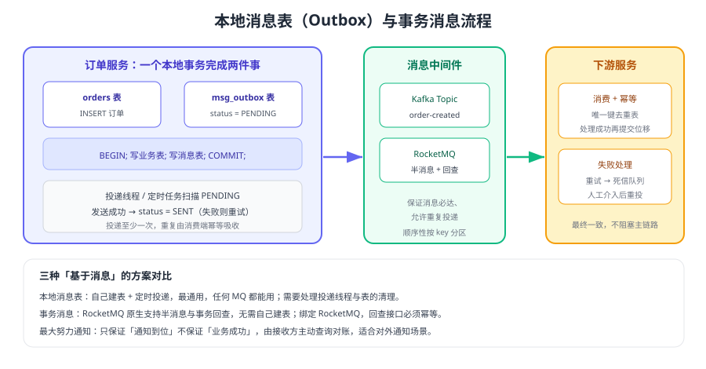

# 本地消息表与事务消息

「本地消息表」是工程里性价比最高的分布式事务方案：**把业务数据和待发送的消息放进同一个本地事务**，再异步把消息投递到 MQ。它不依赖任何事务框架，几乎适用所有 MQ，缺点是投递是「至少一次」，下游必须幂等。



## 核心思路

```text
一个数据库事务里：
  1. INSERT 业务数据（订单）
  2. INSERT 待发送消息（status = PENDING）
  COMMIT
另一个线程/任务：
  3. 扫描 PENDING 消息 → 发送到 MQ(MQ) → 更新为 SENT
下游服务：
  4. 消费消息 → 幂等处理 → 提交位移/ACK
```

关键点：**消息与业务在同一事务里**，因此不存在「业务成功但消息没落库」；投递环节允许重复，由消费端幂等吸收。

::: tip 一句话理解
它用「本地事务的原子性」换掉了「分布式事务的一致性」，把跨服务的问题降级成「消息至少一次 + 消费幂等」这个已知可解的问题。
:::

## 本地消息表设计

```sql [msg_outbox]
CREATE TABLE msg_outbox (
  id            BIGINT UNSIGNED AUTO_INCREMENT PRIMARY KEY,
  biz_type      VARCHAR(32)  NOT NULL COMMENT '业务类型，如 ORDER_CREATED',
  biz_id        VARCHAR(64)  NOT NULL COMMENT '业务唯一键，用于幂等与排查',
  msg_key       VARCHAR(64)  NOT NULL COMMENT '分区键，如订单号',
  topic         VARCHAR(64)  NOT NULL COMMENT '目标 Topic / Exchange',
  payload       TEXT         NOT NULL COMMENT '消息体（JSON）',
  status        VARCHAR(16)  NOT NULL DEFAULT 'PENDING' COMMENT 'PENDING/SENT/FAILED',
  retry_count   INT          NOT NULL DEFAULT 0,
  next_retry_at DATETIME     NULL COMMENT '退避重试时间',
  created_at    DATETIME     NOT NULL DEFAULT CURRENT_TIMESTAMP,
  updated_at    DATETIME     NOT NULL DEFAULT CURRENT_TIMESTAMP ON UPDATE CURRENT_TIMESTAMP,
  UNIQUE KEY uk_biz (biz_type, biz_id),
  KEY idx_status_retry (status, next_retry_at)
) ENGINE=InnoDB COMMENT='本地消息表';
```

### 业务写入

```java [OrderService.java]
@Service
public class OrderService {

    @Transactional(rollbackFor = Exception.class)
    public void createOrder(OrderDTO dto) {
        orderMapper.insert(dto);                     // 业务数据
        outboxMapper.insert(Outbox.of(               // 待发送消息
                "ORDER_CREATED", dto.getOrderNo(), dto.getOrderNo(),
                "order-created", dto.toJson()));
        // 两个 INSERT 在同一事务中，要么都成功，要么都回滚
    }
}
```

### 投递任务

```java [OutboxSender.java]
@Component
public class OutboxSender {

    /** 定时扫描待发送消息；投递采用「先发送后更新状态」，失败进入退避重试 */
    @Scheduled(fixedDelay = 1000)
    public void flush() {
        for (Outbox msg : outboxMapper.lockPending(200)) {   // SELECT ... FOR UPDATE SKIP LOCKED
            try {
                producer.send(new ProducerRecord<>(msg.getTopic(), msg.getMsgKey(), msg.getPayload()))
                        .get(5, TimeUnit.SECONDS);           // 确认 Broker 已接收
                outboxMapper.markSent(msg.getId());
            } catch (Exception ex) {
                outboxMapper.markFailed(msg.getId(), ex.getMessage());   // retry_count + 1 + 退避
            }
        }
    }
}
```

| 设计点 | 建议做法 |
| --- | --- |
| 并发投递 | 多实例部署时用 `SELECT ... FOR UPDATE SKIP LOCKED` 抢占，避免同一条消息被多实例同时发送 |
| 重试策略 | 指数退避（1s、2s、4s…）+ 最大次数，超限置为 `FAILED` 并告警 |
| 消息顺序 | 同一业务单据使用同一 `msg_key`，保证进入同一分区有序 |
| 历史清理 | 定期归档或删除 `SENT` 且超过保留期的记录（如 7 天），避免表无限膨胀 |
| 监控 | 监控 `PENDING` 数量、最老 PENDING 的停留时长、`FAILED` 数量 |

::: danger 本地消息表最常见的三个坑
1. **消息表和业务表不在同一事务**：跨事务写入等于回到最初的问题。
2. **投递线程只发不记录**：Broker 已收到但状态没更新，重启后重复发送（要靠幂等兜底，但也应尽快更新状态）。
3. **表无限增长**：没有归档策略，几个月后扫描变慢、锁竞争加剧。
:::

## 事务消息（RocketMQ）

RocketMQ 把「半消息 + 本地事务 + 回查」做进了消息中间件，因此不需要自己建消息表：

| 步骤 | 动作 |
| --- | --- |
| 1 | 生产者发送**半消息（half message）**到 Broker，此时消息对消费者不可见 |
| 2 | Broker 确认收到半消息后返回 ACK |
| 3 | 生产者执行本地事务（写订单库） |
| 4 | 生产者根据本地事务结果向 Broker 发送 Commit 或 Rollback |
| 5 | Commit → 消息对消费者可见并投递；Rollback → 丢弃半消息 |
| 6 | 若 Broker 长时间未收到结果（网络断开、生产者重启），会**回查**生产者本地事务状态 |

```java [RocketMqTransactionProducer.java]
public class RocketMqTransactionProducer {
    public static void main(String[] args) throws Exception {
        TransactionMQProducer producer = new TransactionMQProducer("order-producer-group");
        producer.setNamesrvAddr("localhost:9876");
        // 回查：Broker 长时间未收到结果时调用，必须根据本地事务表返回真实状态
        producer.setTransactionListener(new TransactionListener() {
            @Override
            public LocalTransactionState executeLocalTransaction(Message msg, Object arg) {
                try {
                    orderService.createOrder(parse(msg));       // 本地事务
                    return LocalTransactionState.COMMIT_MESSAGE;
                } catch (Exception e) {
                    return LocalTransactionState.ROLLBACK_MESSAGE;
                }
            }

            @Override
            public LocalTransactionState checkLocalTransaction(MessageExt msg) {
                // 查本地事务表：已成功 → COMMIT，已失败 → ROLLBACK，仍未知 → UNKNOW（等待下次回查）
                OrderStatus status = orderService.queryStatus(keyOf(msg));
                if (status == OrderStatus.CREATED) {
                    return LocalTransactionState.COMMIT_MESSAGE;
                }
                if (status == OrderStatus.FAILED) {
                    return LocalTransactionState.ROLLBACK_MESSAGE;
                }
                return LocalTransactionState.UNKNOW;
            }
        });
        producer.start();
        producer.sendMessageInTransaction(new Message("order-created",
                orderNo.getBytes(StandardCharsets.UTF_8)), null);
    }
}
```

::: warning 事务消息不等于「万事大吉」
1. 事务消息保证的是「本地事务与消息投递的最终一致」，**不保证消费成功**，下游仍需幂等与重试。
2. 回查接口必须能读到真实事务状态（通常需要一张本地事务表），不能「查不到就当成功」。
3. 事务消息有一定发送限制（回查次数、半消息保留时间），具体以所用版本官方文档为准。
:::

## 最大努力通知

面向**外部系统**（银行回调、第三方平台）时，对方通常不参与我方事务，只能用「最大努力通知」：

1. 本地事务提交后，通过 MQ 或定时任务反复通知对方（退避 + 上限）。
2. 通知内容包含业务单据号与可查询接口地址。
3. **以对方主动查询为准**：我方提供幂等的查询接口，对方按单据号核对自己的数据。
4. 长期未确认的通知进入人工处理队列。

::: tip 判断标准
「对方是否会主动来查」是最大努力通知与可靠投递的分水岭：对方会主动查询 → 用最大努力通知；对方只被动接收 → 必须在对方也建本地消息表或幂等表。
:::

## 三种方案的对比

| 方案 | 依赖 | 实现成本 | 一致性 | 适用场景 |
| --- | --- | --- | --- | --- |
| 本地消息表 | 任意 MQ + 一张表 | 低 | 最终一致 | 通用，首选 |
| 事务消息 | RocketMQ | 低（框架内置） | 最终一致 | 已使用 RocketMQ，且不想维护消息表 |
| 最大努力通知 | 任意 MQ / 定时任务 | 低 | 弱（依赖对方查询） | 对外部系统通知 |

### 进阶：用 CDC 代替轮询

轮询扫描消息表实现简单，但存在延迟（取决于定时间隔）与额外查询压力。数据量很大时，可以用 **CDC（Change Data Capture，如 Debezium）订阅业务库的 binlog**，把消息表的插入直接转成 MQ 消息：

| 方式 | 延迟 | 数据库压力 | 复杂度 |
| --- | --- | --- | --- |
| 定时轮询 | 秒级 | 持续查询 + 锁竞争 | 低 |
| CDC 订阅 binlog | 毫秒~秒级 | 低（读 binlog） | 中（需维护 CDC 组件） |

## 验证方式

1. 在业务写入后立即查询消息表，确认业务数据与 `PENDING` 消息同时存在（验证同事务）。
2. 停掉 MQ，再写入业务数据，确认消息保持 `PENDING` 且不丢失；恢复 MQ 后确认自动补发。
3. 让投递成功后不更新状态（模拟崩溃），确认重启后重复发送，而下游幂等表拦住重复处理。
4. 对 RocketMQ 事务消息，人为在发送 Commit 前杀掉生产者，确认 Broker 回查后消息状态正确（提交或丢弃）。
5. 压测 10 万条消息后检查 `PENDING` 数量与最老记录停留时间，确认投递吞吐满足业务要求。

## 参考资料

- RocketMQ 事务消息：https://rocketmq.apache.org/docs/featureBehavior/04transactionmessage
- Debezium Outbox 模式：https://debezium.io/documentation/reference/stable/transformations/outbox-event-router.html
- microservices.io 事务性发件箱：https://microservices.io/patterns/data/transactional-outbox.html
- 本库消息可靠投递：[可靠投递](../../../MessageQueue/Reliability/index.md)
- 本库消费幂等：[消费幂等](../../../MessageQueue/Idempotency/index.md)
