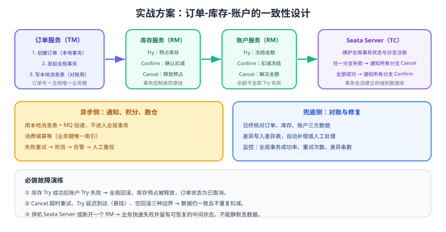

# 实战：订单-库存-账户一致性

前面几页分别讲了 2PC、TCC、SAGA 与消息类方案，本页把它们组合成一条**可运行、可演练**的下单链路：强一致部分用 TCC 预占资源，异步部分用本地消息表投递，最后用对账任务兜底。目标不是「上一个框架」，而是让每一步失败时都知道数据会变成什么样。



## 需求与设计目标

| 需求 | 方案 | 说明 |
| --- | --- | --- |
| 下单必须同时占住库存与余额 | TCC（Try 预占 + Confirm 确认 + Cancel 释放） | 不能出现「订单成功但库存没扣」 |
| 余额不足要迅速失败并释放库存 | 全局事务回滚 | 库存 Try 成功后账户 Try 失败 → 触发全局 Cancel |
| 通知、积分、数仓不能拖慢主链路 | 本地消息表 + MQ | 主链路只写消息表，异步投递 |
| 任何异常都不能造成资损 | 幂等表 + 对账任务 | 允许中间态，不允许不一致长期存在 |
| 出问题能快速定位 | 业务 ID 贯穿全链路 + 状态机 | 一个订单号能查完整流程 |

::: tip 一句话理解
这条链路的核心不是「用了 TCC」，而是**把强一致压到最小范围**：只有「占库存 + 占余额」进入全局事务，通知、积分、数仓全部走异步消息表，出问题由对账任务兜底。
:::

## 数据模型

| 表 | 所在库 | 关键字段 | 用途 |
| --- | --- | --- | --- |
| `orders` | 订单库 | `order_no`（唯一）、`status`、`amount` | 订单主表 |
| `stock` | 库存库 | `sku`、`available`、`frozen` | 可用库存与预占库存 |
| `tcc_branch_transaction` | 库存库/账户库 | `xid`、`branch_id`（唯一）、`status` | TCC 分支状态机 |
| `account` | 账户库 | `account_id`、`available`、`frozen` | 可用余额与冻结余额 |
| `msg_outbox` | 订单库 | `biz_id`（唯一）、`status` | 本地消息表 |
| `tx_difference` | 对账库 | `biz_id`、`diff_type` | 对账差异表 |

```sql [库存表与账户表的预占字段]
-- 库存：可用与预占分开，Try 只动这两列
ALTER TABLE stock
  ADD COLUMN available INT NOT NULL DEFAULT 0 COMMENT '可用库存',
  ADD COLUMN frozen    INT NOT NULL DEFAULT 0 COMMENT '预占库存';

-- 账户：同理
ALTER TABLE account
  ADD COLUMN available BIGINT NOT NULL DEFAULT 0 COMMENT '可用余额',
  ADD COLUMN frozen    BIGINT NOT NULL DEFAULT 0 COMMENT '冻结余额';

-- 校验：预占不会凭空产生
-- SELECT sku, available, frozen FROM stock WHERE available < 0 OR frozen < 0;
```

## 订单服务：全局事务发起方

```java [OrderService.java]
@Service
public class OrderService {

    /** 全局事务：创建订单 → 预占库存 → 冻结余额，任一失败整体回滚 */
    @GlobalTransactional(name = "create-order", timeoutMills = 30000, rollbackFor = Exception.class)
    public String createOrder(OrderDTO dto) {
        String orderNo = idGenerator.next();
        dto.setOrderNo(orderNo);

        orderMapper.insert(buildOrder(dto));                       // 本地事务
        inventoryTccAction.tryDeduct(null, dto.getSku(), dto.getQty());   // TCC Try
        accountTccAction.tryFreeze(null, dto.getAccountId(), dto.getAmount()); // TCC Try
        orderMapper.updateStatus(orderNo, "PAID");

        // 主链路成功后，仅写本地消息表，异步通知下游（不进入全局事务）
        outboxMapper.insert(Outbox.of("ORDER_PAID", orderNo, orderNo,
                "order-paid", buildEvent(orderNo, dto)));
        return orderNo;
    }
}
```

::: danger 注释里最常见的两个错误
1. **把发消息写进全局事务**：MQ 不是 XA 资源，一旦全局回滚，消息可能已经发出，下游就会处理一张不存在的订单。
2. **在全局事务里做同步 HTTP 调用（通知、推送）**：网络耗时直接拉长全局事务与锁持有时间，失败率显著上升。
:::

## 库存服务：TCC 分支

库存与账户的实现骨架与 [TCC](../TCC/index.md) 页给出的 `InventoryTccService` 一致，这里只强调三处与实战强相关的细节：

```java [InventoryTccAction.java]
@LocalTCC
public interface InventoryTccAction {

    @TwoPhaseBusinessAction(name = "inventoryTccAction",
            commitMethod = "confirm", rollbackMethod = "cancel")
    boolean tryDeduct(BusinessActionContext ctx,
                      @BusinessActionContextParameter(paramName = "sku") String sku,
                      @BusinessActionContextParameter(paramName = "qty") int qty);

    boolean confirm(BusinessActionContext ctx);

    boolean cancel(BusinessActionContext ctx);
}
```

1. **Try 必须原子**：`UPDATE stock SET available = available - ?, frozen = frozen + ? WHERE sku = ? AND available >= ?`，用一条带条件的 UPDATE 保证不超卖。
2. **Cancel 必须先判断状态**：已 `CONFIRMED` 的分支不允许再 Cancel（直接返回失败并告警），未执行 Try 的走空回滚标记。
3. **Confirm 只做状态转换**：`UPDATE stock SET frozen = frozen - ? WHERE sku = ?` 配合分支状态置为 `CONFIRMED`，失败就重试。

## 异步侧：本地消息表 + Kafka

```java [OutboxSender.java]
@Component
public class OutboxSender {

    private final KafkaProducer<String, String> producer;

    @Scheduled(fixedDelay = 1000)
    public void flush() {
        for (Outbox msg : outboxMapper.lockPending(200)) {
            try {
                // key = 订单号，保证同一订单的事件进入同一分区、保持顺序
                producer.send(new ProducerRecord<>(msg.getTopic(), msg.getMsgKey(), msg.getPayload()))
                        .get(5, TimeUnit.SECONDS);
                outboxMapper.markSent(msg.getId());
            } catch (Exception ex) {
                outboxMapper.markFailed(msg.getId(), ex.getMessage());
            }
        }
    }
}
```

| 下游 | 消费组 | 幂等键 | 失败处理 |
| --- | --- | --- | --- |
| 通知服务 | `notify-group` | `orderNo + NOTIFY` | 重试 3 次 → 死信 → 人工 |
| 积分服务 | `points-group` | `orderNo + POINTS` | 重试 3 次 → 死信 → 人工 |
| 数仓 | `dw-group` | `orderNo` | 允许延迟，失败重放 |

消费端实现要点见 [消费幂等](../../../MessageQueue/Idempotency/index.md) 与 [Kafka 消费者深入](../../../MessageQueue/Kafka/Consumer/index.md)。

## 对账任务

```sql [日终对账：订单已支付但库存未确认]
SELECT o.order_no, o.status, s.sku, s.frozen
FROM orders o
JOIN stock s ON s.sku = o.sku
WHERE o.status = 'PAID'
  AND o.created_at >= DATE_SUB(NOW(), INTERVAL 1 DAY)
  AND s.frozen < o.qty;      -- 应有预占却没有，说明补偿链路异常
```

| 差异类型 | 判定 | 处理 |
| --- | --- | --- |
| 订单已支付、库存未扣 | `frozen < qty` | 自动重放 Confirm 或人工核实 |
| 订单已取消、库存仍预占 | `frozen > 0` 且订单状态为取消 | 自动执行 Cancel |
| 金额不一致 | 订单金额 ≠ 冻结金额 | 人工介入（可能是改单） |
| 长时间中间态 | 状态停留在 `PROCESSING` 超过 10 分钟 | 触发补偿任务并告警 |

## 故障演练

| 演练 | 操作 | 期望结果 |
| --- | --- | --- |
| Try 后失败 | 库存 Try 成功后让账户 Try 抛异常 | 全局回滚，库存预占被释放，订单状态为已取消 |
| Confirm 超时重试 | 让 Confirm 第一次抛超时异常 | 重试后确认，库存只扣一次（幂等生效） |
| 空回滚 | 不调用 Try，直接调用 Cancel | 返回成功并留下 `CANCELLED` 标记 |
| 悬挂 | 先 Cancel，再调用 Try | Try 被拒绝，无预占产生 |
| TC 不可用 | 停止 Seata Server 后下单 | 业务快速失败并返回明确错误，无半成品数据 |
| 消息重复 | 重复投递同一订单事件 | 下游只处理一次（幂等表拦住） |

## 验证方式

1. 正常下单 100 笔，确认库存 `available` 减少、`frozen` 为 0，账户余额同步变化，`tcc_branch_transaction` 中状态全部为 `CONFIRMED`。
2. 构造 20 笔「账户余额不足」，确认库存预占全部释放（`frozen` 回到 0），订单状态为已取消。
3. 重复投递订单事件 10 次，确认通知与积分只产生一条业务记录。
4. 运行对账 SQL，确认无差异记录；人为制造一条差异后，确认任务能自动修复并写入 `tx_difference` 记录。
5. 压测观察全局事务平均耗时、失败率与数据库锁等待，确认满足业务 SLA。

## 参考资料

- Seata 各事务模式：https://seata.apache.org/docs/user/mode/at/
- Seata TCC 设计解析：https://seata.apache.org/blog/tcc-mode-design-principle/
- SAGA 模式：https://microservices.io/patterns/data/saga.html
- RocketMQ 事务消息：https://rocketmq.apache.org/docs/featureBehavior/04transactionmessage
- 本库 Kafka 深入：[Kafka 概述](../../../MessageQueue/Kafka/index.md)
