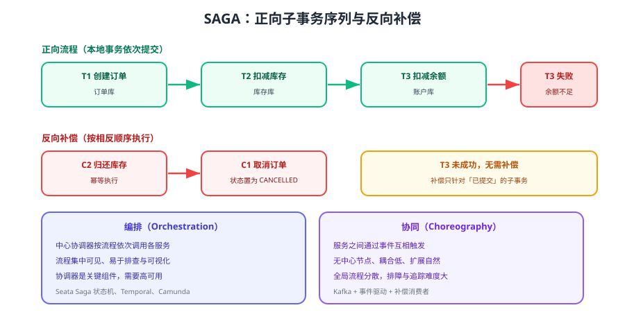

# SAGA

SAGA 把长事务拆成一串**本地子事务**：每一步都立即提交，失败时按相反顺序执行补偿操作。它没有全局锁、没有 Prepare 阶段的资源占用，因此特别适合订票、预订、审批这类**链路长、参与方多、无法预留资源**的业务。



## 两种经典定义

| 类型 | 执行方式 | 特点 |
| --- | --- | --- |
| 正向恢复（Forward Recovery） | 失败后重试当前步骤，直到成功 | 要求所有步骤最终都能成功，通常用于可重试的幂等操作 |
| 反向恢复（Backward Recovery） | 失败后反向执行已完成步骤的补偿 | 工程中最常用，每个子事务都要配一个补偿动作 |

## 与 TCC 的差别

| 维度 | TCC | SAGA |
| --- | --- | --- |
| 资源预留 | 需要（Try 阶段预占） | 不需要 |
| 中间态 | 预占状态 | 普通业务状态（如「已下单待发货」） |
| 适用 | 可预留的资源（库存、余额） | 无法预留的长流程（订票、审批、开通服务） |
| 补偿粒度 | 业务级预留与释放 | 直接反向操作（取消订单、释放座位） |
| 复杂度 | 高（空回滚、悬挂、幂等） | 中（补偿设计 + 状态机） |
| 隔离性 | 较好（预占隔离部分资源） | 弱（中间态完全可见） |

## 补偿设计六条原则

1. **只补偿已提交的子事务**：T3 失败时只补偿 T2、T1，不要补偿未执行的步骤。
2. **补偿必须幂等**：补偿同样会被重试，用「业务 ID + 补偿类型」做唯一键。
3. **补偿必须可重入**：允许补偿逻辑在部分成功后再次执行（先判断当前状态再动作）。
4. **补偿不能失败，只能重试**：补偿失败要重试 + 告警 + 人工介入，不能直接放弃。
5. **补偿要能处理中间态数据**：例如订单已创建但商品已下架，取消订单时允许跳过部分下游动作。
6. **补偿顺序必须与正向相反**：T1→T2→T3 的正向对应 C3→C2→C1 的反向。

::: tip 一句话理解
SAGA 是「**用补偿换隔离**」：它放弃了中间态不可见，换来无全局锁的高吞吐。因此补偿必须写得比正向更仔细——正向是业务成功路径，反向才是数据一致性的最后一道防线。
:::

::: danger 没有隔离性的三个后果
1. 用户在流程未结束时会看到「已下单但库存已回滚」等中间态，前端必须能表达这些状态。
2. 外部系统可能在补偿前已经读取了中间数据（如物流已取件），需要业务上设计阻断。
3. 并发场景下同一用户可能发起两笔流程，需要在入口做业务级互斥（如订单号维度加锁）。
:::

## 编排 vs 协同

| 维度 | 编排（Orchestration） | 协同（Choreography） |
| --- | --- | --- |
| 控制方式 | 中心协调器按流程依次调用 | 服务之间通过事件触发下一步 |
| 可视性 | 流程图集中，便于排查与重放 | 流程分散在多个消费者中 |
| 耦合 | 协调器需要知道所有参与方 | 参与方只需知道事件 |
| 复杂度 | 随步骤线性增长 | 随事件组合爆炸式增长 |
| 典型实现 | Seata Saga 状态机、Temporal、Camunda | Kafka/RocketMQ 事件驱动 + 补偿消费者 |

### 编排式实现（Seata Saga 状态机）

```json [order-saga.json]
{
  "Name": "createOrderSaga",
  "Comment": "下单流程：创建订单 → 扣库存 → 扣余额，失败反向补偿",
  "StartState": "CreateOrder",
  "States": {
    "CreateOrder": {
      "Type": "ServiceTask",
      "ServiceName": "orderService",
      "ServiceMethod": "create",
      "CompensateState": "CancelOrder",
      "Next": "DeductInventory"
    },
    "DeductInventory": {
      "Type": "ServiceTask",
      "ServiceName": "inventoryService",
      "ServiceMethod": "deduct",
      "CompensateState": "RestoreInventory",
      "Next": "DeductBalance"
    },
    "DeductBalance": {
      "Type": "ServiceTask",
      "ServiceName": "accountService",
      "ServiceMethod": "deduct",
      "CompensateState": "RefundBalance",
      "Next": "Succeed"
    },
    "CancelOrder": { "Type": "CompensateState", "Next": "Fail" },
    "RestoreInventory": { "Type": "CompensateState", "Next": "CancelOrder" },
    "RefundBalance": { "Type": "CompensateState", "Next": "RestoreInventory" },
    "Succeed": { "Type": "Succeed" },
    "Fail": { "Type": "Fail" }
  }
}
```

### 代码式编排（不依赖状态机引擎）

```java [OrderSagaOrchestrator.java]
@Service
public class OrderSagaOrchestrator {

    /** 用「补偿动作栈」实现反向补偿，适合步骤较少的流程 */
    public void createOrder(OrderDTO dto) {
        Deque<Runnable> compensations = new ArrayDeque<>();
        try {
            orderService.create(dto);
            compensations.push(() -> orderService.cancel(dto.getOrderNo()));

            inventoryService.deduct(dto);
            compensations.push(() -> inventoryService.restore(dto.getSku(), dto.getQty()));

            accountService.deduct(dto);
            compensations.push(() -> accountService.refund(dto.getAccountId(), dto.getAmount()));

            orderService.markPaid(dto.getOrderNo());
        } catch (Exception ex) {
            // 反向补偿：栈顶先出；补偿失败只记录并告警，由补偿任务继续重试
            while (!compensations.isEmpty()) {
                Runnable compensate = compensations.pop();
                try {
                    compensate.run();
                } catch (Exception e) {
                    compensateLog.save(dto.getOrderNo(), e.getMessage());
                }
            }
            throw new BizException("下单失败，已尝试回滚：" + ex.getMessage(), ex);
        }
    }
}
```

::: warning 代码式编排的边界
这种写法适合步骤少、可同步补偿的场景。一旦链路超过 5 个步骤、需要持久化补偿进度、需要人工干预，就应该切换到状态机引擎（Seata Saga / Temporal），由引擎负责持久化流程状态与重试。
:::

### 协同式实现（事件驱动）

```text
订单服务 --OrderCreated--> 库存服务 --InventoryDeducted--> 账户服务 --BalanceDeducted--> 订单服务(标记支付完成)
                              |                              |
                        失败发布 InventoryDeductFailed    失败发布 BalanceDeductFailed
                              |                              |
                        订单服务取消订单              库存服务归还库存 → 订单服务取消订单
```

优势是把流程解耦到极低耦合，代价是**全局流程不可见**：必须配合链路追踪（如 [Spring Cloud 链路追踪](../../../SpringCloud/Tracing/index.md)）把同一个订单号串联起来排查。

## 与消息队列配合

SAGA 的每一步通常通过消息驱动，因此消息的**至少一次投递**特性会直接作用到补偿逻辑上：

1. 每条事件用业务 ID 作 key，保证同一单据的事件有序（见 [Kafka 生产者深入](../../../MessageQueue/Kafka/Producer/index.md)）。
2. 消费者必须幂等，重复事件不能导致重复补偿（见 [消费幂等](../../../MessageQueue/Idempotency/index.md)）。
3. 补偿事件单独设置死信主题，避免与正向事件混在一起。

## 常见反模式

::: danger 容易踩的写法
1. **忘记补偿未成功的步骤**：T3 失败后补偿了 T3，却漏掉 T2、T1。
2. **补偿逻辑有副作用**：补偿时又发送通知或积分，导致重复发放。
3. **补偿顺序写反**：先取消订单再归还库存，中间出现「库存已扣、订单已取消」的对外可见状态。
4. **补偿被当作业务失败处理**：补偿失败只打日志不告警，脏数据长期存在。
5. **缺少流程状态持久化**：进程重启后不知道流程执行到哪一步，无法继续或补偿。
6. **链路太长却不拆分**：把 20 个步骤塞进一个 SAGA，任何一步失败都要整体回滚，应拆成子流程。
:::

## 验证方式

1. 正常链路：T1→T2→T3 全部成功，确认三个服务的数据都是终态、无补偿记录。
2. 在 T3 注入失败：确认 T2、T1 的补偿被执行，数据回到初始状态。
3. 在补偿过程中重启服务：确认流程状态已持久化，恢复后能继续补偿直至完成。
4. 重复投递补偿事件 10 次，确认补偿只生效一次（幂等）。
5. 用链路追踪查看同一订单号的完整流程与每个步骤耗时，确认异常步骤清晰可定位。

## 参考资料

- SAGA 模式（microservices.io）：https://microservices.io/patterns/data/saga.html
- Seata SAGA 模式：https://seata.apache.org/docs/user/mode/saga/
- Temporal（长流程编排参考实现）：https://docs.temporal.io/
- 本库事件驱动基础：[Kafka 概述](../../../MessageQueue/Kafka/index.md)
- 本库链路追踪：[Spring Cloud 链路追踪与可观测性](../../../SpringCloud/Tracing/index.md)
