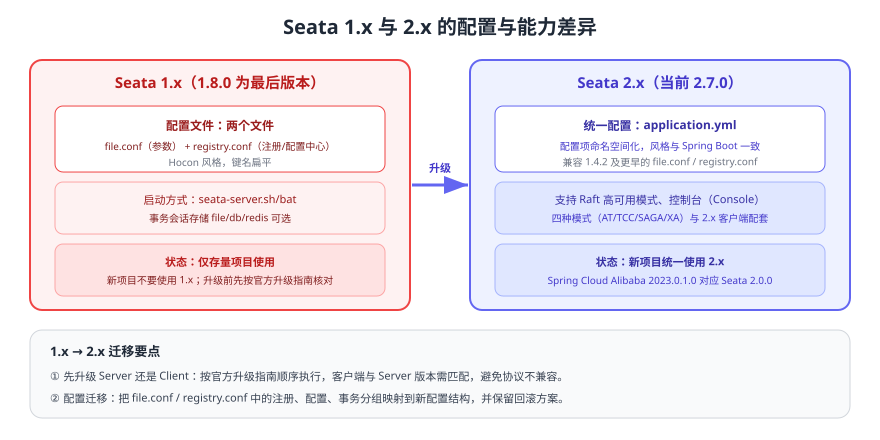

# Seata 1.x 存档（仅存量项目）

::: danger 维护状态声明
本页内容**仅面向存量项目**。Seata 1.x 的最后一个版本是 **1.8.0**，新项目请使用 2.x（当前最新发布版本 2.7.0，2026-09-06），主线内容见 [Seata 事务框架](../index.md)。旧版本内容在本库中**保留、不删除、不覆盖**，便于存量系统维护与升级对照。
:::

Seata 1.x 与 2.x 在使用体验上最大的差别是**配置方式与 Maven 坐标**，事务模式（AT / TCC / SAGA / XA）本身没有变化。本页给出 1.x 的配置样例、与 2.x 的逐项差异，以及升级时的检查清单。



## 1.x 的配置方式

Seata 1.x 采用**两个配置文件**：

| 文件 | 作用 | 典型内容 |
| --- | --- | --- |
| `registry.conf` | 注册中心与配置中心的类型和地址 | `registry { type = "nacos" ... }`、`config { type = "nacos" ... }` |
| `file.conf` | 服务端/客户端参数 | 事务分组、事务会话存储模式（file/db/redis）、传输与线程参数 |

```properties [registry.conf]
registry {
  type = "nacos"
  nacos {
    serverAddr = "127.0.0.1:8848"
    namespace = ""
    cluster = "default"
  }
}

config {
  type = "nacos"
  nacos {
    serverAddr = "127.0.0.1:8848"
  }
}
```

```properties [file.conf]
transport {
  type = "TCP"
  server = "NIO"
}

service {
  vgroupMapping.default_tx_group = "default"
  default.grouplist = "127.0.0.1:8091"
  disableGlobalTransaction = false
}

store {
  mode = "db"
  db {
    datasource = "druid"
    url = "jdbc:mysql://127.0.0.1:3306/seata?useSSL=false"
    user = "seata"
    password = "seata"
  }
}
```

```xml [pom.xml（1.x 坐标）]
<dependency>
    <groupId>io.seata</groupId>
    <artifactId>seata-spring-boot-starter</artifactId>
    <version>1.8.0</version>
</dependency>
```

## 1.x 与 2.x 的差异清单

| 维度 | Seata 1.x（≤1.8.0） | Seata 2.x（2.1.0 起为 org.apache.seata） |
| --- | --- | --- |
| 配置文件 | `file.conf` + `registry.conf` | 统一配置文件（`application.yml` 风格），对 1.4.2 及更早的旧配置仅提供兼容 |
| Maven 坐标 | `io.seata:*` | 2.0.0 仍为 `io.seata:*`，**2.1.0 起为 `org.apache.seata:*`** |
| 事务模式 | AT / TCC / SAGA / XA | AT / TCC / SAGA / XA（能力延续） |
| 高可用 | 依赖外部注册中心 + 共享存储 | 支持 Raft 模式等更完整的服务端高可用方案 |
| 控制台 | 能力有限 | 提供控制台查看全局/分支事务 |
| 维护状态 | 1.8.0 为最后版本，仅存量项目 | 当前主线，持续发布（最新 2.7.0） |

::: warning 版本兼容性
客户端（RM/TM）与服务端（TC）版本需要匹配；跨大版本升级应先看官方升级指南，并在预发环境验证事务提交与回滚链路。Spring Cloud Alibaba 的版本也会锁定所配套的 Seata 版本（如 SCA 2021.0.6.0 → Seata 1.6.1、SCA 2023.0.1.0 → Seata 2.0.0），见 [Spring Cloud 版本选择与演进](../../../../SpringCloud/Version/index.md)。
:::

## 升级到 2.x 的检查清单

1. **确认依赖坐标**：1.x → 2.1.0 及以上需要把 `io.seata` 改为 `org.apache.seata`，同时清理旧坐标的传递依赖。
2. **迁移配置**：把 `file.conf` / `registry.conf` 中的注册中心、配置中心、事务分组、存储模式映射到新配置结构。
3. **检查业务库表**：AT 模式仍需要 `undo_log` 表，确认结构与官方 2.x 文档一致。
4. **核对客户端与服务端版本**：先升级服务端还是客户端按官方升级指南执行，避免协议不兼容。
5. **准备回滚方案**：保留旧版本镜像与配置，升级窗口内准备好快速回退步骤。
6. **回归验证**：成功链路、失败回滚、超时、TC 重启四类场景都要测。

::: tip 存量项目的最省事做法
如果短期无法升级到 2.x，先做两件事：**冻结 1.x 的依赖版本**（避免传递依赖被意外升级）、**补齐监控与对账**（`undo_log` 残留、全局事务未结束、数据差异三类指标）。升级可以排期，数据一致性不能等。
:::

::: danger 存量项目升级的三个禁区
1. 直接在高峰期升级 TC：事务状态存储结构变更期间出现异常很难回退。
2. 只升客户端不升服务端（或反之）且不做灰度：跨版本协议问题往往在业务失败回滚时才暴露。
3. 升级后不做回滚演练：一旦出现脏数据，没有可执行的补救路径。
:::

## 验证方式

1. 在测试环境用 1.x 依赖与配置启动一个 AT 模式示例，确认全局事务可以正常提交与回滚。
2. 对照本页差异表，逐项记录当前存量项目使用的配置项与坐标。
3. 按升级检查清单在预发环境完成一次升级演练，验证四类场景（成功、回滚、超时、TC 重启）。
4. 确认 `undo_log` 表无残留、`global_table` 无长期未结束事务后，再进入生产灰度。

## 参考资料

- Seata 1.8 官方文档：https://seata.apache.org/docs/v1.8/user/configurations100/
- Seata 版本发布记录（含 1.8.0 与 2.x 全部版本）：https://github.com/apache/incubator-seata/releases
- Seata 升级指南：https://seata.apache.org/docs/ops/upgrade/
- Maven Central 坐标核对：https://repo1.maven.org/maven2/org/apache/seata/seata-spring-boot-starter/
- 本库主线内容：[Seata 事务框架](../index.md)
