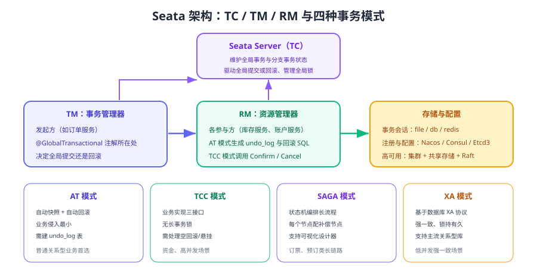

# Seata 事务框架

Seata 是 Apache 顶级项目，用统一的 TC / TM / RM 架构把 AT、TCC、SAGA、XA 四种事务模式收敛成一套接入方式。业务侧大多只需要一个 `@GlobalTransactional` 注解，就能获得「全局回滚」的能力。本页面向当前 **2.x 主线**（最新发布版本 2.7.0，2026-09-06），讲清架构、AT 原理、部署与调优。



## 三个角色

| 角色 | 全称 | 职责 | 落地位置 |
| --- | --- | --- | --- |
| TC | Transaction Coordinator | 维护全局事务与分支事务状态，驱动全局提交/回滚，管理全局锁 | Seata Server（独立部署，可集群） |
| TM | Transaction Manager | 定义全局事务边界（发起、提交、回滚） | 业务发起方（`@GlobalTransactional` 所在服务） |
| RM | Resource Manager | 管理分支事务资源，执行分支提交/回滚 | 每个参与方服务 |

### 一次全局事务的完整流程

1. TM 向 TC 申请开启全局事务，得到全局唯一 `XID`。
2. TM 执行本地业务，并通过 RPC 把 `XID` 传递给下游服务。
3. 每个 RM 在执行业务前向 TC 注册分支事务，业务完成后上报分支状态。
4. 任一分支失败或 TM 抛异常 → TC 通知所有已注册分支执行**回滚**。
5. 全部分支成功 → TC 通知所有分支**提交**，并删除事务记录。

## 版本状态

| 版本 | 状态 | 说明 |
| --- | --- | --- |
| **2.7.0**（2026-09-06 发布） | 当前稳定版，**推荐使用** | 四种模式齐全，支持控制台、Raft 高可用 |
| 2.6.0（2026-01-28）/ 2.5.0（2025-07-21） | 维护中 | 历史补丁线，升级前核对兼容性 |
| 2.0.0（2023-11-24） | 已归档 | 首个统一配置的大版本，Spring Cloud Alibaba 2023.0.1.0 对应此版本 |
| 1.8.0（1.x 最后一个版本） | **仅存量项目使用** | 配置方式与 2.x 不同，见 [Seata 1.x 存档](Seata1/index.md) |

::: info 大版本处理约定
主线内容面向 Seata 2.x；1.x 的配置与差异单独存档在 [Seata 1.x 存档（仅存量项目）](Seata1/index.md)，旧内容保留并标注状态，不用新版覆盖。
:::

## 四种事务模式

| 模式 | 原理 | 侵入性 | 是否需建表 | 适用 |
| --- | --- | --- | --- | --- |
| AT | 拦截 SQL 生成前后镜像，写 `undo_log`，回滚时反向补偿 | 最低 | 需要 `undo_log` | 基于关系型数据库的普通业务（首选） |
| TCC | 业务实现 Try / Confirm / Cancel | 高 | 需要事务控制表 | 资金、库存等可预留资源的高并发场景 |
| SAGA | 状态机编排正向与补偿节点 | 中 | 由引擎管理状态 | 长链路、跨系统流程 |
| XA | 基于数据库 XA 协议的两阶段提交 | 低 | 不需要 | 强一致、低并发 |

### AT 模式原理

AT（Auto Transaction）是 Seata 使用最多的模式，核心是三件事：

| 机制 | 说明 |
| --- | --- |
| 前镜像 / 后镜像 | 执行业务 SQL 前记录变更前的数据（before image），执行后记录变更后的数据（after image），写入 `undo_log` |
| 全局锁 | 提交本地事务前申请该行数据的全局锁，防止其它全局事务在提交前修改同一行 |
| 回滚 | 全局回滚时，TC 通知 RM 根据 `undo_log` 用 after image 比对当前数据，若未被外部修改则用 before image 还原 |

```sql [undo_log 表结构（每个业务库都要建）]
CREATE TABLE undo_log (
  branch_id     BIGINT       NOT NULL COMMENT '分支事务 ID',
  xid           VARCHAR(128) NOT NULL COMMENT '全局事务 ID',
  context       VARCHAR(128) NOT NULL COMMENT 'undo_log 序列化上下文',
  rollback_info LONGBLOB     NOT NULL COMMENT '前后镜像序列化内容',
  log_status    INT          NOT NULL COMMENT '状态：0 正常 1 防御性回滚',
  log_created   DATETIME(6)  NOT NULL,
  log_modified  DATETIME(6)  NOT NULL,
  ext           VARCHAR(100) DEFAULT NULL,
  UNIQUE KEY ux_undo_log (xid, branch_id)
) ENGINE=InnoDB AUTO_INCREMENT=1 DEFAULT CHARSET=utf8mb4 COMMENT='AT 模式回滚日志表';
```

::: warning AT 模式的隔离性边界
AT 默认提供的是**读未提交**级别的全局隔离（本地事务提交后其它事务可能已可见）。官方提供 `@GlobalLock + SELECT ... FOR UPDATE` 作为读隔离的补救手段，但会带来额外加锁开销，需要按业务权衡。
:::

## 服务端部署

```yaml [docker-compose.yml（Seata Server + Nacos 注册/配置）]
services:
  seata-server:
    image: apache/seata-server:2.6.0
    container_name: seata-server
    ports:
      - "7091:7091"   # 控制台
      - "8091:8091"   # 事务服务端口
    environment:
      SEATA_PORT: 8091
      CONSOLE_PORT: 7091
      SEATA_IP: 127.0.0.1
      STORE_MODE: db
      DB_TYPE: mysql
      DB_URL: jdbc:mysql://mysql:3306/seata?useSSL=false&characterEncoding=utf8
      DB_USER: seata
      DB_PASSWORD: seata
      REGISTRY_TYPE: nacos
      NACOS_SERVER_ADDR: nacos:8848
    depends_on: [mysql, nacos]
```

```shell
docker compose up -d
# 打开控制台确认 TC 已就绪（默认账号密码见官方文档）
# http://localhost:7091
```

预期结果：控制台可登录，**全局事务**与**分支事务**页面为空；查询数据库中的 `global_table` / `branch_table` 存在且无堆积记录。

::: danger 服务端部署要点
1. **事务会话存储必须用数据库或 Raft**：`file` 模式不支持集群，多节点部署会导致事务状态分裂。
2. **不要用 1.x 的 `registry.conf`/`file.conf` 方式配置 2.x**：2.x 使用统一的 `application.yml`（对 1.4.2 及更早配置文件仅提供兼容），以官方对应版本文档为准。
3. **Seata Server 也要高可用**：TC 宕机会导致新事务无法开启；生产建议多节点 + 共享存储/Nacos 注册。
:::

## 客户端接入

```xml [pom.xml]
<dependency>
    <groupId>org.apache.seata</groupId>
    <artifactId>seata-spring-boot-starter</artifactId>
    <version>2.6.0</version>
</dependency>
```

::: info 版本与坐标说明（2026-09 核对）
示例中的依赖与镜像使用 Maven Central / Docker Hub 上已发布的 2.6.0；GitHub 上已发布 2.7.0（2026-09-06），升级前请先确认对应制品已发布。坐标在 2.1.0 起由 `io.seata` 改为 `org.apache.seata`，1.x 与 2.0.0 仍使用 `io.seata`，详见 [Seata 1.x 存档（仅存量项目）](Seata1/index.md)。
:::

```yaml [application.yml]
seata:
  application-id: order-service
  tx-service-group: default_tx_group
  registry:
    type: nacos
    nacos:
      server-addr: localhost:8848
      application: seata-server
  config:
    type: nacos
    nacos:
      server-addr: localhost:8848
```

```java [OrderService.java]
@Service
public class OrderService {

    @GlobalTransactional(name = "create-order", rollbackFor = Exception.class)
    public void createOrder(OrderDTO dto) {
        orderDao.insert(dto);          // RM：订单库（AT 分支）
        inventoryClient.deduct(dto);   // RM：库存服务（XID 透传）
        accountClient.deduct(dto);     // RM：账户服务
    }
}
```

三种模式在代码上的差异：

| 模式 | 业务代码 | 配置 |
| --- | --- | --- |
| AT | 只需 `@GlobalTransactional` + 本地事务 | `data-source-proxy-mode: AT` |
| TCC | 实现 Try/Confirm/Cancel 接口并加 `@TwoPhaseBusinessAction` | `data-source-proxy-mode: AT` + TCC 注解 |
| XA | 只需 `@GlobalTransactional` | `data-source-proxy-mode: XA` |

::: tip 选型建议
首次落地建议从 **AT** 开始：改动最小、能从控制台看到全局事务全貌；等遇到「热点行竞争严重、必须避免全局锁」或「无法回滚的操作」时，再把对应分支换成 TCC 或改用本地消息表。
:::

## 事务分组与高可用

`tx-service-group` 是客户端定位 TC 集群的分组名，通过配置中心映射到具体的 TC 地址列表。常见做法：

1. 生产环境为不同业务域划分不同事务分组，隔离故障域。
2. 分组到集群的映射放在 Nacos/配置中心，便于灰度与切换。
3. TC 集群节点数 ≥ 3，事务会话存储使用独立数据库或 Raft 模式。

## 监控与运维

| 观测项 | 位置 | 建议阈值 |
| --- | --- | --- |
| 全局事务成功率 | Seata 控制台 / 埋点 | 低于 99.9% 告警 |
| 全局事务平均耗时 | 控制台 / 应用指标 | 超过业务 SLA 告警 |
| 未结束（超时）全局事务 | `global_table` 状态 | 存在超过超时时间的记录即告警 |
| 分支事务重试次数 | TC 日志、`branch_table` | 频繁重试说明下游不稳 |
| undo_log 表体积 | 业务库 | 持续增长说明回滚日志未清理，需排查 |
| 全局锁冲突 | TC 日志 | 冲突频繁说明热点数据竞争严重 |

## 常见问题

::: danger Seata 使用中的高频问题
1. **业务库忘记建 `undo_log` 表**：AT 模式启动即报错或运行时回滚失败。
2. **事务内做远程调用之外的耗时操作**（大文件、循环批量）：全局事务持有时间过长，放大锁冲突。
3. **`@GlobalTransactional` 加在 `private` 方法或自调用上**：AOP 不生效，事务退化为本地事务。
4. **超时时间设置过大**：失败事务长期挂起，全局锁迟迟不释放。
5. **把 Seata 当成万能方案**：对无法回滚的操作（发短信、调用外部接口）依然需要业务补偿。
6. **忽略 TC 高可用**：单节点 TC 故障后所有新事务无法开启。
:::

## 验证方式

1. 部署 Seata Server 后打开控制台，确认 TC 状态正常，`global_table` / `branch_table` 可访问。
2. 跑一次 AT 模式的成功链路，确认控制台能看到全局事务与分支事务，业务库 `undo_log` 记录被正常清理。
3. 让第二个分支抛异常，确认第一个分支的数据被回滚，且 `undo_log` 中没有残留记录。
4. 停掉 Seata Server 后发起业务，确认业务快速失败而不是长时间挂起（验证客户端超时与降级策略）。
5. 压测 1000 笔全局事务，观察平均耗时、全局锁冲突次数与失败率是否满足业务指标。

## 参考资料

- Seata 官方文档：https://seata.apache.org/docs/overview/what-is-seata/
- Seata 参数配置：https://seata.apache.org/docs/user/configurations/
- Seata AT 模式：https://seata.apache.org/docs/user/mode/at/
- Seata 部署指南：https://seata.apache.org/docs/ops/deploy-server/
- Seata 版本发布记录：https://github.com/apache/incubator-seata/releases
- 本库 Spring Cloud Alibaba 版本对照：[Spring Cloud 版本选择与演进](../../../SpringCloud/Version/index.md)
