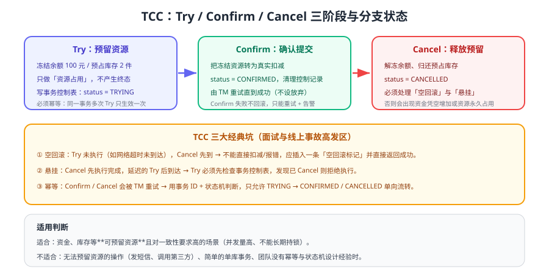

# TCC

TCC（Try-Confirm-Cancel）是目前高并发交易场景使用最广的柔性事务方案：把「一次性扣减」拆成「预留资源 → 确认 → 释放」三步，用业务状态代替数据库长事务锁。本页讲清三接口的语义边界，以及真正让线上事故频发的三个坑：空回滚、悬挂、幂等。



## 三个接口的语义

| 阶段 | 语义 | 库存示例 | 账户示例 |
| --- | --- | --- | --- |
| Try | **预留**资源，不做终态变更 | 可用库存 -2，预占库存 +2 | 可用余额 -100，冻结余额 +100 |
| Confirm | 确认预留，转成终态 | 预占库存 -2（真正扣减） | 冻结余额 -100（真正扣款） |
| Cancel | 释放预留，回到初始 | 可用库存 +2，预占库存 -2 | 可用余额 +100，冻结余额 -100 |

::: tip 一句话理解
TCC 把「**锁**」从数据库搬到业务状态里：Try 用业务字段表达「这笔资源已经被占住」，因此不需要让数据库事务一直开着。代价是每个业务都要自己实现三个接口，并保证它们在重试下依然正确。
:::

## TCC 与 2PC 的差别

| 维度 | 2PC / XA | TCC |
| --- | --- | --- |
| 资源锁 | 数据库层面的行锁/表锁 | 业务层面的预占记录 |
| 持有时间 | 整个全局事务期间 | 仅单次接口调用期间 |
| 中间态可见性 | 不可见（锁隐藏） | 可见（预占库存、冻结金额可查询） |
| 侵入性 | 低 | 高（三个接口 + 状态机） |
| 高并发表现 | 差 | 好 |
| 一致性 | 强一致 | 最终一致（Confirm 可能延迟完成） |

## 三大经典坑

### 坑一：空回滚

**现象**：Try 请求因为网络超时或服务宕机根本没执行（或没被收到），但全局事务已决定回滚，Cancel 先到了。

**错误做法**：Cancel 里直接把「预占库存」加回去 → 凭空多出库存；或者发现记录不存在就抛异常 → 全局事务一直重试卡住。

**正确做法**：Cancel 发现事务记录不存在时，插入一条 `CANCELLED` 的防悬挂/空回滚标记并返回成功。

### 坑二：悬挂

**现象**：Cancel 先执行成功（留下了空回滚标记），**之后延迟的 Try 请求才到达**，此时 Try 又预占了资源，永远不会有人来扣减——资源被永久占用。

**正确做法**：Try 执行前先查事务控制表，如果已存在 `CANCELLED` 标记，直接拒绝执行并返回成功（或抛出明确的业务异常）。

### 坑三：幂等

**现象**：Confirm / Cancel 会因为网络超时被事务协调者反复重试。

**正确做法**：用「事务 ID + 分支 ID」作为唯一键，配合状态机做单向流转：

```text
（空） --Try--> TRYING --Confirm--> CONFIRMED
                    \--- Cancel ---> CANCELLED
（空） --Cancel--> CANCELLED（空回滚标记）
```

## 事务控制表设计

```sql [tcc_branch_transaction]
CREATE TABLE tcc_branch_transaction (
  id             BIGINT UNSIGNED AUTO_INCREMENT PRIMARY KEY,
  xid            VARCHAR(64)  NOT NULL COMMENT '全局事务 ID',
  branch_id      VARCHAR(64)  NOT NULL COMMENT '分支事务 ID',
  biz_type       VARCHAR(32)  NOT NULL COMMENT '业务类型，如 INVENTORY_DEDUCT',
  biz_key        VARCHAR(64)  NOT NULL COMMENT '业务唯一键，如订单号',
  status         VARCHAR(16)  NOT NULL COMMENT 'TRYING/CONFIRMED/CANCELLED',
  amount         INT          NOT NULL DEFAULT 0 COMMENT '预留数量或金额',
  created_at     DATETIME     NOT NULL DEFAULT CURRENT_TIMESTAMP,
  updated_at     DATETIME     NOT NULL DEFAULT CURRENT_TIMESTAMP ON UPDATE CURRENT_TIMESTAMP,
  UNIQUE KEY uk_xid_branch (xid, branch_id)
) ENGINE=InnoDB COMMENT='TCC 分支事务控制表';
```

配合业务侧「预占」字段（如 `stock_frozen`、`balance_frozen`），Try/Confirm/Cancel 三类操作都变成对这两张表的状态流转。

## 完整代码示例

```java [InventoryTccService.java]
@Service
public class InventoryTccService {

    private final StockMapper stockMapper;
    private final TccBranchMapper branchMapper;

    /** Try：预留库存，必须先检查是否已被 Cancel（防悬挂） */
    @Transactional
    public void tryDeduct(String xid, String branchId, String orderNo, String sku, int qty) {
        TccBranch exist = branchMapper.selectByXidAndBranch(xid, branchId);
        if (exist != null && "CANCELLED".equals(exist.getStatus())) {
            // 悬挂：Cancel 已先执行，直接拒绝 Try
            throw new IllegalStateException("事务已取消，忽略迟到的 Try：" + xid);
        }
        if (exist != null) {
            return;   // 幂等：同一分支重复 Try 直接返回
        }
        int affected = stockMapper.freeze(sku, qty);   // available -qty, frozen +qty
        if (affected == 0) {
            throw new BizException("库存不足");
        }
        branchMapper.insert(new TccBranch(xid, branchId, "INVENTORY_DEDUCT", orderNo, "TRYING", qty));
    }

    /** Confirm：把预占转为真实扣减，可重复执行 */
    @Transactional
    public void confirmDeduct(String xid, String branchId) {
        TccBranch branch = branchMapper.selectByXidAndBranch(xid, branchId);
        if (branch == null) {
            // 理论上不应出现：Try 成功但记录丢失，插入标记避免重试风暴
            branchMapper.insert(new TccBranch(xid, branchId, "INVENTORY_DEDUCT", "-", "CONFIRMED", 0));
            return;
        }
        if ("CONFIRMED".equals(branch.getStatus())) {
            return;   // 幂等
        }
        if ("CANCELLED".equals(branch.getStatus())) {
            throw new IllegalStateException("已取消的事务不能 Confirm：" + xid);
        }
        stockMapper.confirmFreeze(branch.getBizKey(), branch.getAmount()); // frozen -qty
        branchMapper.updateStatus(xid, branchId, "CONFIRMED");
    }

    /** Cancel：释放预占；空回滚时留下标记并成功返回 */
    @Transactional
    public void cancelDeduct(String xid, String branchId) {
        TccBranch branch = branchMapper.selectByXidAndBranch(xid, branchId);
        if (branch == null) {
            // 空回滚：Try 未执行，记录 CANCELLED 防止后续 Try 悬挂
            branchMapper.insert(new TccBranch(xid, branchId, "INVENTORY_DEDUCT", "-", "CANCELLED", 0));
            return;
        }
        if ("CANCELLED".equals(branch.getStatus())) {
            return;   // 幂等
        }
        if ("CONFIRMED".equals(branch.getStatus())) {
            throw new IllegalStateException("已确认的事务不能 Cancel：" + xid);
        }
        stockMapper.unfreeze(branch.getBizKey(), branch.getAmount()); // available +qty, frozen -qty
        branchMapper.updateStatus(xid, branchId, "CANCELLED");
    }
}
```

### 用 Seata 的 TCC 注解简化注册

```java [AccountTccAction.java]
@LocalTCC
public interface AccountTccAction {

    @TwoPhaseBusinessAction(name = "accountTccAction",
            commitMethod = "confirm", rollbackMethod = "cancel")
    boolean tryDeduct(BusinessActionContext context,
                      @BusinessActionContextParameter(paramName = "accountId") String accountId,
                      @BusinessActionContextParameter(paramName = "amount") int amount);

    boolean confirm(BusinessActionContext context);

    boolean cancel(BusinessActionContext context);
}
```

在 `tryDeduct` 中通过 `context.getXid()` 与分支 ID 落控制表，`confirm`/`cancel` 从 `context` 中取出参数，即可复用上面的状态机逻辑。

## 常见反模式

::: danger 容易踩的写法
1. **Try 里直接扣减终态**：Cancel 时无法还原（无法区分「真实扣减」与「预占」）。
2. **Confirm 里再做业务校验**：Confirm 阶段只允许成功，任何校验失败都会让全局事务卡住，校验必须在 Try 完成。
3. **Cancel 抛异常或返回失败**：协调者会无限重试，资源长期无法释放；Cancel 必须尽力成功。
4. **只依赖业务表判断幂等**：业务表在并发下容易被重复更新，必须用唯一索引 + 事务控制表。
5. **忘记处理悬挂**：线上表现是「库存被占用但订单早已取消」，且往往几天后才被发现。
6. **Try/Confirm/Cancel 不在同一事务内**：控制表与业务表更新必须原子，否则状态与实际资源不一致。
:::

## 验证方式

1. **正常链路**：Try 成功 → Confirm 成功，确认可用库存减少、冻结库存归零、控制表状态为 `CONFIRMED`。
2. **回滚链路**：Try 成功 → 另一个分支 Try 失败 → Cancel，确认可用库存恢复原值、控制表状态为 `CANCELLED`。
3. **空回滚演练**：直接调用 Cancel（不调用 Try），确认返回成功且控制表留下 `CANCELLED` 标记。
4. **悬挂演练**：先 Cancel，再调用 Try，确认 Try 被拒绝且没有产生预占。
5. **幂等演练**：重复调用 Confirm 与 Cancel 各 10 次，确认库存只变化一次、控制表状态不变。

## 参考资料

- Seata TCC 模式：https://seata.apache.org/docs/user/mode/tcc/
- TCC 空回滚、悬挂与幂等（Seata 社区解析）：https://seata.apache.org/blog/tcc-mode-design-principle/
- 微服务数据一致性模式（microservices.io）：https://microservices.io/patterns/data/saga.html
- 本库幂等方案汇总：[消费幂等](../../../MessageQueue/Idempotency/index.md)
