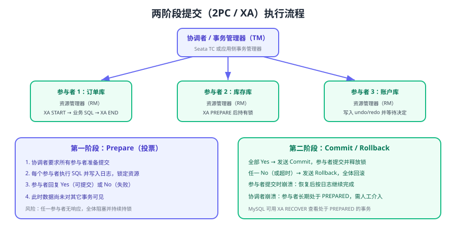

# 2PC 与 XA

2PC（Two-Phase Commit，两阶段提交）是最经典的分布式事务协议，也是理解其它方案的起点：TCC 是把「Prepare」下沉成业务接口，Seata AT 是用 undo_log 模拟回滚，而 XA 则是 2PC 的标准化实现。本页讲清协议流程、失败场景，以及在 MySQL 上真正跑起来的写法与限制。



## 协议角色

| 角色 | 别称 | 职责 |
| --- | --- | --- |
| 协调者 | Coordinator / TM | 发起全局事务，收集参与者投票，决定 Commit 或 Rollback |
| 参与者 | Participant / RM | 执行本地事务并写入日志，投票并最终执行提交或回滚 |
| XA 规范 | X/Open XA | 定义 TM 与 RM 之间的接口，让不同数据库用同一套协议交互 |

## 两个阶段

### 阶段一：Prepare（投票）

1. 协调者把 `prepare` 请求发给所有参与者。
2. 每个参与者执行事务内的 SQL，把 undo/redo 写入日志，**但数据尚不可见**，相关资源被锁定。
3. 参与者返回 `Yes`（可以提交）或 `No`（失败），也可能超时未响应。

### 阶段二：Commit / Rollback（决议）

1. 全部返回 `Yes` → 协调者写提交决议并通知所有参与者 `commit`。
2. 任一返回 `No` 或超时 → 协调者通知所有参与者 `rollback`。
3. 参与者按日志完成提交或回滚，释放锁；执行期间崩溃的参与者在恢复后继续完成决议。

::: danger 2PC 的四个内在缺陷
1. **同步阻塞**：Prepare 之后到 Commit 之前，资源一直被锁定，并发能力随参与者数量下降。
2. **协调者单点**：协调者在写决议前后崩溃，参与者可能长期停留在 PREPARED 状态。
3. **数据不一致窗口**：部分参与者已收到 Commit、部分未收到，且此时协调者彻底失联，需要人工介入。
4. **超时语义模糊**：超时意味着「未知」而不是「失败」，直接把超时当失败回滚会造成新的不一致。
:::

## 3PC：多一次询问，但没有根治

3PC 在 2PC 前增加一个 `CanCommit` 阶段，并把第二阶段拆为 `PreCommit` 与 `DoCommit`：

| 阶段 | 目的 |
| --- | --- |
| CanCommit | 询问参与者是否具备提交条件（不执行 SQL、不锁资源） |
| PreCommit | 真正的准备阶段，执行并锁资源 |
| DoCommit | 最终提交 |

3PC 通过引入超时后的「默认提交」降低阻塞风险，但仍无法解决网络分区下的一致性问题（参与者可能在分区期间自行提交），因此工程中使用远少于 2PC/XA。

## XA 规范与 xid

XA 把 2PC 标准化：TM 通过 `xid`（事务标识）关联同一个全局事务在各 RM 上的分支。

| 组成 | 含义 |
| --- | --- |
| `formatID` | 标识 RM 或分支格式 |
| `gtrid` | 全局事务标识，同一全局事务在各库一致 |
| `bqual` | 分支限定符，用来区分同一全局事务的不同分支 |

## MySQL XA 实操

MySQL 8.4 支持如下 XA 语句：

```sql
XA {START|BEGIN} xid [JOIN|RESUME]
XA END xid [SUSPEND [FOR MIGRATE]]
XA PREPARE xid
XA COMMIT xid [ONE PHASE]
XA ROLLBACK xid
XA RECOVER [CONVERT XID]
```

### 手工体验一次跨库事务

```sql [库 A：order 库]
-- 1. 开启 XA 事务并执行本地 SQL
XA START 'order_tx_1';
UPDATE orders SET status = 'CREATED' WHERE order_no = '1001';
XA END 'order_tx_1';

-- 2. 准备提交（此时资源被锁定，但数据不可见）
XA PREPARE 'order_tx_1';
```

```sql [库 B：inventory 库]
XA START 'order_tx_1';
UPDATE inventory SET stock = stock - 1 WHERE sku = 'SKU-001';
XA END 'order_tx_1';
XA PREPARE 'order_tx_1';
```

```sql [两个库分别执行最终决议]
-- 全部 Prepare 成功 → 各库分别提交
XA COMMIT 'order_tx_1';
-- 任一失败 → 各库分别回滚
-- XA ROLLBACK 'order_tx_1';

-- 查看服务器上处于 PREPARED 状态的 XA 事务（排查悬挂事务）
XA RECOVER;
```

预期输出：`XA RECOVER` 会列出 `formatID`、`gtrid_length`、`data` 等列；提交或回滚后该记录消失，`orders` 与 `inventory` 的变化同时生效或同时不生效。

### MySQL XA 的关键限制（务必先读）

| 限制 | 说明 |
| --- | --- |
| 存储引擎 | XA 事务支持**仅限 InnoDB** |
| 权限 | `XA RECOVER` 需要 `XA_RECOVER_ADMIN` 权限，避免看到他人的 XID |
| PREPARED 状态持久化 | 处于 PREPARED 的事务会一直保留，直到显式 `XA COMMIT` / `XA ROLLBACK`，需要 DBA 监控与处理 |
| 复制过滤 | **不支持**把复制过滤器/二进制日志过滤器与 XA 事务混用（可能导致副本上出现空事务） |
| 语句级复制 | XA 事务对基于语句的复制（SBR）不安全 |

::: danger 生产使用 XA 的三条硬性要求
1. 必须有监控能看到 PREPARED 事务的数量与最长停留时间，超阈值告警。
2. 必须有明确的处置流程（提交还是回滚由业务侧判断），不能「发现了但没人管」。
3. 必须确认主从复制拓扑与过滤规则不会破坏 XA 事务的完整性。
:::

## Seata XA 模式

直接用 XA 需要自己实现 TM（协调者）与跨库的连接管理，工程里更常见的是用 Seata 的 XA 模式：

```java [AccountService.java]
@Service
public class AccountService {
    @Transactional
    @GlobalTransactional(name = "transfer", rollbackFor = Exception.class)
    public void transfer(String from, String to, int amount) {
        accountDao.deduct(from, amount);   // RM 1：XA 分支
        accountDao.add(to, amount);        // RM 2：XA 分支
    }
}
```

```yaml [application.yml]
seata:
  application-id: account-service
  tx-service-group: default_tx_group
  data-source-proxy-mode: XA   # AT（默认）/ XA
```

Seata XA 与原生 XA 的差别：

| 维度 | 原生 XA | Seata XA 模式 |
| --- | --- | --- |
| 协调者 | 自行实现（或数据库 XA 连接池） | Seata Server（TC）统一协调 |
| 分支注册 | 无统一视图 | 分支事务可在控制台/日志中查看 |
| 故障处理 | 全靠 DBA 手工 `XA RECOVER` | TC 驱动重试与回滚，仍有超时与人工兜底 |
| 性能 | 与原生 2PC 相同，锁持有时间长 | 相同，Seata 不改变协议本质 |

## 什么时候用 2PC/XA

| 场景 | 是否推荐 | 说明 |
| --- | --- | --- |
| 跨两个库、并发低、必须强一致 | 推荐 | 例如内部对账、批量结算 |
| 高并发交易主链路 | 不推荐 | 锁持有时间长，吞吐会被显著拉低 |
| 参与方是异构数据库且都支持 XA | 可用 | 需要统一 TM 与异常处理 |
| 参与方包含非数据库系统（HTTP 接口） | 不可用 | 2PC 只覆盖支持 XA 的资源管理器 |

::: tip 更实用的替代
高并发场景通常用 **TCC**（见 [TCC](../TCC/index.md)）或 **本地消息表**（见 [本地消息表与事务消息](../MessageTable/index.md)）替代 XA：用业务状态代替数据库锁，把一致性问题从「持锁等待」转成「补偿收敛」。
:::

## 验证方式

1. 按上面的 SQL 在两个库上手工执行一次 XA 事务，确认全部 `XA PREPARE` 后才提交，最终两库同时生效。
2. 让第二个库 `XA PREPARE` 失败（如故意写错表名），确认第一库执行 `XA ROLLBACK`，两边数据都未变化。
3. 在两个库都 PREPARE 后，执行 `XA RECOVER`，确认能看到两条处于 PREPARED 的事务记录。
4. 用 Seata XA 模式跑一次转账，故意让第二个分支失败，确认第一个分支被 TC 回滚。

## 参考资料

- MySQL 8.4 XA 事务语句：https://dev.mysql.com/doc/refman/8.4/en/xa-statements.html
- MySQL 8.4 XA 事务限制：https://dev.mysql.com/doc/refman/8.4/en/xa-restrictions.html
- 两阶段提交（Martin Fowler）：https://martinfowler.com/articles/patterns-of-distributed-systems/two-phase-commit.html
- Seata XA 模式：https://seata.apache.org/docs/user/mode/xa/
- 本库 MySQL 事务基础：[MySQL 事务与隔离级别](../../../../DB/Relational/MySQL/Transaction/index.md)
