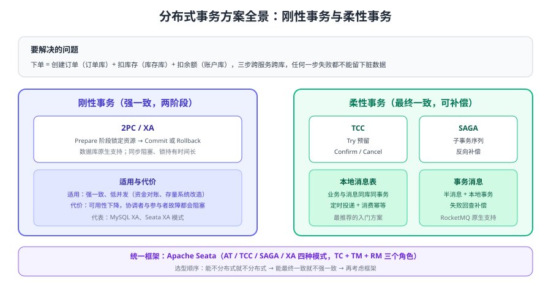

# 分布式事务

分布式事务（Distributed Transaction）处理**跨服务、跨数据库的数据一致性**：比如下单要同时「创建订单 + 扣库存 + 扣余额」，三个操作分属三个服务、三套数据库，任何一个失败都不能出现「订单建了、库存没扣」的脏数据。本页是「分布式事务」专题的入口，讲清**要不要用、有哪些方案、怎么选**，具体方案原理与代码在下方子页展开。



## 先想清楚：真的需要分布式事务吗

分布式事务成本极高（性能、复杂度、排查难度）。动手前先按顺序尝试：

1. **避免跨服务事务**：把强一致的数据放到同一个服务/库（订单与订单项本来就应该在一起）。
2. **用最终一致替代强一致**：库存可以在支付成功后异步确认，超时自动补偿。
3. **幂等 + 对账兜底**：允许短暂不一致，靠对账任务发现并修复差异。

只有确实需要**强一致**（支付扣款、资金转账、库存预占）时，才引入分布式事务框架。

::: tip 一句话理解
分布式事务的本质是「**用可用性和复杂度换一致性**」。判断标准只有两个：中间态最长能接受多久？业务能不能容忍重复？答案决定你该用强一致还是最终一致。
:::

## 专题导航

### 基础

- [一致性基础与事务边界](Consistency/index.md)：ACID / CAP / BASE、刚性 vs 柔性、幂等与对账

### 主流方案

- [2PC 与 XA](TwoPhaseCommit/index.md)：Prepare/Commit 两阶段、MySQL XA 实操与限制
- [TCC](TCC/index.md)：Try / Confirm / Cancel 三接口与空回滚、悬挂、幂等三大坑
- [SAGA](Saga/index.md)：子事务序列、反向补偿、编排与协同
- [本地消息表与事务消息](MessageTable/index.md)：Outbox、RocketMQ 半消息、最大努力通知

### 框架与落地

- [Seata 事务框架（2.x）](Seata/index.md)：TC / TM / RM 架构与 AT / TCC / SAGA / XA 四模式
- [Seata 1.x 存档（仅存量项目）](Seata/Seata1/index.md)：与 2.x 的差异与迁移要点
- [实战：订单-库存-账户一致性](Practice/index.md)：方案组合、故障演练与对账
- [常见问题与最佳实践](FAQ/index.md)：排查地图、面试高频问题、避坑清单

## 一致性基础速览

| 概念 | 含义 | 对分布式事务的意义 |
| --- | --- | --- |
| ACID | 单库事务的原子性、一致性、隔离性、持久性 | 只保证单库；跨库后原子性与隔离性失效 |
| CAP | 一致性、可用性、分区容错三者不可兼得 | P 必然存在，实际是在 C 与 A 之间取舍 |
| BASE | 基本可用、软状态、最终一致 | 柔性事务（TCC/SAGA/消息表）的理论基础 |
| 刚性事务 | 两阶段提交，资源在提交前一直锁定 | 强一致但并发差，代表：XA、Seata XA |
| 柔性事务 | 先提交本地事务，再做补偿或重试 | 高并发、最终一致，代表：TCC、SAGA、消息表 |

更完整的理论、事务边界划分方法与幂等设计见 [一致性基础与事务边界](Consistency/index.md)。

## 方案对比


| 方案 | 一致性 | 侵入性 | 性能 | 典型场景 | 详细说明 |
| --- | --- | --- | --- | --- | --- |
| 2PC / XA | 强一致 | 低（数据库事务） | 差（Prepare 后长期持锁） | 单库跨库、存量系统改造 | [2PC 与 XA](TwoPhaseCommit/index.md) |
| TCC | 最终一致（业务补偿） | 高（Try/Confirm/Cancel 三接口） | 好（无长期锁） | 资金、库存等可预留资源 | [TCC](TCC/index.md) |
| SAGA | 最终一致 | 中（正/反向补偿） | 好（无全局锁） | 长链路、跨系统流程 | [SAGA](Saga/index.md) |
| 本地消息表 | 最终一致 | 低 | 好 | 配合任意 MQ 的经典方案 | [本地消息表与事务消息](MessageTable/index.md) |
| 事务消息 | 最终一致 | 低 | 好 | RocketMQ 原生支持 | [本地消息表与事务消息](MessageTable/index.md) |

### 每种方案的「代价」要提前想清楚

1. **2PC / XA**：Prepare 阶段资源被锁住，参与者越多、链路越长，失败面越大；协调者故障会让参与者长期处于 PREPARED。
2. **TCC**：每个业务要写三个接口，还要处理空回滚、悬挂、幂等；Confirm 一旦失败只能重试，不能回滚。
3. **SAGA**：没有隔离性，中间状态对外可见；补偿逻辑必须为每个子事务单独设计。
4. **本地消息表**：消息投递是「至少一次」，下游必须幂等；需要额外的表、定时任务与清理策略。
5. **事务消息**：绑定具体 MQ 实现（如 RocketMQ），回查接口要能判断本地事务真实结果。

## 方案选择决策表

| 场景 | 推荐方案 | 理由 |
| --- | --- | --- |
| 首次落地、订单/库存/账户 | Seata AT（低侵入）或本地消息表 | 改造成本最低，能快速拿到最终一致 |
| 资金转账、强一致、低并发 | Seata XA / TCC | 需要严格一致或资源可预留 |
| 长链路（订票、预订、审批） | SAGA（状态机编排） | 补偿链路清晰、可视化、便于重试 |
| 已有 RocketMQ | 事务消息 | 不用自己维护消息表与投递线程 |
| 只是解耦、允许最终一致 | 本地消息表 + MQ | 别上框架，用好幂等与对账即可 |
| 跨公司/对外系统 | 最大努力通知 + 主动对账查询 | 对方未必支持事务，只能保证通知到位 |

## 版本与兼容性速览

以下信息按 2026-09 核对（来源见各页参考资料）。

| 组件 | 当前版本 | 状态与说明 |
| --- | --- | --- |
| Apache Seata | **2.7.0**（2026-09-06 发布） | 新项目统一使用 2.x；支持 AT / TCC / SAGA / XA 四种模式 |
| Apache Seata 1.x | 1.8.0（1.x 最后一个版本） | **仅存量项目使用**，配置方式与 2.x 不同，见 [Seata 1.x 存档](Seata/Seata1/index.md) |
| Spring Cloud Alibaba 2023.x | 2023.0.1.0 | 适配 Spring Cloud 2023.0.1 / Spring Boot 3.2.4，内置 Seata 2.0.0 |
| Spring Cloud Alibaba 2022.x | 2022.0.0.0 | 适配 Spring Cloud 2022.0.0 / Spring Boot 3.0.2，内置 Seata 1.7.0 |
| Spring Cloud Alibaba 2021.x | 2021.0.6.0 | 适配 Spring Cloud 2021.0.5 / Spring Boot 2.6.13，内置 Seata 1.6.1（**仅存量**） |
| RocketMQ | 5.x | 事务消息为原生能力，机制见 [本地消息表与事务消息](MessageTable/index.md) |

::: info 大版本处理约定
本库对存在大版本差异的主题采用「版本目录 + 状态标注」的方式组织。分布式事务的**模式与理论不随版本变化**，差异集中在框架配置上，因此：主线内容面向 Seata 2.x，Seata 1.x 的配置与差异单独存档在 [Seata 1.x 存档](Seata/Seata1/index.md)，旧内容不删除、不覆盖，并明确标注「仅存量项目使用」。
:::

## Seata 落地速览

Seata 是 Apache 顶级分布式事务框架，用一套 TC（事务协调者）+ TM（事务管理器）+ RM（资源管理器）架构覆盖四种模式：

| 模式 | 原理 | 侵入性 | 适用 |
| --- | --- | --- | --- |
| AT | 自动记录前后镜像（undo_log）并生成回滚 SQL | 最低 | 基于关系型数据库的普通业务 |
| TCC | 业务实现 Try / Confirm / Cancel | 高 | 资金、高并发、可预留资源 |
| SAGA | 状态机编排正向与补偿节点 | 中 | 长链路、跨系统 |
| XA | 基于数据库 XA 协议的两阶段提交 | 低 | 强一致、低并发 |

业务代码在 AT 模式下通常只需要一个注解：

```java [OrderService.java]
@Service
public class OrderService {
    @GlobalTransactional(name = "create-order", rollbackFor = Exception.class)
    public void createOrder(OrderDTO dto) {
        orderDao.insert(dto);              // 本地事务
        inventoryClient.deduct(dto);       // 远程调用：库存服务（同样有 @Transactional）
        accountClient.deduct(dto);         // 远程调用：账户服务
    }
}
```

任一参与者异常，Seata 会根据 undo_log 回滚已提交的本地事务。完整架构、部署与调优见 [Seata 事务框架](Seata/index.md)。

## 易错点与最佳实践

::: danger 常见错误
1. **处处用分布式事务**：多数业务可以靠最终一致解决，滥用 XA/AT 会把性能拖垮。
2. **TCC 的 Confirm/Cancel 不幂等**：补偿重试会重复执行，必须幂等。
3. **SAGA 补偿不完整**：只写了正向流程，没有为每个子事务配反向补偿。
4. **本地消息表与业务不在同一事务**：消息发出去了业务没提交，消费者白忙。
5. **忘记全局锁或唯一约束**：并发重复提交，扣两次款。
6. **事务超时配置过大**：全局锁长时间占用，拖垮整体并发。
7. **忽略最终一致的对账**：只有方案没有对账任务，脏数据没人发现。
8. **只做正向演练**：没验证过下游宕机、补偿重试、消息重复，上线必踩坑。
:::

::: tip 最佳实践
1. 先建模再选型：强一致用 XA/TCC，最终一致用 SAGA/消息表。
2. 所有补偿与消费逻辑必须幂等（唯一 ID + 去重表 + 状态机）。
3. 事务内禁止远程调用（网络耗时占锁），改用本地消息表或异步解耦。
4. 上线前做故障演练：下游宕机、事务超时、消息重复三种场景。
5. 建立对账任务：每日核对订单、库存、余额，差异自动修正并告警。
:::

## 验证方式

1. 构造「库存不足」场景触发全局回滚：订单、库存、账户三个库都应回滚到初始状态。
2. 模拟消息重复投递，确认消费者幂等（订单只创建一次）。
3. 用压测观察全局事务耗时与数据库锁等待，评估是否满足业务指标。
4. 人为停掉事务协调者（如 Seata Server），确认业务快速失败而非无限等待，且中间状态可恢复。
5. 按 [实战：订单-库存-账户一致性](Practice/index.md) 的演练清单逐项验证。

## 相关专题

- [微服务概述与服务拆分](../Overview/index.md)：什么时候必须拆服务、拆分后的数据一致性问题
- [微服务常见问题与最佳实践](../FAQ/index.md)：微服务治理层面的通用坑
- [Spring Cloud 消息驱动：Spring Cloud Stream](../../SpringCloud/Stream/index.md)：用统一编程模型收发消息
- [Kafka 可靠性与 Exactly-Once](../../MessageQueue/Kafka/Reliability/index.md)：消息侧的幂等、事务与顺序性
- [消息队列消费幂等](../../MessageQueue/Idempotency/index.md)：幂等表、状态机、Redis 去重四种方案
- [MySQL 事务与隔离级别](../../../DB/Relational/MySQL/Transaction/index.md)：单库事务与锁的基础
- [SQL 优化 · 锁与事务](../../../DB/Relational/SQLOptimization/LockTransaction/index.md)：行锁、死锁与长事务排查

## 参考资料

- Apache Seata 官方文档：https://seata.apache.org/docs/overview/what-is-seata/
- Seata 各事务模式：https://seata.apache.org/docs/user/mode/at/
- Seata 版本发布记录：https://github.com/apache/incubator-seata/releases
- Spring Cloud Alibaba 版本发布说明：https://sca.aliyun.com/docs/2023/overview/version-explain/
- SAGA 模式（microservices.io）：https://microservices.io/patterns/data/saga.html
- 两阶段提交（Martin Fowler）：https://martinfowler.com/articles/patterns-of-distributed-systems/two-phase-commit.html
- RocketMQ 事务消息：https://rocketmq.apache.org/docs/featureBehavior/04transactionmessage
