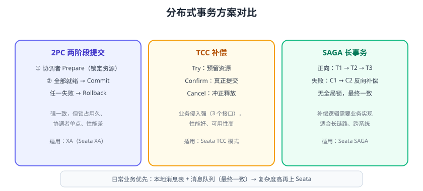

# 分布式事务

分布式事务（Distributed Transaction）处理**跨服务、跨数据库的数据一致性**：比如下单要同时“创建订单 + 扣库存 + 扣余额”，三个操作分属三个服务、三套数据库，任何一个失败都不能出现“订单建了库存没扣”的脏数据。本页讲透 2PC、TCC、SAGA、本地消息表与 Seata 落地。



## 先想清楚：真的需要分布式事务吗

分布式事务成本极高（性能、复杂度、排查难度）。先尝试：

1. **避免跨服务事务**：把强一致的数据放到同一个服务/库（如订单与订单项本来就应该一起）。
2. **用最终一致替代强一致**：库存扣减可以异步确认，超时自动回滚。
3. **幂等 + 对账兜底**：允许短暂不一致，靠对账任务修正。

只有确实需要**强一致**（如支付扣款、资金转账）时，才上分布式事务框架。

## 理论基础

### CAP 与 BASE

分布式系统无法同时满足一致性（C）、可用性（A）、分区容错性（P）；分布式事务的取舍围绕 **BASE**：

- **Basically Available**：基本可用
- **Soft state**：软状态（允许中间态）
- **Eventually consistent**：最终一致

强一致方案（2PC/XA）牺牲可用性与性能；最终一致方案（SAGA/消息表）牺牲实时一致性换可用性。

## 方案对比

| 方案 | 一致性 | 侵入性 | 性能 | 适用 |
| --- | --- | --- | --- | --- |
| 2PC / XA | 强一致 | 低（数据库事务） | 差（锁占用久） | 单库跨库、存量系统改造 |
| TCC | 最终一致（业务补偿） | 高（Try/Confirm/Cancel 三接口） | 好 | 资金类、需要业务预留 |
| SAGA | 最终一致 | 中（正/反向补偿） | 好（无全局锁） | 长链路、跨系统 |
| 本地消息表 | 最终一致 | 低 | 好 | 配合 MQ 的经典方案 |
| 事务消息 | 最终一致 | 低 | 好 | RocketMQ 原生支持 |

## 2PC / XA

两阶段提交：协调者先让所有参与者 **Prepare**（锁定资源），全部成功才 **Commit**，任一失败则 **Rollback**。

```text
协调者 → 各库 Prepare → 全部 OK → Commit
                      ↘ 任一失败 → Rollback
```

优点：数据库原生支持（XA 协议），代码侵入小。缺点：**准备阶段锁资源**，高并发下性能差；协调者单点；参与者故障时长时间阻塞。

## TCC

TCC 把每个业务操作拆成三个接口：

| 阶段 | 动作 | 示例（扣余额） |
| --- | --- | --- |
| Try | 预留资源 | 冻结 100 元 |
| Confirm | 真正提交 | 扣除冻结金额 |
| Cancel | 冲正释放 | 解冻 100 元 |

```java
@LocalTCC
public interface AccountService {
    @TwoPhaseBusinessAction(name = "deduct", commitMethod = "confirm", rollbackMethod = "cancel")
    boolean tryDeduct(@BusinessActionContextParameter(paramName = "amount") int amount);

    boolean confirm(BusinessActionContext ctx);

    boolean cancel(BusinessActionContext ctx);
}
```

优点：性能好、可用性高；缺点：**每个业务都要写三个方法**，且 Try 成功后 Confirm/Cancel 必须保证最终成功（要幂等 + 重试）。

## SAGA

SAGA 把长事务拆成子事务序列，正向执行 `T1 → T2 → T3`，失败则反向补偿 `C2 → C1`：

```text
下单 → 扣库存 → 扣余额
                 ↘ 扣余额失败 → 加回库存 → 取消订单（补偿）
```

适合订单、旅行预订等**长链路**场景。补偿逻辑要幂等、可重入；无全局锁，中间状态对外可见（最终一致）。

## 本地消息表 + 消息队列（最推荐的入门方案）

核心思路：**业务操作与消息写入同一个本地事务**，消息可靠投递到 MQ，消费者处理并幂等。

```text
订单服务（本地事务）：
  1. INSERT 订单
  2. INSERT 本地消息表（status=待发送）
  3. COMMIT
定时任务/事务消息：
  4. 把待发送消息发到 MQ → 更新 status=已发送
库存服务（消费者）：
  5. 幂等扣库存 → ACK
```

```sql
START TRANSACTION;
INSERT INTO orders (order_no, status) VALUES ('1001', 'CREATED');
INSERT INTO msg_outbox (biz_id, topic, payload, status)
VALUES ('1001', 'order-created', '{"orderNo":"1001"}', 'PENDING');
COMMIT;
```

发送端由事务消息或定时扫描 `msg_outbox` 表投递；消费端配合 [消息队列消费幂等](../../MessageQueue/Idempotency/index.md) 保证不重不漏。

## Seata 落地

Seata 是 Apache 顶级分布式事务框架，最新稳定版 **2.6.x**（2026-01 发布），支持 AT / TCC / SAGA / XA 四种模式。

### 模式对比

| 模式 | 原理 | 侵入性 | 适用 |
| --- | --- | --- | --- |
| AT | 自动生成快照与回滚 SQL，业务无感 | 最低 | 基于关系型数据库的普通业务 |
| TCC | 业务三接口 | 高 | 资金、高并发 |
| SAGA | 状态机编排补偿 | 中 | 长链路 |
| XA | 数据库 XA 事务 | 低 | 强一致、低并发 |

### AT 模式示例

```xml
<dependency>
    <groupId>io.seata</groupId>
    <artifactId>seata-spring-boot-starter</artifactId>
    <version>2.6.0</version>
</dependency>
```

```yaml [application.yml]
seata:
  application-id: order-service
  tx-service-group: default_tx_group
  registry:
    type: nacos
    nacos:
      server-addr: localhost:8848
  config:
    type: nacos
    nacos:
      server-addr: localhost:8848
```

业务代码只需要一个注解：

```java
@Service
public class OrderService {
    @GlobalTransactional(name = "create-order", rollbackFor = Exception.class)
    public void createOrder(OrderDTO dto) {
        orderDao.insert(dto);              // 本地事务
        inventoryClient.deduct(dto);       // 远程调用：库存服务（同样有 @Transactional）
        accountClient.deduct(dto);         // 远程调用：账户服务
    }
}
```

任一参与者异常，Seata 根据 undo_log 自动回滚已提交的本地事务，业务代码无需手动补偿。

## 方案选择决策表

| 场景 | 推荐方案 |
| --- | --- |
| 首次落地、订单/库存/账户 | Seata AT（低侵入）或本地消息表 |
| 资金转账、强一致 | Seata XA / TCC |
| 长链路（订票、预订） | SAGA 状态机 |
| 已有 RocketMQ | 事务消息 |
| 只是想解耦、允许最终一致 | 本地消息表 + MQ，别上框架 |

## 易错点与最佳实践

::: danger 常见错误
1. **处处用分布式事务**：90% 的业务可以靠最终一致解决，滥用 XA/AT 会把性能拖垮。
2. **TCC 的 Confirm/Cancel 不幂等**：补偿重试会重复执行，必须幂等。
3. **SAGA 补偿不完整**：只写了正向流程，没有为每个子事务配反向补偿。
4. **本地消息表与业务不在同一事务**：消息发出去了业务没提交，消费者白忙。
5. **忘记全局锁/唯一约束**：并发重复提交，扣两次款。
6. **Seata 事务超时配置过大**：全局锁长时间占用，拖垮整体并发。
7. **忽略最终一致的对账**：只有方案没有对账任务，脏数据没人发现。
:::

::: tip 最佳实践
1. 先建模再选型：强一致用 XA/TCC，最终一致用 SAGA/消息表。
2. 所有补偿与消费逻辑必须幂等（唯一 ID + 去重表）。
3. 事务内禁止远程调用（网络耗时占锁），用本地消息表/异步解耦。
4. 上线前做故障演练：下游宕机、事务超时、消息重复三种场景。
5. 建立对账任务：每日核对订单、库存、余额，发现差异自动修正。
:::

## 验证方式

1. 构造“库存不足”场景触发全局回滚：订单、库存、账户三个库都应回滚到初始状态。
2. 模拟消息重复投递，确认消费者幂等（订单只创建一次）。
3. 用压测观察全局事务耗时与数据库锁等待，评估是否满足业务指标。
4. 人为停掉 Seata Server，确认业务快速失败而非无限等待。

## 相关专题

- [SQL 优化 · 锁与事务](../../../DB/Relational/SQLOptimization/LockTransaction/index.md)：数据库行锁、死锁与长事务排查
- [MySQL 事务与隔离级别](../../../DB/Relational/MySQL/Transaction/index.md)：单库事务基础

## 参考资料

- Apache Seata 文档：https://seata.apache.org/docs/overview/
- Seata 模式详解：https://seata.apache.org/docs/user/mode/at/
- 分布式事务模式（microservices.io）：https://microservices.io/patterns/data/saga.html
- 两阶段提交（Martin Fowler）：https://martinfowler.com/articles/patterns-of-distributed-systems/two-phase-commit.html
- RocketMQ 事务消息：https://rocketmq.apache.org/docs/featureBehavior/01transactionmessage/
