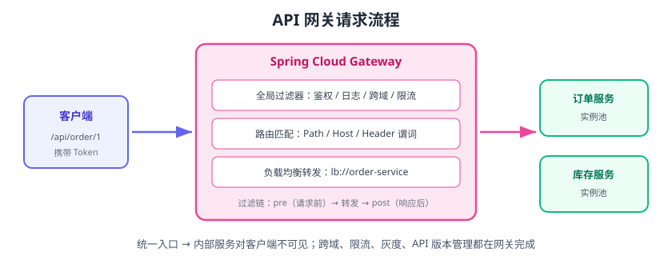

# API 网关

API 网关（API Gateway）是微服务的**统一入口**：所有客户端请求先到网关，由网关完成路由、鉴权、限流、日志等横切逻辑，再转发给下游服务。没有网关时，客户端要同时知道订单服务、库存服务、账户服务的地址，还要各自处理鉴权和跨域；有了网关，客户端只跟一个地址打交道。



## 网关的职责

| 职责 | 说明 |
| --- | --- |
| 统一路由 | 按路径/域名把请求转发到对应服务，如 `/api/order/**` → order-service |
| 鉴权认证 | 校验 Token、签名，拦截未授权请求（白名单放行登录接口） |
| 限流熔断 | 按 IP/用户/接口限流，保护后端服务 |
| 跨域处理 | 统一配置 CORS，避免每个服务各配一遍 |
| 灰度发布 | 按 Header/权重把流量路由到新版本实例 |
| 协议转换 | REST ↔ gRPC/WebSocket，聚合多个服务的响应 |
| 日志监控 | 记录访问日志、埋点，供链路追踪与告警使用 |

## 为什么需要网关

1. **客户端简化**：只需知道一个入口，服务拆分/合并对客户端透明。
2. **安全收敛**：鉴权、防刷、风控集中在网关，内部服务默认不暴露公网。
3. **横切逻辑复用**：跨域、日志、限流不用在每个服务重复实现。
4. **流量治理**：限流、熔断、灰度在入口统一管控。

## 主流实现

| 网关 | 特点 | 说明 |
| --- | --- | --- |
| Spring Cloud Gateway | 基于 WebFlux 响应式，非阻塞 | Spring Cloud 生态标配，版本随 Release Train（2025.1 对应 5.0.x） |
| Nginx / OpenResty | 高性能接入层 | 偏流量层：反代、限流、静态资源；常与 API 网关配合 |
| Kong / APISIX | 云原生网关 | 插件化路由/限流/鉴权，支持多语言 |
| Envoy | 数据面代理 | 服务网格 Sidecar 与网关两用 |
| 云 API 网关 | 托管服务 | 阿里云/腾讯云/AWS，免运维 |

::: tip 分工建议
常见分层：**Nginx（入口流量/SSL/TCP 转发）→ API 网关（业务路由/鉴权/限流）→ 微服务**。Nginx 管“网络层”，Spring Cloud Gateway 管“业务层”。
:::

## Spring Cloud Gateway 快速上手

```xml [pom.xml]
<dependency>
    <groupId>org.springframework.cloud</groupId>
    <artifactId>spring-cloud-starter-gateway</artifactId>
</dependency>
<dependency>
    <groupId>com.alibaba.cloud</groupId>
    <artifactId>spring-cloud-starter-alibaba-nacos-discovery</artifactId>
</dependency>
```

```yaml [application.yml]
server:
  port: 8080
spring:
  application:
    name: gateway
  cloud:
    nacos:
      discovery:
        server-addr: localhost:8848
    gateway:
      routes:
        - id: order-route
          uri: lb://order-service          # lb:// 走注册中心 + 负载均衡
          predicates:
            - Path=/api/order/**
          filters:
            - StripPrefix=2                # 去掉 /api/order 前缀
        - id: inventory-route
          uri: lb://inventory-service
          predicates:
            - Path=/api/inventory/**
          filters:
            - StripPrefix=2
```

请求 `http://localhost:8080/api/order/1` 会被转发到 `order-service` 的 `/1`。

## 谓词（Predicate）与过滤器（Filter）

### 常用谓词

| 谓词 | 匹配条件 |
| --- | --- |
| `Path=/api/**` | 路径 |
| `Host=api.example.com` | 域名 |
| `Method=GET,POST` | HTTP 方法 |
| `Header=X-Env, staging` | 请求头 |
| `Query=version, v2` | 查询参数 |
| `Weight=group1, 80` | 权重灰度 |

### 常用过滤器

| 过滤器 | 作用 |
| --- | --- |
| `StripPrefix=N` | 去掉前 N 段路径 |
| `AddRequestHeader` | 追加请求头（如透传用户 ID） |
| `RemoveRequestHeader` | 删除敏感请求头 |
| `RequestRateLimiter` | 按 KeyResolver 限流 |
| `Retry` | 转发失败重试 |
| `CircuitBreaker` | 网关侧熔断降级 |
| `RewritePath` | 重写路径 |

## 网关鉴权示例（全局过滤器）

```java
@Component
public class AuthFilter implements GlobalFilter, Ordered {
    @Override
    public Mono<Void> filter(ServerWebExchange exchange, GatewayFilterChain chain) {
        String path = exchange.getRequest().getURI().getPath();
        // 白名单：登录、健康检查直接放行
        if (path.startsWith("/api/auth/") || path.equals("/actuator/health")) {
            return chain.filter(exchange);
        }
        String token = exchange.getRequest().getHeaders().getFirst("Authorization");
        if (token == null || !tokenService.verify(token)) {
            exchange.getResponse().setStatusCode(HttpStatus.UNAUTHORIZED);
            return exchange.getResponse().setComplete();
        }
        // 解析出用户 ID 后透传给下游
        ServerHttpRequest mutated = exchange.getRequest().mutate()
                .header("X-User-Id", tokenService.getUserId(token)).build();
        return chain.filter(exchange.mutate().request(mutated).build());
    }

    @Override
    public int getOrder() {
        return -100;  // 数字越小越先执行
    }
}
```

## 网关限流

基于 Redis 的令牌桶限流器：

```yaml
spring:
  redis:
    host: localhost
  cloud:
    gateway:
      routes:
        - id: order-route
          uri: lb://order-service
          predicates:
            - Path=/api/order/**
          filters:
            - name: RequestRateLimiter
              args:
                redis-rate-limiter.replenishRate: 10     # 每秒补充令牌数
                redis-rate-limiter.burstCapacity: 20     # 桶容量
                key-resolver: "#{@userKeyResolver}"
```

```java
@Bean
public KeyResolver userKeyResolver() {
    // 按用户维度限流：从请求头取用户 ID
    return exchange -> Mono.just(
        exchange.getRequest().getHeaders().getFirst("X-User-Id"));
}
```

## 网关 vs Nginx

| 维度 | Nginx | Spring Cloud Gateway |
| --- | --- | --- |
| 定位 | 接入层/LB/静态资源 | 业务网关 |
| 协议 | HTTP/TCP/UDP | HTTP/WebSocket（WebFlux） |
| 路由依据 | 域名、路径、正则 | Path/Host/Header/Weight 等谓词 |
| 服务发现 | 需手动配置 upstream 或 Lua | 原生 `lb://` 对接注册中心 |
| 扩展 | Lua/OpenResty | Java 过滤器/自定义 |
| 适合 | 入口流量、SSL、静态 | 业务路由、鉴权、限流、灰度 |

## 易错点与最佳实践

::: danger 常见错误
1. **网关做太重**：把业务逻辑写进网关，网关变成“新单体”，难以升级。
2. **URI 写死 IP**：`uri: http://10.0.0.1:8081` 不走注册中心，实例变化就失效，应使用 `lb://服务名`。
3. **忘记 StripPrefix**：下游收到的路径还带着 `/api/order`，路由不匹配。
4. **网关单点部署**：网关是入口，至少两个实例 + 前置 LB 高可用。
5. **鉴权只做一半**：网关鉴权后，内部服务之间互相调用不鉴权，越权漏洞；需要内部信任机制（如内部 Token / 网络隔离）。
6. **超时配置过大**：下游慢请求占用网关线程/连接，整体吞吐下降；设置合理超时与并发限制。
:::

::: tip 最佳实践
1. 网关只做横切，不写业务；复杂聚合放 BFF（Backend for Frontend）。
2. 所有路由统一在配置中心管理，支持动态刷新。
3. 网关接入链路追踪，traceId 透传到下游服务。
4. 配置全局超时、重试与熔断兜底响应（如返回 503 降级 JSON）。
5. 定期压测网关：WebFlux 非阻塞不代表无限并发，连接数、线程数要留余量。
:::

## 验证方式

1. 启动 Nacos、order-service（两个实例）、网关，访问 `http://localhost:8080/api/order/1`，确认转发成功且两次请求落到不同实例（轮询）。
2. 停掉一个实例，确认请求自动切到存活实例。
3. 不带 Token 访问受保护接口，确认返回 401。
4. 触发限流（快速连续请求），确认返回 429 且后端无压力。

## 参考资料

- Spring Cloud Gateway 文档：https://docs.spring.io/spring-cloud-gateway/reference/
- Spring Cloud Gateway 过滤器工厂：https://docs.spring.io/spring-cloud-gateway/reference/spring-cloud-gateway-server-mvc/filter-factories.html
- 微服务网关模式：https://microservices.io/patterns/apigateway.html
- APISIX 网关：https://apisix.apache.org/

::: tip 相关文档
Spring Cloud Gateway 的落地细节（断言/过滤器清单、全局过滤器鉴权、Redis 限流、网关模块依赖坑位）见 [Spring Cloud 专题：API 网关](../SpringCloud/Gateway/index.md)，方法论参考同目录的 [Spring Cloud 版本与实现专题](../SpringCloud/index.md)。
:::
